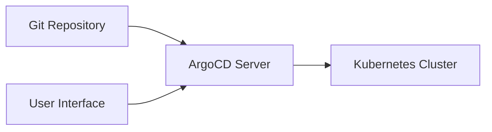
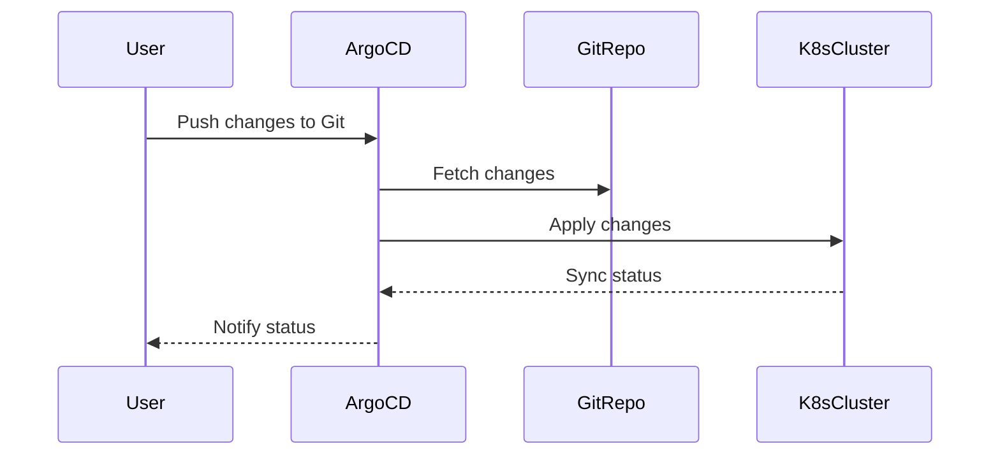

## Introduction to ArgoCD and GitOps

ArgoCD is an open-source declarative continuous delivery tool for Kubernetes applications. It is designed to manage and automate the deployment of applications using GitOps principles. GitOps is a methodology that uses Git as a single source of truth for infrastructure and application configurations. This approach ensures that all changes are tracked, reviewed, and audited, providing a robust and reliable way to manage deployments.

### What is GitOps?

GitOps is a set of practices that uses Git as the single source of truth for infrastructure and application configurations. This means that all changes to the system are made via pull requests, and the desired state of the system is stored in Git. By doing so, GitOps provides a transparent and auditable history of changes, making it easier to track and revert changes if necessary.

### Why Use GitOps?

Using GitOps offers several benefits:

1. **Version Control**: All changes are version-controlled, allowing you to track and revert changes easily.
2. **Auditing**: Every change is recorded, making it easy to audit who made what changes and when.
3. **Collaboration**: Pull requests enable collaboration among team members, ensuring that changes are reviewed and approved before being applied.
4. **Automation**: Automated pipelines can be triggered based on changes in the Git repository, ensuring that deployments are consistent and repeatable.

### How Does ArgoCD Work?

ArgoCD works by continuously comparing the desired state of your Kubernetes resources (stored in Git) with the actual state of your cluster. If there are discrepancies, ArgoCD automatically applies the necessary changes to bring the cluster into alignment with the desired state.

#### Key Components of ArgoCD

- **Application Controller**: Manages the synchronization between the Git repository and the Kubernetes cluster.
- **Sync Operation**: Ensures that the cluster matches the desired state defined in Git.
- **Health Checks**: Monitors the health of the applications and reports any issues.
- **UI**: Provides a user interface to manage and monitor applications.

### Setting Up ArgoCD

To set up ArgoCD, you first need to install it in your Kubernetes cluster. This can be done using `kubectl` or Helm charts.

```bash
kubectl create namespace argocd
kubectl apply -n argocd -f https://raw.githubusercontent.com/argoproj/argo-cd/stable/manifests/install.yaml
```

Once installed, you can access the ArgoCD UI by setting up port forwarding:

```bash
kubectl port-forward svc/argocd-server -n argocd 8080:443
```

### Connecting to a Git Repository

After setting up ArgoCD, you need to connect it to a Git repository. This is typically done by creating an ArgoCD application that points to the repository.

```yaml
apiVersion: argoproj.io/v1alpha1
kind: Application
metadata:
  name: my-app
spec:
  project: default
  source:
    repoURL: https://github.com/myorg/myrepo.git
    targetRevision: HEAD
    path: overlays/dev
  destination:
    server: https://kubernetes.default.svc
    namespace: my-app-namespace
```

This configuration tells ArgoCD to watch the `overlays/dev` directory in the specified Git repository and apply any changes to the `my-app-namespace` in the Kubernetes cluster.

### Monitoring Application Status

Once the application is set up, you can monitor its status through the ArgoCD UI or CLI. The UI provides a dashboard showing the health, sync status, and other details of the application.

```bash
argocd app get my-app
```

### Automating Sync Operations

By default, ArgoCD is configured to automatically sync the cluster with the Git repository. This means that any changes pushed to the Git repository will be automatically applied to the cluster.

### Manual Sync Operations

While automatic syncing is enabled, you can also perform manual sync operations through the UI or CLI.

```bash
argocd app sync my-app
```

### Example: Deploying an Application

Let's walk through an example of deploying an application using ArgoCD.

1. **Create a Git Repository**:
   Create a new Git repository and push some Kubernetes manifests to it.

   ```bash
   git init
   touch deployment.yaml service.yaml
   git add .
   git commit -m "Initial commit"
   git remote add origin https://github.com/myorg/myrepo.git
   git push -u origin master
   ```

2. **Configure ArgoCD Application**:
   Configure ArgoCD to watch the Git repository and apply changes to the cluster.

   ```yaml
   apiVersion: argoproj.io/v1alpha1
   kind: Application
   metadata:
     name: my-app
   spec:
     project: default
     source:
       repoURL: https://github.com/myorg/myrepo.git
       targetRevision: HEAD
       path: overlays/dev
     destination:
       server: https://kubernetes.default.svc
       namespace: my-app-namespace
   ```

3. **Monitor Application Status**:
   Monitor the status of the application through the ArgoCD UI or CLI.

   ```bash
   argocd app get my-app
   ```

### Real-World Examples

#### Example 1: CVE-2021-20225

In 2021, a critical vulnerability (CVE-2021-20225) was discovered in ArgoCD, which allowed attackers to gain unauthorized access to the ArgoCD server and execute arbitrary commands. This vulnerability highlights the importance of keeping your ArgoCD installation up-to-date and following best practices for securing your environment.

#### Example 2: GitLab Incident

In 2021, GitLab experienced a significant incident where unauthorized access to their internal systems led to the exposure of sensitive data. This incident underscores the importance of proper access controls and monitoring in GitOps environments.

### How to Prevent / Defend

#### Detection

To detect potential issues in your ArgoCD setup, you should regularly monitor the logs and alerts generated by ArgoCD. You can also use tools like Prometheus and Grafana to visualize and analyze the metrics.

```bash
kubectl logs -n argocd -l app.kubernetes.io/name=argocd-server
```

#### Prevention

To prevent unauthorized access and ensure the security of your ArgoCD setup, follow these best practices:

1. **Use Strong Authentication**: Enable strong authentication methods such as OAuth2 or LDAP.
2. **Limit Access**: Restrict access to the ArgoCD server and ensure that only authorized users have access to the Git repository.
3. **Regular Updates**: Keep your ArgoCD installation up-to-date with the latest security patches.
4. **Audit Logs**: Regularly review the audit logs to detect any suspicious activity.

#### Secure Coding Fixes

Here is an example of a vulnerable configuration and its secure counterpart:

**Vulnerable Configuration:**

```yaml
apiVersion: argoproj.io/v1alpha1
kind: Application
metadata:
  name: my-app
spec:
  project: default
  source:
    repoURL: https://github.com/myorg/myrepo.git
    targetRevision: HEAD
    path: overlays/dev
  destination:
    server: https://kubernetes.default.svc
    namespace: my-app-namespace
```

**Secure Configuration:**

```yaml
apiVersion: argoproj.io/v1alpha1
kind: Application
metadata:
  name: my-app
spec:
  project: default
  source:
    repoURL: https://github.com/myorg/myrepo.git
    targetRevision: HEAD
    path: overlays/dev
  destination:
    server: https://kubernetes.default.svc
    namespace: my
  syncPolicy:
    automated:
      prune: true
      selfHeal: true
  revisionHistoryLimit: 10
```

### Complete Example: Full HTTP Request and Response

When interacting with the ArgoCD API, you might send HTTP requests to perform various operations. Here is an example of a full HTTP request and response:

**HTTP Request:**

```http
POST /api/v1/session HTTP/1.1
Host: localhost:8080
Content-Type: application/json
Accept: application/json

{
  "username": "admin",
  "password": "password"
}
```

**HTTP Response:**

```http
HTTP/1.1 200 OK
Date: Tue, 01 Mar 2022 12:00:00 GMT
Content-Type: application/json
Content-Length: 123

{
  "token": "eyJhbGciOiJIUzI1NiIsInR5cCI6IkpXVCJ9..."
}
```

### Mermaid Diagrams

#### Architecture Diagram



#### Sequence Diagram



### Hands-On Labs

For hands-on practice with ArgoCD and GitOps, consider the following labs:

- **PortSwigger Web Security Academy**: Focuses on web application security but can be adapted for learning GitOps principles.
- **OWASP Juice Shop**: A deliberately insecure web application for practicing security skills.
- **DVWA (Damn Vulnerable Web Application)**: Another web application for security training.
- **WebGoat**: An interactive web application for learning about web security.

These labs provide a practical way to understand and implement GitOps principles using ArgoCD.

### Conclusion

ArgoCD is a powerful tool for automating and managing Kubernetes deployments using GitOps principles. By following best practices and implementing secure coding techniques, you can ensure that your deployments are reliable, auditable, and secure.

---
<!-- nav -->
[[DevSecOps/DevSecOps Bootcamp/07-CI CD Security Pipeline/01-App Release Pipeline with ArgoCD/Deployment through Pipeline and Access Argo UI Deploy Argo Part 3/02-Introduction to ArgoCD and Deployment Pipelines|Introduction to ArgoCD and Deployment Pipelines]] | [[DevSecOps/DevSecOps Bootcamp/07-CI CD Security Pipeline/01-App Release Pipeline with ArgoCD/Deployment through Pipeline and Access Argo UI Deploy Argo Part 3/00-Overview|Overview]] | [[DevSecOps/DevSecOps Bootcamp/07-CI CD Security Pipeline/01-App Release Pipeline with ArgoCD/Deployment through Pipeline and Access Argo UI Deploy Argo Part 3/04-Introduction to ArgoCD and Its Role in DevSecOps|Introduction to ArgoCD and Its Role in DevSecOps]]
