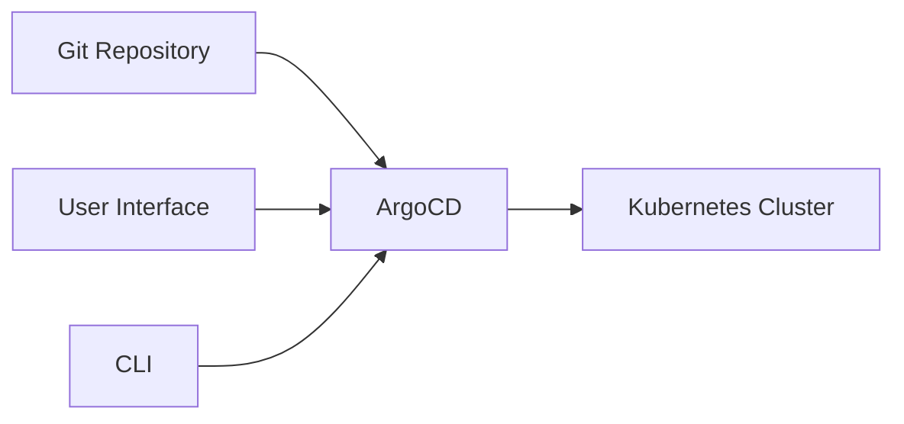
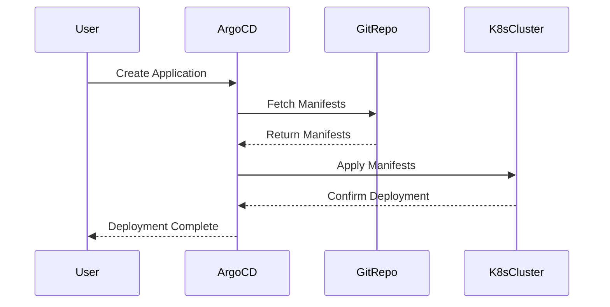

## Introduction to ArgoCD and Its Role in DevSecOps

ArgoCD is an open-source declarative continuous delivery tool for Kubernetes. It allows you to manage your applications in a GitOps way, meaning that your application's desired state is stored in a Git repository. This approach ensures that your application's deployment and configuration are version-controlled and auditable. In this chapter, we will delve into the details of deploying applications through an ArgoCD pipeline and accessing the ArgoCD UI.

### Understanding the Components

Before diving into the specifics, let's break down the key components involved:

1. **ArgoCD**: A declarative continuous delivery tool for Kubernetes.
2. **Git Repository**: Stores the desired state of your application.
3. **Kubernetes Cluster**: Where your application is deployed.
4. **Application Manifest**: Describes the desired state of your application.

### Setting Up the Environment

To get started, ensure you have the following prerequisites:

- A Kubernetes cluster.
- ArgoCD installed on your cluster.
- A Git repository containing your application manifests.

#### Installing ArgoCD

To install ArgoCD on your Kubernetes cluster, you can use the following command:

```sh
kubectl create namespace argocd
kubectl apply -n argocd -f https://raw.githubusercontent.com/argoproj/argo-cd/stable/manifests/install.yaml
```

This command creates a namespace `argocd` and applies the ArgoCD installation manifest.

### Accessing the ArgoCD UI

Once ArgoCD is installed, you can access the UI to manage your applications. By default, the UI is accessible at `https://<your-server>:20443`.

#### Default Credentials

The default username for ArgoCD is `admin`. The password is stored in a Kubernetes secret named `argocd-initial-admin-secret` in the `argocd` namespace. You can retrieve the password using the following command:

```sh
kubectl -n argocd get secret argocd-initial-admin-secret -o jsonpath="{.data.password}" | base64 --decode; echo
```

### Configuring Git Repositories

To connect ArgoCD to your Git repository, you need to configure a Git repository secret. This secret contains the credentials needed to access the repository.

#### Creating the Secret

First, create a secret with the necessary credentials:

```sh
kubectl -n argocd create secret generic argocd-repo-creds \
  --from-literal=url=https://github.com/yourusername/yourrepo.git \
  --from-literal=username=yourusername \
  --from-literal=password=yourpassword
```

Replace `yourusername`, `yourrepo`, and `yourpassword` with your actual GitHub username, repository name, and personal access token.

#### Adding the Repository to ArgoCD

Next, add the repository to ArgoCD via the UI or CLI. Here’s how to do it via the CLI:

```sh
argocd repo add https://github.com/yourusername/yourrepo.git \
  --username yourusername \
  --password yourpassword
```

### Creating Applications

Now that the repository is configured, you can create applications from the manifests within the repository.

#### Application Manifest Example

Here’s an example of an application manifest (`app.yaml`):

```yaml
apiVersion: argoproj.io/v1alpha1
kind: Application
metadata:
  name: online-boutique
spec:
  project: default
  source:
    repoURL: https://github.com/yourusername/yourrepo.git
    targetRevision: HEAD
    path: manifests/online-boutique
  destination:
    server: https://kubernetes.default.svc
    namespace: online-boutique
  syncPolicy:
    automated:
      prune: true
      selfHeal: true
```

This manifest specifies the repository URL, the path to the application manifests, and the destination namespace in the Kubernetes cluster.

#### Applying the Application

Apply the application manifest using the following command:

```sh
argocd app create online-boutique --repo https://github.com/yourusername/yourrepo.git --path manifests/online-boutique --dest-server https://kubernetes.default.svc --dest-namespace online-boutique
```

### Monitoring and Managing Applications

Once the application is created, you can monitor its status and manage it through the ArgoCD UI or CLI.

#### Viewing Application Status

To view the status of your application, use the following command:

```sh
argocd app get online-boutique
```

This command provides detailed information about the application, including its current state, health, and sync status.

### Common Pitfalls and How to Prevent Them

#### Incorrect Configuration

**Issue**: Incorrectly configuring the Git repository secret or application manifest can lead to deployment failures.

**Prevention**:
- Ensure the repository URL, username, and password are correct.
- Verify the path to the application manifests is accurate.
- Check the destination namespace exists in the Kubernetes cluster.

#### Insufficient Permissions

**Issue**: Insufficient permissions for the service account used by ArgoCD can cause deployment issues.

**Prevention**:
- Ensure the service account has the necessary RBAC permissions.
- Use `kubectl auth can-i` to verify permissions.

#### Outdated Dependencies

**Issue**: Using outdated dependencies in your application manifests can introduce vulnerabilities.

**Prevention**:
- Regularly update dependencies.
- Use tools like `Trivy` to scan for vulnerabilities.

### Real-World Examples and Recent CVEs

#### CVE-2021-20225

**Description**: A vulnerability in ArgoCD allowed unauthorized users to bypass authentication and gain administrative access.

**Impact**: Unauthorized access to the ArgoCD UI and management of applications.

**Mitigation**:
- Ensure all users have strong passwords.
- Enable two-factor authentication.
- Regularly update ArgoCD to the latest version.

#### CVE-2021-39123

**Description**: A vulnerability in Kubernetes allowed attackers to escalate privileges and gain control over the cluster.

**Impact**: Unauthorized access to the Kubernetes cluster and potential compromise of ArgoCD-managed applications.

**Mitigation**:
- Implement strict RBAC policies.
- Regularly audit and review access controls.
- Use network segmentation to isolate sensitive resources.

### Secure Coding Practices

#### Vulnerable Code Example

```yaml
apiVersion: argoproj.io/v1alpha1
kind: Application
metadata:
  name: online-boutique
spec:
  project: default
  source:
    repoURL: https://github.com/yourusername/yourrepo.git
    targetRevision: HEAD
    path: manifests/online-boutique
  destination:
    server: https://kubernetes.default.svc
    namespace: online-boutique
  syncPolicy:
    automated:
      prune: false
      selfHeal: false
```

#### Secure Code Example

```yaml
apiVersion: argoproj.io/v1alpha1
kind: Application
metadata:
  name: online-boutique
spec:
  project: default
  source:
    repoURL: https://github.com/yourusername/yourrepo.git
    targetRevision: HEAD
    path: manifests/online-boutique
  destination:
    server: https://kubernetes.default.svc
    namespace: online-boutique
  syncPolicy:
    automated:
      prune: true
      selfHeal: true
```

### Conclusion

In this chapter, we covered the setup and usage of ArgoCD for managing applications in a GitOps manner. We explored the key components, configuration steps, and common pitfalls. Additionally, we provided real-world examples and secure coding practices to help you deploy and manage applications securely.

### Practice Labs

For hands-on practice, consider the following labs:

- **PortSwigger Web Security Academy**: Focuses on web application security but includes sections on CI/CD pipelines.
- **CloudGoat**: Provides scenarios for securing cloud environments, including Kubernetes clusters.
- **Kubernetes Goat**: Offers practical exercises for securing Kubernetes deployments.

These labs will help you gain practical experience in setting up and managing ArgoCD in a secure manner.

### Diagrams

#### ArgoCD Architecture Diagram



#### Application Deployment Flow



By following this comprehensive guide, you should now have a solid understanding of how to deploy applications through an ArgoCD pipeline and manage them securely.

---
<!-- nav -->
[[DevSecOps/DevSecOps Bootcamp/07-CI CD Security Pipeline/01-App Release Pipeline with ArgoCD/Deployment through Pipeline and Access Argo UI Deploy Argo Part 3/03-Introduction to ArgoCD and GitOps|Introduction to ArgoCD and GitOps]] | [[DevSecOps/DevSecOps Bootcamp/07-CI CD Security Pipeline/01-App Release Pipeline with ArgoCD/Deployment through Pipeline and Access Argo UI Deploy Argo Part 3/00-Overview|Overview]] | [[DevSecOps/DevSecOps Bootcamp/07-CI CD Security Pipeline/01-App Release Pipeline with ArgoCD/Deployment through Pipeline and Access Argo UI Deploy Argo Part 3/05-Introduction to DevSecOps and Continuous IntegrationContinuous Delivery (CICD)|Introduction to DevSecOps and Continuous IntegrationContinuous Delivery (CICD)]]
