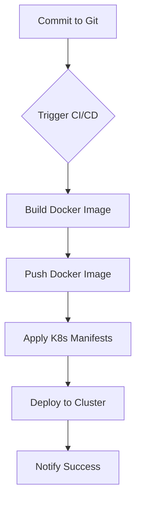
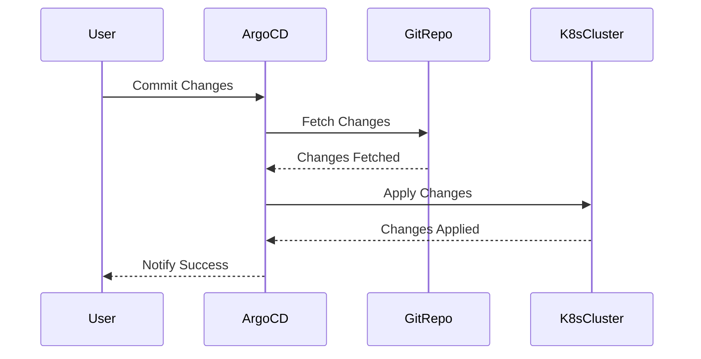

## Setting Up a CI/CD Pipeline with ArgoCD

### What is ArgoCD?

ArgoCD is a declarative, GitOps continuous delivery tool for Kubernetes. It allows you to manage your applications using Git repositories, ensuring that your cluster state is always in sync with your desired state defined in Git. This approach provides a single source of truth for your application configurations and makes it easier to manage and audit changes.

### Why Use ArgoCD?

- **Declarative Configuration:** With ArgoCD, you define your application configurations in Git, making it easy to track changes and collaborate with other team members.
- **Automated Syncing:** ArgoCD continuously monitors your Git repository and automatically applies any changes to your Kubernetes cluster.
- **Rollback Capabilities:** In case of issues, you can easily roll back to a previous version of your application by reverting the changes in Git.

### Setting Up the Environment

To set up a CI/CD pipeline with ArgoCD, you need to have the following components:

- **Kubernetes Cluster:** A running Kubernetes cluster where your applications will be deployed.
- **Git Repository:** A Git repository containing your application manifests and CI/CD pipeline configurations.
- **CI/CD Tool:** A CI/CD tool like Jenkins, GitLab CI, or GitHub Actions to automate the build, test, and deployment processes.

### Step-by-Step Setup

#### 1. Install ArgoCD

First, install ArgoCD on your Kubernetes cluster. You can use the following commands to install ArgoCD using `kubectl`:

```bash
kubectl create namespace argocd
kubectl apply -n argocd -f https://raw.githubusercontent.com/argoproj/argo-cd/stable/manifests/install.yaml
```

#### 2. Configure ArgoCD

Once ArgoCD is installed, configure it to connect to your Git repository. You can do this by creating an ArgoCD application manifest and applying it to your cluster.

```yaml
apiVersion: argoproj.io/v1alpha1
kind: Application
metadata:
  name: online-boutique
spec:
  project: default
  source:
    repoURL: https://github.com/your-repo/online-boutique.git
    targetRevision: HEAD
    path: k8s
  destination:
    server: https://kubernetes.default.svc
    namespace: online-boutique
```

Apply the manifest using `kubectl`:

```bash
kubectl apply -f argocd-application.yaml
```

#### 3. Set Up CI/CD Pipeline

Next, set up a CI/CD pipeline to automate the build, test, and deployment processes. For this example, we'll use GitHub Actions.

Create a `.github/workflows/ci-cd.yml` file in your Git repository:

```yaml
name: CI/CD Pipeline

on:
  push:
    branches:
      - main

jobs:
  build-and-deploy:
    runs-on: ubuntu-latest

    steps:
    - name: Checkout Code
      uses: actions/checkout@v2

    - name: Build Docker Images
      run: |
        docker build -t your-dockerhub-username/online-boutique:latest .

    - name: Push Docker Images
      run: |
        echo ${{ secrets.DOCKERHUB_PASSWORD }} | docker login -u ${{ secrets.DOCKERHUB_USERNAME }} --password-stdin
        docker push your-dockerhub-username/online-boutique:latest

    - name: Apply K8s Manifests
      run: |
        kubectl apply -f k8s/
```

This workflow will:

- Check out the code from the Git repository.
- Build Docker images and push them to Docker Hub.
- Apply the Kubernetes manifests to your cluster.

### How to Prevent / Defend

#### Detection

- **Regular Audits:** Regularly audit your Git repository and Kubernetes cluster to ensure that they are in sync and that no unauthorized changes have been made.
- **Security Scans:** Integrate security scanning tools like Trivy or Clair into your CI/CD pipeline to detect vulnerabilities in your Docker images and dependencies.

#### Prevention

- **Access Controls:** Ensure that only authorized users have access to your Git repository and Kubernetes cluster. Use role-based access control (RBAC) to restrict permissions.
- **Immutable Infrastructure:** Use immutable infrastructure principles to ensure that your application instances are never modified in place. Instead, replace them with new instances whenever changes are needed.

#### Secure Coding Fixes

Compare the vulnerable and secure versions of the CI/CD pipeline configuration:

**Vulnerable Version:**

```yaml
name: CI/CD Pipeline

on:
  push:
    branches:
      - main

jobs:
  build-and-deploy:
    runs-on: ubuntu-latest

    steps:
    - name: Checkout Code
      uses: actions/checkout@v2

    - name: Build Docker Images
      run: |
        docker build -t your-dockerhub-username/online-boutique:latest .

    - name: Push Docker Images
      run: |
        echo ${{ secrets.DOCKERHUB_PASSWORD }} | docker login -u ${{ secrets.DOCKERHUB_USERNAME }} --password-stdin
        docker push your-dockerhub-username//online-boutique:latest

    - name: Apply K8s Manifests
      run: |
        kubectl apply -f k8s/
```

**Secure Version:**

```yaml
name: CI/CD Pipeline

on:
  push:
    branches:
      - main

jobs:
  build-and-deploy:
    runs-on: ubuntu-latest

    steps:
    - name: Checkout Code
      uses: actions/checkout@v2

    - name: Build Docker Images
      run: |
        docker build -t your-dockerhub-username/online-boutique:latest .

    - name: Push Docker Images
      run: |
        echo ${{ secrets.DOCKERHUB_PASSWORD }} | docker login -u ${{ secrets.DOCKERHUB_USERNAME }} --password-stdin
        docker push your-dockerhub-username/online-boutique:latest

    - name: Apply K8s Manifests
      run: |
        kubectl apply -f k8s/

    - name: Security Scan
      run: |
        trivy image your-dockerhub-username/online-boutique:latest
```

In the secure version, we added a security scan step to detect vulnerabilities in the Docker image before deploying it to the cluster.

### Complete Example: Full HTTP Request and Response

Here is a complete example of a full HTTP request and response for triggering a CI/CD pipeline:

**HTTP Request:**

```http
POST /github-webhook HTTP/1.1
Host: your-ci-cd-server.com
Content-Type: application/json
User-Agent: GitHub-Hookshot/6b8c4f7
X-GitHub-Event: push
X-Hub-Signature: sha1=0123456789abcdef0123456789abcdef01234567
Content-Length: 1234

{
  "ref": "refs/heads/main",
  "before": "0000000000000000000000000000000000000000",
  "after": "1234567890abcdef1234567890abcdef12345678",
  "repository": {
    "name": "online-boutique",
    "full_name": "your-repo/online-boutique",
    "html_url": "https://github.com/your-repo/online-boutique"
  },
  "commits": [
    {
      "id": "1234567890abcdef1234567890abcdef12345678",
      "message": "Update README.md",
      "timestamp": "2023-01-01T00:00:00Z",
      "url": "https://github.com/your-repo/online-boutique/commit/1234567890abcdef1234567890abcdef12345678"
    }
  ]
}
```

**HTTP Response:**

```http
HTTP/1.1 200 OK
Date: Sun, 01 Jan 2023 00:00:00 GMT
Server: Your-CI-CD-Server
Content-Type: application/json
Content-Length: 34

{
  "status": "success",
  "message": "Pipeline triggered successfully"
}
```

### Mermaid Diagrams

#### CI/CD Pipeline Flow



#### ArgoCD Sync Process



### Hands-On Labs

For hands-on practice with setting up a CI/CD pipeline with ArgoCD, consider the following labs:

- **PortSwigger Web Security Academy:** Focuses on web application security but includes sections on CI/CD pipelines.
- **OWASP Juice Shop:** A deliberately insecure web application for security training purposes, which can be used to practice CI/CD pipelines.
- **DVWA (Damn Vulnerable Web Application):** Another web application for security training, which can be used to practice CI/CD pipelines.
- **WebGoat:** An interactive web application security training tool that includes sections on CI/CD pipelines.

These labs provide practical experience in setting up and managing CI/CD pipelines, including integration with ArgoCD.

By following these steps and best practices, you can set up a robust CI/CD pipeline with ArgoCD that ensures your applications are deployed securely and efficiently.

---
<!-- nav -->
[[DevSecOps/DevSecOps Bootcamp/07-CI CD Security Pipeline/01-App Release Pipeline with ArgoCD/Deployment through Pipeline and Access Argo UI Deploy Argo Part 3/05-Introduction to DevSecOps and Continuous IntegrationContinuous Delivery (CICD)|Introduction to DevSecOps and Continuous IntegrationContinuous Delivery (CICD)]] | [[DevSecOps/DevSecOps Bootcamp/07-CI CD Security Pipeline/01-App Release Pipeline with ArgoCD/Deployment through Pipeline and Access Argo UI Deploy Argo Part 3/00-Overview|Overview]] | [[DevSecOps/DevSecOps Bootcamp/07-CI CD Security Pipeline/01-App Release Pipeline with ArgoCD/Deployment through Pipeline and Access Argo UI Deploy Argo Part 3/07-Setting Up the Kubernetes Admin User|Setting Up the Kubernetes Admin User]]
