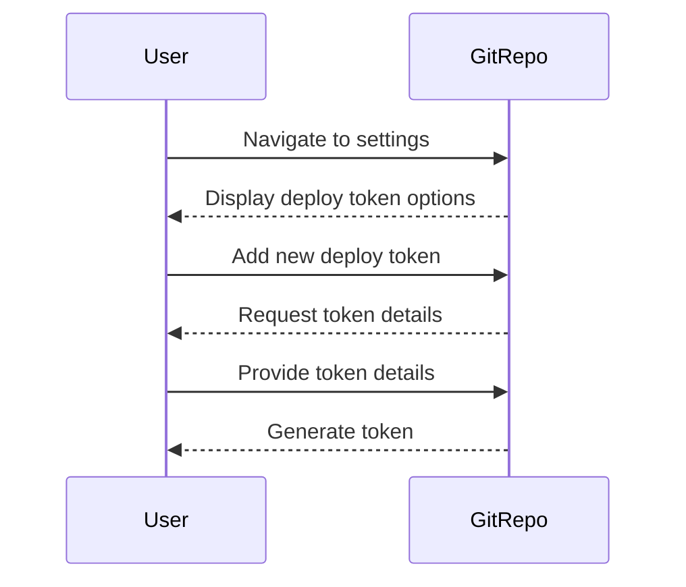
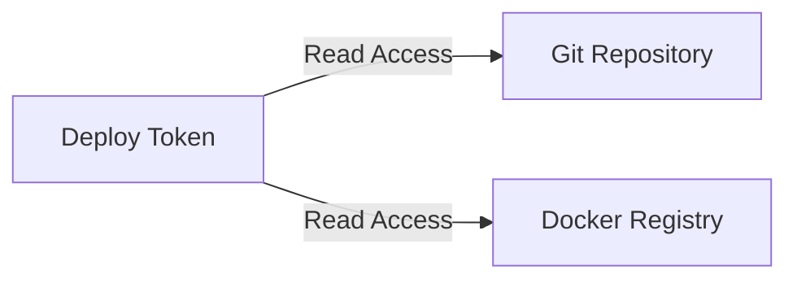

## Introduction to App Release Pipeline with ArgoCD

In the context of DevSecOps, an application release pipeline is a series of steps that automate the process of building, testing, and deploying applications. One popular tool used in this process is ArgoCD, which is a declarative, GitOps continuous delivery tool for Kubernetes. This chapter will delve into the configuration and deployment of an app release pipeline using ArgoCD, focusing on the creation and usage of deploy tokens within a Git repository.

### Background Theory

#### What is GitOps?

GitOps is a methodology that uses Git as a single source of truth for all infrastructure and application configurations. By treating infrastructure as code and using Git as the central store, teams can leverage familiar workflows such as pull requests, reviews, and approvals to manage their infrastructure and application deployments.

#### What is ArgoCD?

ArgoCD is a declarative, continuous delivery tool for Kubernetes that implements the GitOps model. It allows you to declare your desired state in a Git repository and automatically syncs that state with your Kubernetes clusters. This ensures that your cluster's state is always up-to-date with the desired state defined in Git.

### Setting Up Deploy Tokens

Deploy tokens are a type of access token that provide limited access to a Git repository. They are often used in CI/CD pipelines to allow automated processes to access the repository without exposing sensitive credentials.

#### Creating a Deploy Token

To create a deploy token in a Git repository, follow these steps:

1. **Navigate to Repository Settings**: In the repository settings, locate the section for deploy tokens. This is typically found under "Settings" or "Repository settings."

2. **Add New Token**: Click on "Add deploy token" or a similar option to create a new token.

3. **Configure Token Details**:
    - **Token Name**: Provide a descriptive name for the token, such as "ArgoCD-deploy-token."
    - **Username**: Optionally, provide a username for the token. This can be the same as the token name.
    - **Access Permissions**: Set the access permissions for the token. For ArgoCD, you typically need read access to the Git repository and the Docker registry.

4. **Generate Token**: After configuring the details, generate the token. You will receive a username and a token value.



#### Access Permissions

The deploy token should have the following access permissions:

- **Read Access to Git Repository**: This allows ArgoCD to fetch the configuration files from the repository.
- **Read Access to Docker Registry**: This allows ArgoCD to pull container images from the Docker registry.



### Configuring the CI/CD Pipeline

Once the deploy token is created, it needs to be configured in the CI/CD pipeline to ensure that ArgoCD can access the Git repository and Docker registry.

#### Setting Up Environment Variables

In the CI/CD pipeline configuration, set the environment variables for the deploy token:

- `GIT_USERNAME`: The username associated with the deploy token.
- `GIT_TOKEN`: The token value.

These variables will be used to authenticate ArgoCD when accessing the Git repository and Docker registry.

```yaml
# Example CI/CD pipeline configuration
stages:
  - init
  - build
  - deploy
  - cleanup

variables:
  GIT_USERNAME: "ArgoCD-deploy-token"
  GIT_TOKEN: "your-generated-token-value"

init:
  script:
    - echo "Initializing pipeline..."

build:
  script:
    - echo "Building application..."

deploy:
  script:
    - argocd login --username $GIT_USERNAME --password $GIT_TOKEN
    - argocd repo add <git-repo-url>
    - argocd app create <app-name> --repo <git-repo-url> --path <app-path>

cleanup:
  script:
    - echo "Cleaning up..."
```

### Adjusting the Pipeline Code

Finally, adjust the pipeline code to deploy the configuration changes. This involves modifying the existing pipeline stages to include the necessary steps for deploying the application using ArgoCD.

#### Current Pipeline Stages

The current pipeline consists of the following stages:

- **Init**: Initializes the pipeline.
- **Build**: Builds the application.
- **Deploy**: Deploys the application using ArgoCD.
- **Cleanup**: Cleans up after the deployment.

#### Modifying the Deploy Stage

Modify the `deploy` stage to include the necessary commands for deploying the application using ArgoCD:

```yaml
deploy:
  script:
    - argocd login --username $GIT_USERNAME --password $GIT_TOKEN
    - argocd repo add <git-repo-url>
    - argocd app create <app-name> --repo <git-repo-url> --path <app-path>
    - argocd app sync <app-name>
```

### Real-World Examples

#### Recent CVEs and Breaches

One notable breach involving Git repositories was the GitHub data breach in 2021, where unauthorized access to user data was reported. This highlights the importance of securing access to Git repositories and ensuring that deploy tokens have the minimum required permissions.

#### Secure Coding Practices

To prevent unauthorized access to Git repositories and Docker registries, follow these secure coding practices:

- **Use Strong, Unique Tokens**: Ensure that deploy tokens are strong and unique to prevent brute-force attacks.
- **Limit Token Permissions**: Restrict the permissions of deploy tokens to the minimum required for the task.
- **Rotate Tokens Regularly**: Rotate deploy tokens regularly to minimize the risk of exposure.

### How to Prevent / Defend

#### Detection

To detect unauthorized access to Git repositories and Docker registries, implement the following measures:

- **Audit Logs**: Enable audit logs for both the Git repository and Docker registry to track access attempts.
- **Monitoring Tools**: Use monitoring tools to detect unusual activity and alert on potential security incidents.

#### Prevention

To prevent unauthorized access, follow these best practices:

- **Secure Token Storage**: Store deploy tokens securely using environment variables or secrets management tools like HashiCorp Vault.
- **Least Privilege Principle**: Apply the least privilege principle to ensure that deploy tokens have the minimum required permissions.

#### Secure-Coding Fixes

Compare the vulnerable and secure versions of the pipeline configuration:

**Vulnerable Version**

```yaml
deploy:
  script:
    - argocd login --username $GIT_USERNAME --password $GIT_PASSWORD
    - argocd repo add <git-repo-url>
    - argocd app create <app-name> --repo <git-repo-url> --path <app-path>
```

**Secure Version**

```yaml
deploy:
  script:
    - argocd login --username $GIT_USERNAME --password $GIT_TOKEN
    - argocd repo add <git-repo-url>
    - argocd app create <app-name> --repo <git-repo-url> --path <app-path>
    - argocd app sync <app-name>
```

### Conclusion

By setting up deploy tokens and configuring the CI/CD pipeline correctly, you can ensure that ArgoCD has the necessary access to deploy your application configurations. Following secure coding practices and implementing preventive measures will help protect your Git repositories and Docker registries from unauthorized access.

### Practice Labs

For hands-on practice with ArgoCD and GitOps, consider the following labs:

- **PortSwigger Web Security Academy**: Offers a variety of labs related to web application security, including some that touch on GitOps principles.
- **OWASP Juice Shop**: A deliberately insecure web application for security training purposes, which can be used to practice GitOps and CI/CD pipelines.
- **Kubernetes Goat**: A Kubernetes-based security training platform that includes exercises related to GitOps and CI/CD pipelines.

These labs provide practical experience in setting up and managing GitOps pipelines with ArgoCD.

---
<!-- nav -->
[[DevSecOps/DevSecOps Bootcamp/07-CI CD Security Pipeline/01-App Release Pipeline with ArgoCD/IaC Pipeline Configuration Deploy Argo Part 2/00-Overview|Overview]] | [[02-Introduction to Application Release Pipeline with ArgoCD Part 1|Introduction to Application Release Pipeline with ArgoCD Part 1]]
