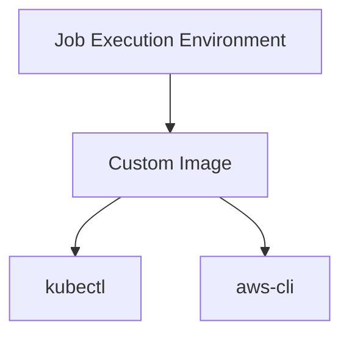
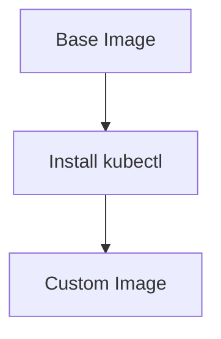

## Introduction to Application Release Pipeline with ArgoCD

In the realm of DevSecOps, managing the deployment and continuous integration/continuous delivery (CI/CD) pipeline is crucial for ensuring that applications are deployed securely and efficiently. One popular tool for orchestrating these pipelines is ArgoCD, which is a declarative, GitOps continuous delivery tool for Kubernetes. This chapter will delve deep into configuring an infrastructure-as-code (IaC) pipeline using ArgoCD, focusing on the specific steps and considerations mentioned in the lecture transcript.

### Background Theory

Before diving into the specifics, let's understand the fundamental concepts:

#### What is ArgoCD?

ArgoCD is a declarative, GitOps continuous delivery tool for Kubernetes. It allows you to manage your Kubernetes resources through a Git repository, ensuring that your application's state is always in sync with the desired state defined in your Git repository. This approach helps in maintaining consistency, traceability, and automation in the deployment process.

#### Why Use ArgoCD?

- **Declarative**: You define the desired state of your application in a Git repository, and ArgoCD ensures that the actual state matches the desired state.
- **GitOps**: By treating your infrastructure as code, you can leverage the benefits of version control, collaboration, and audit trails.
- **Automation**: ArgoCD automates the deployment process, reducing the chances of human error and speeding up the release cycle.

### Setting Up the Pipeline Stage

The lecture transcript mentions that the ArgoCD setup should run in a separate stage after the initial cluster setup. This is important because ArgoCD itself needs to be running in the cluster before you can apply any applications.

#### Why Run in a Separate Stage?

Running ArgoCD setup in a separate stage ensures that the cluster is ready and stable before deploying the application. This separation helps in isolating the setup process and makes debugging easier if something goes wrong.

### Job Execution Environment

The next critical aspect is setting up the job execution environment. The transcript specifies that `kubectl` and `aws-cli` are required, but `terraform` is not needed.

#### Why Use `kubectl` and `aws-cli`?

- **kubectl**: This is the command-line interface for interacting with Kubernetes clusters. It is essential for managing the cluster and deploying applications.
- **aws-cli**: This is the command-line interface for Amazon Web Services (AWS). It is necessary for interacting with AWS services, such as Elastic Kubernetes Service (EKS).

#### Image Selection

Instead of using a `terraform` image, the transcript suggests using an image that contains both `aws-cli` and `kubectl`. This decision is based on the specific requirements of the job.

#### Using a Custom Image



This custom image ensures that all necessary tools are available without the need for additional installations.

### Alternative Approaches

The transcript also mentions an alternative approach of using a base image and installing `kubectl` on top of it. This method is useful if you prefer to use an official image and customize it.

#### Base Image Approach



This approach provides flexibility and ensures that you are using officially supported images.

### Connecting to the Cluster

Once the job execution environment is set up, the next step is to connect to the Kubernetes cluster using `kubectl`.

#### Generating the `kubeconfig` File

To connect to the cluster, you need to generate the `kubeconfig` file. This file contains the configuration details required to interact with the Kubernetes cluster.

```bash
aws eks update-kubeconfig --name <cluster-name> --region <aws-region>
```

This command updates the `kubeconfig` file with the necessary details to connect to the specified EKS cluster.

### Overriding Variables

The transcript mentions that certain variables, such as `name` and `aws-region`, are defined in the Terraform configuration and can be overridden in the pipeline environment variables.

#### Example of Overriding Variables

```yaml
env:
  - name: CLUSTER_NAME
    value: "my-cluster"
  - name: AWS_REGION
    value: "us-west-2"
```

These environment variables can be used in the pipeline to dynamically configure the deployment process.

### Complete Example

Let's put all the pieces together in a complete example.

#### Dockerfile for Custom Image

```Dockerfile
FROM amazon/aws-cli

# Install kubectl
RUN curl -LO "https://dl.k8s.io/release/$(curl -L -s https://dl.k8s.io/release/stable.txt)/bin/linux/amd64/kubectl"
RUN chmod +x ./kubectl && mv ./kubectl /usr/local/bin/kubectl
```

#### Full Pipeline Configuration

```yaml
stages:
  - name: setup-argocd
    jobs:
      - name: setup-argocd-job
        image: my-custom-image:latest
        steps:
          - run: aws eks update-kubeconfig --name $CLUSTER_NAME --region $AWS_REGION
          - run: kubectl apply -f argocd-config.yaml
```

### Pitfalls and Common Mistakes

#### Missing Dependencies

One common mistake is forgetting to include all necessary dependencies in the job execution environment. Ensure that all required tools (`kubectl`, `aws-cli`) are present.

#### Incorrect Configuration

Another pitfall is incorrect configuration of the `kubeconfig` file. Double-check the values of `CLUSTER_NAME` and `AWS_REGION` to ensure they match the actual cluster details.

### How to Prevent / Defend

#### Detection

Regularly review the pipeline configurations and job logs to detect any issues. Use monitoring tools to track the status of the pipeline stages.

#### Prevention

- **Use Official Images**: Whenever possible, use officially supported images to avoid compatibility issues.
- **Automated Testing**: Implement automated testing in the pipeline to catch errors early.
- **Secure Coding Practices**: Follow secure coding practices to prevent common vulnerabilities.

#### Secure Code Fix

**Vulnerable Code**

```yaml
env:
  - name: CLUSTER_NAME
    value: "my-cluster"
  - name: AWS_REGION
    value: "us-west-2"
```

**Fixed Code**

```yaml
env:
  - name: CLUSTER_NAME
    valueFrom:
      secretKeyRef:
        name: cluster-secrets
        key: cluster_name
  - name: AWS_REGION
    valueFrom:
      secretKeyRef:
        name: cluster-secrets
        key: aws_region
```

By using secrets, sensitive information is stored securely and not exposed in the pipeline configuration.

### Real-World Examples

#### Recent CVEs and Breaches

- **CVE-2021-25741**: A vulnerability in Kubernetes allowed unauthorized access to the API server. Ensuring that your `kubeconfig` file is properly secured can help mitigate such risks.
- **AWS EKS Incident**: In 2021, an incident affected some EKS clusters due to misconfigured permissions. Properly configuring and securing your `kubeconfig` file can help prevent similar incidents.

### Practice Labs

For hands-on practice, consider the following labs:

- **PortSwigger Web Security Academy**: Offers a comprehensive set of labs for learning web security.
- **OWASP Juice Shop**: A deliberately insecure web application for practicing web security skills.
- **Kubernetes Goat**: A vulnerable Kubernetes cluster for learning Kubernetes security.

These labs provide practical experience in setting up and securing pipelines using ArgoCD and other tools.

### Conclusion

Setting up an IaC pipeline with ArgoCD requires careful planning and execution. By understanding the underlying concepts, following best practices, and using real-world examples, you can ensure that your pipeline is secure and efficient. Always remember to validate and secure your configurations to prevent potential vulnerabilities.

---
<!-- nav -->
[[DevSecOps/DevSecOps Bootcamp/07-CI CD Security Pipeline/01-App Release Pipeline with ArgoCD/IaC Pipeline Configuration Deploy Argo Part 2/01-Introduction to App Release Pipeline with ArgoCD|Introduction to App Release Pipeline with ArgoCD]] | [[DevSecOps/DevSecOps Bootcamp/07-CI CD Security Pipeline/01-App Release Pipeline with ArgoCD/IaC Pipeline Configuration Deploy Argo Part 2/00-Overview|Overview]] | [[03-Introduction to Application Release Pipeline with ArgoCD Part 2|Introduction to Application Release Pipeline with ArgoCD Part 2]]
