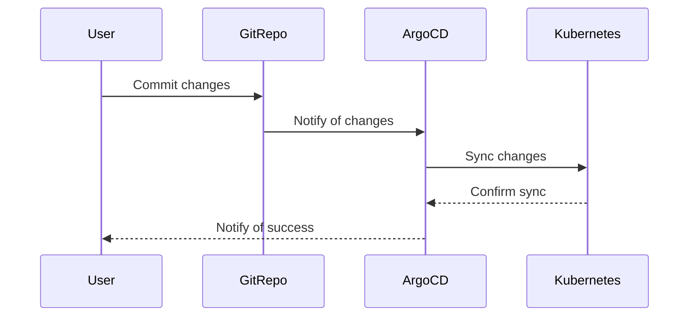
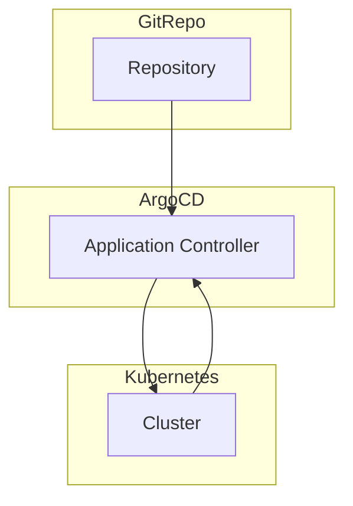

## Introduction to Application Release Pipeline with ArgoCD

In the context of DevSecOps, an application release pipeline is a series of steps that automate the process of building, testing, and deploying applications. One of the key tools used in this process is ArgoCD, which is a declarative, GitOps continuous delivery tool for Kubernetes. This chapter will delve into the configuration and deployment of an application using ArgoCD, focusing on the creation of a separate branch for configuration and the subsequent steps to ensure successful deployment.

### What is ArgoCD?

ArgoCD is a declarative, GitOps continuous delivery tool for Kubernetes. It allows you to manage your Kubernetes resources through Git repositories, ensuring that your infrastructure as code (IaC) is version-controlled and auditable. ArgoCD provides a way to synchronize your Kubernetes clusters with the desired state defined in your Git repository.

#### Why Use ArgoCD?

- **Declarative**: You define the desired state of your cluster in a declarative manner, making it easier to understand and maintain.
- **GitOps**: By using Git as the single source of truth, you can leverage Git's powerful features such as version control, branching, and pull requests.
- **Automation**: ArgoCD automates the synchronization between your Git repository and your Kubernetes cluster, reducing the risk of human error.
- **Security**: With proper configuration, ArgoCD can enforce strict security policies, ensuring that only authorized changes are applied to your cluster.

### Creating a Separate Branch for Configuration

To manage the configuration changes effectively, it is recommended to create a separate branch specifically for these changes. In this case, we will create a branch named `feature-argocd`.

#### Step-by-Step Process

1. **Create the Branch**:
   ```bash
   git checkout -b feature-argocd
   ```

2. **Make Configuration Changes**:
   - Add or modify the necessary configuration files in this branch.
   - Ensure that these changes are committed to the branch.

3. **Push the Branch**:
   ```bash
   git push origin feature-argocd
   ```

4. **Create an ArgoCD Application**:
   - Define the application in a `yaml` file.
   - Apply the application definition to ArgoCD.

#### Example Configuration

Let's assume we have a simple application defined in a `yaml` file:

```yaml
apiVersion: argoproj.io/v1alpha1
kind: Application
metadata:
  name: my-app
spec:
  project: default
  source:
    repoURL: https://github.com/myorg/myrepo.git
    targetRevision: HEAD
    path: k8s
  destination:
    server: https://kubernetes.default.svc
    namespace: my-app-namespace
```

This configuration specifies the following:
- The application name is `my-app`.
- The source repository is `https://github.com/myorg/myrepo.git`.
- The target revision is `HEAD`, meaning the latest commit.
- The path to the Kubernetes manifests is `k8s`.
- The destination server is the default Kubernetes service.
- The destination namespace is `my-app-namespace`.

#### Applying the Configuration

To apply this configuration, you would use the ArgoCD CLI:

```bash
argocd app create my-app --repo https://github.com/myorg/myrepo.git --path k8s --dest-server https://kubernetes.default.svc --dest-namespace my-app-namespace
```

### Connecting to the Cluster and Accessing ArgoCD

Once the application is created, you need to connect to the Kubernetes cluster and access ArgoCD to verify the deployment.

#### Connecting to the Cluster

To connect to the Kubernetes cluster, you typically use `kubectl`:

```bash
kubectl get pods -n my-app-namespace
```

This command lists all the pods in the specified namespace, allowing you to verify that the application has been deployed correctly.

#### Accessing ArgoCD

To access ArgoCD, you can use the ArgoCD CLI or the web UI. First, log in to ArgoCD:

```bash
argocd login <argocd-server-url>
```

Then, view the status of the application:

```bash
argocd app get my-app
```

This command shows the current status of the application, including whether it is synchronized with the Git repository.

### Verifying the Deployment

To ensure that the application was successfully created and connected to the GitOps repository, you should check the following:

1. **Application Status**:
   - Ensure that the application is in a `Synced` state.
   - Check for any errors or warnings in the application status.

2. **Cluster Resources**:
   - Verify that the resources defined in the `yaml` file are present in the cluster.
   - Use `kubectl` commands to inspect the resources.

3. **Git Repository**:
   - Ensure that the changes made in the `feature-argocd` branch are reflected in the Git repository.
   - Check the commit history to verify that the changes were committed and pushed.

### Real-World Examples and Recent CVEs

Recent breaches and CVEs related to Kubernetes and GitOps include:

- **CVE-2021-20245**: A vulnerability in Kubernetes Dashboard allowed unauthorized access to the dashboard.
- **CVE-2021-25741**: A vulnerability in Kubernetes API server allowed unauthorized access to sensitive information.

These vulnerabilities highlight the importance of securing your Kubernetes clusters and Git repositories. Proper configuration and monitoring are crucial to prevent such issues.

### How to Prevent / Defend

#### Detection

- **Monitoring**: Use tools like Prometheus and Grafana to monitor the health and performance of your applications.
- **Logging**: Enable logging for all Kubernetes resources and store logs in a centralized location for analysis.
- **Audit Logs**: Enable audit logs in Kubernetes to track all actions performed on the cluster.

#### Prevention

- **RBAC**: Implement Role-Based Access Control (RBAC) to restrict access to Kubernetes resources.
- **Network Policies**: Use Network Policies to control traffic within the cluster.
- **Secure Configurations**: Follow secure configurations for Kubernetes components, such as disabling unnecessary APIs and enabling TLS for communication.

#### Secure Coding Fixes

Here is an example of a vulnerable configuration and its secure counterpart:

**Vulnerable Configuration**:
```yaml
apiVersion: v1
kind: Pod
metadata:
  name: my-pod
spec:
  containers:
  - name: my-container
    image: my-image
    ports:
    - containerPort: 80
```

**Secure Configuration**:
```yaml
apiVersion: v1
kind: Pod
metadata:
  name: my-pod
spec:
  containers:
  - name: my-container
    image: my-image
    ports:
    - containerPort: 80
      protocol: TCP
    securityContext:
      runAsUser: 1000
      allowPrivilegeEscalation: false
```

The secure configuration includes a `securityContext` that restricts the privileges of the container.

### Complete Example

#### Full HTTP Request and Response

When interacting with ArgoCD via the API, you might send a request like this:

```http
POST /api/v1/applications HTTP/1.1
Host: argocd.example.com
Content-Type: application/json
Authorization: Bearer <token>

{
  "name": "my-app",
  "project": "default",
  "source": {
    "repoURL": "https://github.com/myorg/myrepo.git",
    "targetRevision": "HEAD",
    "path": "k8s"
  },
  "destination": {
    "server": "https://kubernetes.default.svc",
    "namespace": "my-app-namespace"
  }
}
```

The corresponding response might look like this:

```http
HTTP/1.1 200 OK
Content-Type: application/json

{
  "metadata": {
    "name": "my-app",
    "creationTimestamp": "2023-01-01T00:00:00Z"
  },
  "spec": {
    "project": "default",
    "source": {
      "repoURL": "https://github.com/myorg/myrepo.git",
      "targetRevision": "HEAD",
      "path": "k8s"
    },
    "destination": {
      "server": "https://kubernetes.default.svc",
      "namespace": "my-app-namespace"
    }
  },
  "status": {
    "health": {
      "status": "Healthy",
      "message": "all checks passed"
    },
    "sync": {
      "status": "Synced",
      "message": "application is synced with the Git repository"
    }
  }
}
```

### Mermaid Diagrams

#### Application Deployment Flow



#### Network Topology



### Hands-On Labs

For hands-on practice with ArgoCD and GitOps, consider the following labs:

- **PortSwigger Web Security Academy**: Focuses on web application security but can provide insights into secure coding practices.
- **OWASP Juice Shop**: A deliberately insecure web application for practicing web security skills.
- **CloudGoat**: Provides scenarios for practicing cloud security on AWS.
- **Pacu**: A collection of AWS security tools for penetration testing and security assessments.

### Conclusion

By following the steps outlined in this chapter, you can effectively manage your application release pipeline using ArgoCD. Creating a separate branch for configuration changes ensures that your pipeline is well-managed and auditable. Ensuring that your application is successfully created and connected to the GitOps repository is crucial for maintaining a secure and reliable deployment process.

---
<!-- nav -->
[[02-Introduction to Application Release Pipeline with ArgoCD Part 1|Introduction to Application Release Pipeline with ArgoCD Part 1]] | [[DevSecOps/DevSecOps Bootcamp/07-CI CD Security Pipeline/01-App Release Pipeline with ArgoCD/IaC Pipeline Configuration Deploy Argo Part 2/00-Overview|Overview]] | [[04-Introduction to Application Release Pipeline with ArgoCD|Introduction to Application Release Pipeline with ArgoCD]]
