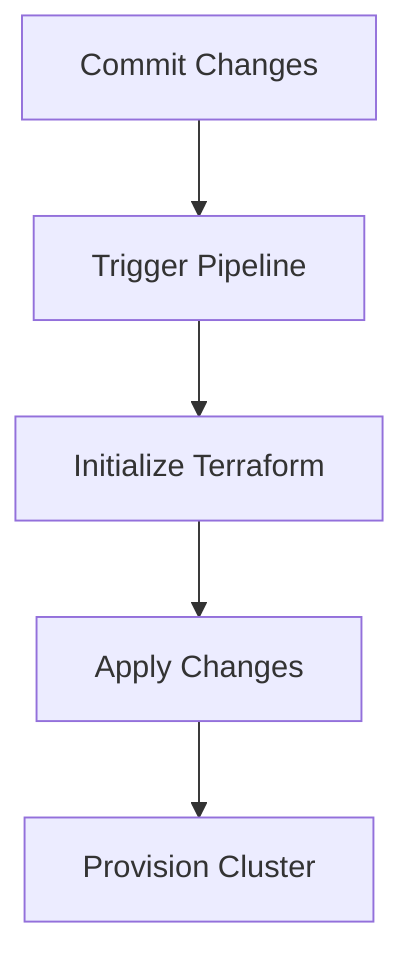
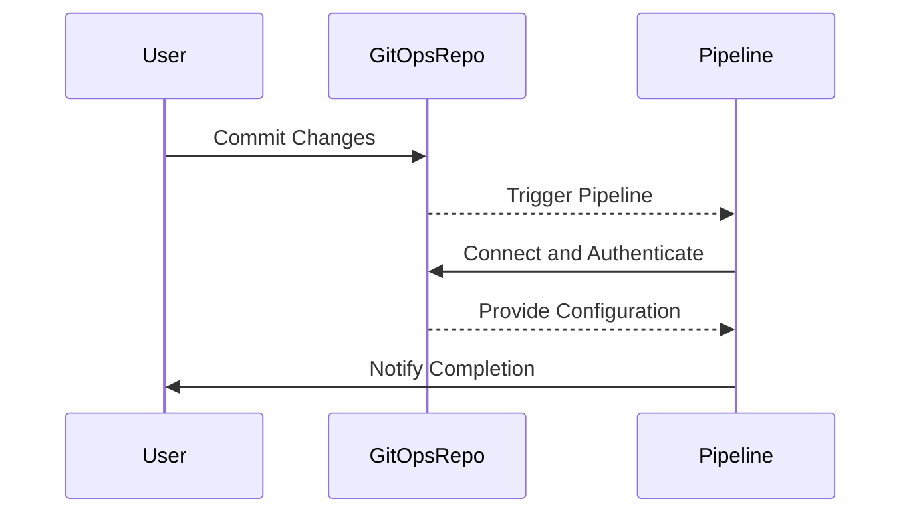

## Infrastructure as Code (IaC) Pipeline Configuration with ArgoCD

### Introduction to IaC and ArgoCD

Infrastructure as Code (IaC) is a practice where infrastructure is defined using declarative configuration files rather than manual setup processes. This approach allows for version control, automated testing, and reproducibility of infrastructure setups. One popular tool for managing IaC pipelines is ArgoCD, which is an open-source continuous delivery tool for Kubernetes applications.

ArgoCD enables the deployment and management of applications in a GitOps workflow, where the desired state of the infrastructure is stored in a Git repository. Any changes to the infrastructure are made through commits to the Git repository, which then triggers the ArgoCD application controller to reconcile the actual state with the desired state.

### Setting Up Variables in the Infrastructure Pipeline

Before configuring the pipeline code, it is essential to define the necessary variables. These variables will be used to parameterize the infrastructure configuration and ensure that the pipeline can dynamically adapt to different environments or configurations.

#### Step-by-Step Variable Definition

1. **Navigate to the Infrastructure Repository**: 
   - Open the infrastructure automation repository where the pipeline configuration is stored.
   - Go to the settings section of the repository.

2. **Define Pipeline Variables**:
   - In the pipeline variables section, add the required variables.
   - Ensure that the variables are accessible to feature branches by unchecking any options that restrict their usage.

3. **Create Variables One by One**:
   - Define each variable individually, ensuring that they are correctly named and formatted.

#### Example Variables

For instance, if using Terraform, the variables can be defined as environment variables with the `TF_VAR_` prefix. Here are some example variables:

```yaml
TF_VAR_gitops_repo_url: "https://github.com/example/gitops-repo"
TF_VAR_username: "your-username"
TF_VAR_password: "your-password"
```

These variables will be used to connect to the GitOps repository and authenticate the necessary operations.

### Understanding the GitOps Repository

The GitOps repository is the central location where the desired state of the infrastructure is stored. This repository contains the configuration files that define the infrastructure, such as Kubernetes manifests, Terraform files, and other IaC definitions.

#### Connecting to the GitOps Repository

To connect to the GitOps repository, the following steps are typically involved:

1. **Repository URL**:
   - The URL of the GitOps repository is specified as a variable (`TF_VAR_gitops_repo_url`).

2. **Authentication**:
   - The username and password are provided as variables (`TF_VAR_username` and `TF_VAR_password`) to authenticate the connection.

#### Example GitOps Repository Configuration

Here is an example of how the GitOps repository might be configured:

```yaml
# .gitlab-ci.yml
variables:
  TF_VAR_gitops_repo_url: "https://github.com/example/gitops-repo"
  TF_VAR_username: "your-username"
  TF_VAR_password: "your-password"

stages:
  - deploy

deploy_infrastructure:
  stage: deploy
  script:
    - terraform init
    - terraform apply -auto-approve
```

This configuration ensures that the pipeline can access the GitOps repository and apply the necessary changes.

### Provisioning the Cluster from Scratch

When committing changes to the Git repository, it triggers the pipeline to provision the entire cluster from scratch. This process involves destroying the existing cluster and creating a new one based on the updated configuration.

#### Steps to Destroy and Re-Provision the Cluster

1. **Destroy the Existing Cluster**:
   - Use Terraform or another IaC tool to destroy the existing cluster.
   - Ensure that all resources are properly cleaned up to avoid any residual issues.

2. **Commit Changes to the Git Repository**:
   - Commit the updated configuration files to the Git repository.
   - This action triggers the pipeline to start provisioning the new cluster.

#### Example Terraform Destroy Command

Here is an example of how to destroy the existing cluster using Terraform:

```bash
terraform destroy -auto-approve
```

After destroying the cluster, commit the changes to the Git repository:

```bash
git add .
git commit -m "Provision cluster from scratch"
git push origin main
```

### Handling Feature Branches

Feature branches are used to develop new features or make changes without affecting the main branch. To ensure that the pipeline variables are accessible to feature branches, the variables should be defined in a way that they can be used across different branches.

#### Example Feature Branch Configuration

Here is an example of how to configure the pipeline to handle feature branches:

```yaml
# .gitlab-ci.yml
variables:
  TF_VAR_gitops_repo_url: "https://github.com/example/gitops-repo"
  TF_VAR_username: "your-username"
  TF_VAR_password: "your-password"

stages:
  - deploy

deploy_infrastructure:
  stage: deploy
  only:
    - main
    - /^feature\/.*/
  script:
    - terraform init
    - terraform apply -auto-approve
```

This configuration ensures that the pipeline runs for both the main branch and any feature branches that match the pattern `/^feature\/./`.

### Recent Real-World Examples

Recent real-world examples of IaC and GitOps include the following:

- **CVE-2021-20225**: A vulnerability in Terraform that allowed unauthorized access to sensitive data. This highlights the importance of securing IaC tools and repositories.
- **GitHub Breach (2021)**: A breach that compromised user credentials, emphasizing the need for strong authentication mechanisms in GitOps workflows.

### How to Prevent / Defend

#### Detection

- **Audit Logs**: Enable audit logs for all IaC operations to track changes and identify potential security issues.
- **Monitoring Tools**: Use monitoring tools like Prometheus and Grafana to monitor the health and performance of the infrastructure.

#### Prevention

- **Secure Authentication**: Use strong authentication mechanisms, such as OAuth tokens or SSH keys, to secure access to the GitOps repository.
- **Least Privilege Principle**: Ensure that users and services have the minimum permissions required to perform their tasks.

#### Secure Coding Fixes

Here is an example of a vulnerable and secure configuration:

**Vulnerable Configuration**:

```yaml
# .gitlab-ci.yml
variables:
  TF_VAR_gitops_repo_url: "https://github.com/example/gitops-repo"
  TF_VAR_username: "your-username"
  TF_VAR_password: "your-password"
```

**Secure Configuration**:

```yaml
# .gitlab-ci.yml
variables:
  TF_VAR_gitops_repo_url: "https://github.com/example/gitops-repo"
  TF_VAR_username: "${GITOPS_USERNAME}"
  TF_VAR_password: "${GITOPS_PASSWORD}"
```

In the secure configuration, the sensitive information is stored as environment variables, which are not exposed in the configuration files.

### Complete Example of Request, Response, and Result

Here is a complete example of the HTTP request, response, and result for a pipeline trigger:

#### HTTP Request

```http
POST /api/v4/projects/12345/pipeline HTTP/1.1
Host: gitlab.example.com
Authorization: Bearer <access_token>
Content-Type: application/json

{
  "ref": "main",
  "variables": [
    {
      "key": "TF_VAR_gitops_repo_url",
      "value": "https://github.com/example/gitops-repo"
    },
    {
      "key": "TF_VAR_username",
      "value": "your-username"
    },
    {
      "key": "TF_VAR_password",
      "value": "your-password"
    }
  ]
}
```

#### HTTP Response

```http
HTTP/1.1 201 Created
Content-Type: application/json

{
  "id": 67890,
  "status": "pending",
  "ref": "main",
  "sha": "abcde12345",
  "web_url": "https://gitlab.example.com/project/pipelines/67890"
}
```

#### Result

The pipeline is triggered and starts provisioning the cluster from scratch. The status of the pipeline can be monitored via the provided web URL.

### Mermaid Diagrams

#### Pipeline Workflow Diagram



#### GitOps Repository Connection Diagram



### Hands-On Labs

For hands-on practice with IaC and ArgoCD, consider the following labs:

- **PortSwigger Web Security Academy**: Focuses on web application security but includes sections on IaC and GitOps.
- **OWASP Juice Shop**: A deliberately insecure web application for practicing security skills, including IaC and GitOps.
- **CloudGoat**: A cloud security training platform that includes exercises on IaC and GitOps with AWS.
- **Kubernetes Goat**: A Kubernetes security training platform that includes exercises on IaC and GitOps with Kubernetes.

By following these detailed steps and examples, you can effectively manage your infrastructure using IaC and ArgoCD, ensuring that your pipelines are secure and reliable.

---
<!-- nav -->
[[05-Introduction to Infrastructure as Code (IaC) and Continuous Delivery with ArgoCD|Introduction to Infrastructure as Code (IaC) and Continuous Delivery with ArgoCD]] | [[DevSecOps/DevSecOps Bootcamp/07-CI CD Security Pipeline/01-App Release Pipeline with ArgoCD/IaC Pipeline Configuration Deploy Argo Part 2/00-Overview|Overview]] | [[DevSecOps/DevSecOps Bootcamp/07-CI CD Security Pipeline/01-App Release Pipeline with ArgoCD/IaC Pipeline Configuration Deploy Argo Part 2/07-Practice Questions & Answers|Practice Questions & Answers]]
