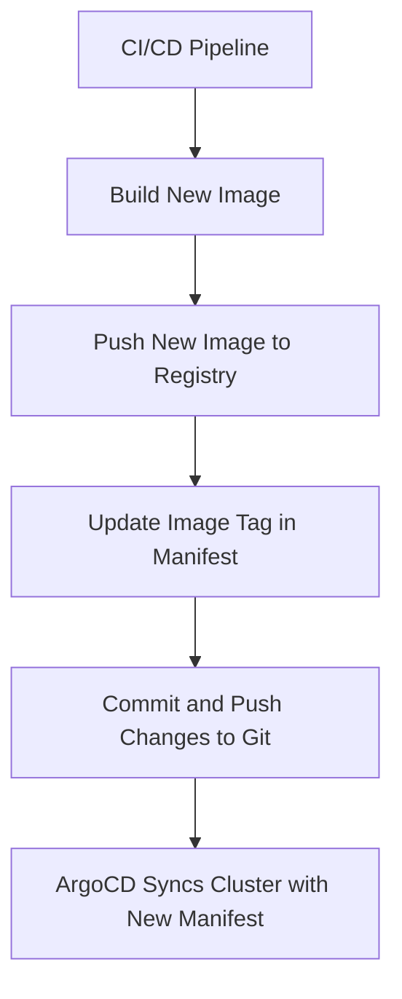
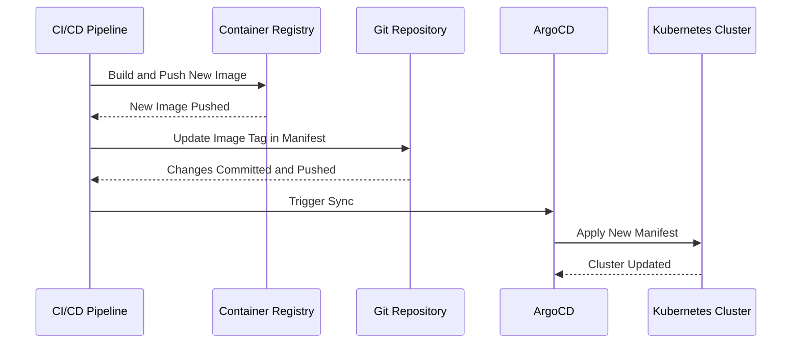

## Introduction to App Release Pipeline with ArgoCD Using Kustomize

In the realm of DevSecOps, managing the deployment and release of applications in a Kubernetes environment is a critical task. One of the most effective tools for this purpose is ArgoCD, which leverages GitOps principles to ensure that the desired state of the application is always reflected in the Kubernetes cluster. This chapter delves into the intricacies of setting up an app release pipeline using ArgoCD and Kustomize, focusing on the management of Kubernetes manifests for microservices applications.

### Background Theory

#### What is GitOps?

GitOps is a set of practices that uses Git as a single source of truth for all infrastructure and application configurations. This approach ensures that the desired state of the system is version-controlled and can be audited, reviewed, and rolled back easily. GitOps emphasizes the importance of declarative infrastructure, where the desired state is defined in code, and automated tools are used to reconcile the actual state with the desired state.

#### What is ArgoCD?

ArgoCD is a declarative, GitOps continuous delivery tool for Kubernetes. It allows you to manage your Kubernetes applications by syncing your cluster state with a Git repository. ArgoCD provides a robust mechanism to ensure that the cluster is always in sync with the desired state defined in the Git repository. It supports various features such as automatic synchronization, rollbacks, and multi-cluster management.

#### What is Kustomize?

Kustomize is a tool for customizing raw, template-free YAML files for multiple purposes, typically for deploying to different environments. It allows you to maintain a single set of base YAML files and customize them for different environments using overlay files. This approach helps in reducing redundancy and makes it easier to manage different environments.

### Parameterizing Kubernetes Manifests

One of the key aspects of managing Kubernetes manifests is parameterizing them. This means that certain values, such as image tags, can be dynamically updated during the deployment process. In the context of a microservices application, the image tag is particularly important because it determines which version of the service is deployed.

#### Why Parameterize Image Tags?

The image tag is crucial because it specifies the exact version of the Docker image that should be deployed. By parameterizing this value, you can automate the process of updating the image tag whenever a new version of the service is built and pushed to the repository. This ensures that the latest version of the service is always deployed in the cluster.

#### How to Parameterize Image Tags

To parameterize the image tag, you can define it as a variable in your Kubernetes manifest. For example:

```yaml
apiVersion: apps/v1
kind: Deployment
metadata:
  name: my-service
spec:
  replicas: 3
  selector:
    matchLabels:
      app: my-service
  template:
    metadata:
      labels:
        app: my-service
    spec:
      containers:
      - name: my-service
        image: my-repo/my-service:{{IMAGE_TAG}}
```

Here, `{{IMAGE_TAG}}` is a placeholder that will be replaced with the actual image tag during the deployment process.

### Using Kustomize for Customization

Kustomize provides a powerful way to customize your Kubernetes manifests for different environments. You can define a base set of manifests and then create overlay files to customize them for specific environments.

#### Base Manifests

The base manifests contain the core configuration of your application. These are the default settings that will be applied unless overridden by an overlay.

```yaml
# base/deployment.yaml
apiVersion: apps/v1
kind: Deployment
metadata:
  name: my-service
spec:
  replicas: 3
  selector:
    matchLabels:
      app: my-service
  template:
    metadata:
      labels:
        app:  my-service
    spec:
      containers:
      - name: my-service
        image: my-repo/my-service:latest
```

#### Overlay Files

Overlay files allow you to customize the base manifests for specific environments. For example, you might have a `dev` overlay that overrides certain values for the development environment.

```yaml
# overlays/dev/kustomization.yaml
resources:
- ../../base/deployment.yaml

patchesStrategicMerge:
- patch.yaml
```

```yaml
# overlays/dev/patch.yaml
apiVersion: apps/v1
kind: Deployment
metadata:
  name: my-service
spec:
  template:
    spec:
      containers:
      - name: my-service
        image: my-repo/my-service:dev
```

### Automating the Deployment Process

The deployment process can be automated using a CI/CD pipeline. The pipeline will build the new image, push it to the repository, and update the image tag in the Kubernetes manifest. ArgoCD will then detect the change and synchronize the cluster with the new manifest.

#### Example Pipeline Steps

1. **Build the New Image**: Use a CI/CD tool like Jenkins, GitLab CI, or GitHub Actions to build the new image.
2. **Push the New Image**: Push the new image to the container registry.
3. **Update the Image Tag**: Update the image tag in the Kubernetes manifest.
4. **Commit and Push Changes**: Commit the updated manifest to the Git repository and push the changes.
5. **Sync with ArgoCD**: ArgoCD will detect the change and synchronize the cluster with the new manifest.

### Real-World Example

Consider a scenario where a microservices application is being developed and deployed using ArgoCD and Kustomize. The application consists of several services, each with its own deployment manifest.

#### Initial Setup

1. **Base Manifests**: Define the base manifests for each service.
2. **Overlay Files**: Create overlay files for different environments (e.g., `dev`, `staging`, `prod`).

#### Deployment Process

1. **Build and Push New Image**: A new version of the service is built and pushed to the container registry.
2. **Update Image Tag**: The image tag in the Kubernetes manifest is updated to reflect the new version.
3. **Commit and Push Changes**: The updated manifest is committed and pushed to the Git repository.
4. **Sync with ArgoCD**: ArgoCD detects the change and synchronizes the cluster with the new manifest.

### Mermaid Diagrams

#### Deployment Architecture



#### Request/Response Flow



### Common Pitfalls and How to Avoid Them

#### Hard-Coded Values

Hard-coding values in your manifests can lead to issues when trying to customize them for different environments. Always use variables and overlays to avoid hard-coding.

**Vulnerable Code**

```yaml
apiVersion: apps/v1
kind: Deployment
metadata:
  name: my-service
spec:
  replicas: 3
  selector:
    matchLabels:
      app: my-service
  template:
    metadata:
      labels:
        app: my-service
    spec:
      containers:
      - name: my-service
        image: my-repo/my-service:latest
```

**Secure Code**

```yaml
apiVersion: apps/v1
kind: Deployment
metadata:
  name: my-service
spec:
  replicas: 3
  selector:
    matchLabels:
      app: my-service
  template:
    metadata:
      labels:
        app: my-service
    spec:
      containers:
      - name: my-service
        image: my-repo/my-service:{{IMAGE_TAG}}
```

### Detection and Prevention

#### Detection

To detect issues in your deployment process, you can use tools like ArgoCD's built-in monitoring and alerting capabilities. Additionally, you can set up CI/CD pipelines to automatically test and validate the changes before they are applied to the cluster.

#### Prevention

To prevent issues, follow best practices such as:

1. **Use Variables and Overlays**: Avoid hard-coding values in your manifests.
2. **Automate Testing**: Ensure that your CI/CD pipeline includes automated testing to catch issues early.
3. **Regular Audits**: Regularly audit your Git repository and cluster to ensure that they are in sync with the desired state.

### Secure Coding Practices

#### Example Vulnerable Code

```yaml
apiVersion: apps/v1
kind: Deployment
metadata:
  name: my-service
spec:
  replicas: 3
  selector:
    matchLabels:
      app: my-service
  template:
    metadata:
      labels:
        app: my-service
    spec:
      containers:
      - name: my-service
        image: my-repo/my-service:latest
```

#### Example Secure Code

```yaml
apiVersion: apps/v1
kind: Deployment
metadata:
  name: my-service
spec:
  replicas: 3
  selector:
    matchLabels:
      app: my-service
  template:
    metadata:
      labels:
        app: my-service
    spec:
      containers:
      - name: my-service
        image: my-repo/my-service:{{IMAGE_TAG}}
```

### Hands-On Labs

For hands-on practice, consider the following labs:

- **PortSwigger Web Security Academy**: Focuses on web application security but also covers Kubernetes and GitOps principles.
- **OWASP Juice Shop**: A deliberately insecure web application for practicing web security skills.
- **Kubernetes Goat**: A Kubernetes-based security training platform that simulates real-world attacks and vulnerabilities.

### Conclusion

Managing the deployment and release of applications in a Kubernetes environment using ArgoCD and Kustomize is a powerful approach that ensures consistency and reliability. By parameterizing your manifests, using Kustomize for customization, and automating the deployment process, you can ensure that your application is always in the desired state. Following best practices and using secure coding techniques can help prevent issues and ensure the security of your application.

---
<!-- nav -->
[[DevSecOps/DevSecOps Bootcamp/07-CI CD Security Pipeline/01-App Release Pipeline with ArgoCD/K8s Manifests for Microservices App using Kustomize/00-Overview|Overview]] | [[02-Introduction to App Release Pipeline with ArgoCD Using Kustomize|Introduction to App Release Pipeline with ArgoCD Using Kustomize]]
