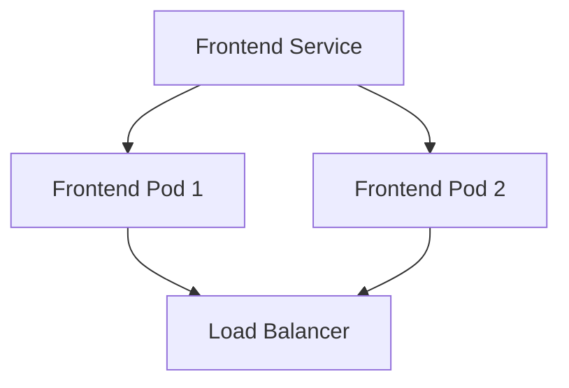

## Introduction to Kubernetes Manifests and Microservices Deployment

In the context of modern DevSecOps practices, deploying applications in a Kubernetes (K8s) environment requires a deep understanding of Kubernetes manifests and microservices architecture. This chapter will delve into the intricacies of deploying a microservices-based application using Kustomize, a powerful tool for managing Kubernetes resources, and integrating it with ArgoCD, a declarative continuous delivery tool for Kubernetes.

### What Are Kubernetes Manifests?

Kubernetes manifests are YAML files that describe the desired state of your application in a Kubernetes cluster. These files define various Kubernetes objects such as Pods, Deployments, Services, ConfigMaps, and more. Each object has specific properties and behaviors that determine how your application runs in the cluster.

#### Why Use Kubernetes Manifests?

Using Kubernetes manifests allows you to manage your application's deployment in a consistent and repeatable manner. By defining your application's structure in code, you can easily version control your deployments, collaborate with team members, and automate the deployment process.

#### How Do Kubernetes Manifests Work?

When you apply a Kubernetes manifest to a cluster using `kubectl apply`, Kubernetes compares the current state of the cluster with the desired state defined in the manifest. If there are differences, Kubernetes makes the necessary changes to bring the cluster to the desired state. This process is called reconciliation.

### What Are Microservices?

Microservices are a design approach to building applications as a collection of small, independent services. Each service has a single responsibility and communicates with other services through well-defined APIs. This architecture allows for better scalability, fault isolation, and easier maintenance compared to monolithic applications.

#### Why Use Microservices?

Microservices offer several benefits:

- **Scalability**: You can scale individual services independently based on demand.
- **Fault Isolation**: A failure in one service does not affect others.
- **Easier Maintenance**: Smaller, focused services are easier to understand and maintain.
- **Faster Development**: Teams can work on different services simultaneously without interfering with each other.

#### How Do Microservices Work?

In a microservices architecture, each service runs in its own container and communicates with other services through APIs. Services can be deployed and scaled independently, allowing for greater flexibility and resilience.

### What Is Kustomize?

Kustomize is a tool for customizing Kubernetes manifests. It allows you to create reusable configurations and customize them for different environments without modifying the original manifests. Kustomize uses a set of base manifests and overlays to generate the final configuration.

#### Why Use Kustomize?

Kustomize simplifies the management of Kubernetes manifests by providing a way to customize and extend configurations without duplicating code. This is particularly useful in multi-environment setups where you need to make minor changes to the same base configuration.

#### How Does Kustomize Work?

Kustomize works by combining base manifests with overlays. Base manifests contain the core configuration, while overlays specify the customizations needed for a particular environment. Kustomize generates the final configuration by merging the base and overlay manifests.

### What Is ArgoCD?

ArgoCD is a declarative continuous delivery tool for Kubernetes. It allows you to manage the deployment of your applications in a GitOps workflow, where the desired state of your cluster is stored in a Git repository. ArgoCD continuously reconciles the actual state of the cluster with the desired state defined in the Git repository.

#### Why Use ArgoCD?

ArgoCD provides several benefits:

- **Declarative Deployment**: Define the desired state of your cluster in a Git repository.
- **Continuous Delivery**: Automatically deploy changes when the Git repository is updated.
- **Rollback**: Easily roll back to previous versions if something goes wrong.
- **Multi-Cluster Management**: Manage multiple clusters from a single interface.

#### How Does ArgoCD Work?

ArgoCD works by continuously comparing the actual state of the cluster with the desired state defined in the Git repository. If there are differences, ArgoCD applies the necessary changes to bring the cluster to the desired state. This process is called synchronization.

### Example: Deploying a Microservices Application Using Kustomize and ArgoCD

Let's walk through an example of deploying a microservices-based application using Kustomize and ArgoCD. We'll start by creating the base manifests and then customize them for different environments using Kustomize. Finally, we'll set up ArgoCD to manage the deployment.

#### Step 1: Create Base Manifests

First, we need to create the base manifests for our microservices application. These manifests will define the core configuration of our application, including the services, deployments, and other Kubernetes objects.

```yaml
# base/deployment.yaml
apiVersion: apps/v1
kind: Deployment
metadata:
  name: frontend-deployment
spec:
  replicas: 2
  selector:
    matchLabels:
      app: frontend
  template:
    metadata:
      labels:
        app: frontend
    spec:
      containers:
      - name: frontend
        image: myregistry/frontend:latest
        ports:
        - containerPort: 80
---
# base/service.yaml
apiVersion: v1
kind: Service
metadata:
  name: frontend-service
spec:
  type: LoadBalancer
  selector:
    app: frontend
  ports:
  - protocol: TCP
    port: 80
    targetPort: 80
```

These manifests define a deployment with two replicas of the `frontend` service and a load balancer service that exposes the frontend to the internet.

#### Step 2: Customize Manifests Using Kustomize

Next, we'll use Kustomize to customize the base manifests for different environments. We'll create an overlay for the development environment that changes the number of replicas and the image tag.

```yaml
# overlays/dev/kustomization.yaml
resources:
- ../../base
patchesStrategicMerge:
- dev-patch.yaml
```

```yaml
# overlays/dev/dev-patch.yaml
apiVersion: apps/v1
kind: Deployment
metadata:
  name: frontend-deployment
spec:
  replicas: 1
  template:
    spec:
      containers:
      - name: frontend
        image: myregistry/frontend:dev
```

This overlay reduces the number of replicas to 1 and changes the image tag to `dev`.

#### Step 3: Set Up ArgoCD

Finally, we'll set up ArgoCD to manage the deployment of our application. We'll create a Git repository to store our manifests and configure ArgoCD to sync the repository with our cluster.

```yaml
# argocd/app.yaml
apiVersion: argoproj.io/v1alpha1
kind: Application
metadata:
  name: frontend-app
spec:
  project: default
  source:
    repoURL: https://github.com/myorg/frontend-manifests.git
    targetRevision: HEAD
    path: overlays/dev
  destination:
    server: https://kubernetes.default.svc
    namespace: frontend-namespace
  syncPolicy:
    automated:
      prune: true
      selfHeal: true
```

This configuration tells ArgoCD to sync the `overlays/dev` directory of the `frontend-manifests` repository with the `frontend-namespace` in our cluster.

### Visualization in ArgoCD

Once the application is deployed, you can visualize the state of your microservices using ArgoCD. ArgoCD provides a dashboard that shows the status of your services, pods, and other Kubernetes objects.



This diagram shows the relationship between the frontend service, its pods, and the load balancer.

### Connectivity Through Load Balancer

The load balancer is a crucial component that directs traffic to the frontend service. In our example, the load balancer was automatically created in our AWS account.

```yaml
# Example of a load balancer configuration
apiVersion: v1
kind: Service
metadata:
  name: frontend-service
spec:
  type: LoadBalancer
  selector:
    app: frontend
  ports:
  - protocol: TCP
    port: 80
    targetPort: 80
```

This configuration creates a load balancer that forwards incoming traffic to the frontend service.

### Accessing the Frontend Application

To access the frontend application, you can use the DNS name provided by the load balancer. Open a browser and navigate to the DNS name to see the frontend application in action.

```http
GET http://frontend-load-balancer.example.com/
```

This request will be forwarded to the frontend service, which in turn forwards it to the frontend application.

### Real-World Examples and Recent Breaches

Recent breaches and CVEs have highlighted the importance of securing microservices-based applications. For example, the Log4Shell vulnerability (CVE-2021-44228) affected many applications, including those built with microservices. To mitigate such vulnerabilities, it's essential to follow secure coding practices and regularly update dependencies.

### Pitfalls and Common Mistakes

Deploying microservices-based applications can be complex, and there are several pitfalls to avoid:

- **Over-provisioning Resources**: Ensure that you provision the correct number of replicas and resources for each service.
- **Inconsistent Configurations**: Use tools like Kustomize to manage configurations consistently across environments.
- **Security Vulnerabilities**: Regularly scan your dependencies for vulnerabilities and keep them up to date.

### How to Prevent / Defend

To prevent and defend against issues in your microservices-based application, follow these best practices:

- **Secure Coding Practices**: Follow secure coding guidelines to prevent common vulnerabilities.
- **Dependency Management**: Use tools like `dep` or `go mod` to manage dependencies and ensure they are up to date.
- **Regular Scans**: Use tools like `Trivy` or `Clair` to scan your images for vulnerabilities.
- **Monitoring and Logging**: Implement monitoring and logging to detect and respond to issues quickly.

### Complete Example

Here is a complete example of deploying a microservices-based application using Kustomize and ArgoCD:

#### Base Manifests

```yaml
# base/deployment.yaml
apiVersion: apps/v1
kind: Deployment
metadata:
  name: frontend-deployment
spec:
  replicas: 2
  selector:
    matchLabels:
      app: frontend
  template:
    metadata:
      labels:
        app: frontend
    spec:
      containers:
      - name: frontend
        image: myregistry/frontend:latest
        ports:
        - containerPort: 80
---
# base/service.yaml
apiVersion: v1
kind: Service
metadata:
  name: frontend-service
spec:
  type: LoadBalancer
  selector:
    app: frontend
  ports:
  - protocol: TCP
    port: 80
    targetPort: 80
```

#### Customized Manifests

```yaml
# overlays/dev/kustomization.yaml
resources:
- ../../base
patchesStrategicMerge:
- dev-patch.yaml
```

```yaml
# overlays/dev/dev-patch.yaml
apiVersion: apps/v1
kind: Deployment
metadata:
  name: frontend-deployment
spec:
  replicas: 1
  template:
    spec:
      containers:
      - name: frontend
        image: myregistry/frontend:dev
```

#### ArgoCD Configuration

```yaml
# argocd/app.yaml
apiVersion: argoproj.io/v1alpha1
kind: Application
metadata:
  name: frontend-app
spec:
  project: default
  source:
    repoURL: https://github.com/myorg/frontend-manifests.git
    targetRevision: HEAD
    path: overlays/dev
  destination:
    server: https://kubernetes.default.svc
    namespace: frontend-namespace
  syncPolicy:
    automated:
      prune: true
      selfHeal: true
```

### Hands-On Labs

To practice deploying microservices-based applications using Kustomize and ArgoCD, you can use the following labs:

- **PortSwigger Web Security Academy**: Practice web application security concepts.
- **OWASP Juice Shop**: Learn about web application security vulnerabilities.
- **DVWA**: Practice web application security vulnerabilities.
- **WebGoat**: Learn about web application security vulnerabilities.

### Conclusion

Deploying a microservices-based application using Kustomize and ArgoCD requires a deep understanding of Kubernetes manifests, microservices architecture, and continuous delivery practices. By following the steps outlined in this chapter, you can effectively manage your application's deployment and ensure its security and reliability.

---
<!-- nav -->
[[06-Introduction to Kubernetes Manifests and Kustomize|Introduction to Kubernetes Manifests and Kustomize]] | [[DevSecOps/DevSecOps Bootcamp/07-CI CD Security Pipeline/01-App Release Pipeline with ArgoCD/K8s Manifests for Microservices App using Kustomize/00-Overview|Overview]] | [[08-Introduction to Kustomize and ArgoCD in DevSecOps Part 1|Introduction to Kustomize and ArgoCD in DevSecOps Part 1]]
