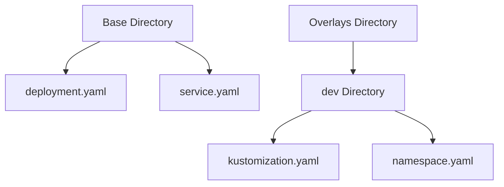

## Introduction to Kustomize and ArgoCD in DevSecOps

In the realm of DevSecOps, managing the deployment and release pipeline for microservices applications is a critical task. One of the key tools used in this process is **Kustomize**, which helps in customizing and deploying Kubernetes manifests. Another essential tool is **ArgoCD**, which facilitates continuous delivery and automated deployment of applications. This chapter will delve into how these tools can be effectively utilized to manage a microservices application using Kustomize and deploy it via ArgoCD.

### What is Kustomize?

**Kustomize** is a tool that allows you to customize and manage Kubernetes manifests. It provides a way to modify and combine multiple manifests into a single, cohesive set of resources. The primary advantage of Kustomize is that it enables you to maintain a single set of base manifests and create customized versions for different environments (development, staging, production) without duplicating code.

#### Why Use Kustomize?

- **Modularity**: Kustomize allows you to break down your application into smaller, reusable components.
- **Environment Customization**: You can easily customize your application for different environments without changing the base manifests.
- **Version Control**: Since Kustomize uses plain text files, it integrates seamlessly with version control systems like Git.

### What is ArgoCD?

**ArgoCD** is an open-source tool for continuous delivery and automated deployment of applications. It is built on top of Kubernetes and provides a declarative approach to managing application deployments. ArgoCD supports various deployment strategies, including blue-green deployments and canary releases.

#### Why Use ArgoCD?

- **Declarative Deployment**: ArgoCD uses a declarative model to describe the desired state of your application.
- **Automated Syncing**: It automatically syncs the desired state with the actual state of your cluster.
- **Multi-Cluster Support**: ArgoCD can manage multiple clusters and namespaces, making it ideal for large-scale deployments.

### Base Microservice Application

Let's start by defining the base microservice application. In Kustomize, the base application consists of a set of Kubernetes manifests that define the core resources required for the application to run. These resources typically include:

- **Deployments**
- **Services**
- **ConfigMaps**
- **Secrets**

Here is an example of a base microservice application:

```yaml
# base/deployment.yaml
apiVersion: apps/v1
kind: Deployment
metadata:
  name: myapp
spec:
  replicas: 3
  selector:
    matchLabels:
      app: myapp
  template:
    metadata:
      labels:
        app: myapp
    spec:
      containers:
      - name: myapp
        image: myapp:v1
        ports:
        - containerPort: 8080

# base/service.yaml
apiVersion: v1
kind: Service
metadata:
  name: myapp
spec:
  selector:
    app: myapp
  ports:
  - protocol: TCP
    port: 80
    targetPort: 8080
```

### Overlays for Different Environments

Once the base application is defined, you can create overlays for different environments. An overlay is a set of modifications applied to the base manifests to customize them for a specific environment. In Kustomize, overlays are defined in separate folders, each containing a `kustomization.yaml` file.

#### Example Overlay for Development Environment

```yaml
# overlays/dev/kustomization.yaml
resources:
- ../../base

patchesStrategicMerge:
- namespace.yaml
```

The `namespace.yaml` file specifies the namespace for the development environment:

```yaml
# overlays/dev/namespace.yaml
apiVersion: v1
kind: Namespace
metadata:
  name: dev
```

### Applying the Customizations

To apply the customizations, you can use the `kustomize build` command followed by `kubectl apply`. Here’s how you can do it:

```bash
# Build the kustomization for the development environment
kustomize build overlays/dev > dev-manifests.yaml

# Apply the generated manifests to the Kubernetes cluster
kubectl apply -f dev-manifests.yaml
```

### Mermaid Diagrams for Visualization

Let's visualize the structure of the base and overlay directories using a mermaid diagram:



### Real-World Examples and Recent Breaches

One recent example of a breach involving misconfigured Kubernetes resources is the **CVE-2021-25741**. This vulnerability allowed unauthorized access to Kubernetes clusters due to misconfigured RBAC permissions. To prevent such issues, it is crucial to ensure that your Kustomize configurations are secure and properly managed.

### How to Prevent / Defend

#### Secure Configuration Management

1. **RBAC Permissions**: Ensure that RBAC roles and bindings are correctly configured to limit access to sensitive resources.
2. **Namespace Isolation**: Use namespaces to isolate different environments and applications.
3. **Secret Management**: Use Kubernetes secrets to store sensitive information securely.

#### Example Vulnerable vs. Secure Configuration

**Vulnerable Configuration:**

```yaml
# overlays/dev/kustomization.yaml
resources:
- ../../base

patchesStrategicMerge:
- namespace.yaml
```

**Secure Configuration:**

```yaml
# overlays/dev/kustomization.yaml
resources:
- ../../base

patchesStrategicMerge:
- namespace.yaml
- rbac.yaml
```

**RBAC Configuration:**

```yaml
# overlays/dev/rbac.yaml
apiVersion: rbac.authorization.k8s.io/v1
kind: Role
metadata:
  name: dev-role
rules:
- apiGroups: [""]
  resources: ["pods"]
  verbs: ["get", "list", "watch"]

---
apiVersion: rbac.authorization.k8s.io/v1
kind: RoleBinding
metadata:
  name: dev-binding
roleRef:
  apiGroup: rbac.authorization.k8s.io
  kind: Role
  name: dev-role
subjects:
- kind: ServiceAccount
  name: default
  namespace: dev
```

### Integrating with ArgoCD

Once the Kustomize configurations are set up, you can integrate them with ArgoCD for automated deployment. Here’s how you can set up ArgoCD to manage your application:

1. **Install ArgoCD**: First, install ArgoCD in your Kubernetes cluster.

```bash
kubectl create namespace argocd
kubectl apply -n argocd -f https://raw.githubusercontent.com/argoproj/argo-cd/stable/manifests/install.yaml
```

2. **Configure ArgoCD**: Configure ArgoCD to use your Kustomize directory as the source of truth.

```yaml
# argocd-application.yaml
apiVersion: argoproj.io/v1alpha1
kind: Application
metadata:
  name: myapp
spec:
  project: default
  source:
    repoURL: https://github.com/myorg/myapp.git
    targetRevision: HEAD
    path: overlays/dev
  destination:
    server: https://kubernetes.default.svc
    namespace: dev
```

3. **Apply the Application**: Apply the ArgoCD application configuration to your cluster.

```bash
kubectl apply -f argocd-application.yaml
```

### Monitoring and Logging

To ensure the health and security of your application, it is important to monitor and log the activities in your Kubernetes cluster. Tools like Prometheus and Grafana can be used for monitoring, while Fluentd and Elasticsearch can be used for logging.

### Hands-On Labs

For hands-on practice, you can use the following labs:

- **PortSwigger Web Security Academy**: Focuses on web application security but also covers Kubernetes and CI/CD pipelines.
- **OWASP Juice Shop**: A deliberately insecure web application for security training.
- **CloudGoat**: A series of labs designed to teach cloud security concepts using AWS.

### Conclusion

By leveraging Kustomize and ArgoCD, you can effectively manage and deploy microservices applications in a DevSecOps environment. Understanding the principles and practices covered in this chapter will help you build robust, secure, and scalable applications.

---
<!-- nav -->
[[07-Introduction to Kubernetes Manifests and Microservices Deployment|Introduction to Kubernetes Manifests and Microservices Deployment]] | [[DevSecOps/DevSecOps Bootcamp/07-CI CD Security Pipeline/01-App Release Pipeline with ArgoCD/K8s Manifests for Microservices App using Kustomize/00-Overview|Overview]] | [[09-Introduction to Kustomize and ArgoCD in DevSecOps Part 2|Introduction to Kustomize and ArgoCD in DevSecOps Part 2]]
