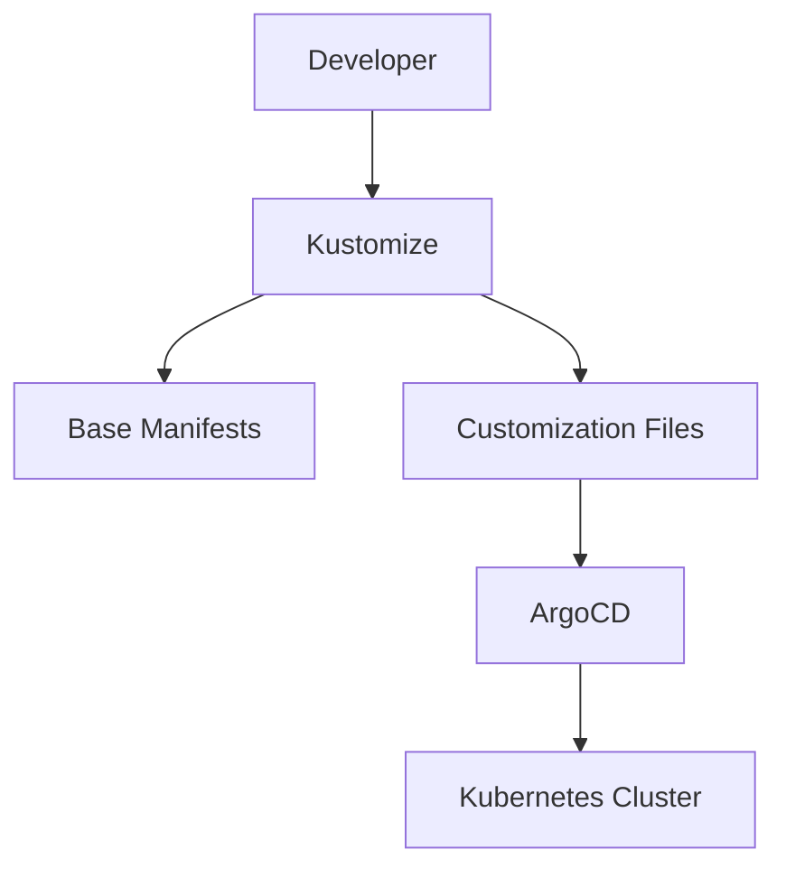
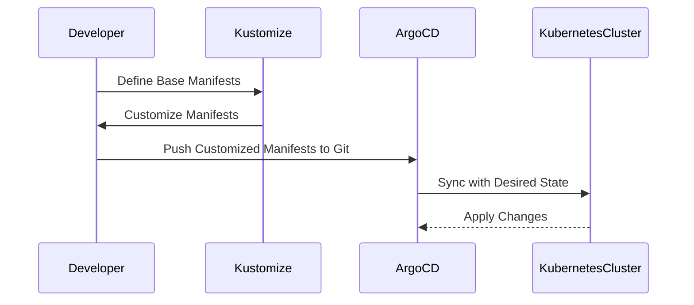

## Introduction to Kustomize and ArgoCD in DevSecOps

In the realm of DevSecOps, managing Kubernetes manifests for microservices applications efficiently is crucial. This chapter delves into the use of Kustomize and ArgoCD to streamline the deployment process, ensuring consistency and security throughout the application lifecycle.

### What is Kustomize?

Kustomize is a tool that allows you to customize raw, template-free YAML files for multiple purposes, such as different environments or deployments. It provides a way to manage and apply changes to your Kubernetes resources without having to modify the original manifests.

#### Why Use Kustomize?

- **Consistency**: Ensures that all deployments follow a consistent naming pattern and structure.
- **Maintainability**: Simplifies the management of multiple environments by abstracting away environment-specific details.
- **Security**: Reduces the risk of errors and inconsistencies by centralizing configuration management.

### What is ArgoCD?

ArgoCD is a declarative, GitOps continuous delivery tool for Kubernetes. It enables you to manage your cluster state through Git repositories, ensuring that your cluster remains in sync with your desired state.

#### Why Use ArgoCD?

- **GitOps Workflow**: Integrates seamlessly with Git-based workflows, allowing you to manage your cluster state through Git commits and pull requests.
- **Automated Syncing**: Automatically synchronizes your cluster with the desired state defined in your Git repository.
- **Security**: Provides robust mechanisms for securing your cluster, including role-based access control (RBAC) and secret management.

### Kustomize Configuration for Microservices

Let's explore how to configure Kustomize for a microservices application. We'll start by defining the base manifests and then customize them using Kustomize.

#### Base Manifests

The base manifests contain the core definitions of your microservices. These are typically stored in a `base` directory within your project.

```yaml
# base/deployment.yaml
apiVersion: apps/v1
kind: Deployment
metadata:
  name: card-service
spec:
  replicas: 3
  selector:
    matchLabels:
      app: card-service
  template:
    metadata:
      labels:
        app: card-service
    spec:
      containers:
      - name: card-service
        image: gcr.io/my-project/card-service:latest
```

#### Customization File

The customization file (`kustomization.yaml`) defines how the base manifests should be modified for different environments.

```yaml
# kustomization.yaml
resources:
- deployment.yaml

images:
- name: card-service
  newName: gcr.io/my-project/card-service
  newTag: 0.8.0
```

### Refactoring Images Using Kustomize

To refactor the images in your microservices, you can use Kustomize to define a consistent naming pattern and manage image tags centrally.

#### Step-by-Step Refactoring

1. **Define the Naming Pattern**:
   - Use a consistent naming pattern for your images, such as `gcr.io/my-project/service-name`.

2. **Set Image Tags**:
   - Define the image tags in the customization file to ensure they are updated consistently across all environments.

```yaml
# kustomization.yaml
resources:
- deployment.yaml

images:
- name: card-service
  newName: gcr.io/my-project/card-service
  newTag: 0.8.0
- name: payment-service
  newName: gcr.io/my-project/payment-service
  newTag: 1.2.3
```

### Deploying with ArgoCD

Once your Kustomize configurations are set up, you can use ArgoCD to deploy and manage your microservices application.

#### Setting Up ArgoCD

1. **Install ArgoCD**:
   - Install ArgoCD in your Kubernetes cluster using the official Helm chart.

```bash
helm repo add argo https://argoproj.github.io/argo-helm
helm install argocd argo/argo-cd --namespace argocd --create-namespace
```

2. **Configure ArgoCD**:
   - Configure ArgoCD to sync your cluster with the desired state defined in your Git repository.

```yaml
# argocd/cluster.yaml
apiVersion: argoproj.io/v1alpha1
kind: Application
metadata:
  name: my-microservices-app
spec:
  project: default
  source:
    repoURL: https://github.com/my-org/my-microservices-app.git
    targetRevision: HEAD
    path: kustomize
  destination:
    server: https://kubernetes.default.svc
    namespace: my-microservices-ns
```

### Real-World Example: Recent Breaches and CVEs

Recent breaches and CVEs highlight the importance of maintaining consistent and secure configurations in your Kubernetes clusters.

#### Example: CVE-2021-25741

CVE-2021-25741 is a vulnerability in Kubernetes that allows an attacker to escalate privileges by manipulating pod security contexts. This highlights the importance of using tools like Kustomize and ArgoCD to maintain consistent and secure configurations.

#### Secure Configuration Example

Here’s how you can secure your Kustomize configurations to prevent such vulnerabilities:

```yaml
# kustomization.yaml
resources:
- deployment.yaml

patchesStrategicMerge:
- patch.yaml

images:
- name: card-service
  newName: gcr.io/my-project/card-service
  newTag: 0.8.0
```

```yaml
# patch.yaml
apiVersion: apps/v1
kind: Deployment
metadata:
  name: card-service
spec:
  template:
    spec:
      securityContext:
        runAsUser: 1000
        fsGroup: 2000
```

### How to Prevent / Defend

#### Detection

- **Regular Audits**: Regularly audit your Kustomize configurations and ArgoCD applications to ensure they are up-to-date and secure.
- **Monitoring**: Implement monitoring and alerting for your Kubernetes cluster to detect any unauthorized changes.

#### Prevention

- **Role-Based Access Control (RBAC)**: Use RBAC to restrict access to sensitive resources and configurations.
- **Secret Management**: Use tools like Kubernetes Secrets or HashiCorp Vault to securely manage secrets.

#### Secure Coding Fixes

Here’s an example of a vulnerable configuration and its secure counterpart:

**Vulnerable Configuration**

```yaml
# deployment.yaml
apiVersion: apps/v1
kind: Deployment
metadata:
  name: card-service
spec:
  template:
    spec:
      containers:
      - name: card-service
        image: gcr.io/my-project/card-service:latest
```

**Secure Configuration**

```yaml
# deployment.yaml
apiVersion: apps/v1
kind: Deployment
metadata:
  name: card-service
spec:
  template:
    spec:
      containers:
      - name: card-service
        image: gcr.io/my-project/card-service:0.8.0
      securityContext:
        runAsUser: 1000
        fsGroup: 2000
```

### Complete Example: Full HTTP Request and Response

Here’s a complete example of a full HTTP request and response for deploying a microservice using ArgoCD.

#### HTTP Request

```http
POST /api/v1/namespaces/argocd/apps HTTP/1.1
Host: localhost:2746
Content-Type: application/json

{
  "apiVersion": "argoproj.io/v1alpha1",
  "kind": "Application",
  "metadata": {
    "name": "my-microservices-app"
  },
  "spec": {
    "project": "default",
    "source": {
      "repoURL": "https://github.com/my-org/my-microservices-app.git",
      "targetRevision": "HEAD",
      "path": "kustomize"
    },
    "destination": {
      "server": "https://kubernetes.default.svc",
      "namespace": "my-microservices-ns"
    }
  }
}
```

#### HTTP Response

```http
HTTP/1.1 201 Created
Content-Type: application/json

{
  "apiVersion": "argoproj.io/v1alpha1",
  "kind": "Application",
  "metadata": {
    "name": "my-microservices-app",
    "namespace": "argocd"
  },
  "spec": {
    "project": "default",
    "source": {
      "repoURL": "https://github.com/my-org/my-microservices-app.git",
      "targetRevision": "HEAD",
      "path": "kustomize"
    },
    "destination": {
      "server": "https://kubernetes.default.svc",
      "namespace": "my-microservices-ns"
    }
  }
}
```

### Mermaid Diagrams

#### Kustomize and ArgoCD Architecture



#### Deployment Flow



### Practice Labs

For hands-on practice with Kustomize and ArgoCD, consider the following labs:

- **PortSwigger Web Security Academy**: Focuses on web application security but can be adapted for Kubernetes security practices.
- **OWASP Juice Shop**: A deliberately insecure web application for practicing security testing.
- **Kubernetes Goat**: A vulnerable Kubernetes cluster for learning security practices.

These labs provide practical experience in managing Kubernetes manifests and securing your applications.

### Conclusion

Using Kustomize and ArgoCD in your DevSecOps pipeline ensures that your microservices applications are deployed consistently and securely. By following the steps outlined in this chapter, you can maintain a robust and secure Kubernetes environment.

---
<!-- nav -->
[[08-Introduction to Kustomize and ArgoCD in DevSecOps Part 1|Introduction to Kustomize and ArgoCD in DevSecOps Part 1]] | [[DevSecOps/DevSecOps Bootcamp/07-CI CD Security Pipeline/01-App Release Pipeline with ArgoCD/K8s Manifests for Microservices App using Kustomize/00-Overview|Overview]] | [[10-Introduction to Kustomize and ArgoCD in DevSecOps|Introduction to Kustomize and ArgoCD in DevSecOps]]
