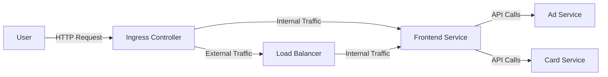

## Introduction to Microservices Application Deployment with ArgoCD and Kustomize

In this section, we will delve into the deployment of a microservices-based application using Kubernetes (K8s) manifests, managed with ArgoCD and customized with Kustomize. This approach allows us to manage complex applications efficiently, ensuring that each microservice is deployed and updated seamlessly.

### Overview of the Microservices Architecture

A microservices architecture breaks down an application into smaller, independent services that communicate over well-defined APIs. Each microservice can be developed, deployed, and scaled independently, leading to greater agility and resilience.

#### Example Microservices

Consider a typical e-commerce application consisting of several microservices:

- **Ad Service**: Handles advertisement logic.
- **Card Service**: Manages payment cards.
- **Frontend Service**: Acts as the entry point and provides the user interface.

The frontend service is the primary entry point for users, while the other services are internal and communicate with the frontend via APIs.

### Kubernetes Manifests for Microservices

To deploy these microservices, we use Kubernetes manifests. These manifests define the desired state of the application in the cluster. Each microservice typically has its own set of manifests, including `Deployment`, `Service`, and `Ingress` resources.

#### Example Manifests

Let's look at a simplified example of the manifest files for the frontend service:

```yaml
apiVersion: apps/v1
kind: Deployment
metadata:
  name: frontend-deployment
spec:
  replicas: 3
  selector:
    matchLabels:
      app: frontend
  template:
    metadata:
      labels:
        app: frontend
    spec:
      containers:
      - name: frontend
        image: myregistry/frontend:latest
        ports:
        - containerPort: 80
---
apiVersion: v1
kind: Service
metadata:
  name: frontend-service
spec:
  selector:
    app: frontend
  ports:
    - protocol: TCP
      port: 80
      targetPort: 80
  type: ClusterIP
```

This manifest defines a `Deployment` with three replicas and a `Service` of type `ClusterIP`, which is used internally within the cluster.

### Exposing Services with Ingress

To expose the frontend service externally, we use an `Ingress` resource. An `Ingress` is a Kubernetes object that manages external access to the services in a cluster, typically HTTP.

#### Example Ingress Manifest

Here’s an example of an `Ingress` manifest:

```yaml
apiVersion: networking.k8s.io/v1
kind: Ingress
metadata:
  name: frontend-ingress
  annotations:
    kubernetes.io/ingress.class: "nginx"
    alb.ingress.k8s.aws/group.name: "frontend-group"
    alb.ingress.k8s.aws/scheme: "internet-facing"
spec:
  rules:
  - host: frontend.example.com
    http:
      paths:
      - path: /
        pathType: Prefix
        backend:
          service:
            name: frontend-service
            port:
              number: 80
```

This `Ingress` routes traffic from `frontend.example.com` to the `frontend-service`.

### Using Kustomize for Customization

Kustomize is a tool that allows us to customize our Kubernetes manifests without modifying the original files. This is particularly useful when working with multiple environments (development, staging, production).

#### Example Kustomization File

Here’s an example of a `kustomization.yaml` file:

```yaml
resources:
- deployment.yaml
- service.yaml
- ingress.yaml

patchesStrategicMerge:
- patch.yaml

namespace: frontend-ns
```

This file specifies the resources to be included and any patches to apply.

### Deploying with ArgoCD

ArgoCD is a declarative, GitOps continuous delivery tool for Kubernetes. It ensures that the desired state of the cluster matches the state defined in the Git repository.

#### Example ArgoCD Configuration

Here’s an example of an ArgoCD application configuration:

```yaml
apiVersion: argoproj.io/v1alpha1
kind: Application
metadata:
  name: frontend-app
spec:
  project: default
  source:
    repoURL: https://github.com/myorg/frontend.git
    targetRevision: HEAD
    path: k8s-manifests
  destination:
    server: https://kubernetes.default.svc
    namespace: frontend-ns
```

This configuration tells ArgoCD to sync the `k8s-manifests` directory from the specified Git repository to the `frontend-ns` namespace in the cluster.

### Network Topology Diagram

Let's visualize the network topology using a Mermaid diagram:



### Pitfalls and Best Practices

#### Common Mistakes

1. **Incorrect Ingress Configuration**: Ensure that the `Ingress` resource is correctly configured to route traffic to the appropriate service.
2. **Security Vulnerabilities**: Ensure that the services are properly secured, especially those exposed externally.
3. **Resource Overprovisioning**: Avoid overprovisioning resources, which can lead to unnecessary costs and inefficiencies.

#### Best Practices

1. **Use RBAC**: Implement Role-Based Access Control (RBAC) to ensure that only authorized users can modify the cluster.
2. **Secure Secrets**: Use Kubernetes secrets to store sensitive information securely.
3. **Regular Audits**: Regularly audit the cluster to identify and mitigate potential security risks.

### Real-World Examples

#### Recent Breaches

One notable breach involved a misconfigured `Ingress` resource that exposed internal services to the internet. This led to unauthorized access to sensitive data.

#### Secure Configuration

To prevent such issues, ensure that the `Ingress` resource is correctly configured and that only necessary services are exposed externally. Here’s an example of a secure `Ingress` configuration:

```yaml
apiVersion: networking.k8s.io/v1
kind: Ingress
metadata:
  name: frontend-ingress
  annotations:
    kubernetes.io/ingress.class: "nginx"
    alb.ingress.k8s.aws/group.name: "frontend-group"
    alb.ingress.k8s.aws/scheme: "internet-facing"
spec:
  rules:
  - host: frontend.example.com
    http:
      paths:
      - path: /
        pathType: Prefix
        backend:
          service:
            name: frontend-service
            port:
              number: 80
```

### How to Prevent / Defend

#### Detection

1. **Monitoring**: Use tools like Prometheus and Grafana to monitor the cluster and detect any unusual activity.
2. **Logging**: Enable logging for all services and regularly review logs for suspicious activity.

#### Prevention

1. **Secure Configurations**: Ensure that all configurations are secure and follow best practices.
2. **Regular Audits**: Conduct regular audits to identify and mitigate potential security risks.

#### Secure Coding Fixes

Here’s an example of a vulnerable `Ingress` configuration and its secure counterpart:

**Vulnerable Configuration**

```yaml
apiVersion: networking.k8s.io/v1
kind: Ingress
metadata:
  name: frontend-ingress
spec:
  rules:
  - host: frontend.example.com
    http:
      paths:
      - path: /
        pathType: Prefix
        backend:
          service:
            name: frontend-service
            port:
              number: 80
```

**Secure Configuration**

```yaml
apiVersion: networking.k8s.io/v1
kind: Ingress
metadata:
  name: frontend-ingress
  annotations:
    kubernetes.io/ingress.class: "nginx"
    alb.ingress.k8s.aws/group.name: "frontend-group"
    alb.ingress.k8s.aws/scheme: "internet-facing"
spec:
  rules:
  - host: frontend.example.com
    http:
      paths:
      - path: /
        pathType: Prefix
        backend:
          service:
            name: frontend-service
            port:
              number: 80
```

### Hands-On Labs

For practical experience, consider the following labs:

- **PortSwigger Web Security Academy**: Focuses on web application security.
- **OWASP Juice Shop**: A deliberately insecure web application for security training.
- **DVWA (Damn Vulnerable Web Application)**: Another popular web application for security training.
- **WebGoat**: An interactive web application security training tool.

These labs provide hands-on experience with deploying and securing microservices-based applications.

### Conclusion

Deploying a microservices-based application using Kubernetes manifests, managed with ArgoCD and customized with Kustomize, requires careful planning and execution. By following best practices and regularly auditing the cluster, you can ensure that your application is both efficient and secure.

---
<!-- nav -->
[[10-Introduction to Kustomize and ArgoCD in DevSecOps|Introduction to Kustomize and ArgoCD in DevSecOps]] | [[DevSecOps/DevSecOps Bootcamp/07-CI CD Security Pipeline/01-App Release Pipeline with ArgoCD/K8s Manifests for Microservices App using Kustomize/00-Overview|Overview]] | [[12-Setting Up the Ingress Component|Setting Up the Ingress Component]]
