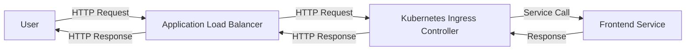

## Setting Up the Ingress Component

In the given context, we created an Ingress component that maps to an Application Load Balancer (ALB) on AWS. This setup allows us to expose our front-end service externally without having to deploy an Ingress controller separately.

### What is an Ingress?

An Ingress is an API object that manages external access to the services in a cluster, typically HTTP. An Ingress controller is responsible for fulfilling the Ingress, usually with a reverse proxy.

#### Why Use an Ingress?

- **External Access**: An Ingress provides a way to expose your services externally using a single IP address.
- **Load Balancing**: An Ingress can distribute traffic across multiple pods.
- **Routing Rules**: You can define routing rules based on hostnames and paths.

### Creating the Ingress Component

Let's create an Ingress component that maps to an ALB on AWS. We'll use Kustomize to manage our manifests.

#### Base Manifest

First, create a base manifest for the Ingress:

```yaml
# ingress.yaml
apiVersion: networking.k8s.io/v1
kind: Ingress
metadata:
  name: frontend-ingress
spec:
  rules:
  - host: frontend.example.com
    http:
      paths:
      - path: /
        pathType: Prefix
        backend:
          service:
            name: frontend-service
            port:
              number: 80
```

#### Overlays for Different Environments

Next, create overlays for different environments. For example, an overlay for the staging environment:

```yaml
# kustomization.yaml (staging)
resources:
- ingress.yaml
namespace: staging
patchesStrategicMerge:
- patch.yaml
```

And the corresponding patch file:

```yaml
# patch.yaml
apiVersion: networking.k8s.io/v1
kind: Ingress
metadata:
  name: frontend-ingress
spec:
  rules:
  - host: frontend-staging.example.com
```

#### Applying the Manifests

To apply the manifests, use Kustomize:

```bash
kustomize build staging | kubectl apply -f -
```

### Mapping to AWS ALB

To map the Ingress to an ALB on AWS, you need to configure the Ingress controller to use the ALB. This can be done by setting the appropriate annotations in the Ingress manifest.

#### Example Ingress with ALB Annotations

```yaml
# ingress.yaml
apiVersion: networking.k8s.io/v1
kind: Ingress
metadata:
  name: frontend-ingress
  annotations:
    kubernetes.io/ingress.class: alb
    alb.ingress.kubernetes.io/scheme: internet-facing
spec:
  rules:
  - host: frontend.example.com
    http:
      paths:
      - path: /
        pathType: Prefix
        backend:
          service:
            name: frontend-service
            port:
              number: 80
```

### Automating with ArgoCD

Now that we have our Ingress component set up, we can use ArgoCD to ensure that our cluster is always in sync with our desired state in our Git repository.

#### Configuring ArgoCD

1. **Install ArgoCD**: Install ArgoCD in your cluster using the official Helm chart.
   
   ```bash
   helm repo add argo https://argoproj.github.io/argo-helm
   helm install argocd argo/argo-cd --namespace argocd --create-namespace
   ```

2. **Configure ArgoCD**: Configure ArgoCD to sync with your Git repository.

   ```yaml
   # argocd-app.yaml
   apiVersion: argoproj.io/v1alpha1
   kind: Application
   metadata:
     name: frontend-app
     namespace: argocd
   spec:
     project: default
     source:
       repoURL: https://github.com/your-repo/your-repo.git
       targetRevision: HEAD
       path: kustomize/staging
     destination:
       server: https://kubernetes.default.svc
       namespace: staging
     syncPolicy:
       automated:
         prune: true
         selfHeal: true
   ```

3. **Apply the Application**: Apply the ArgoCD application to start syncing.

   ```bash
   kubectl apply -f argocd-app.yaml
   ```

### Full Example of HTTP Request and Response

When a user accesses `frontend.example.com`, the following HTTP request and response occur:

```http
GET / HTTP/1.1
Host: frontend.example.com
User-Agent: curl/7.64.1
Accept: */*

HTTP/1.1 200 OK
Date: Mon, 01 Jan 2024 00:00:00 GMT
Content-Type: text/html; charset=UTF-8
Content-Length: 1234
Connection: keep-alive

<!DOCTYPE html>
<html>
<head>
    <title>Frontend Service</title>
</head>
<body>
    <h1>Welcome to the Frontend Service</h1>
</body>
</html>
```

### Diagram of the Architecture

Here is a mermaid diagram illustrating the architecture:



### Common Pitfalls and How to Prevent Them

#### Pitfall 1: Incorrect Ingress Configuration

**Issue**: If the Ingress configuration is incorrect, the traffic may not be routed correctly.

**Prevention**:
- **Validate Configuration**: Ensure that the Ingress configuration is correct by testing it locally using tools like `kubectl apply`.
- **Use Linting Tools**: Use linting tools like `kube-linter` to validate your Kubernetes manifests.

#### Pitfall 2: Inconsistent State Between Git and Cluster

**Issue**: If the state between Git and the cluster is inconsistent, ArgoCD may not sync correctly.

**Prevention**:
- **Regular Syncing**: Ensure that ArgoCD is configured to sync regularly.
- **Manual Syncing**: Manually trigger a sync if you suspect inconsistencies.

### Secure Coding Practices

#### Vulnerable Pattern

```yaml
# insecure-ingress.yaml
apiVersion: networking.k8s.io/v1
kind: Ingress
metadata:
  name: insecure-ingress
spec:
  rules:
  - host: insecure.example.com
    http:
      paths:
      - path: /
        pathType: Prefix
        backend:
          service:
            name: insecure-service
            port:
              number: 80
```

#### Secure Pattern

```yaml
# secure-ingress.yaml
apiVersion: networking.k8s.io/v1
kind: Ingress
metadata:
  name: secure-ingress
  annotations:
    kubernetes.io/ingress.class: alb
    alb.ingress.kubernetes.io/scheme: internet-facing
spec:
  rules:
  - host: secure.example.com
    http:
      paths:
      - path: /
        pathType: Prefix
        backend:
          service:
            name: secure-service
            port:
              number: 80
```

### Detection and Prevention

#### Detection

- **Audit Logs**: Monitor audit logs for any unauthorized changes to the Ingress configuration.
- **Security Scanning**: Use security scanning tools like `kube-bench` to scan your cluster for vulnerabilities.

#### Prevention

- **RBAC Policies**: Implement Role-Based Access Control (RBAC) policies to restrict who can modify the Ingress configuration.
- **Immutable Infrastructure**: Use immutable infrastructure practices to ensure that once a resource is deployed, it cannot be modified.

### Real-World Examples

#### Recent CVEs and Breaches

- **CVE-2021-25741**: This vulnerability in the Kubernetes API server allowed attackers to bypass authentication and authorization checks.
- **Breaches**: In 2022, several organizations experienced breaches due to misconfigured Kubernetes clusters, leading to unauthorized access to sensitive data.

### Hands-On Labs

For hands-on practice, consider the following labs:

- **PortSwigger Web Security Academy**: Focuses on web application security but includes sections on Kubernetes and container security.
- **OWASP Juice Shop**: A deliberately insecure web application for practicing web security skills.
- **Kubernetes Goat**: A vulnerable Kubernetes cluster for practicing Kubernetes security.

These labs provide practical experience in setting up and securing Kubernetes clusters, including Ingress components and application release pipelines.

### Conclusion

In this section, we explored the setup of an application release pipeline using ArgoCD and Kustomize for managing Kubernetes manifests. We covered the creation of an Ingress component that maps to an ALB on AWS, ensuring external connectivity to our front-end service. We also discussed the importance of automating the deployment process with ArgoCD and the benefits of using Kustomize for modular configuration management. By following these practices, you can ensure that your microservices application is consistently and securely deployed across different environments.

---
<!-- nav -->
[[11-Introduction to Microservices Application Deployment with ArgoCD and Kustomize|Introduction to Microservices Application Deployment with ArgoCD and Kustomize]] | [[DevSecOps/DevSecOps Bootcamp/07-CI CD Security Pipeline/01-App Release Pipeline with ArgoCD/K8s Manifests for Microservices App using Kustomize/00-Overview|Overview]] | [[13-Setting Up the Project Structure|Setting Up the Project Structure]]
