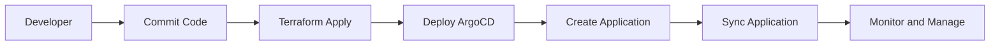

## Introduction to CI/CD Pipelines and ArgoCD

### What Are CI/CD Pipelines?

Continuous Integration (CI) and Continuous Delivery (CD) are practices that aim to streamline the software development process. CI focuses on integrating code changes frequently into a shared repository, ensuring that the codebase remains stable and functional. CD extends this by automating the deployment of these integrated changes to production environments.

#### Why Use CI/CD?

- **Faster Time-to-Market**: Frequent integration and automated testing reduce the time required to deliver new features.
- **Improved Quality**: Automated testing ensures that bugs are caught early, leading to higher-quality software.
- **Reduced Risks**: Smaller, more frequent deployments reduce the risk associated with large, infrequent releases.

### What Is ArgoCD?

ArgoCD is an open-source declarative continuous delivery tool for Kubernetes. It allows you to manage your Kubernetes applications using GitOps principles, where the desired state of your applications is stored in a Git repository. ArgoCD continuously reconciles the actual state of your cluster with the desired state defined in Git.

#### Why Use ArgoCD?

- **GitOps Principles**: By treating your infrastructure as code, you can leverage the benefits of version control, such as rollback capabilities and audit trails.
- **Declarative Management**: Define your desired state in Git, and ArgoCD will ensure that your cluster matches this state.
- **Automation**: Automate the deployment and management of your applications, reducing manual intervention and human error.

### Overview of the Application Release Pipeline

In this section, we will set up a CI/CD pipeline using ArgoCD to automate the deployment of a microservices application into a Kubernetes cluster. The pipeline will consist of two main repositories:

1. **Infrastructure Automation Repository**: This repository contains the Terraform project, which is responsible for configuring and preparing the Kubernetes cluster.
2. **Application Repository**: This repository contains the microservices application, which will be deployed into the prepared cluster.

### Infrastructure Automation Repository

The infrastructure automation repository is where we define and manage the infrastructure using Terraform. Terraform is a popular tool for infrastructure as code (IaC), allowing us to define our infrastructure in code and manage it consistently.

#### Setting Up Terraform

First, we need to initialize our Terraform project. This involves creating a `main.tf` file and defining our resources.

```hcl
provider "kubernetes" {
  config_path = "~/.kube/config"
}

resource "kubernetes_namespace" "default" {
  metadata {
    name = "default"
  }
}
```

This configuration sets up the Kubernetes provider and creates a default namespace.

#### Deploying ArgoCD

Next, we will deploy ArgoCD into the Kubernetes cluster using Terraform. This involves creating a Helm chart for ArgoCD and applying it to the cluster.

```hcl
resource "helm_release" "argocd" {
  name       = "argocd"
  repository = "https://argoproj.github.io/argo-helm"
  chart      = "argo-cd"
  version    = "3.28.2"

  set {
    name  = "server.args.server"
    value = "localhost:8080"
  }

  set {
    name  = "server.args.admin.password"
    value = "adminpassword"
  }
}
```

This configuration deploys ArgoCD into the cluster with the specified settings.

### Application Repository

The application repository contains the microservices application that we will deploy into the Kubernetes cluster. In this example, we will use the "Online Boutique" application, an open-source microservices application provided by Google.

#### Setting Up the Application Repository

First, we need to clone the Online Boutique repository and make any necessary modifications.

```bash
git clone https://github.com/GoogleCloudPlatform/microservices-demo.git
cd microservices-demo
```

This repository contains the Kubernetes manifests for the Online Boutique application.

#### Deploying the Application Using ArgoCD

To deploy the application using ArgoCD, we need to create an ArgoCD application that references the application repository.

```yaml
apiVersion: argoproj.io/v1alpha1
kind: Application
metadata:
  name: online-boutique
spec:
  project: default
  source:
    repoURL: https://github.com/GoogleCloudPlatform/microservices-demo.git
    targetRevision: HEAD
    path: kubernetes-manifests
  destination:
    server: https://kubernetes.default.svc
    namespace: default
  syncPolicy:
    automated:
      prune: true
      selfHeal: true
```

This configuration defines an ArgoCD application that references the Online Boutique repository and deploys the Kubernetes manifests found in the `kubernetes-manifests` directory.

### Connecting the Repositories

Now that we have set up both repositories, we need to connect them using ArgoCD. This involves configuring ArgoCD to watch the application repository and automatically deploy any changes.

#### Configuring ArgoCD

To configure ArgoCD, we need to log in to the ArgoCD dashboard and create a new application.

```bash
argocd login localhost:8080 --username admin --password adminpassword
argocd app create online-boutique \
  --repo https://github.com/GoogleCloudPlatform/microservices-demo.git \
  --path kubernetes-manifests \
  --dest-server https://kubernetes.default.svc \
  --dest-namespace default
```

This command logs in to ArgoCD and creates a new application that watches the Online Boutique repository.

### Monitoring and Managing the Deployment

Once the application is deployed, we need to monitor and manage it using ArgoCD. ArgoCD provides a dashboard and CLI tools to manage the deployment.

#### Monitoring the Deployment

To monitor the deployment, we can use the ArgoCD dashboard or the CLI.

```bash
argocd app get online-boutique
```

This command retrieves the status of the `online-boutique` application.

#### Managing the Deployment

To manage the deployment, we can use the ArgoCD CLI to perform various operations, such as syncing the application or rolling back to a previous version.

```bash
argocd app sync online-boutique
argocd app rollback online-boutique --revision 1
```

These commands sync the application and roll back to a previous revision.

### Real-World Examples and Recent Breaches

Recent breaches and vulnerabilities have highlighted the importance of proper CI/CD pipeline management. For example, the Log4Shell vulnerability (CVE-2021-44228) affected many organizations due to improper management of dependencies and lack of automated testing.

#### Secure Coding Practices

To prevent such vulnerabilities, it is essential to follow secure coding practices, such as:

- **Dependency Management**: Regularly update dependencies and use tools like `Dependabot` to track vulnerabilities.
- **Automated Testing**: Implement automated testing to catch bugs and vulnerabilities early.
- **Code Reviews**: Conduct regular code reviews to identify and fix security issues.

### How to Prevent / Defend

#### Detection

To detect vulnerabilities in your CI/CD pipeline, you can use tools like `Trivy`, `tfsec`, and `kube-hunter`.

```bash
trivy image my-image:latest
tfsec .
kube-hunter run
```

These commands scan your images, Terraform configurations, and Kubernetes clusters for vulnerabilities.

#### Prevention

To prevent vulnerabilities, implement the following measures:

- **Secure Configuration Management**: Use tools like `Kube-bench` to ensure your Kubernetes cluster is configured securely.
- **Least Privilege Principle**: Ensure that your applications and services run with the least privilege necessary.
- **Regular Audits**: Conduct regular audits of your CI/CD pipeline to identify and fix security issues.

### Complete Example

Here is a complete example of setting up a CI/CD pipeline using ArgoCD:

#### Infrastructure Automation Repository

```hcl
provider "kubernetes" {
  config_path = "~/.kube/config"
}

resource "kubernetes_namespace" "default" {
  metadata {
    name = "default"
  }
}

resource "helm_release" "argocd" {
  name       = "argocd"
  repository = "https://argoproj.github.io/argo-helm"
  chart      = "argo-cd"
  version    = "3.28.2"

  set {
    name  = "server.args.server"
    value = "localhost:8080"
  }

  set {
    name  = "server.args.admin.password"
    value = "adminpassword"
  }
}
```

#### Application Repository

```yaml
apiVersion: argoproj.io/v1alpha1
kind: Application
metadata:
  name: online-boutique
spec:
  project: default
  source:
    repoURL: https://github.com/GoogleCloudPlatform/microservices-demo.git
    targetRevision: HEAD
    path: kubernetes-manifests
  destination:
    server: https://kubernetes.default.svc
    namespace: default
  syncPolicy:
    automated:
      prune: true
      selfHeal: true
```

#### Connecting the Repositories

```bash
argocd login localhost:8080 --username admin --password adminpassword
argocd app create online-b
```

### Conclusion

By setting up a CI/CD pipeline using ArgoCD, you can automate the deployment and management of your applications, ensuring that they are deployed consistently and securely. This approach leverages GitOps principles to provide a robust and reliable deployment process.

### Practice Labs

For hands-on practice with ArgoCD and CI/CD pipelines, consider the following labs:

- **PortSwigger Web Security Academy**: Focuses on web application security but includes sections on CI/CD pipelines.
- **OWASP Juice Shop**: A vulnerable web application for practicing security skills, including CI/CD pipelines.
- **DVWA**: A deliberately insecure web application for practicing security skills, including CI/CD pipelines.
- **WebGoat**: An interactive web application for learning about web security, including CI/CD pipelines.

These labs provide practical experience with setting up and managing CI/CD pipelines using ArgoCD and other tools.

### Diagrams



This diagram illustrates the flow of setting up a CI/CD pipeline using ArgoCD.

### Summary

In this chapter, we covered the basics of CI/CD pipelines and ArgoCD, including setting up the infrastructure automation repository and the application repository. We also discussed real-world examples and recent breaches, along with secure coding practices and how to prevent and defend against vulnerabilities. Finally, we provided a complete example and suggested practice labs for hands-on experience.

---
<!-- nav -->
[[DevSecOps/DevSecOps Bootcamp/07-CI CD Security Pipeline/01-App Release Pipeline with ArgoCD/Overview of CI or CD Pipelines to Git repositories/00-Overview|Overview]] | [[DevSecOps/DevSecOps Bootcamp/07-CI CD Security Pipeline/01-App Release Pipeline with ArgoCD/Overview of CI or CD Pipelines to Git repositories/02-Introduction to CICD Pipelines and GitOps Part 1|Introduction to CICD Pipelines and GitOps Part 1]]
