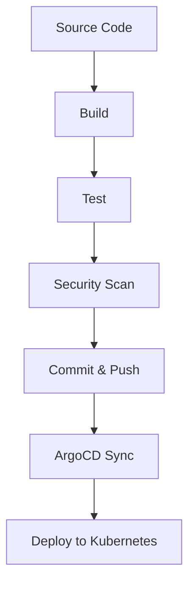
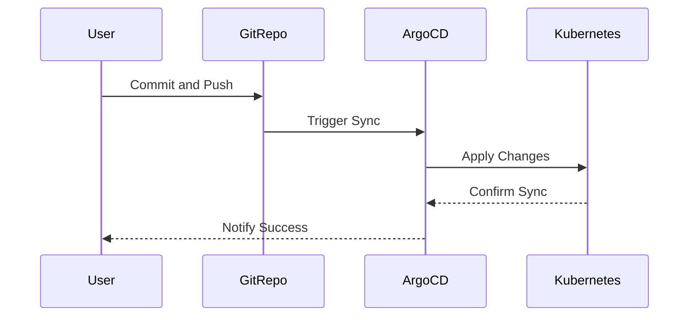

## Introduction to CI/CD Pipelines with ArgoCD

In the realm of DevSecOps, Continuous Integration (CI) and Continuous Deployment (CD) pipelines play a pivotal role in ensuring that applications are built, tested, and deployed efficiently and securely. This chapter delves into the specifics of setting up a CI/CD pipeline using ArgoCD, focusing particularly on the deployment aspect to a Kubernetes cluster. We will cover the entire process, including background theory, practical implementation, potential pitfalls, and robust defense mechanisms.

### Background Theory

#### What is CI/CD?

Continuous Integration (CI) and Continuous Deployment (CD) are practices that enable developers to integrate code changes frequently and automatically deploy those changes to production environments. CI focuses on automating the build and testing processes, while CD extends this automation to the deployment phase.

**Why CI/CD?**

- **Faster Feedback Loops:** Developers receive immediate feedback on their code changes, reducing the time to identify and fix issues.
- **Improved Quality:** Automated tests ensure that code changes do not introduce new bugs.
- **Increased Productivity:** Developers can focus on writing code rather than manual testing and deployment tasks.
- **Enhanced Security:** Security checks can be integrated into the pipeline, ensuring that vulnerabilities are detected early.

#### What is ArgoCD?

ArgoCD is an open-source declarative continuous delivery tool for Kubernetes. It enables automated deployment of applications to Kubernetes clusters based on GitOps principles. GitOps is a set of practices that uses Git as a single source of truth for infrastructure and application deployments.

**Why ArgoCD?**

- **Declarative Deployments:** ArgoCD allows you to define your desired state in Git and automatically reconciles the actual state to match the desired state.
- **Automated Rollouts:** It supports automated rollouts and rollbacks, making it easier to manage complex deployments.
- **Multi-cluster Support:** ArgoCD can manage deployments across multiple Kubernetes clusters, providing a unified view and control.

### Setting Up the CI Pipeline

Before diving into the CD pipeline, let's briefly discuss the CI pipeline setup. Although the transcript does not cover the CI pipeline in detail, it is essential to understand the context.

#### CI Pipeline Components

A typical CI pipeline includes the following steps:

1. **Source Code Checkout:** Clone the repository containing the application code.
2. **Build:** Compile the code and create artifacts (e.g., Docker images).
3. **Test:** Run unit tests, integration tests, and other validation checks.
4. **Security Scans:** Perform static code analysis and dynamic security testing.

#### Example CI Pipeline Configuration

Here is a simplified example of a CI pipeline using Jenkins:

```yaml
pipeline {
    agent any
    stages {
        stage('Checkout') {
            steps {
                git branch: 'main', url: 'https://github.com/example/online-boutique.git'
            }
        }
        stage('Build') {
            steps {
                sh 'mvn clean package'
            }
        }
        stage('Test') {
            steps {
                sh 'mvn test'
            }
        }
        stage('Security Scan') {
            steps {
                sh 'dependency-check --project online-boutique --scan .'
            }
        }
    }
}
```

### Setting Up the CD Pipeline with ArgoCD

Now, let's focus on the deployment part using ArgoCD.

#### Prerequisites

To set up ArgoCD, you need:

- A Kubernetes cluster.
- Access to a Git repository containing the application manifests.
- ArgoCD installed on the Kubernetes cluster.

#### Installing ArgoCD

You can install ArgoCD using the official Helm chart:

```bash
helm repo add argo https://argoproj.github.io/argo-helm
helm repo update
helm install argocd argo/argo-cd --namespace argocd --create-namespace
```

#### Configuring ArgoCD

Once installed, you need to configure ArgoCD to sync your application manifests from a Git repository.

1. **Create Application Manifests:** Define your application resources (e.g., `Deployment`, `Service`, `ConfigMap`) in a Git repository.
2. **Configure ArgoCD Application:** Create an ArgoCD application resource that points to the Git repository and specifies the path to the application manifests.

Example `Application` manifest:

```yaml
apiVersion: argoproj.io/v1alpha1
kind: Application
metadata:
  name: online-boutique
spec:
  project: default
  source:
    repoURL: https://github.com/example/online-boutique.git
    targetRevision: HEAD
    path: k8s
  destination:
    server: https://kubernetes.default.svc
    namespace: online-boutique
```

#### Deploying with ArgoCD

After configuring the application, ArgoCD will automatically reconcile the desired state defined in the Git repository with the actual state in the Kubernetes cluster.

### Potential Pitfalls and How to Prevent Them

#### Pitfall 1: Manual Interventions

Manual interventions in the pipeline can lead to inconsistencies and errors.

**How to Prevent:**

- **Automate Everything:** Ensure that all steps in the CI/CD pipeline are automated.
- **Use Version Control:** Store all pipeline configurations in version control to track changes and maintain consistency.

#### Pitfall 2: Insecure Configurations

Insecure configurations in the pipeline can expose sensitive information and lead to security vulnerabilities.

**How to Prevent:**

- **Secure Secrets Management:** Use tools like HashiCorp Vault or Kubernetes Secrets to manage secrets securely.
- **Least Privilege Principle:** Ensure that the pipeline runs with the least privileges necessary to perform its tasks.

#### Pitfall 3: Lack of Monitoring

Without proper monitoring, issues in the pipeline may go unnoticed.

**How to Prevent:**

- **Implement Monitoring:** Use tools like Prometheus and Grafana to monitor the pipeline and alert on anomalies.
- **Logging:** Enable detailed logging to track the pipeline's execution and troubleshoot issues.

### Real-World Examples and Recent Breaches

#### Example: Log4Shell (CVE-2021-44228)

The Log4Shell vulnerability affected many applications, including those deployed via CI/CD pipelines. This highlights the importance of integrating security scans into the pipeline.

**How to Prevent:**

- **Regular Security Scans:** Integrate tools like OWASP Dependency-Check into the CI pipeline to detect known vulnerabilities.
- **Patch Management:** Ensure that dependencies are regularly updated to the latest versions.

#### Example: Kubernetes API Server Vulnerability (CVE-2021-25741)

This vulnerability allowed attackers to bypass authentication and gain unauthorized access to the Kubernetes API server.

**How to Prevent:**

- **RBAC Policies:** Implement Role-Based Access Control (RBAC) policies to restrict access to the Kubernetes API server.
- **Network Segmentation:** Use network segmentation to isolate the Kubernetes cluster from other networks.

### Complete Example: CI/CD Pipeline with ArgoCD

Let's walk through a complete example of setting up a CI/CD pipeline with ArgoCD.

#### Step 1: Source Code Checkout

Clone the repository containing the application code:

```bash
git clone https://github.com/example/online-boutique.git
cd online-boutique
```

#### Step 2: Build and Test

Build the application and run tests:

```bash
mvn clean package
mvn test
```

#### Step 3: Security Scan

Perform a security scan using OWASP Dependency-Check:

```bash
dependency-check --project online-boutique --scan .
```

#### Step 4: Commit and Push Changes

Commit and push the changes to the Git repository:

```bash
git add .
git commit -m "Add security scan"
git push origin main
```

#### Step 5: Configure ArgoCD Application

Create an ArgoCD application resource:

```yaml
apiVersion: argoproj.io/v1alpha1
kind: Application
metadata:
  name: online-boutique
spec:
  project: default
  source:
    repoURL: https://github.com/example/online-boutique.git
    targetRevision: HEAD
    path: k8s
  destination:
    server: https://kubernetes.default.svc
    namespace: online-b
```

#### Step 6: Sync with ArgoCD

Sync the application with ArgoCD:

```bash
kubectl apply -f argocd-application.yaml
```

### Mermaid Diagrams

#### CI/CD Pipeline Architecture



#### ArgoCD Application Flow



### How to Prevent / Defend

#### Detection

- **Monitoring Tools:** Use tools like Prometheus and Grafana to monitor the pipeline and detect anomalies.
- **Logging:** Enable detailed logging to track the pipeline's execution and troubleshoot issues.

#### Prevention

- **Automate Everything:** Ensure that all steps in the CI/CD pipeline are automated.
- **Secure Secrets Management:** Use tools like HashiCorp Vault or Kubernetes Secrets to manage secrets securely.
- **Least Privilege Principle:** Ensure that the pipeline runs with the least privileges necessary to perform its tasks.

#### Secure Coding Fixes

##### Vulnerable Code

```yaml
apiVersion: v1
kind: Secret
metadata:
  name: database-secret
type: Opaque
data:
  username: cGFzc3dvcmQ=
  password: cGFzc3dvcmQ=
```

##### Fixed Code

```yaml
apiVersion: v1
kind: Secret
metadata:
  name: database-secret
type: Opaque
data:
  username: <base64-encoded-username>
  password: <base64-encoded-password>
```

### Practice Labs

For hands-on experience with CI/CD pipelines and ArgoCD, consider the following labs:

- **PortSwigger Web Security Academy:** Focuses on web application security but also covers CI/CD pipelines.
- **OWASP Juice Shop:** A deliberately insecure web application for practicing security testing.
- **CloudGoat:** Provides a series of labs for learning about cloud security, including CI/CD pipelines.

By following these guidelines and examples, you can set up a robust CI/CD pipeline with ArgoCD, ensuring efficient and secure deployments to your Kubernetes cluster.

---
<!-- nav -->
[[03-Introduction to CICD Pipelines and GitOps|Introduction to CICD Pipelines and GitOps]] | [[DevSecOps/DevSecOps Bootcamp/07-CI CD Security Pipeline/01-App Release Pipeline with ArgoCD/Overview of CI or CD Pipelines to Git repositories/00-Overview|Overview]] | [[05-Overview of CICD Pipelines to Git Repositories|Overview of CICD Pipelines to Git Repositories]]
