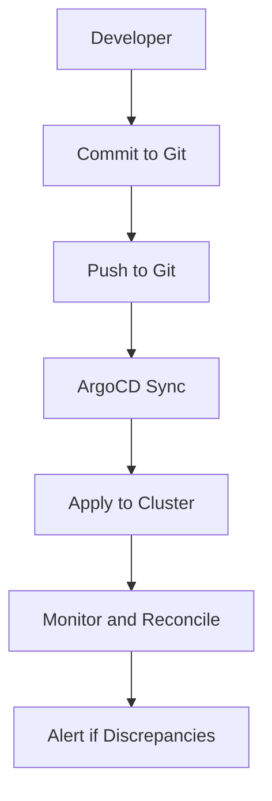
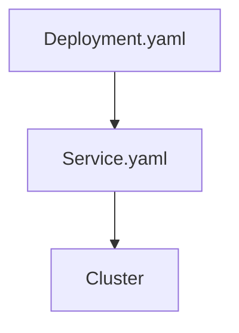

## ArgoCD and GitOps Workflow

### What is ArgoCD?

ArgoCD is a declarative, extensible, open-source continuous delivery tool for Kubernetes. It enables you to manage your Kubernetes resources using GitOps principles, ensuring that your cluster is always in sync with the desired state defined in your Git repository.

### Why Use ArgoCD?

ArgoCD provides several benefits:

- **Declarative Configuration**: Define the desired state of your cluster in Git, and ArgoCD will ensure that the actual state matches the desired state.
- **Automated Reconciliation**: Automatically reconcile the actual state with the desired state, ensuring that your cluster is always up-to-date.
- **Multi-cluster Support**: Manage multiple clusters from a single Git repository.

### GitOps Workflow with ArgoCD

The GitOps workflow with ArgoCD involves the following steps:

1. **Define Desired State**: Define the desired state of your cluster in a Git repository.
2. **Sync with Actual State**: Use ArgoCD to sync the actual state of your cluster with the desired state.
3. **Monitor and Reconcile**: Continuously monitor the cluster and automatically reconcile any differences between the actual and desired states.

### Real-World Example: ArgoCD Setup

Consider a scenario where you have a Git repository containing Kubernetes manifests for a simple web application.

#### Git Repository Structure

```plaintext
my-webapp/
├── kubernetes/
│   ├── deployment.yaml
│   └── service.yaml
└── README.md
```

#### Deployment.yaml

```yaml
apiVersion: apps/v1
kind: Deployment
metadata:
  name: my-webapp
spec:
  replicas: 3
  selector:
    matchLabels:
      app: my-webapp
  template:
    metadata:
      labels:
        app: my-webapp
    spec:
      containers:
      - name: my-webapp
        image: my-webapp:latest
        ports:
        - containerPort: 8080
```

#### Service.yaml

```yaml
apiVersion: v1
kind: Service
metadata:
  name: my-webapp
spec:
  selector:
    app: my-webapp
  ports:
  - protocol: TCP
    port: 80
    targetPort: 8080
  type: LoadBalancer
```

### How to Prevent / Defend

**Detection**:
- Regularly review the Git repository to ensure that the desired state is correctly defined.
- Use ArgoCD’s built-in monitoring and alerting features to detect any discrepancies between the actual and desired states.

**Prevention**:
- Implement strict access controls for the Git repository to prevent unauthorized changes.
- Use ArgoCD’s built-in validation features to ensure that the desired state is valid before applying it to the cluster.

**Secure-Coding Fixes**:
```yaml
# Example of a deployment.yaml file with security enhancements
apiVersion: apps/v1
kind: Deployment
metadata:
  name: my-webapp
spec:
  replicas: 3
  selector:
    matchLabels:
      app: my-webapp
  template:
    metadata:
      labels:
        app: my-webapp
    spec:
      containers:
      - name: my-webapp
        image: my-webapp:latest
        ports:
        - containerPort: 8080
        securityContext:
          runAsUser: 1000
          runAsGroup: 3000
          readOnlyRootFilesystem: true
```

### Mermaid Diagrams

#### GitOps Workflow Diagram



#### Kubernetes Manifests Diagram



---
<!-- nav -->
[[05-Overview of CICD Pipelines to Git Repositories|Overview of CICD Pipelines to Git Repositories]] | [[DevSecOps/DevSecOps Bootcamp/07-CI CD Security Pipeline/01-App Release Pipeline with ArgoCD/Overview of CI or CD Pipelines to Git repositories/00-Overview|Overview]] | [[DevSecOps/DevSecOps Bootcamp/07-CI CD Security Pipeline/01-App Release Pipeline with ArgoCD/Overview of CI or CD Pipelines to Git repositories/07-Practice Labs|Practice Labs]]
