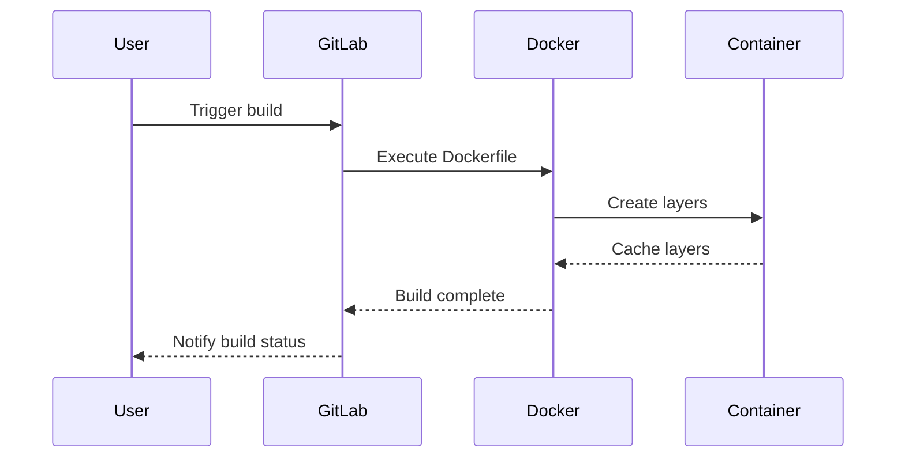
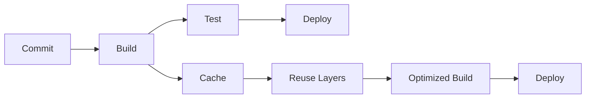

## Introduction to Continuous Delivery (CD) Pipelines

Continuous Delivery (CD) is an extension of Continuous Integration (CI) that ensures your software can be released to production at any time. A CD pipeline automates the process of building, testing, and deploying applications. One critical aspect of a CD pipeline is the efficient creation and management of application images using Docker. This chapter will delve into the nuances of building application images on self-managed runners and leveraging Docker caching to optimize the pipeline.

### Background Theory

Docker is a platform that allows developers to package their applications into lightweight, portable containers. These containers can run consistently across different environments, ensuring that the application behaves the same way whether it’s running locally, in a staging environment, or in production.

A Dockerfile is a script that contains a series of instructions to build a Docker image. Each instruction in the Dockerfile adds a layer to the image. When a Docker image is built, Docker caches each layer to speed up subsequent builds. This caching mechanism is crucial for optimizing the CD pipeline.

### Dockerfile Instructions and Layers

Let's consider a typical Dockerfile:

```dockerfile
# Use an official Python runtime as a parent image
FROM python:3.9-slim

# Set the working directory in the container
WORKDIR /app

# Copy the current directory contents into the container at /app
COPY . /app

# Install any needed packages specified in requirements.txt
RUN pip install --no-cache-dir -r requirements.txt

# Make port 80 available to the world outside this container
EXPOSE 80

# Define environment variable
ENV NAME World

# Run app.py when the container launches
CMD ["python", "app.py"]
```

Each line in the Dockerfile represents an instruction that Docker executes to build the image. Here’s a breakdown of the instructions:

- `FROM`: Specifies the base image.
- `WORKDIR`: Sets the working directory inside the container.
- `COPY`: Copies files from the host machine to the container.
- `RUN`: Executes commands during the build process.
- `EXPOSE`: Informs Docker that the container listens on the specified network ports at runtime.
- `ENV`: Sets environment variables.
- `CMD`: Provides defaults for an executing container.

Each instruction creates a new layer in the Docker image. The layers are cached based on the instruction and the input data. If the input data (e.g., the contents of a file) changes, Docker invalidates the cache for that layer and all subsequent layers.

### Leveraging Docker Caching

Docker caching is a powerful feature that speeds up the build process by reusing previously built layers. When a Dockerfile is executed, Docker checks if the output of a given instruction has changed since the last build. If it hasn’t, Docker uses the cached layer instead of rebuilding it.

Consider the following example:

```dockerfile
FROM python:3.9-slim

WORKDIR /app

COPY requirements.txt .

RUN pip install --no-cache-dir -r requirements.txt

COPY . .
```

In this Dockerfile, the `COPY requirements.txt .` instruction copies the `requirements.txt` file to the container. The `RUN pip install --no-cache-dir -r requirements.txt` instruction installs the dependencies listed in `requirements.txt`. If `requirements.txt` does not change between builds, Docker will reuse the cached layer for the `RUN` instruction.

However, if `requirements.txt` changes, Docker will invalidate the cache for the `RUN` instruction and rebuild it. Similarly, if the contents of the `/app` directory change, Docker will invalidate the cache for the `COPY . .` instruction and rebuild it.

### Optimizing the CD Pipeline with Docker Caching

To optimize the CD pipeline, it’s essential to structure the Dockerfile in a way that maximizes the effectiveness of Docker caching. Here are some best practices:

1. **Order Instructions Wisely**: Place instructions that change frequently towards the end of the Dockerfile. For example, copying the application code should typically come after installing dependencies.
   
2. **Use Multi-Stage Builds**: Multi-stage builds allow you to separate the build process from the final runtime image. This reduces the size of the final image and improves caching efficiency.

3. **Avoid Unnecessary Layers**: Combining multiple `RUN` instructions into a single `RUN` instruction can reduce the number of layers and improve caching.

Here’s an example of a multi-stage build:

```dockerfile
# Stage 1: Build the application
FROM python:3.9-slim AS builder

WORKDIR /app

COPY requirements.txt .

RUN pip install --no-cache-dir -r requirements.txt

COPY . .

RUN python setup.py install

# Stage 2: Create the final runtime image
FROM python:3.9-slim

WORKDIR /app

COPY --from=builder /app /app

CMD ["python", "app.py"]
```

In this example, the first stage (`builder`) installs the dependencies and builds the application. The second stage (`final runtime image`) copies only the necessary files from the first stage, reducing the size of the final image.

### Managing Shared Runner Resources

When using shared runners provided by GitLab, it’s important to manage the resources effectively. Shared runners are free but have usage limits. If you exceed the limit, you may receive warnings and eventually lose access to the shared runners.

For example, if you receive a warning that you have used 70% of the shared runner resources, you have only 30% left. Once you exceed the limit, you won’t be able to use the shared runners until the next billing cycle.

To avoid hitting the resource limit, consider the following strategies:

1. **Optimize Build Times**: Ensure that your builds are as fast as possible. Use Docker caching and other optimizations to reduce build times.

2. **Use Self-Managed Runners**: Instead of relying on shared runners, set up self-managed runners. Self-managed runners provide more control over the build process and eliminate the risk of hitting resource limits.

3. **Monitor Usage**: Regularly monitor your usage of shared runner resources. GitLab provides tools to track resource usage and set alerts when you approach the limit.

### Disk Space Management

Another challenge in managing a CD pipeline is disk space management. Large Docker images can quickly consume disk space, especially if you’re building images frequently.

To manage disk space effectively:

1. **Use Smaller Base Images**: Choose smaller base images to reduce the size of the final image. For example, use `python:3.9-slim` instead of `python:3.9`.

2. **Clean Up Unused Images**: Regularly clean up unused Docker images to free up disk space. You can use the `docker system prune` command to remove unused images, containers, and volumes.

3. **Use Multi-Stage Builds**: As mentioned earlier, multi-stage builds help reduce the size of the final image.

### Real-World Example: CVE-2021-21315

CVE-2021-21315 is a vulnerability in Docker that allows an attacker to escape the container and gain root access to the host system. This vulnerability highlights the importance of securing the build process and ensuring that the Docker images are built securely.

To prevent such vulnerabilities:

1. **Use Secure Base Images**: Ensure that the base images used in the Dockerfile are secure and up-to-date.

2. **Scan Images for Vulnerabilities**: Use tools like Trivy or Clair to scan Docker images for known vulnerabilities.

3. **Implement Least Privilege**: Run containers with the least privilege necessary. Avoid running containers as root unless absolutely required.

### How to Prevent / Defend

#### Detection

To detect issues related to Docker caching and resource management:

1. **Monitor Build Times**: Use monitoring tools to track build times and identify slow builds.

2. **Check Resource Usage**: Regularly check the usage of shared runner resources and disk space.

3. **Scan Images**: Use vulnerability scanning tools to detect known vulnerabilities in Docker images.

#### Prevention

To prevent issues related to Docker caching and resource management:

1. **Optimize Dockerfiles**: Structure Dockerfiles to maximize the effectiveness of Docker caching.

2. **Use Self-Managed Runners**: Set up self-managed runners to avoid hitting resource limits.

3. **Secure Base Images**: Use secure and up-to-date base images in Dockerfiles.

4. **Implement Least Privilege**: Run containers with the least privilege necessary.

#### Secure-Coding Fixes

Here’s an example of a vulnerable Dockerfile and its secure counterpart:

**Vulnerable Dockerfile:**

```dockerfile
FROM python:3.9

WORKDIR /app

COPY . .

RUN pip install -r requirements.txt

CMD ["python", "app.py"]
```

**Secure Dockerfile:**

```dockerfile
# Use a slim base image to reduce size
FROM python:3.9-slim

# Set the working directory
WORKDIR /app

# Copy requirements.txt first
COPY requirements.txt .

# Install dependencies
RUN pip install --no-cache-dir -r requirements.txt

# Copy the rest of the application code
COPY . .

# Expose port 80
EXPOSE 80

# Run the application
CMD ["python", "app.py"]
```

### Complete Example: Full HTTP Request and Response

Here’s a complete example of a full HTTP request and response for a Docker build:

**HTTP Request:**

```http
POST /api/v4/projects/12345/builds HTTP/1.1
Host: gitlab.example.com
Authorization: Bearer <your_access_token>
Content-Type: application/json

{
  "ref": "main",
  "variables": [
    {
      "key": "DOCKER_IMAGE_TAG",
      "value": "latest"
    }
  ]
}
```

**HTTP Response:**

```http
HTTP/1.1 201 Created
Date: Tue, 01 Mar 2023 12:00:00 GMT
Content-Type: application/json
Content-Length: 1234

{
  "id": 123,
  "status": "running",
  "tag_list": [],
  "commit": {
    "id": "abc123",
    "title": "Initial commit",
    "author_name": "John Doe",
    "created_at": "2023-03-01T12:00:00Z"
  },
  "user": {
    "id": 1,
    "name": "John Doe",
    "username": "johndoe"
  },
  "started_at": "2023-03-01T12:00:00Z",
  "finished_at": null
}
```

### Mermaid Diagrams

#### Docker Build Process



#### CD Pipeline Architecture



### Practice Labs

For hands-on practice with CD pipelines and Docker, consider the following labs:

- **PortSwigger Web Security Academy**: Focuses on web application security but includes sections on CI/CD pipelines.
- **OWASP Juice Shop**: A deliberately insecure web application for security training.
- **DVWA (Damn Vulnerable Web Application)**: Another web application for security training.
- **WebGoat**: An interactive web application security training tool.

These labs provide practical experience with building and managing CD pipelines, including Docker image creation and management.

### Conclusion

Building a CD pipeline that efficiently creates and manages Docker images is crucial for modern DevSecOps practices. By leveraging Docker caching, optimizing Dockerfile instructions, and managing shared runner resources, you can ensure that your pipeline is both fast and secure. Regular monitoring and proactive measures can help prevent issues related to resource usage and disk space management.

---
<!-- nav -->
[[DevSecOps/DevSecOps Bootcamp/07-CI CD Security Pipeline/02-Build a CD Pipeline/Build Application Images on Self Managed Runner Leverage Docker Caching/00-Overview|Overview]] | [[02-Introduction to Continuous Delivery Pipelines Part 1|Introduction to Continuous Delivery Pipelines Part 1]]
