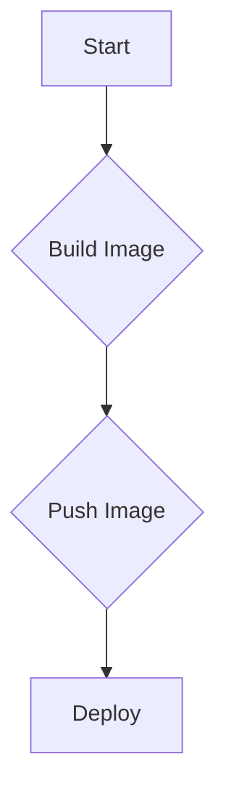
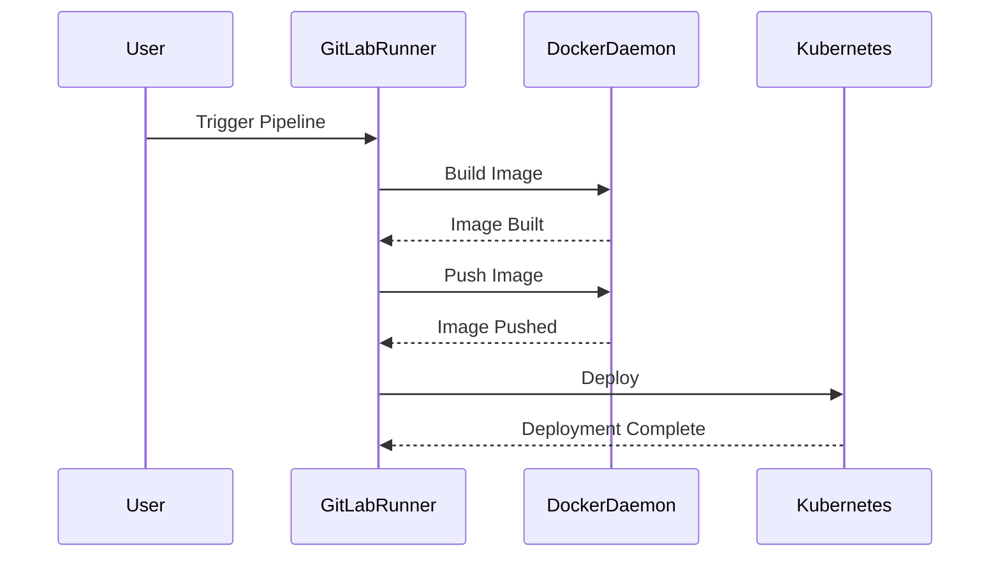

## Introduction to Continuous Delivery Pipelines

Continuous Delivery (CD) is a software engineering approach in which teams produce software in short cycles, ensuring that the application can be reliably released at any time. It aims to build, test, and release software with greater speed and frequency. A key component of CD is the continuous delivery pipeline, which automates the process of building, testing, and deploying applications.

### Self-Managed Runners and Docker Integration

In the context of DevSecOps, self-managed runners are crucial for controlling the environment in which your pipelines execute. These runners are typically virtual machines or containers that are configured to run tasks defined in your CI/CD pipeline. One of the most common tools used for managing these runners is GitLab Runner.

#### Adding GitLab Runner User to Docker Group

To leverage Docker within a self-managed runner, the GitLab Runner user must have access to the Docker daemon. This requires adding the GitLab Runner user to the Docker group. Here’s how you can achieve this:

```bash
# Add the GitLab Runner user to the Docker group
sudo usermod -aG docker gitlab-runner
```

This command adds the `gitlab-runner` user to the `docker` group, allowing it to interact with the Docker daemon.

### Improvements to the Self-Managed Runner

The lecture discusses two significant improvements to the self-managed runner setup:

1. **Replacing D&D Environment with Direct Docker Execution**
2. **Implementing Docker Caching**

#### Replacing D&D Environment with Direct Docker Execution

Docker-in-Docker (DinD) is a common setup where a Docker daemon runs inside a Docker container. While this provides flexibility, it introduces overhead and complexity. By executing Docker directly on the server, you can avoid these issues and improve performance.

Here’s an example of how to configure a GitLab CI/CD pipeline to use direct Docker execution:

```yaml
stages:
  - build

build_image:
  stage: build
  script:
    - docker build -t myapp .
```

This configuration ensures that the Docker commands are executed directly on the host machine rather than within a nested Docker environment.

#### Implementing Docker Caching

Docker caching is a mechanism that speeds up the build process by reusing previously built layers. Without caching, each build starts from scratch, leading to longer build times. In the given scenario, the build process takes around 7-8 minutes due to the lack of caching.

To implement Docker caching, ensure that the Dockerfile and build context are optimized. Here’s an example of a Dockerfile with caching considerations:

```Dockerfile
# Use a base image
FROM node:14

# Set the working directory
WORKDIR /app

# Copy package.json and install dependencies
COPY package*.json ./
RUN npm install

# Copy the rest of the application
COPY . .

# Build the application
RUN npm run build

# Expose the port
EXPOSE 3000

# Command to run the app
CMD ["npm", "start"]
```

By copying `package.json` and installing dependencies separately, Docker can cache these steps, reducing the overall build time.

### Full Example of a CI/CD Pipeline

Let’s create a complete CI/CD pipeline using GitLab CI/CD. This pipeline will build a Docker image and push it to a registry.

```yaml
stages:
  - build
  - deploy

variables:
  DOCKER_IMAGE: myapp

build_image:
  stage: build
  script:
    - docker build -t $DOCKER_IMAGE .
    - docker tag $DOCKER_IMAGE registry.example.com/$DOCKER_IMAGE
    - docker push registry.example.com/$DOCKER_IMAGE

deploy:
  stage: deploy
  script:
    - kubectl apply -f deployment.yaml
```

### Mermaid Diagrams

#### Pipeline Flow Diagram



#### Sequence Diagram



### Pitfalls and Best Practices

#### Common Pitfalls

1. **Incorrect Permissions**: Ensure the GitLab Runner user has the necessary permissions to interact with the Docker daemon.
2. **Inefficient Dockerfile**: Poorly written Dockerfiles can lead to unnecessary rebuilds and increased build times.
3. **Security Risks**: Running Docker commands directly on the host can introduce security risks if proper isolation and hardening measures are not in place.

#### Best Practices

1. **Optimize Dockerfile**: Use multi-stage builds and COPY instructions strategically to minimize layer creation.
2. **Use Docker Caching**: Ensure that Docker can reuse cached layers to speed up builds.
3. **Secure Docker Usage**: Use Docker socket mounting carefully and consider using Docker socket proxies like `docker-socket-proxy` to mitigate security risks.

### How to Prevent / Defend

#### Detection

Monitor Docker build times and identify patterns of inefficiency. Tools like GitLab CI/CD analytics can provide insights into build performance.

#### Prevention

1. **Secure Docker Setup**:
   - Ensure the GitLab Runner user is added to the Docker group.
   - Use Docker socket mounting with care and consider using a proxy like `docker-socket-proxy`.

2. **Secure-Coding Fixes**:
   - **Vulnerable Dockerfile**:
     ```Dockerfile
     FROM node:14
     COPY . /app
     RUN npm install
     CMD ["npm", "start"]
     ```
   - **Fixed Dockerfile**:
     ```Dockerfile
     FROM node:14
     WORKDIR /app
     COPY package*.json ./
     RUN npm install
     COPY . .
     CMD ["npm", "start"]
     ```

3. **Configuration Hardening**:
   - Use `docker-socket-proxy` to securely expose the Docker socket to the GitLab Runner.
   - Configure firewall rules to restrict access to the Docker daemon.

### Real-World Examples

#### Recent Breaches and CVEs

- **CVE-2021-21363**: A vulnerability in Docker that allowed unauthorized access to the Docker daemon. This highlights the importance of securing Docker setups.
- **Breaches involving misconfigured Docker daemons**: Several high-profile breaches have occurred due to misconfigured Docker daemons, emphasizing the need for proper security practices.

### Practice Labs

For hands-on practice with CD pipelines and Docker integration, consider the following labs:

- **PortSwigger Web Security Academy**: Offers practical exercises on setting up CI/CD pipelines.
- **OWASP Juice Shop**: Provides a vulnerable web application to practice securing CI/CD pipelines.
- **CloudGoat**: Focuses on cloud security and includes scenarios related to CI/CD pipeline setup.

These labs provide real-world scenarios to reinforce the concepts learned in this chapter.

### Conclusion

Building a robust CD pipeline with self-managed runners and Docker integration requires careful planning and execution. By optimizing Docker usage, leveraging caching, and implementing security best practices, you can significantly improve the efficiency and reliability of your CI/CD processes.

---
<!-- nav -->
[[DevSecOps/DevSecOps Bootcamp/07-CI CD Security Pipeline/02-Build a CD Pipeline/Build Application Images on Self Managed Runner Leverage Docker Caching/01-Introduction to Continuous Delivery (CD) Pipelines|Introduction to Continuous Delivery (CD) Pipelines]] | [[DevSecOps/DevSecOps Bootcamp/07-CI CD Security Pipeline/02-Build a CD Pipeline/Build Application Images on Self Managed Runner Leverage Docker Caching/00-Overview|Overview]] | [[03-Introduction to Continuous Delivery Pipelines Part 2|Introduction to Continuous Delivery Pipelines Part 2]]
