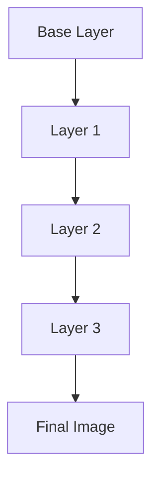
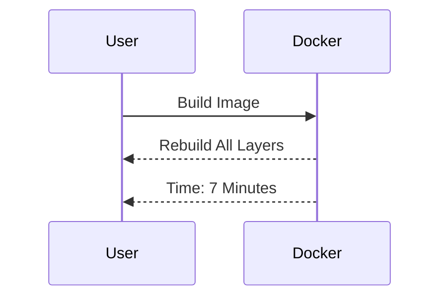
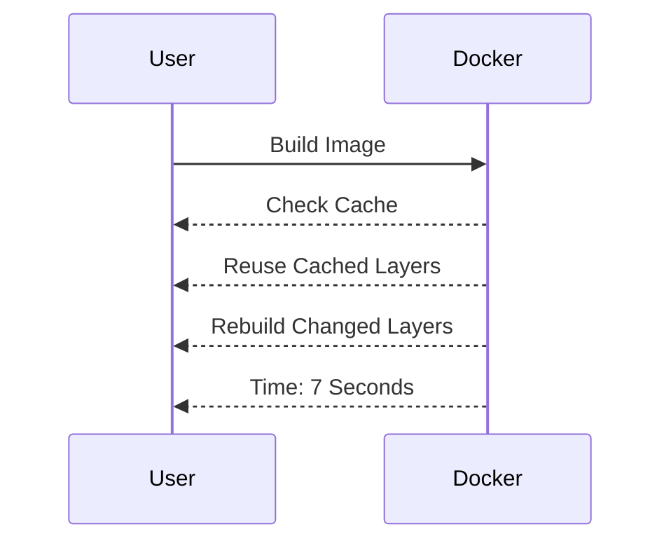
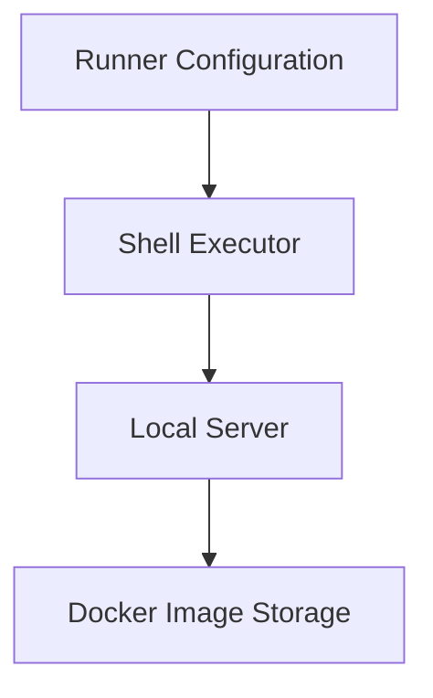

## Introduction to Continuous Delivery Pipelines

Continuous Delivery (CD) pipelines are essential components of modern DevSecOps practices. They automate the process of building, testing, and deploying applications, ensuring that software can be released reliably and frequently. A key aspect of CD pipelines is the efficient management of Docker images, particularly leveraging Docker caching to speed up builds.

### What is a Docker Image?

A Docker image is a lightweight, standalone, executable package that includes everything needed to run a piece of software, including the code, runtime, libraries, environment variables, and configuration files. Docker images are built in layers, which allows for efficient storage and reuse.

#### Layers in Docker Images

Docker images are composed of layers, each representing a specific instruction in the Dockerfile. These layers are stacked on top of each other, forming a final image. Each layer is immutable and can be cached, which significantly speeds up subsequent builds if the underlying layers remain unchanged.



### Importance of Docker Caching

Docker caching is a mechanism that allows Docker to reuse previously built layers, rather than rebuilding them from scratch. This is particularly useful in CD pipelines, where frequent builds are common. By leveraging caching, the build time can be drastically reduced, leading to faster feedback cycles and more efficient development processes.

#### Example Without Docker Caching

Consider a scenario where you are building a Docker image for an application. Without caching, each build would require reprocessing all layers, even if only minor changes were made. This can result in significant delays, especially for large applications.



#### Example With Docker Caching

With Docker caching enabled, only the layers that have changed need to be rebuilt. This can reduce the build time from several minutes to just a few seconds.



### Self-Managed GitLab Runners

Self-managed GitLab runners are dedicated servers or virtual machines that are configured to execute jobs defined in GitLab CI/CD pipelines. Unlike shared runners, which are managed by GitLab and shared among multiple users, self-managed runners provide more control and flexibility.

#### Shell Executor

The shell executor is one of the most commonly used executors in GitLab runners. It runs jobs directly on the server where the runner is installed. This means that any artifacts created during the job, such as Docker images, are stored locally on the server.



### Configuring Self-Managed Runners

To configure a self-managed GitLab runner, you need to install the runner software on your server and register it with your GitLab instance. This involves setting up the necessary environment variables and configuring the runner to use the shell executor.

#### Installation and Registration

1. **Install GitLab Runner**: Download and install the GitLab Runner software on your server.
   
   ```bash
   sudo apt-get update
   sudo apt-get install gitlab-runner
   ```

2. **Register the Runner**: Register the runner with your GitLab instance using the registration token provided in your project settings.

   ```bash
   sudo gitlab-runner register
   ```

3. **Configure Shell Executor**: Ensure that the runner is configured to use the shell executor.

   ```yaml
   concurrent = 1
   check_interval = 0

   [[runners]]
     name = "self-managed-runner"
     url = "https://gitlab.com/"
     token = "your_registration_token"
     executor = "shell"
   ```

### Changing Build Jobs to Use Self-Managed Runners

Once the self-managed runner is configured, you can modify your `.gitlab-ci.yml` file to specify that certain jobs should run on the self-managed runner instead of the shared runner.

#### Example `.gitlab-ci.yml`

```yaml
stages:
  - build
  - test
  - deploy

build_image:
  stage: build
  script:
    - docker build -t myapp .
  tags:
    - self-managed-runner

test_app:
  stage: test
  script:
    - docker run myapp ./test.sh
  tags:
    - shared-runner

deploy_app:
  stage: deploy
  script:
    - docker push myapp
  tags:
    - shared-runner
```

In this example, the `build_image` job is tagged to run on the self-managed runner, while the `test_app` and `deploy_app` jobs continue to use the shared runner.

### Leveraging Docker Caching

When building Docker images on a self-managed runner, Docker caching can be leveraged to speed up subsequent builds. This is achieved by ensuring that the Docker image layers are stored locally on the server.

#### Example Dockerfile

```Dockerfile
FROM python:3.9-slim

WORKDIR /app

COPY requirements.txt .
RUN pip install --no-cache-dir -r requirements.txt

COPY . .

CMD ["python", "app.py"]
```

#### Building the Docker Image

When you run the `docker build` command, Docker will check the local cache for each layer. If a layer has not changed since the last build, it will be reused from the cache.

```bash
docker build -t myapp .
```

### Real-World Examples and Recent Breaches

Recent breaches and vulnerabilities often highlight the importance of efficient and secure CD pipelines. For example, the Log4j vulnerability (CVE-2021-44228) affected numerous applications and systems, emphasizing the need for robust and automated security practices.

#### Secure Coding Practices

To prevent vulnerabilities like Log4j, it is crucial to follow secure coding practices and regularly update dependencies. In the context of Docker images, this means ensuring that base images and dependencies are kept up-to-date and free from known vulnerabilities.

#### Example of Vulnerable Code

```python
import logging
logging.basicConfig(level=logging.DEBUG)
logger = logging.getLogger("myapp")
logger.debug("This is a debug message.")
```

#### Secure Version

```python
import logging
logging.basicConfig(level=logging.INFO)
logger = logging.getLogger("myapp")
logger.info("This is an info message.")
```

### How to Prevent / Defend

#### Detection

Regularly scan Docker images for vulnerabilities using tools like Trivy or Clair. These tools can identify known vulnerabilities in the base images and dependencies.

```bash
trivy image myapp
```

#### Prevention

1. **Keep Dependencies Updated**: Regularly update dependencies to the latest versions.
2. **Use Secure Base Images**: Choose base images that are maintained and regularly updated.
3. **Automate Security Checks**: Integrate security checks into the CD pipeline to ensure that vulnerabilities are detected early.

#### Secure-Coding Fixes

Compare the vulnerable and secure versions of the code to understand the changes required to mitigate risks.

#### Configuration Hardening

Hardening the Docker daemon and runner configurations can further enhance security.

```yaml
# GitLab Runner Configuration
[[runners.docker]]
  tls_verify = true
  image = "docker:latest"
  privileged = false
  disable_cache = false
  volumes = ["/cache"]
```

### Complete Example

#### Full HTTP Request and Response

When interacting with the GitLab API to manage runners, you might send a request to list all runners.

```http
GET /api/v4/runners HTTP/1.1
Host: gitlab.com
Authorization: Bearer <your_access_token>
Accept: application/json
```

Response:

```http
HTTP/1.1 200 OK
Content-Type: application/json

[
  {
    "id": 123,
    "description": "self-managed-runner",
    "active": true,
    "tag_list": [],
    "runner_type": "shell"
  }
]
```

#### Full Policy/Config File

Example of a GitLab CI/CD configuration file (`gitlab-ci.yml`).

```yaml
stages:
  - build
  - test
  - deploy

build_image:
  stage: build
  script:
    - docker build -t myapp .
  tags:
    - self-managed-runner

test_app:
  stage: test
  script:
    - docker run myapp ./test.sh
  tags:
    - shared-runner

deploy_app:
  stage: deploy
  script:
    - docker push myapp
  tags:
    - shared-runner
```

### Hands-On Labs

For practical experience with building CD pipelines and managing Docker images, consider the following labs:

- **PortSwigger Web Security Academy**: Focuses on web application security but can be adapted for learning about secure CD pipelines.
- **OWASP Juice Shop**: A deliberately insecure web application for security training.
- **DVWA (Damn Vulnerable Web Application)**: Another web application for security training.

These labs provide a controlled environment to practice and reinforce the concepts learned in this chapter.

### Conclusion

Efficient management of Docker images and leveraging Docker caching are critical aspects of modern CD pipelines. By configuring self-managed GitLab runners and following secure coding practices, you can ensure that your applications are built, tested, and deployed securely and efficiently. Regularly updating dependencies and integrating security checks into the pipeline can help prevent vulnerabilities and ensure the integrity of your applications.

---
<!-- nav -->
[[02-Introduction to Continuous Delivery Pipelines Part 1|Introduction to Continuous Delivery Pipelines Part 1]] | [[DevSecOps/DevSecOps Bootcamp/07-CI CD Security Pipeline/02-Build a CD Pipeline/Build Application Images on Self Managed Runner Leverage Docker Caching/00-Overview|Overview]] | [[04-Introduction to Continuous Delivery Pipelines Part 3|Introduction to Continuous Delivery Pipelines Part 3]]
