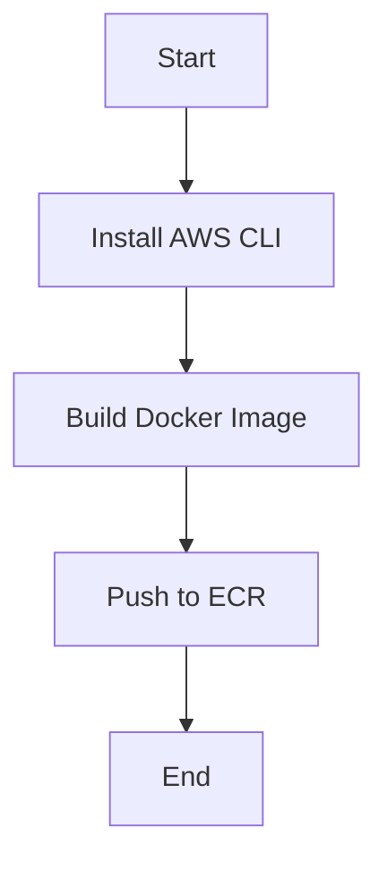

## Introduction to Continuous Delivery Pipelines

Continuous Delivery (CD) pipelines are essential components of modern DevSecOps practices. They automate the process of building, testing, and deploying applications, ensuring that the software can be released to production at any time. In this chapter, we will focus on building application images using self-managed runners and leveraging Docker caching. This approach allows us to optimize the build process, reduce build times, and ensure consistency across different environments.

### Background Theory

Before diving into the practical aspects, let's understand the key concepts involved:

#### Continuous Integration (CI) vs. Continuous Delivery (CD)

- **Continuous Integration (CI)**: This involves automatically building and testing code changes as they are committed to the repository. The goal is to catch integration issues early and ensure that the codebase remains in a deployable state.
  
- **Continuous Delivery (CD)**: This extends CI by automating the deployment process. Once the code passes all tests, it can be deployed to production with minimal manual intervention.

#### Self-Managed Runners

Self-managed runners are custom-built systems that execute jobs defined in your CI/CD pipeline. Unlike hosted runners provided by CI/CD platforms (like GitLab's shared runners), self-managed runners offer greater control and customization. They can be configured to meet specific requirements, such as running tasks on specific hardware or in isolated environments.

#### Docker Caching

Docker caching is a mechanism that speeds up the build process by reusing previously built layers. Each `Dockerfile` instruction creates a layer, and if the contents of a layer haven't changed since the last build, Docker can reuse that layer instead of rebuilding it from scratch. This significantly reduces build times, especially for large or complex applications.

### Setting Up Self-Managed Runners

To set up self-managed runners, follow these steps:

1. **Install GitLab Runner**: First, you need to install GitLab Runner on your self-managed system. This can be done via package managers like `apt` or `yum`, or by downloading the binary directly.

    ```bash
    sudo apt-get update
    sudo apt-get install gitlab-runner
    ```

2. **Register the Runner**: Register the runner with your GitLab instance. You'll need to provide a registration token, which can be found in your GitLab project settings.

    ```bash
    sudo gitlab-runner register
    ```

3. **Configure Tags**: Assign tags to your runner to specify the type of jobs it can handle. For example, you might tag a runner with `docker` and `aws`.

    ```bash
    sudo gitlab-runner register --tag-list "docker,aws"
    ```

### Configuring the CI/CD Pipeline

Now that we have our self-managed runner set up, let's configure the CI/CD pipeline to use it.

#### Removing Default Image and Services

In the pipeline configuration file (`gitlab-ci.yml`), remove the default `image` and `services` definitions. These are typically used when relying on shared runners, but we want to leverage our self-managed runner.

```yaml
stages:
  - build

build_image:
  stage: build
  tags:
    - docker
    - aws
  script:
    - echo "Building the Docker image..."
    - docker build -t myapp .
```

#### Specifying Tags

By specifying tags in the `tags` section, we instruct GitLab to use a runner with those tags. This ensures that the job runs on our self-managed runner.

```yaml
build_image:
  stage: build
  tags:
    - docker
    - aws
  script:
    - echo "Building the Docker image..."
    - docker build -t myapp .
```

#### Installing AWS CLI

Since we need to interact with AWS services, ensure that the AWS CLI is installed on the runner. This can be done as part of the pipeline script.

```yaml
install_aws_cli:
  stage: build
  tags:
    - docker
    - aws
  script:
    - echo "Installing AWS CLI..."
    - curl "https://awscli.amazonaws.com/awscli-exe-linux-x86_64.zip" -o "awscliv2.zip"
    - unzip awscliv2.zip
    - sudo ./aws/install
```

### Leveraging Docker Caching

To take advantage of Docker caching, ensure that your `Dockerfile` is optimized. Here’s an example `Dockerfile`:

```Dockerfile
FROM python:3.9-slim

WORKDIR /app

COPY requirements.txt .
RUN pip install --no-cache-dir -r requirements.txt

COPY . .

CMD ["python", "app.py"]
```

#### Explanation of the `Dockerfile`

- **Base Image**: `python:3.9-slim` is a lightweight Python image.
- **Work Directory**: `WORKDIR /app` sets the working directory inside the container.
- **Copy Requirements**: `COPY requirements.txt .` copies the `requirements.txt` file to the container.
- **Install Dependencies**: `RUN pip install --no-cache-dir -r requirements.txt` installs the dependencies. The `--no-cache-dir` flag ensures that the cache is not used during installation.
- **Copy Application Code**: `COPY . .` copies the entire application code into the container.
- **Command**: `CMD ["python", "app.py"]` specifies the command to run the application.

### Full Example Pipeline Configuration

Here’s a complete example of a `gitlab-ci.yml` file that builds a Docker image and pushes it to Amazon Elastic Container Registry (ECR):

```yaml
stages:
  - build
  - push

variables:
  DOCKER_HOST: tcp://localhost:2375
  DOCKER_TLS_CERTDIR: ""

install_aws_cli:
  stage: build
  tags:
    - docker
    - aws
  script:
    - echo "Installing AWS CLI..."
    - curl "https://awscli.amazonaws.com/awscli-exe-linux-x86_64.zip" -o "awscliv2.zip"
    - unzip awscliv2.zip
    - sudo ./aws/install

build_image:
  stage: build
  tags:
    - docker
    - aws
  script:
    - echo "Building the Docker image..."
    - docker build -t myapp .

push_to_ecr:
  stage: push
  tags:
    - docker
    - aws
  script:
    - echo "Logging into ECR..."
    - $(aws ecr get-login --no-include-email --region us-east-1)
    - echo "Tagging the Docker image..."
    - docker tag myapp:latest 123456789012.dkr.ecr.us-east-1.amazonaws.com/myapp:latest
    - echo "Pushing the Docker image to ECR..."
    - docker push 123456789012.dkr.ecr.us-east-1.amazonaws.com/myapp:latest
```

### Mermaid Diagrams

Let's visualize the pipeline stages using a mermaid diagram:



### Pitfalls and Common Mistakes

1. **Incorrect Tagging**: Ensure that the tags specified in the pipeline configuration match the tags assigned to the self-managed runner.
2. **Missing Dependencies**: Make sure that all necessary tools (e.g., Docker, AWS CLI) are installed on the runner.
3. **Docker Cache Issues**: If the Docker cache is not being utilized effectively, check the `Dockerfile` for inefficiencies. Ensure that frequently changing files are copied after the dependencies are installed.

### How to Prevent / Defend

#### Detection

- **Monitoring Logs**: Regularly monitor the pipeline logs to identify any issues or errors.
- **Automated Testing**: Implement automated tests to catch integration issues early.

#### Prevention

- **Secure Runner Configuration**: Ensure that the self-managed runner is configured securely. Use SSH keys or other secure methods to authenticate with the runner.
- **Regular Updates**: Keep the runner and all installed tools up to date to mitigate vulnerabilities.

#### Secure Coding Fixes

Compare the insecure and secure versions of the `gitlab-ci.yml` file:

**Insecure Version**

```yaml
stages:
  - build

build_image:
  stage: build
  script:
    - echo "Building the Docker image..."
    - docker build -t myapp .
```

**Secure Version**

```yaml
stages:
  - build
  - push

variables:
  DOCKER_HOST: tcp://localhost:2375
  DOCKER_TLS_CERTDIR: ""

install_aws_cli:
  stage: build
  tags:
    - docker
    - aws
  script:
    - echo "Installing AWS CLI..."
    - curl "https://awscli.amazonaws.com/awscli-exe-linux-x86_64.zip" -o "awscliv2.zip"
    - unzip awscliv2.zip
    - sudo ./aws/install

build_image:
  stage: build
  tags:
    - docker
    - aws
  script:
    - echo "Building the Docker image..."
    - docker build -t myapp .

push_to_ecr:
  stage: push
  tags:
   - docker
    - aws
  script:
    - echo "Logging into ECR..."
    - $(aws ecr get-login --no-include-email --region us-east-1)
    - echo "Tagging the Docker image..."
    - docker tag myapp:latest 123456789012.dkr.ecr.us-east-1.amazonaws.com/myapp:latest
    - echo "Pushing the Docker image to ECR..."
    - docker push 123456789012.dkr.ecr.us-east-1.amazonaws.com/myapp:latest
```

### Real-World Examples

#### Recent CVEs and Breaches

- **CVE-2021-21287**: This vulnerability in GitLab allowed unauthorized access to sensitive data. Ensure that your GitLab instance is patched and that access controls are properly configured.
- **AWS ECR Breach**: In 2021, a misconfigured ECR repository exposed sensitive data. Ensure that your ECR repositories are properly secured with IAM policies and encryption.

### Hands-On Labs

For hands-on practice, consider the following labs:

- **PortSwigger Web Security Academy**: Focus on the Docker and CI/CD modules.
- **OWASP Juice Shop**: Practice securing Docker images and CI/CD pipelines.
- **GitLab CI/CD Workshop**: Follow the official GitLab CI/CD workshop to gain practical experience.

### Conclusion

Building a CD pipeline using self-managed runners and leveraging Docker caching is a powerful way to optimize your build process. By following the steps outlined in this chapter, you can ensure that your pipeline is efficient, secure, and reliable. Remember to regularly review and update your pipeline configuration to stay ahead of potential vulnerabilities.

---
<!-- nav -->
[[03-Introduction to Continuous Delivery Pipelines Part 2|Introduction to Continuous Delivery Pipelines Part 2]] | [[DevSecOps/DevSecOps Bootcamp/07-CI CD Security Pipeline/02-Build a CD Pipeline/Build Application Images on Self Managed Runner Leverage Docker Caching/00-Overview|Overview]] | [[05-Introduction to Continuous Delivery Pipelines Part 4|Introduction to Continuous Delivery Pipelines Part 4]]
