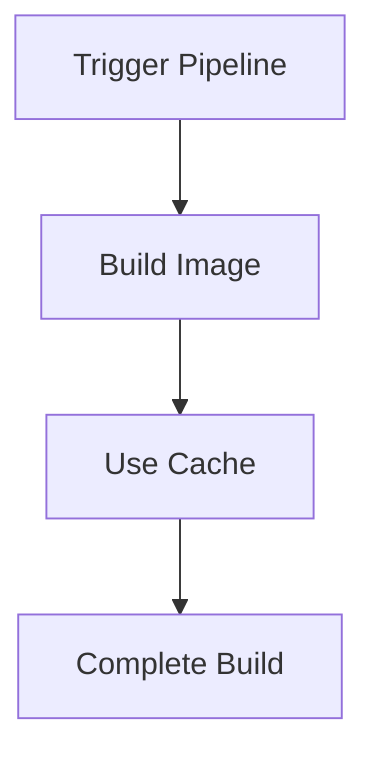
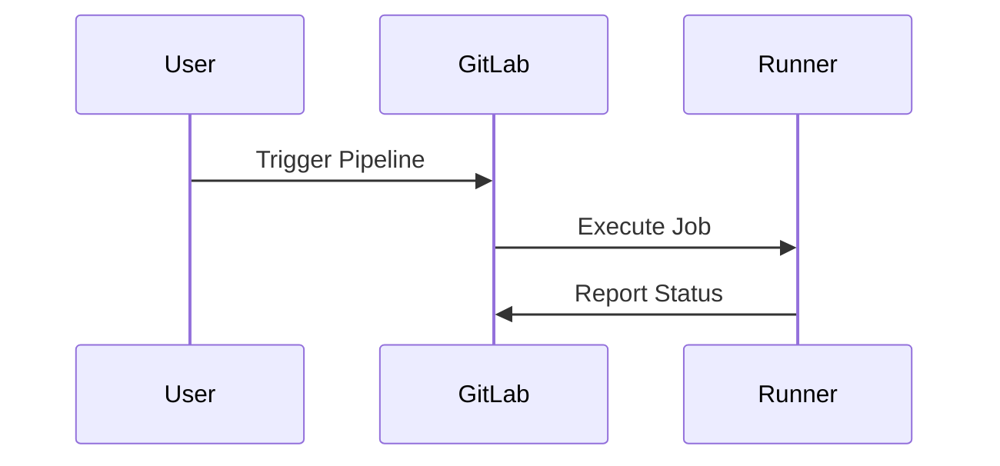

## Introduction to Continuous Delivery Pipelines

Continuous Delivery (CD) pipelines are a critical component of modern DevSecOps practices. They automate the process of building, testing, and deploying applications, ensuring that changes can be safely released to production at any time. One key aspect of an efficient CD pipeline is the ability to build application images quickly and efficiently. This chapter focuses on building application images on a self-managed runner and leveraging Docker caching to significantly reduce build times.

### Self-Managed Runners

A self-managed runner is a worker node that you set up and manage yourself. It can be a physical machine, a virtual machine, or a container. The runner is responsible for executing jobs defined in your CD pipeline. In the context of GitLab, a self-managed runner is configured to run jobs specified in `.gitlab-ci.yml` files.

#### Setting Up a Self-Managed Runner

To set up a self-managed runner, follow these steps:

1. **Install GitLab Runner**: Install the GitLab Runner software on your machine. This can typically be done via package managers like `apt`, `yum`, or `brew`.

    ```bash
    sudo apt-get install gitlab-runner
    ```

2. **Register the Runner**: Register the runner with your GitLab instance. This involves providing a registration token, which can be found in the GitLab UI under your project settings.

    ```bash
    sudo gitlab-runner register
    ```

3. **Configure the Runner**: Configure the runner to specify the type of executor (shell, docker, etc.) and any other necessary settings.

    ```bash
    sudo gitlab-runner configure
    ```

4. **Start the Runner**: Start the runner service to begin executing jobs.

    ```bash
    sudo systemctl start gitlab-runner
    ```

### Leveraging Docker Caching

Docker caching is a powerful feature that can significantly speed up the build process. When building Docker images, each line in the Dockerfile creates a new layer. If a layer has not changed since the last build, Docker can reuse the cached layer instead of rebuilding it from scratch.

#### Dockerfile Layers

A Dockerfile consists of a series of instructions that define how to build a Docker image. Each instruction creates a new layer in the image. For example:

```dockerfile
FROM python:3.9-slim
WORKDIR /app
COPY requirements.txt .
RUN pip install --no-cache-dir -r requirements.txt
COPY . .
CMD ["python", "app.py"]
```

Each `COPY` and `RUN` instruction creates a new layer. If the contents of `requirements.txt` or the application code have not changed, Docker can reuse the cached layers, reducing build time.

#### Enabling Docker Caching

To enable Docker caching, ensure that the Dockerfile is structured in a way that minimizes unnecessary rebuilds. For example, place frequently changing files (like application code) at the end of the Dockerfile.

#### Example of Docker Caching in Action

Consider the following scenario where we build a Docker image using a self-managed runner:

1. **Initial Build**:
    - The first build takes around 8 minutes because all layers are built from scratch.
    - The build process is logged in the GitLab CI/CD interface.

2. **Subsequent Builds**:
    - Subsequent builds take only 8 seconds because Docker reuses the cached layers.
    - The build process is logged in the GitLab CI/CD interface.

#### Full Example of a GitLab CI/CD Configuration

Here is a complete example of a `.gitlab-ci.yml` file that leverages Docker caching:

```yaml
stages:
  - build

build_image:
  stage: build
  script:
    - docker build --cache-from my-image:latest -t my-image:$CI_COMMIT_SHORT_SHA .
  artifacts:
    paths:
      - ./my-image.tar
```

This configuration specifies a `build` stage and a `build_image` job. The `--cache-from` flag tells Docker to use the existing cache from the `my-image:latest` tag.

### Detailed Explanation of the Build Process

When the pipeline runs, the `build_image` job is executed by the self-managed runner. The `docker build` command is used to build the Docker image. The `--cache-from` flag ensures that Docker uses the existing cache if available.

#### Full Raw HTTP Request and Response

The GitLab API is used to trigger the pipeline and retrieve the build logs. Here is an example of the HTTP request and response:

```http
POST /api/v4/projects/:id/pipeline HTTP/1.1
Host: gitlab.example.com
Authorization: Bearer <your_access_token>
Content-Type: application/json

{
  "ref": "main"
}
```

Response:

```http
HTTP/1.1 201 Created
Content-Type: application/json

{
  "id": 12345,
  "status": "running",
  "web_url": "https://gitlab.example.com/project/pipelines/12345"
}
```

### Mermaid Diagrams

#### Pipeline Flow Diagram



#### Sequence Diagram



### Common Pitfalls and How to Avoid Them

#### Pitfall: Uncached Layers

If layers are not being cached, the build process will take much longer. This can happen if the Dockerfile is not structured correctly or if the `--no-cache` flag is used.

**How to Avoid**:
- Ensure the Dockerfile is structured to minimize unnecessary rebuilds.
- Use the `--cache-from` flag to explicitly specify the cache to use.

#### Pitfall: Outdated Cache

If the cache becomes outdated, it can lead to incorrect builds. This can happen if the base image or dependencies change but the cache is not invalidated.

**How to Avoid**:
- Invalidate the cache when the base image or dependencies change.
- Use unique tags for each build to avoid conflicts.

### Real-World Examples

#### Recent CVEs and Breaches

One recent example is the Log4j vulnerability (CVE-2021-44228). This vulnerability affected many applications and could have been mitigated by ensuring that Docker images were built with the latest security patches.

#### Secure Coding Practices

To prevent vulnerabilities, ensure that Docker images are built with the latest security patches and that dependencies are regularly updated. Here is an example of a secure Dockerfile:

```dockerfile
FROM python:3.9-slim
WORKDIR /app
COPY requirements.txt .
RUN pip install --no-cache-dir -r requirements.txt
COPY . .
CMD ["python", "app.py"]
```

### How to Prevent / Defend

#### Detection

To detect issues with Docker caching, monitor the build times and logs. If build times are consistently high, investigate the Dockerfile and cache settings.

#### Prevention

To prevent issues with Docker caching, follow these best practices:
- Structure the Dockerfile to minimize unnecessary rebuilds.
- Use the `--cache-from` flag to explicitly specify the cache to use.
- Invalidate the cache when the base image or dependencies change.

#### Secure-Coding Fixes

Here is an example of a vulnerable Dockerfile and its secure counterpart:

**Vulnerable Dockerfile**:

```dockerfile
FROM python:3.9-slim
WORKDIR /app
COPY . .
RUN pip install --no-cache-dir -r requirements.txt
CMD ["python", "app.py"]
```

**Secure Dockerfile**:

```dockerfile
FROM python:3.9-slim
WORKDIR /app
COPY requirements.txt .
RUN pip install --no-cache-dir -r requirements.txt
COPY . .
CMD ["python", "app.py"]
```

### Hands-On Labs

For hands-on practice, consider the following labs:
- **PortSwigger Web Security Academy**: Focuses on web application security.
- **OWASP Juice Shop**: A deliberately insecure web application for practicing security skills.
- **DVWA**: Damn Vulnerable Web Application for learning about web application security.
- **WebGoat**: An interactive web application security training tool.

These labs provide practical experience in building and securing Docker images and CD pipelines.

### Conclusion

Building application images on a self-managed runner and leveraging Docker caching are essential techniques for creating efficient and secure CD pipelines. By understanding the underlying mechanisms and best practices, you can ensure that your builds are fast, reliable, and secure.

---
<!-- nav -->
[[04-Introduction to Continuous Delivery Pipelines Part 3|Introduction to Continuous Delivery Pipelines Part 3]] | [[DevSecOps/DevSecOps Bootcamp/07-CI CD Security Pipeline/02-Build a CD Pipeline/Build Application Images on Self Managed Runner Leverage Docker Caching/00-Overview|Overview]] | [[06-Introduction to Continuous Delivery Pipelines|Introduction to Continuous Delivery Pipelines]]
