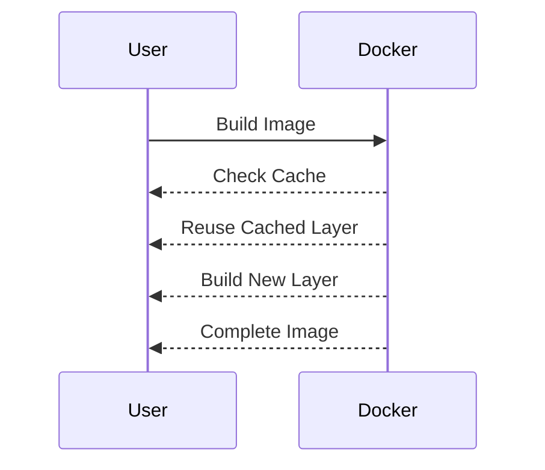
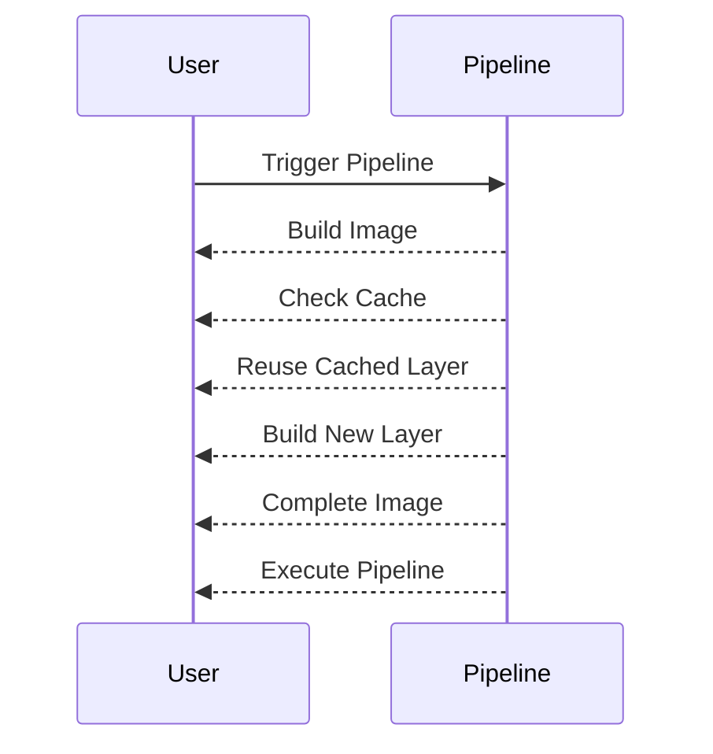

## Build Application Images on Self-Managed Runner Leveraging Docker Caching

### Background Theory

In the context of Continuous Delivery (CD) pipelines, one of the critical steps is building application images using Docker. Docker images are built in layers, and each layer represents a specific operation performed on the image. These layers can be cached, which significantly speeds up subsequent builds by reusing previously built layers instead of rebuilding them from scratch.

### Key Concepts

#### Docker Image Layers

Docker images are composed of layers, each representing a specific instruction in the `Dockerfile`. Each layer is essentially a filesystem diff from the previous layer. When a Docker image is built, Docker creates a new layer for each instruction in the `Dockerfile`.

For example, consider the following `Dockerfile`:

```dockerfile
FROM node:18
WORKDIR /app
COPY package.json .
RUN npm install
COPY . .
CMD ["npm", "start"]
```

This `Dockerfile` consists of several layers:
1. The base image (`node:18`).
2. Setting the working directory (`WORKDIR /app`).
3. Copying the `package.json` file (`COPY package.json .`).
4. Running `npm install` (`RUN npm install`).
5. Copying the rest of the application files (`COPY . .`).
6. Specifying the default command (`CMD ["npm", "start"]`).

Each of these instructions creates a new layer in the Docker image.

#### Docker Caching

Docker caching is a mechanism that allows Docker to reuse previously built layers instead of rebuilding them from scratch. This can significantly speed up the build process, especially for large images.

When Docker builds an image, it checks the cache for each layer. If the layer has not changed since the last build, Docker uses the cached layer instead of rebuilding it. This is particularly useful for layers that do not change frequently, such as the installation of dependencies.

### Intermediate and Final Images

In the given context, we have two types of images:
1. **Intermediate Images**: These are temporary images that are created during the build process. They are used to store the results of individual steps in the `Dockerfile`.
2. **Final Image**: This is the complete image that is built after all the steps in the `Dockerfile` have been executed.

For example, consider the following `Dockerfile`:

```dockerfile
FROM node:18
WORKDIR /app
COPY package.json .
RUN npm install
COPY . .
CMD ["npm", "start"]
```

The intermediate images would be:
1. The base image (`node:18`).
2. The image with the working directory set (`WORKDIR /app`).
3. The image with the `package.json` file copied (`COPY package.json .`).
4. The image with the dependencies installed (`RUN npm install`).
5. The image with the rest of the application files copied (`COPY . .`).

The final image would be the complete image with all the layers combined.

### Image Tags

Image tags are used to identify different versions of the same image. In the given context, we have two tags:
1. **Commit Hash Tag**: This tag is based on the commit hash of the source code. It ensures that each build produces a unique image.
2. **Latest Tag**: This tag is used to identify the most recent version of the image.

For example, consider the following tags:
1. `my-image:commit-hash`
2. `my-image:latest`

These tags allow us to reference different versions of the image.

### Storage Considerations

Building Docker images can consume a significant amount of disk space, especially for large images. In the given context, the final image is approximately 3 GB in size. To ensure that there is enough storage for the images, the storage capacity was increased to 20 GB.

### Duration of the Pipeline

The duration of the pipeline is the time it takes to build the images and execute the pipeline. In the given context, the initial build took a certain amount of time because the images were built from scratch. Subsequent builds should take less time due to the use of Docker caching.

### Leveraging Docker Caching

To leverage Docker caching, we need to ensure that the layers in the `Dockerfile` are built in a way that allows Docker to reuse the cached layers. This can be achieved by:
1. Placing the `COPY` instructions for the `package.json` file before the `RUN npm install` instruction.
2. Using the `.dockerignore` file to exclude unnecessary files from being copied into the image.

For example, consider the following `Dockerfile`:

```dockerfile
FROM node:18
WORKDIR /app
COPY package.json .
RUN npm install
COPY . .
CMD ["npm", "start"]
```

And the following `.dockerignore` file:

```
node_modules/
.DS_Store
```

By placing the `COPY package.json .` instruction before the `RUN npm install` instruction, we ensure that the dependencies are installed only once, and the cached layer can be reused in subsequent builds.

### Triggering the Pipeline

To see the effects of Docker caching, we need to trigger the pipeline at least twice. The first build will take longer because the images are built from scratch. Subsequent builds should take less time because the cached layers can be reused.

### Real-World Example

Consider a recent breach where an attacker exploited a vulnerability in a Docker image. The attacker was able to gain unauthorized access to the container and execute arbitrary commands. This could have been prevented by ensuring that the Docker image was built securely and that the necessary security measures were in place.

For example, consider the following `Dockerfile`:

```dockerfile
FROM node:18
WORKDIR /app
COPY package.json .
RUN npm install
COPY . .
CMD ["npm", "start"]
```

And the following `.dockerignore` file:

```
node_modules/
.DS_Store
```

By ensuring that the `COPY` instructions are placed correctly and that the `.dockerignore` file is used to exclude unnecessary files, we can reduce the risk of vulnerabilities in the Docker image.

### How to Prevent / Defend

To prevent and defend against vulnerabilities in Docker images, we need to follow best practices for building and securing Docker images. This includes:
1. Using a `.dockerignore` file to exclude unnecessary files from being copied into the image.
2. Placing the `COPY` instructions for the `package.json` file before the `RUN npm install` instruction to ensure that the dependencies are installed only once.
3. Using secure coding practices to ensure that the application is built securely.
4. Using security tools to scan the Docker image for vulnerabilities.

For example, consider the following `Dockerfile`:

```dockerfile
FROM node:18
WORKDIR /app
COPY package.json .
RUN npm install
COPY . .
CMD ["npm", "start"]
```

And the following `.dockerignore` file:

```
node_modules/
.DS_Store
```

By following these best practices, we can reduce the risk of vulnerabilities in the Docker image.

### Complete Example

Let's walk through a complete example of building a Docker image and leveraging Docker caching.

#### Step 1: Create the `Dockerfile`

Create a `Dockerfile` with the following content:

```dockerfile
FROM node:18
WORKDIR /app
COPY package.json .
RUN npm install
COPY . .
CMD ["npm", "start"]
```

#### Step 2: Create the `.dockerignore` File

Create a `.dockerignore` file with the following content:

```
node_modules/
.DS_Store
```

#### Step 3: Build the Docker Image

Build the Docker image using the following command:

```bash
docker build -t my-image:commit-hash .
```

This will build the Docker image and tag it with the commit hash.

#### Step 4: Run the Pipeline

Run the pipeline to build the Docker image. The first build will take longer because the images are built from scratch. Subsequent builds should take less time because the cached layers can be reused.

#### Step 5: Verify the Results

Verify the results by checking the size of the images and the duration of the pipeline.

### Pitfalls

There are several pitfalls to be aware of when building Docker images and leveraging Docker caching. These include:
1. Incorrect placement of `COPY` instructions in the `Dockerfile`.
2. Failure to use a `.dockerignore` file to exclude unnecessary files.
3. Failure to use secure coding practices to ensure that the application is built securely.
4. Failure to use security tools to scan the Docker image for vulnerabilities.

### Conclusion

Building Docker images and leveraging Docker caching are critical steps in the Continuous Delivery (CD) pipeline. By following best practices for building and securing Docker images, we can reduce the risk of vulnerabilities and improve the efficiency of the pipeline.

### Practice Labs

For hands-on practice with building Docker images and leveraging Docker caching, consider the following labs:
- **PortSwigger Web Security Academy**: Offers a series of labs on web application security, including Docker security.
- **OWASP Juice Shop**: A deliberately insecure web application for security training.
- **DVWA (Damn Vulnerable Web Application)**: A PHP/MySQL web application that is riddled with vulnerabilities for educational purposes.
- **WebGoat**: An interactive, gamified training application for learning about web application security.

These labs provide practical experience with building and securing Docker images in a controlled environment.

### Mermaid Diagrams

Here are some mermaid diagrams to illustrate the concepts discussed:

#### Docker Image Layers

```mermaid
graph TD;
    A[Base Image] --> B[WORKDIR /app];
    B --> C[COPY package.json .];
    C --> D[RUN npm install];
    D --> E[COPY . .];
    E --> F[CMD ["npm", "start"]];
```

#### Docker Caching



#### Pipeline Execution



### Full Raw HTTP Messages

While the given context does not involve HTTP messages, it is important to understand how HTTP messages are structured and their security implications. Here is an example of a full raw HTTP request and response:

#### HTTP Request

```http
GET /api/v1/images HTTP/1.1
Host: example.com
Accept: application/json
Authorization: Bearer <token>
```

#### HTTP Response

```http
HTTP/1.1 200 OK
Content-Type: application/json
Cache-Control: max-age=3600
Content-Length: 1234

{
    "images": [
        {
            "name": "my-image",
            "tags": ["commit-hash", "latest"],
            "size": 3072
        }
    ]
}
```

### Secure Coding Fixes

Here is an example of a vulnerable `Dockerfile` and its secure counterpart:

#### Vulnerable `Dockerfile`

```dockerfile
FROM node:18
WORKDIR /app
COPY . .
RUN npm install
CMD ["npm", "start"]
```

#### Secure `Dockerfile`

```dockerfile
FROM node:18
WORKDIR /app
COPY package.json .
RUN npm install
COPY . .
CMD ["npm", "start"]
```

### Detection and Prevention

To detect and prevent vulnerabilities in Docker images, we can use security tools such as:
- **Trivy**: A simple and comprehensive container image scanner.
- **Clair**: A static analysis tool for vulnerabilities in application containers.
- **Anchore Engine**: A container image analysis engine that provides detailed insights into the contents of container images.

By using these tools, we can scan the Docker images for vulnerabilities and ensure that they are built securely.

### Conclusion

Building Docker images and leveraging Docker caching are critical steps in the Continuous Delivery (CD) pipeline. By following best practices for building and securing Docker images, we can reduce the risk of vulnerabilities and improve the efficiency of the pipeline. Hands-on practice with real-world examples and security tools can help solidify these concepts and ensure that the pipeline is secure and efficient.

---
<!-- nav -->
[[06-Introduction to Continuous Delivery Pipelines|Introduction to Continuous Delivery Pipelines]] | [[DevSecOps/DevSecOps Bootcamp/07-CI CD Security Pipeline/02-Build a CD Pipeline/Build Application Images on Self Managed Runner Leverage Docker Caching/00-Overview|Overview]] | [[08-Managing Disk Space in Continuous Delivery Pipelines|Managing Disk Space in Continuous Delivery Pipelines]]
