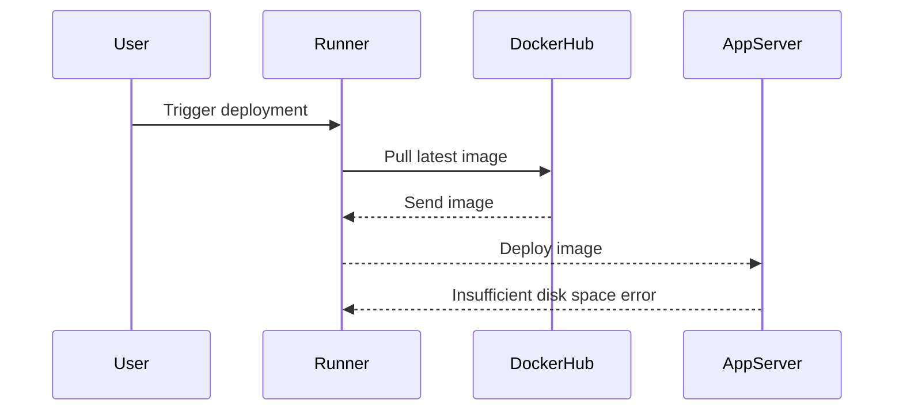

## Managing Disk Space in Continuous Delivery Pipelines

### Introduction to Disk Space Management in CD Pipelines

In the context of Continuous Delivery (CD) pipelines, managing disk space is crucial for maintaining the efficiency and reliability of your deployment processes. This section will delve into the challenges of disk space management, particularly when using self-managed runners and Docker images. We'll explore how to clean up older images, understand the implications of limited disk space, and provide strategies to prevent and mitigate these issues.

### Understanding Disk Space Constraints

When working with self-managed runners, one of the primary constraints is the limited disk space available on the runner nodes. This limitation can lead to various issues, such as:

- **Deployment failures**: If the runner runs out of disk space, it may fail to pull new Docker images, leading to deployment failures.
- **Performance degradation**: Over time, unused Docker images can accumulate, consuming valuable disk space and potentially slowing down the runner's performance.

#### Example Scenario: Deployment Failure Due to Limited Disk Space

Consider a scenario where a deployment pipeline fails due to insufficient disk space. This situation often occurs when the runner repeatedly pulls large Docker images without cleaning up older versions. Here’s a detailed breakdown of the issue:



In this sequence, the runner attempts to pull the latest Docker image but fails due to insufficient disk space on the app server. This failure can be traced back to the accumulation of older Docker images that were not cleaned up.

### Cleaning Up Older Docker Images

To manage disk space effectively, it's essential to periodically clean up older Docker images. This process involves identifying and removing unused images to free up space. Here’s how you can achieve this:

#### Identifying Dangling Images

Dangling images are those that are not tagged and are no longer referenced by any container. These images can be safely removed without affecting the current deployments.

```bash
docker images -qf dangling=true
```

This command lists all dangling images. You can then remove these images using:

```bash
docker rmi $(docker images -qf dangling=true)
```

#### Removing Unused Tagged Images

In addition to dangling images, you might also want to remove older tagged images that are no longer needed. This can be done by listing all images and selectively removing the older ones.

```bash
docker images
```

This command lists all Docker images along with their tags and sizes. You can then identify and remove the older images using:

```bash
docker rmi <image_id>
```

### Increasing Disk Space

If cleaning up older images is not sufficient to free up enough space, you might consider increasing the disk space available to your runner nodes. This can be achieved by resizing the underlying storage volumes.

#### Resizing EBS Volumes in AWS

For AWS users, you can resize the Elastic Block Store (EBS) volumes attached to your EC2 instances. Here’s a step-by-step guide:

1. **Connect to the Instance**:
   Connect to your EC2 instance via SSH.

2. **Resize the Volume**:
   Resize the EBS volume through the AWS Management Console or using the AWS CLI.

   ```bash
   aws ec2 modify-volume --volume-id vol-0123456789abcdef0 --size 16
   ```

3. **Extend the File System**:
   After resizing the volume, you need to extend the file system to utilize the additional space.

   ```bash
   sudo growpart /dev/xvda 1
   sudo xfs_growfs /
   ```

### Automating Disk Space Management

To avoid manual intervention, you can automate the process of cleaning up older Docker images and monitoring disk space usage. This can be achieved by integrating these tasks into your CD pipeline.

#### Example: Automated Cleanup Script

Here’s an example script that automates the cleanup process:

```bash
#!/bin/bash

# Remove dangling images
docker rmi $(docker images -qf dangling=true)

# Remove unused tagged images
docker images | grep -v "REPOSITORY" | awk '{print $3}' | xargs docker rmi

# Check disk space usage
df -h
```

You can schedule this script to run periodically using a cron job or integrate it into your CD pipeline.

### Real-World Examples and Case Studies

#### Example: CVE-2021-21315 - Docker Hub Rate Limiting

In 2021, Docker Hub introduced rate limiting for anonymous pulls, which affected many organizations relying on frequent image pulls. This incident highlighted the importance of managing disk space and optimizing image usage.

#### Example: Breach at Uber - Inadequate Disk Space Management

Uber faced significant operational issues due to inadequate disk space management in their CI/CD pipelines. This led to frequent deployment failures and performance degradation, emphasizing the need for robust disk space management practices.

### How to Prevent and Defend Against Disk Space Issues

#### Detection

Regularly monitor disk space usage to detect potential issues before they cause deployment failures. Tools like `df`, `du`, and `ncdu` can help in monitoring disk usage.

#### Prevention

- **Automate Cleanup**: Integrate automated cleanup scripts into your CD pipeline.
- **Increase Disk Space**: Resize storage volumes as needed to ensure sufficient disk space.
- **Optimize Image Usage**: Use multi-stage builds and cache layers to reduce image sizes.

#### Secure Coding Fixes

Compare the insecure and secure versions of a script to demonstrate best practices:

**Insecure Version**:
```bash
#!/bin/bash

# Pull latest image
docker pull myapp:latest

# Deploy image
docker run -d myapp:latest
```

**Secure Version**:
```bash
#!/bin/bash

# Remove dangling images
docker rmi $(docker images -qf dangling=true)

# Pull latest image
docker pull myapp:latest

# Deploy image
docker run -d myapp:latest

# Check disk space usage
df -h
```

### Conclusion

Managing disk space in CD pipelines is critical for ensuring smooth and efficient deployments. By understanding the implications of limited disk space, implementing regular cleanup procedures, and automating these tasks, you can prevent deployment failures and maintain optimal performance.

### Hands-On Labs

For practical experience, consider the following labs:

- **PortSwigger Web Security Academy**: Focuses on web application security but includes sections on CI/CD pipelines.
- **OWASP Juice Shop**: A deliberately insecure web application for security training.
- **DVWA (Damn Vulnerable Web Application)**: Another popular web application for security training.

These labs provide a comprehensive learning experience and help reinforce the concepts discussed in this chapter.

---
<!-- nav -->
[[07-Build Application Images on Self-Managed Runner Leveraging Docker Caching|Build Application Images on Self-Managed Runner Leveraging Docker Caching]] | [[DevSecOps/DevSecOps Bootcamp/07-CI CD Security Pipeline/02-Build a CD Pipeline/Build Application Images on Self Managed Runner Leverage Docker Caching/00-Overview|Overview]] | [[09-Monitoring Disk Space on Self-Managed Runners|Monitoring Disk Space on Self-Managed Runners]]
