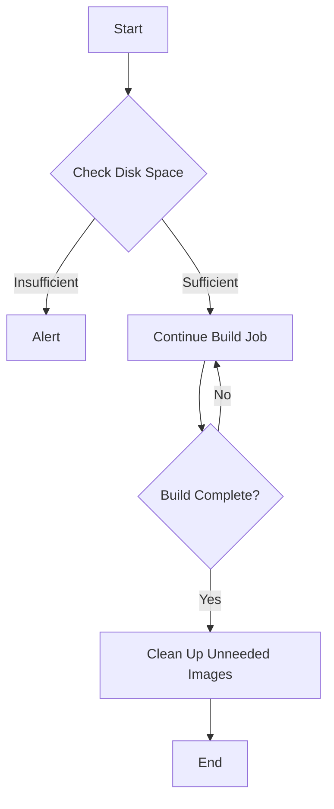

## Monitoring Disk Space on Self-Managed Runners

When managing a self-hosted Continuous Delivery (CD) pipeline, one of the critical aspects to monitor is the disk space usage on the runners. This ensures that the build jobs can run smoothly without running into issues like insufficient disk space. Let's delve into how to check and manage disk space on a self-managed runner.

### Checking Available Disk Space

To check the available disk space on a self-managed runner, you can use the `df` command with the `-h` flag. This command provides a human-readable output of the disk space usage.

```bash
df -h
```

This command will display the total disk space, used space, available space, and the mount points. Here’s an example of what the output might look like:

```plaintext
Filesystem      Size  Used Avail Use% Mounted on
/dev/sda1        20G   14G  6.0G  70% /
```

In this example, the total disk space is 20GB, with 14GB used and 6GB available. The disk usage percentage is 70%.

#### Why Check Disk Space?

Checking disk space is crucial because if the disk becomes full, it can cause build jobs to fail. This can lead to delays in the CD pipeline and affect the overall development process. By monitoring the disk space, you can proactively address any potential issues before they become critical.

### Setting Disk Space Limits

When setting up a self-hosted runner, you typically allocate a specific amount of disk space. In the given context, the default disk space allocation was 8GB, but it was increased to 20GB. This is important because larger applications may require more disk space during the build process.

#### Example Configuration

Here’s an example of how you might configure a self-hosted runner with 20GB of disk space:

```yaml
# Example configuration for a self-hosted runner
runner:
  name: my-self-hosted-runner
  tags: ["self-hosted"]
  limits:
    disk-space: 20GB
```

### Monitoring Disk Usage During Build Jobs

While the build jobs are running, you can continuously monitor the disk usage to ensure that there is enough space available. This can be done by periodically running the `df -h` command.

#### Example Script for Monitoring Disk Usage

Here’s a simple script that monitors the disk usage and logs the results:

```bash
#!/bin/bash

while true; do
  df -h | grep '/dev/sda1'
  sleep 60
done
```

This script will log the disk usage every minute. You can adjust the interval as needed.

### Managing Disk Space Usage

As you build and tag images, the disk space usage can increase significantly. Each time you tag an image, a new copy of the image is created with the commit hash. Over time, this can lead to disk space issues.

#### Cleaning Up Unneeded Intermediary Images

To manage disk space, you can clean up unneeded intermediary images using the `docker image prune` command. This command removes all dangling images and unused intermediate images.

```bash
docker image prune -a
```

The `-a` flag tells Docker to remove all unused images, not just dangling ones.

#### Example Before and After Cleanup

Let’s consider an example where you have several unneeded intermediary images:

**Before Cleanup:**

```plaintext
REPOSITORY          TAG                 IMAGE ID            CREATED             SIZE
myapp               latest              abcdef123456        2 days ago          1.5GB
<none>              <none>              123456abcdef        3 days ago          1.2GB
<none>              <none>              7890abcd1234        4 days ago          1.3GB
```

**After Cleanup:**

```bash
docker image prune -a
```

```plaintext
REPOSITORY          TAG                 IMAGE ID            CREATED             SIZE
myapp               latest              abcdef123456        2 days ago          1.5GB
```

### How to Prevent / Defend Against Disk Space Issues

#### Detection

To detect disk space issues, you can set up monitoring tools that alert you when the disk usage exceeds a certain threshold. For example, you can use Prometheus and Grafana to monitor disk usage and set up alerts.

#### Prevention

To prevent disk space issues, you can implement the following strategies:

1. **Regular Cleanup**: Schedule regular cleanup tasks to remove unneeded intermediary images.
2. **Disk Space Allocation**: Ensure that the disk space allocated to the runner is sufficient for the build jobs.
3. **Monitoring**: Set up monitoring tools to alert you when disk usage exceeds a certain threshold.

#### Secure Coding Fixes

Here’s an example of how you might implement a regular cleanup task using a cron job:

**Vulnerable Code:**

```bash
# No regular cleanup task
```

**Secure Code:**

```bash
# Add a cron job to clean up unneeded images daily
0 0 * * * docker image prune -a > /var/log/docker-prune.log 2>&1
```

### Real-World Examples

#### Recent Breaches and CVEs

One recent example of a breach related to disk space management is the incident where a company’s CI/CD pipeline failed due to insufficient disk space. This led to a delay in the deployment process and affected the overall development cycle.

#### Example: Docker Image Pruning

Consider a scenario where a company uses Docker images extensively in their CI/CD pipeline. Due to the frequent builds and tagging of images, the disk space usage increased rapidly. They implemented a regular cleanup task using the `docker image prune` command to manage the disk space effectively.

### Mermaid Diagrams

#### Disk Space Management Flow



### Conclusion

Managing disk space on self-hosted runners is crucial for ensuring the smooth operation of a CD pipeline. By regularly checking and cleaning up unneeded images, you can prevent disk space issues and maintain the efficiency of your build jobs. Implementing monitoring and cleanup tasks can help you proactively manage disk space and avoid potential disruptions.

### Practice Labs

For hands-on practice with managing disk space in a CI/CD pipeline, consider the following labs:

- **PortSwigger Web Security Academy**: Offers labs on managing disk space in a CI/CD pipeline.
- **OWASP Juice Shop**: Provides scenarios where you can practice managing disk space in a real-world application.
- **DVWA**: Offers exercises on managing disk space in a web application environment.

These labs will provide you with practical experience in managing disk space and ensuring the smooth operation of your CD pipeline.

---
<!-- nav -->
[[08-Managing Disk Space in Continuous Delivery Pipelines|Managing Disk Space in Continuous Delivery Pipelines]] | [[DevSecOps/DevSecOps Bootcamp/07-CI CD Security Pipeline/02-Build a CD Pipeline/Build Application Images on Self Managed Runner Leverage Docker Caching/00-Overview|Overview]] | [[10-Troubleshooting Job Execution on Self-Managed Runners|Troubleshooting Job Execution on Self-Managed Runners]]
