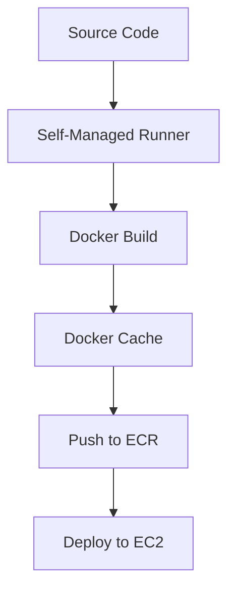

## Understanding the Build Process in a CD Pipeline

In the context of Continuous Delivery (CD) pipelines, building application images is a critical step that ensures the application is packaged correctly and efficiently. This process often involves using a self-managed runner, which is a dedicated machine or container that executes the build steps. One key aspect of this process is leveraging Docker caching to speed up builds and optimize resource usage.

### Self-Managed Runners

A self-managed runner is a custom environment set up to run the build steps of a CD pipeline. This runner can be a physical machine, a virtual machine, or a container. The advantage of using a self-managed runner is that it provides full control over the environment, allowing for customization and optimization based on specific requirements.

#### Setting Up the Environment

To set up a self-managed runner, you need to ensure that the environment has all the necessary tools installed, such as Docker, Git, and any language-specific build tools (e.g., Node.js, Python, Java).

```bash
# Install Docker
sudo apt-get update
sudo apt-get install -y docker.io

# Install Git
sudo apt-get install -y git

# Install Node.js (example)
curl -fsSL https://deb.nodesource.com/setup_16.x | sudo -E bash -
sudo apt-get install -y nodejs
```

### Docker Caching

Docker caching is a mechanism that speeds up the build process by reusing previously built layers. Each layer in a Docker image corresponds to an instruction in the `Dockerfile`. If a layer has already been built and hasn't changed, Docker uses the cached version instead of rebuilding it.

#### How Docker Caching Works

When Docker builds an image, it reads the `Dockerfile` line by line and creates a new layer for each instruction. If the content of a layer has not changed since the last build, Docker uses the cached version of that layer. This significantly reduces the time required to build the image.

```dockerfile
# Example Dockerfile
FROM node:16-alpine
WORKDIR /app
COPY package.json .
RUN npm install
COPY . .
CMD ["npm", "start"]
```

In this `Dockerfile`, the `COPY package.json .` and `RUN npm install` instructions are likely to be cached if the `package.json` file hasn't changed. However, if the `package.json` file changes, Docker will invalidate the cache for subsequent layers.

### Managing Disk Space

Disk space management is crucial when working with self-managed runners, especially when dealing with large Docker images. Insufficient disk space can cause build failures or slow down the build process.

#### Cleaning Up Old Images

To manage disk space effectively, it's important to regularly clean up old Docker images that are no longer needed. This can be done using the `docker system prune` command, which removes unused data.

```bash
# Remove all unused Docker images, networks, and containers
docker system prune -a
```

Alternatively, you can manually remove specific images using the `docker rmi` command.

```bash
# List all Docker images
docker images

# Remove a specific Docker image
docker rmi <image_id>
```

### Handling Volume Assignments

When setting up a self-managed runner, it's essential to ensure that the runner has sufficient disk space. This can be managed by assigning a larger volume to the runner when creating the app server.

#### Modifying Volume Size

If the current volume size is insufficient, you can modify it by either increasing the volume size or rebooting the instance to apply the changes.

```bash
# Increase the volume size
aws ec2 modify-volume --volume-id vol-0123456789abcdef0 --size 50

# Reboot the instance
aws ec2 reboot-instances --instance-ids i-0123456789abcdef0
```

### Pushing Images to ECR Repository

Once the application image is built, it needs to be pushed to a container registry like Amazon Elastic Container Registry (ECR). This allows the image to be deployed to the target environment.

#### Pushing to ECR

To push the Docker image to ECR, you first need to authenticate with the ECR registry using the `aws ecr get-login-password` command.

```bash
# Authenticate with ECR
$(aws ecr get-login-password --region us-west-2 | docker login --username AWS --password-stdin aws_account_id.dkr.ecr.us-west-2.amazonaws.com)

# Tag the Docker image
docker tag myapp:latest aws_account_id.dkr.ecr.us-west-2.amazonaws.com/myapp:latest

# Push the Docker image to ECR
docker push aws_account_id.dkr.ecr.us-west-2.amazonaws.com/myapp:latest
```

### Deploying to EC2 Instance

After pushing the image to ECR, the next step is to deploy it to an EC2 instance. This can be done using tools like AWS CLI or AWS Management Console.

#### Deploying Using AWS CLI

To deploy the image to an EC2 instance, you can use the `aws ecs update-service` command.

```bash
# Update the ECS service to use the new image
aws ecs update-service --cluster my-cluster --service my-service --force-new-deployment
```

### Full Example: Build and Deploy Pipeline

Let's walk through a complete example of building and deploying an application image using a self-managed runner and Docker caching.

#### Step 1: Set Up the Environment

First, set up the self-managed runner with the necessary tools.

```bash
# Install Docker, Git, and Node.js
sudo apt-get update
sudo apt-get install -y docker.io git
curl -fsSL https://deb.nodesource.com/setup_16.x | sudo -E bash -
sudo apt-get install -y nodejs
```

#### Step 2: Create the Dockerfile

Create a `Dockerfile` for the application.

```dockerfile
# Example Dockerfile
FROM node:16-alpine
WORKDIR /app
COPY package.json .
RUN npm install
COPY . .
CMD ["npm", "start"]
```

#### Step 3: Build the Docker Image

Build the Docker image using the `Dockerfile`.

```bash
# Build the Docker image
docker build -t myapp:latest .
```

#### Step 4: Push the Image to ECR

Push the Docker image to ECR.

```bash
# Authenticate with ECR
$(aws ecr get-login-password --region us-west-2 | docker login --username AWS --password-stdin aws_account_id.dkr.ecr.us-west-2.amazonaws.com)

# Tag the Docker image
docker tag myapp:latest aws_account_id.dkr.ecr.us-west-2.amazonaws.com/myapp:latest

# Push the Docker image to ECR
docker push aws_account_id.dkr.ecr.us-west-2.amazonaws.com/myapp:latest
```

#### Step 5: Deploy to EC2 Instance

Deploy the image to an EC2 instance.

```bash
# Update the ECS service to use the new image
aws ecs update-service --cluster my-cluster --service my-service --force-new-deployment
```

### Diagram: CD Pipeline Architecture



### Common Pitfalls and How to Avoid Them

#### Insufficient Disk Space

**Problem:** Insufficient disk space can cause build failures or slow down the build process.

**Solution:** Regularly clean up old Docker images and increase the volume size if necessary.

```bash
# Clean up old Docker images
docker system prune -a

# Increase the volume size
aws ec2 modify-volume --volume-id vol-0123456789abcdef0 --size 50
```

#### Inefficient Docker Caching

**Problem:** Inefficient Docker caching can lead to slower build times.

**Solution:** Ensure that the `Dockerfile` is optimized for caching. Place frequently changing files at the end of the `Dockerfile`.

```dockerfile
# Optimized Dockerfile
FROM node:16-alpine
WORKDIR /app
COPY package.json .
RUN npm install
COPY . .
CMD ["npm", "start"]
```

### Real-World Examples

#### Recent Breach: Docker Hub Vulnerability

In 2021, Docker Hub experienced a security breach where unauthorized access was gained to user accounts. This highlights the importance of securing container registries and ensuring that images are built and deployed securely.

#### Secure Coding Practices

To prevent vulnerabilities, follow secure coding practices such as:

- **Use secure base images**: Always start with a trusted base image.
- **Minimize privileges**: Run the container with the least privileges necessary.
- **Regularly update dependencies**: Keep all dependencies up to date to avoid known vulnerabilities.

### How to Prevent / Defend

#### Detection

- **Monitor Docker builds**: Use tools like Docker Scan to detect vulnerabilities in Docker images.
- **Audit logs**: Enable audit logging to track changes and access to Docker images.

#### Prevention

- **Secure base images**: Use trusted base images from reputable sources.
- **Regular updates**: Keep all dependencies and tools up to date.
- **Least privilege**: Run containers with the least privileges necessary.

#### Secure-Coding Fixes

**Vulnerable Code:**

```dockerfile
# Vulnerable Dockerfile
FROM node:16-alpine
WORKDIR /app
COPY . .
RUN npm install
CMD ["npm", "start"]
```

**Fixed Code:**

```dockerfile
# Fixed Dockerfile
FROM node:16-alpine
WORKDIR /app
COPY package.json .
RUN npm install
COPY . .
CMD ["npm", "start"]
```

### Conclusion

Building and deploying application images in a CD pipeline requires careful management of resources and security. By leveraging Docker caching, managing disk space, and following secure coding practices, you can ensure that your pipeline is efficient and secure.

### Practice Labs

For hands-on practice, consider the following labs:

- **PortSwigger Web Security Academy**: Focuses on web application security but also covers CI/CD pipelines.
- **AWS Official Workshops**: Provides detailed guides on setting up and securing CD pipelines using AWS services.

By completing these labs, you can gain practical experience in building and deploying application images in a CD pipeline.

---
<!-- nav -->
[[11-Understanding Dangling Docker Images|Understanding Dangling Docker Images]] | [[DevSecOps/DevSecOps Bootcamp/07-CI CD Security Pipeline/02-Build a CD Pipeline/Build Application Images on Self Managed Runner Leverage Docker Caching/00-Overview|Overview]] | [[DevSecOps/DevSecOps Bootcamp/07-CI CD Security Pipeline/02-Build a CD Pipeline/Build Application Images on Self Managed Runner Leverage Docker Caching/13-Conclusion|Conclusion]]
