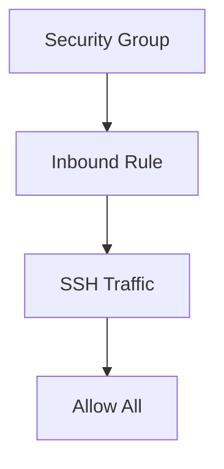
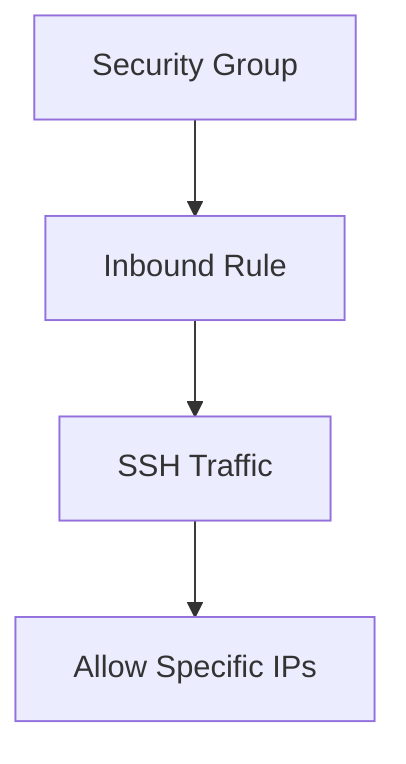

## Configuring Application Deployment Environment on EC2 Server

### Introduction to EC2 Instances

Amazon Elastic Compute Cloud (EC2) is a web service that provides resizable compute capacity in the cloud. EC2 enables you to launch and run virtual servers, called instances, in Amazon's data centers. These instances can be used for various purposes, including deploying applications, hosting websites, and running databases.

#### Why Use EC2?

- **Scalability**: EC2 allows you to scale your resources up or down based on demand.
- **Cost-Effective**: You pay only for the resources you use, which can help reduce costs compared to maintaining physical servers.
- **Flexibility**: EC2 supports a wide range of operating systems and configurations, allowing you to choose the environment that best suits your application.

### Creating an EC2 Instance

To deploy an application on an EC2 instance, you first need to create the instance itself. This process involves several steps, including selecting the appropriate AMI (Amazon Machine Image), choosing an instance type, configuring security groups, and setting up storage.

#### Step-by-Step Guide to Create an EC2 Instance

1. **Access the EC2 Dashboard**:
    - Log in to the AWS Management Console.
    - Navigate to the EC2 dashboard.

2. **Launch an Instance**:
    - Click on the "Launch Instance" button.
    - Choose an AMI (Amazon Machine Image). For this example, we will use the latest version of Ubuntu.

3. **Select an Instance Type**:
    - Choose an instance type based on your requirements. For simplicity, we will use the `t2.micro` instance type, which is suitable for small-scale applications.

4. **Configure Instance Details**:
    - Set the number of instances to launch.
    - Select the network and subnet.
    - Configure the auto-scaling group and load balancer settings if needed.

5. **Add Storage**:
    - Configure the storage settings. For this example, we will use the default settings.

6. **Configure Security Group**:
    - Create a new security group or use an existing one.
    - Add rules to allow incoming traffic. For this example, we will allow all SSH traffic from anywhere.

7. **Review and Launch**:
    - Review the instance details and launch the instance.

### Detailed Configuration Steps

Let's break down each step in more detail:

#### Access the EC2 Dashboard

```markdown
1. Log in to the AWS Management Console.
2. Navigate to the EC2 dashboard.
```

#### Launch an Instance

```markdown
1. Click on the "Launch Instance" button.
2. Choose an AMI (Amazon Machine Image). For this example, we will use the latest version of Ubuntu.
```

#### Select an Instance Type

```markdown
1. Choose an instance type based on your requirements. For simplicity, we will use the `t2.micro` instance type, which is suitable for small-scale applications.
```

#### Configure Instance Details

```markdown
1. Set the number of instances to launch.
2. Select the network and subnet.
3. Configure the auto-scaling group and load balancer settings if needed.
```

#### Add Storage

```markdown
1. Configure the storage settings. For this example, we will use the default settings.
```

#### Configure Security Group

```markdown
1. Create a new security group or use an existing one.
2. Add rules to allow incoming traffic. For this example, we will allow all SSH traffic from anywhere.
```

#### Review and Launch

```markdown
1. Review the instance details and launch the instance.
```

### Creating a Key Pair

To securely access the EC2 instance via SSH, you need to create a key pair. A key pair consists of a public key and a private key. The public key is stored on the EC2 instance, and the private key is kept securely on your local machine.

#### Step-by-Step Guide to Create a Key Pair

1. **Create a New Key Pair**:
    - In the EC2 dashboard, navigate to the "Key Pairs" section.
    - Click on the "Create Key Pair" button.
    - Enter a name for the key pair (e.g., `AppServerKey`).

2. **Download the Private Key**:
    - The private key will be automatically downloaded to your local machine. Ensure you save it in a secure location.

3. **Set Permissions**:
    - Set the correct permissions on the private key file to ensure it is not readable by others.

```bash
chmod 400 AppServerKey.pem
```

### Configuring Security Groups

A security group acts as a virtual firewall for your EC2 instance, controlling inbound and outbound traffic. By default, a new security group is created when you launch an instance.

#### Step-by-Step Guide to Configure Security Groups

1. **Create a New Security Group**:
    - In the EC2 dashboard, navigate to the "Security Groups" section.
    - Click on the "Create Security Group" button.
    - Enter a name and description for the security group (e.g., `AppServerSG`).

2. **Add Inbound Rules**:
    - Add rules to allow incoming traffic. For this example, we will allow all SSH traffic from anywhere.



### Launching the Instance

Once you have configured the instance details, storage, and security group, you can launch the instance.

#### Step-by-Step Guide to Launch the Instance

1. **Review and Launch**:
    - Review the instance details and click on the "Launch" button.
    - Confirm the launch by clicking on the "Launch Instances" button.

### Accessing the EC2 Instance

After launching the instance, you can access it via SSH using the private key you created earlier.

#### Step-by-Step Guide to Access the EC2 Instance

1. **Get the Public IP Address**:
    - In the EC2 dashboard, navigate to the "Instances" section.
    - Find the instance you launched and note its public IP address.

2. **SSH into the Instance**:
    - Use the following command to SSH into the instance:

```bash
ssh -i AppServerKey.pem ubuntu@<public-ip-address>
```

### Example of Full HTTP Request and Response

When accessing the EC2 instance via SSH, the communication happens over the SSH protocol, which is not an HTTP-based protocol. However, for completeness, let's consider an example of a full HTTP request and response for a typical web application hosted on an EC2 instance.

#### Full HTTP Request

```http
GET /index.html HTTP/1.1
Host: example.com
User-Agent: Mozilla/5.0 (Windows NT 10.0; Win64; x64) AppleWebKit/537.36 (KHTML, like Gecko) Chrome/91.0.4472.124 Safari/537.36
Accept: text/html,application/xhtml+xml,application/xml;q=0.9,image/webp,*/*;q=0.8
Accept-Language: en-US,en;q=0.5
Connection: keep-alive
```

#### Full HTTP Response

```http
HTTP/1.1 200 OK
Date: Mon, 27 Jul 2021 12:00:00 GMT
Server: Apache/2.4.41 (Ubuntu)
Content-Type: text/html; charset=UTF-8
Content-Length: 1234
Last-Modified: Wed, 21 Jul 2021 10:00:00 GMT
ETag: "abc123"
Cache-Control: max-age=3600
Expires: Mon, 27 Jul 22:00:00 GMT
Vary: Accept-Encoding
Connection: close

<!DOCTYPE html>
<html>
<head>
    <title>Example Page</title>
</head>
<body>
    <h1>Welcome to Example Page</h1>
    <p>This is a sample page hosted on an EC2 instance.</p>
</body>
</html>
```

### Pitfalls and Best Practices

#### Insecure Practices

- **Allowing SSH Traffic from Anywhere**: Allowing SSH traffic from any IP address can expose your instance to unauthorized access. This is an insecure practice and should be avoided in production environments.

#### How to Prevent / Defend

- **Restrict SSH Access**: Restrict SSH access to specific IP addresses or ranges. This can be done by modifying the security group rules to allow SSH traffic only from trusted sources.



- **Use Strong Authentication Methods**: Use strong authentication methods such as two-factor authentication (2FA) to further secure SSH access.

- **Regularly Update and Patch**: Regularly update and patch your EC2 instance to protect against known vulnerabilities.

- **Enable Logging and Monitoring**: Enable logging and monitoring to detect and respond to suspicious activities.

### Real-World Examples

#### Recent CVEs and Breaches

- **CVE-2021-20225**: This vulnerability affects the OpenSSH server and could allow an attacker to bypass authentication and gain unauthorized access to the system. Ensuring that your SSH server is up-to-date and patched can help mitigate this risk.

- **SolarWinds Supply Chain Attack (CVE-2020-1014)**: This attack involved the compromise of SolarWinds Orion software, which was then used to gain unauthorized access to numerous organizations. This highlights the importance of securing your infrastructure and regularly auditing third-party software.

### Complete Code Examples

#### Vulnerable SSH Configuration

```yaml
# Vulnerable SSH Configuration
Port 22
PermitRootLogin yes
PasswordAuthentication yes
PubkeyAuthentication no
```

#### Secure SSH Configuration

```yaml
# Secure SSH Configuration
Port 2222
PermitRootLogin no
PasswordAuthentication no
PubkeyAuthentication yes
```

### Practice Labs

For hands-on experience with configuring EC2 instances and securing them, consider the following labs:

- **AWS Official Workshops**: AWS offers a variety of workshops that cover different aspects of EC2 and security.
- **CloudGoat**: A cloud security training platform that includes exercises on securing EC2 instances.
- **flaws.cloud**: A cloud security training platform that includes exercises on securing EC2 instances.

By following these steps and best practices, you can effectively configure and secure your EC2 instances for deploying applications.

---
<!-- nav -->
[[03-Configuring Application Deployment Environment on EC2 Server Part 3|Configuring Application Deployment Environment on EC2 Server Part 3]] | [[DevSecOps/DevSecOps Bootcamp/07-CI CD Security Pipeline/02-Build a CD Pipeline/Configure Application Deployment Environment on EC2 Server/00-Overview|Overview]] | [[05-Setting Up the AWS CLI and Environment Variables|Setting Up the AWS CLI and Environment Variables]]
