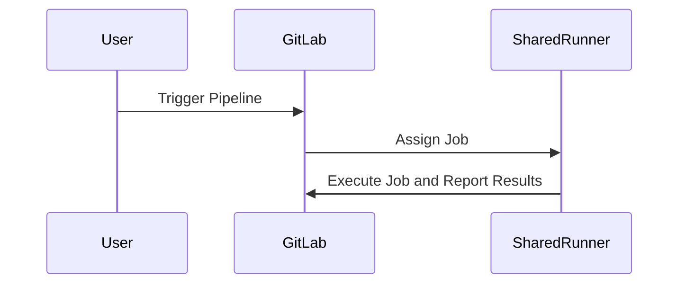
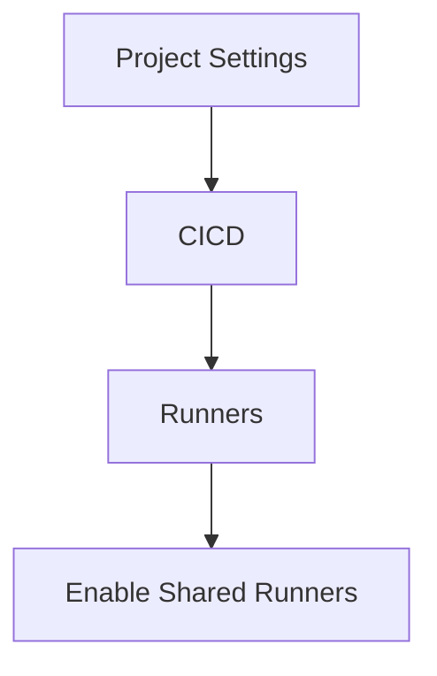

## Introduction to Continuous Delivery (CD) Pipelines

Continuous Delivery (CD) is an essential practice in modern software development, enabling teams to release high-quality software frequently and reliably. A CD pipeline automates the process of building, testing, and deploying applications. This automation ensures consistency, reduces human error, and allows teams to focus on innovation rather than repetitive tasks.

### Shared Runners in GitLab

In GitLab, shared runners are pre-configured machines managed by GitLab itself. These runners are available to all GitLab users and can be used to execute pipeline jobs. The key advantage of shared runners is their ease of use; they require minimal setup and can handle a variety of tasks.

#### What Are Shared Runners?

Shared runners are virtual machines provided by GitLab that can execute pipeline jobs. These runners are available to all GitLab users and are managed by GitLab. They come in different operating systems such as Windows and Linux, allowing flexibility in job execution.

#### Why Use Shared Runners?

- **Ease of Use**: Shared runners are ready to use out-of-the-box, requiring no additional setup.
- **Flexibility**: They support various operating systems and can handle different types of jobs.
- **Scalability**: GitLab manages the scaling of shared runners based on demand.

#### How Do Shared Runners Work?

When a pipeline is triggered, GitLab selects an appropriate shared runner based on the job requirements. The selected runner then executes the job and reports the results back to GitLab.



### Configuration of Shared Runners

To use shared runners, you need to configure your project settings in GitLab. Navigate to the CICD settings and ensure that shared runners are enabled.



### Limitations of Shared Runners

While shared runners offer convenience, they come with several limitations:

- **Security Concerns**: Since shared runners are public servers, they are accessible to all GitLab users. This means your jobs could potentially be executed alongside those of other users, introducing security risks.
- **Limited Control**: You have no direct control over the shared runners. GitLab manages them, and you cannot customize the environment or infrastructure.
- **Resource Constraints**: Shared runners may face resource constraints during peak usage times, leading to delays in job execution.

### Real-World Example: Security Breach

A notable example of the security risks associated with shared runners occurred in 2021 when a malicious actor exploited a shared runner to steal sensitive information from multiple projects. This incident highlighted the importance of having control over the environment where your jobs are executed.

### Configuring Self-Managed GitLab Runners

To overcome the limitations of shared runners, many organizations opt to use self-managed GitLab runners. Self-managed runners provide greater control over the environment and enhance security.

#### What Are Self-Managed Runners?

Self-managed runners are virtual machines or containers that you set up and manage yourself. These runners can be configured to meet specific requirements and are isolated from other users.

#### Why Use Self-Managed Runners?

- **Control Over Environment**: You can customize the environment to suit your needs.
- **Enhanced Security**: Your runners are isolated from other users, reducing the risk of security breaches.
- **Customization**: You can tailor the runners to specific tasks, ensuring optimal performance.

#### How to Set Up Self-Managed Runners

Setting up self-managed runners involves several steps:

1. **Install GitLab Runner**: Install the GitLab Runner software on your server or container.
2. **Register the Runner**: Register the runner with your GitLab instance.
3. **Configure the Runner**: Customize the runner to meet your requirements.

### Step-by-Step Guide to Setting Up Self-Managed Runners

#### Step 1: Install GitLab Runner

First, install the GitLab Runner software on your server or container. The installation process varies depending on your operating system.

For Linux:

```bash
curl -L https://packages.gitlab.com/install/repositories/runner/gitlab-runner/script.deb.sh | sudo bash
sudo apt-get install gitlab-runner
```

For Windows:

Download the installer from the GitLab website and follow the installation instructions.

#### Step 2: Register the Runner

Once installed, register the runner with your GitLab instance. This process involves providing the URL of your GitLab instance and a registration token.

```bash
gitlab-runner register --url https://gitlab.example.com --registration-token <token>
```

#### Step 3: Configure the Runner

After registering, configure the runner to meet your specific requirements. This includes setting up executors, specifying tags, and configuring environment variables.

```yaml
concurrent = 1
check_interval = 0

[[runners]]
  name = "My Self-Managed Runner"
  url = "https://gitlab.example.com/"
  token = "<token>"
  executor = "docker"
  [runners.custom_build_dir]
  [runners.cache]
    [runners.cache.s3]
    [runners.cache.gcs]
    [runners.cache.azure]
  [runners.docker]
    tls_verify = false
    image = "ruby:2.7"
    privileged = false
    disable_entrypoint_overwrite = false
    oom_kill_disable = false
    disable_cache = false
    volumes = ["/cache"]
    shm_size = 0
```

### Example of a Full Pipeline Configuration

Here is an example of a `.gitlab-ci.yml` file that uses a self-managed runner:

```yaml
stages:
  - build
  - test
  - deploy

build_job:
  stage: build
  script:
    - echo "Building the application..."
  tags:
    - my-self-managed-runner

test_job:
  stage: test
  script:
    - echo "Running tests..."
  tags:
    - my-self-managed-runner

deploy_job:
  stage: deploy
  script:
    - echo "Deploying the application..."
  tags:
    - my-self-managed-runner
```

### Common Pitfalls and Best Practices

#### Common Pitfalls

- **Incorrect Configuration**: Ensure that the runner is correctly configured to avoid issues with job execution.
- **Security Vulnerabilities**: Regularly update the runner software and apply security patches.
- **Resource Management**: Monitor the resources used by the runners to avoid overloading the system.

#### Best Practices

- **Regular Updates**: Keep the runner software up-to-date to benefit from the latest features and security improvements.
- **Isolation**: Isolate the runners to prevent unauthorized access and reduce the risk of security breaches.
- **Monitoring**: Implement monitoring tools to track the performance and health of the runners.

### How to Prevent / Defend Against Security Risks

#### Detection

- **Logging and Monitoring**: Enable logging and monitoring to detect any suspicious activity.
- **Security Tools**: Use security tools like intrusion detection systems (IDS) to identify potential threats.

#### Prevention

- **Secure Configuration**: Follow secure configuration guidelines to minimize vulnerabilities.
- **Access Controls**: Implement strict access controls to limit who can access the runners.

#### Secure Coding Fixes

Compare the vulnerable configuration with the secure configuration:

**Vulnerable Configuration:**

```yaml
stages:
  - build
  - test
  - deploy

build_job:
  stage: build
  script:
    - echo "Building the application..."
  tags:
    - shared-runner

test_job:
  stage: test
  script:
    - echo "Running tests..."
  tags:
    - shared-runner

deploy_job:
  stage: deploy
  script:
    - echo "Deploying the application..."
  tags:
    - shared-runner
```

**Secure Configuration:**

```yaml
stages:
  - build
  - test
  - deploy

build_job:
  stage: build
  script:
    - echo "Building the application..."
  tags:
    - my-self-managed-runner

test_job:
  stage: test
  script:
    - echo "Running tests..."
  tags:
    - my-self-managed-runner

deploy_job:
  stage: deploy
  script:
    - echo "Deploying the application..."
  tags:
    - my-self-managed-runner
```

### Conclusion

Using self-managed GitLab runners provides greater control and enhanced security compared to shared runners. By following the steps outlined in this chapter, you can set up and configure self-managed runners to meet your specific requirements. Remember to regularly update and monitor your runners to ensure optimal performance and security.

### Hands-On Practice Labs

For hands-on practice, consider the following labs:

- **PortSwigger Web Security Academy**: Offers practical exercises to understand and implement secure CD pipelines.
- **OWASP Juice Shop**: Provides a vulnerable web application to practice securing CD pipelines.
- **DVWA (Damn Vulnerable Web Application)**: Another excellent resource for practicing secure CD pipeline configurations.

By completing these labs, you can gain practical experience in setting up and managing self-managed GitLab runners.

---
<!-- nav -->
[[DevSecOps/DevSecOps Bootcamp/07-CI CD Security Pipeline/02-Build a CD Pipeline/Configure Self Managed GitLab Runner for Pipeline Jobs/00-Overview|Overview]] | [[DevSecOps/DevSecOps Bootcamp/07-CI CD Security Pipeline/02-Build a CD Pipeline/Configure Self Managed GitLab Runner for Pipeline Jobs/02-Introduction to GitLab Runner|Introduction to GitLab Runner]]
