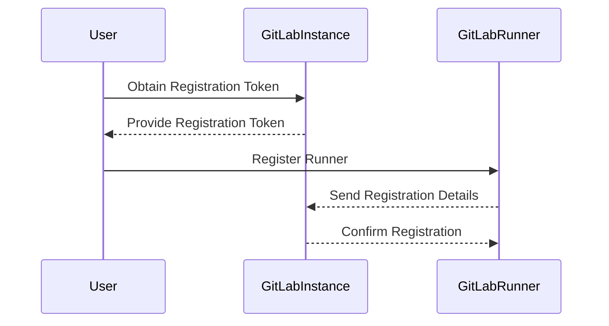

## Introduction to GitLab Runner

GitLab Runner is a tool that allows you to run your CI/CD pipelines. It is an open-source application that can be installed on various operating systems, including Linux, Windows, and macOS. The primary function of GitLab Runner is to execute jobs defined in your `.gitlab-ci.yml` file. These jobs can range from simple tasks like compiling code to more complex operations such as deploying applications to production environments.

### Why Use GitLab Runner?

Using GitLab Runner provides several benefits:

1. **Flexibility**: You can configure runners to run on different environments, allowing you to test your application in various scenarios.
2. **Scalability**: You can scale your runners based on the number of jobs you need to run, ensuring that your pipeline remains efficient.
3. **Security**: By using self-managed runners, you can control the environment in which your jobs are executed, reducing the risk of unauthorized access.

### Installing GitLab Runner

To install GitLab Runner, you first need to download the installation script. This script will handle the installation process for you, making it easier to set up the runner on your system.

#### Step-by-Step Installation

1. **Download the Installation Script**:
   The first step is to download the installation script. This script is available on the GitLab website and can be downloaded using the following command:

   ```bash
   curl -L https://packages.gitlab.com/install/repositories/runner/gitlab-runner/script.deb.sh | sudo bash
   ```

   This command downloads the script and runs it using `sudo`, which ensures that the script has the necessary permissions to install the runner.

2. **Install the GitLab Runner Package**:
   Once the script is downloaded, you can install the GitLab Runner package using the following command:

   ```bash
   sudo apt-get install gitlab-runner
   ```

   This command installs the GitLab Runner package on your system. After the installation is complete, the runner will be ready to use.

### Registering the GitLab Runner

After installing the GitLab Runner, the next step is to register it with your GitLab instance. This process involves providing the URL of your GitLab instance and a registration token.

#### Step-by-Step Registration

1. **Obtain the Registration Token**:
   To register the runner, you need a registration token. This token is specific to your GitLab instance and can be found in the settings of your project. Navigate to the project settings and locate the "CI/CD" section. Under the "Runners" tab, you will find the registration token.

2. **Register the Runner**:
   Once you have the registration token, you can register the runner using the following command:

   ```bash
   sudo gitlab-runner register
   ```

   This command will prompt you to enter the URL of your GitLab instance and the registration token. After entering these details, the runner will be registered with your GitLab instance.

### Example of a Complete Registration Process

Let's walk through a complete example of registering a GitLab Runner with a self-managed GitLab instance.

#### Environment Setup

Assume you have a Linux server where you want to install and register the GitLab Runner. The server is running Ubuntu 20.04 LTS.

#### Download and Install GitLab Runner

First, download and install the GitLab Runner package:

```bash
curl -L https://packages.gitlab.com/install/repositories/runner/gitlab-runner/script.deb.sh | sudo bash
sudo apt-get install gitlab-runner
```

#### Register the Runner

Next, register the runner with your GitLab instance:

```bash
sudo gitlab-runner register
```

You will be prompted to enter the following details:

- **URL**: The URL of your GitLab instance (e.g., `https://gitlab.example.com`)
- **Registration Token**: The registration token obtained from your project settings
- **Description**: A description for the runner (e.g., `Linux Runner`)
- **Tags**: Tags to identify the runner (e.g., `linux`)

Here is a sample interaction:

```bash
Running in system mode.

Please enter the gitlab-ci coordinator URL (e.g. https://gitlab.example.com/ci):
https://gitlab.example.com/ci
Please enter the gitlab-ci token for this runner:
<registration-token>
Please enter the gitlab-ci description for this runner:
Linux Runner
Please enter the gitlab-ci tags for this runner (comma separated):
linux
Whether to restrict this runner to the current project? [yes/no]:
no
Runner registered successfully. Feel free to start it, but if it's running already the config should be automatically reloaded!
```

### Mermaid Diagram: GitLab Runner Registration Flow

A visual representation of the registration process can help understand the flow better.



### Common Pitfalls and How to Avoid Them

When setting up and registering a GitLab Runner, there are several common pitfalls to watch out for:

1. **Incorrect URL**: Ensure that the URL you provide is correct and accessible from the runner.
2. **Expired Token**: Make sure the registration token is valid and has not expired.
3. **Network Issues**: Verify that the runner can communicate with the GitLab instance over the network.

### How to Prevent / Defend

To ensure the security and reliability of your GitLab Runner setup, follow these best practices:

1. **Secure Network Configuration**:
   - Ensure that the runner can only communicate with the GitLab instance over a secure connection (HTTPS).
   - Use firewalls and network policies to restrict access to the runner.

2. **Regular Updates**:
   - Keep the GitLab Runner software up to date to ensure you have the latest security patches and features.

3. **Monitoring and Logging**:
   - Enable monitoring and logging to track the activity of the runner and detect any suspicious behavior.

### Secure Code Fix Example

Here is an example of a vulnerable configuration and its secure counterpart:

#### Vulnerable Configuration

```yaml
stages:
  - build
  - test
  - deploy

build_job:
  stage: build
  script:
    - echo "Building..."
  only:
    - master

test_job:
  stage: test
  script:
    - echo "Testing..."
  only:
    - master

deploy_job:
  stage: deploy
  script:
    - echo "Deploying..."
  only:
    - master
```

#### Secure Configuration

```yaml
stages:
  - build
  - test
  - deploy

build_job:
  stage: build
  script:
    - echo "Building..."
  only:
    - master
  allow_failure: false

test_job:
  stage: test
  script:
    - echo "Testing..."
  only:
    - master
  allow_failure: false

deploy_job:
  stage: deploy
  script:
    - echo "Deploying..."
  only:
    - master
  allow_failure: false
```

In the secure configuration, we added `allow_failure: false` to ensure that the pipeline fails if any job fails, preventing partial deployments.

### Real-World Examples

Recent breaches and vulnerabilities related to CI/CD pipelines include:

- **CVE-2021-22205**: A vulnerability in GitLab allowed attackers to bypass authentication and gain unauthorized access to the GitLab instance.
- **CVE-2021-22206**: Another vulnerability in GitLab allowed attackers to execute arbitrary code on the server.

These vulnerabilities highlight the importance of keeping your GitLab instance and runners up to date and securing your network configurations.

### Practice Labs

For hands-on practice with configuring GitLab Runners, consider the following labs:

- **PortSwigger Web Security Academy**: Offers a comprehensive course on web security, including sections on CI/CD pipelines.
- **OWASP Juice Shop**: A deliberately insecure web application for practicing web security skills.
- **DVWA (Damn Vulnerable Web Application)**: A PHP/MySQL web application that demonstrates web application security weaknesses.

These labs provide practical experience in setting up and securing GitLab Runners in a controlled environment.

### Conclusion

Setting up and registering a GitLab Runner is a crucial step in building a robust CI/CD pipeline. By following the steps outlined in this chapter, you can ensure that your runner is installed correctly and securely registered with your GitLab instance. Remember to monitor and maintain your runner to keep your pipeline secure and reliable.

---
<!-- nav -->
[[DevSecOps/DevSecOps Bootcamp/07-CI CD Security Pipeline/02-Build a CD Pipeline/Configure Self Managed GitLab Runner for Pipeline Jobs/01-Introduction to Continuous Delivery (CD) Pipelines|Introduction to Continuous Delivery (CD) Pipelines]] | [[DevSecOps/DevSecOps Bootcamp/07-CI CD Security Pipeline/02-Build a CD Pipeline/Configure Self Managed GitLab Runner for Pipeline Jobs/00-Overview|Overview]] | [[DevSecOps/DevSecOps Bootcamp/07-CI CD Security Pipeline/02-Build a CD Pipeline/Configure Self Managed GitLab Runner for Pipeline Jobs/03-Introduction to GitLab Runners|Introduction to GitLab Runners]]
