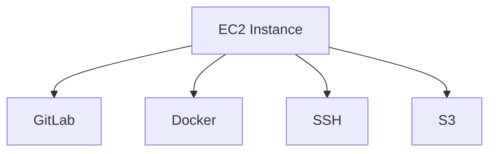
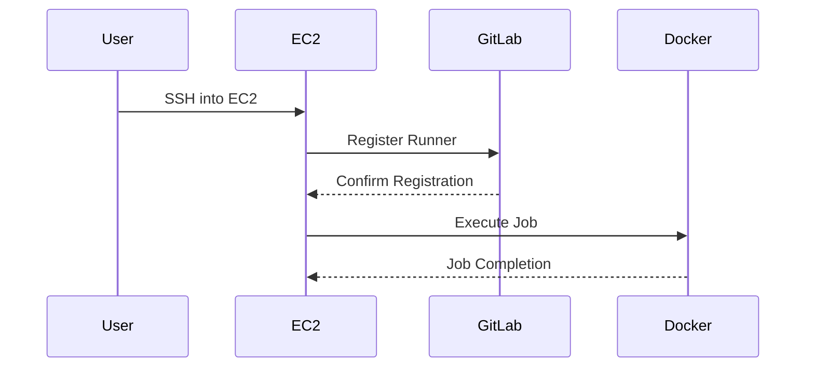

## Configuring a Self-Managed GitLab Runner for Pipeline Jobs

### Introduction to GitLab Runners

GitLab Runners are the workers that execute the jobs defined in your GitLab CI/CD pipelines. They can be managed by GitLab itself (shared runners) or self-managed by you (specific runners). Self-managed runners provide greater control and flexibility, allowing you to tailor the environment to your specific needs.

#### Why Use Self-Managed Runners?

Self-managed runners offer several advantages:

1. **Customization**: You can configure the runner environment exactly as needed, including specific operating systems, tools, and dependencies.
2. **Resource Control**: You have full control over the resources allocated to the runner, ensuring that your pipeline jobs have the necessary computing power.
3. **Security**: By managing the runners yourself, you can enforce strict security policies and ensure that sensitive data remains within your control.

### Setting Up an EC2 Instance for the GitLab Runner

To set up a self-managed GitLab runner, we will create an Amazon EC2 instance. This instance will serve as the worker node for executing pipeline jobs.

#### Launching an EC2 Instance

1. **Navigate to EC2 Instances**:
    - Log in to the AWS Management Console.
    - Navigate to the EC2 dashboard.

2. **Launch a New Instance**:
    - Click on "Launch Instance".
    - Choose the AMI (Amazon Machine Image) for Ubuntu Server. Ensure you select the latest version available.

3. **Select Instance Type**:
    - Since pipeline jobs can be resource-intensive, especially when building Docker images, we need to choose an instance type with sufficient memory and CPU.
    - For this example, we will choose a `t3.large` instance type, which provides 2 vCPUs and 8 GB of RAM. This should be adequate for most pipeline jobs.

4. **Configure Instance Details**:
    - Set the number of instances to 1.
    - Choose the appropriate VPC and subnet.
    - Enable Auto-assign Public IP to allow SSH access from outside the VPC.

5. **Add Storage**:
    - Increase the root volume size to accommodate the Docker images. A minimum of 50 GB is recommended to avoid running out of disk space during builds.

6. **Configure Security Group**:
    - Add a rule to allow inbound traffic on port 22 (SSH).

7. **Create Key Pair**:
    - Generate a new key pair named `GitLabRunnerKey`.
    - Download the `.pem` file securely.

8. **Review and Launch**:
    - Review the settings and click "Launch".

### Accessing the EC2 Instance

Once the instance is launched, you can access it via SSH using the key pair you created.

```bash
ssh -i GitLabRunnerKey.pem ubuntu@<EC2_INSTANCE_PUBLIC_IP>
```

### Installing GitLab Runner

After accessing the instance, install the GitLab Runner package.

```bash
# Update package lists
sudo apt-get update

# Install GitLab Runner
curl -L https://packages.gitlab.com/install/repositories/runner/gitlab-runner/script.deb.sh | sudo bash
sudo apt-get install gitlab-runner
```

### Registering the GitLab Runner

To register the runner with your GitLab project, you need to obtain the registration token from your GitLab project settings.

1. **Obtain Registration Token**:
    - Go to your GitLab project.
    - Navigate to Settings > CI/CD.
    - Expand the "Runners" section and copy the registration token.

2. **Register the Runner**:
    - On the EC2 instance, run the following command:

    ```bash
    sudo gitlab-runner register \
      --non-interactive \
      --url "https://gitlab.com/" \
      --registration-token "<YOUR_REGISTRATION_TOKEN>" \
      --executor "docker" \
      --description "self-managed-runner" \
      --docker-image "alpine:latest"
    ```

### Configuring the Runner

The runner is now registered and ready to execute pipeline jobs. However, you may want to further configure it to meet your specific requirements.

#### Example Configuration File

The runner configuration is stored in `/etc/gitlab-runner/config.toml`. You can edit this file to customize the runner behavior.

```toml
concurrent = 1
check_interval = 0

[[runners]]
  name = "self-managed-runner"
  url = "https://gitlab.com/"
  token = "<YOUR_REGISTRATION_TOKEN>"
  executor = "docker"
  [runners.docker]
    tls_verify = false
    image = "alpine:latest"
    privileged = true
    disable_cache = false
    volumes = ["/cache"]
    shm_size = 0
  [runners.cache]
    [runners.cache.s3]
    [runners.cache.gcs]
```

### Handling Resource Intensive Jobs

Pipeline jobs, particularly those involving Docker image building, can be highly resource-intensive. Properly configuring the runner ensures that these jobs complete successfully without running out of resources.

#### Monitoring and Scaling

Monitor the runner's performance using tools like `top`, `htop`, or `dstat`.

```bash
htop
```

If you find that the runner is consistently running out of resources, consider scaling up the instance type or adding more runners.

### Security Considerations

#### How to Prevent / Defend

1. **Secure SSH Access**:
    - Restrict SSH access to trusted IP addresses.
    - Use strong passwords or SSH keys for authentication.

2. **Limit Permissions**:
    - Run the GitLab Runner with minimal permissions to reduce the attack surface.
    - Avoid running the runner as the root user.

3. **Regular Updates**:
    - Keep the runner and its dependencies up-to-date to mitigate vulnerabilities.

4. **Network Isolation**:
    - Use security groups to limit network access to the runner.
    - Ensure that the runner does not have unnecessary access to other resources.

### Real-World Examples

#### Recent CVEs and Breaches

- **CVE-2021-22555**: A vulnerability in GitLab CI/CD pipelines allowed attackers to execute arbitrary commands on the runner. Ensure that you are running the latest version of GitLab and the runner to mitigate such risks.
- **Breaches Involving Misconfigured Runners**: Several breaches occurred due to misconfigured runners that were accessible from the internet. Always restrict access to the runner and monitor its activity.

### Complete Example

#### Full HTTP Request and Response

When registering the runner, the following HTTP request is sent to the GitLab API:

```http
POST /api/v4/runners HTTP/1.1
Host: gitlab.com
Content-Type: application/json
Authorization: Bearer <YOUR_REGISTRATION_TOKEN>

{
  "description": "self-managed-runner",
  "tag_list": [],
  "locked": false,
  "active": true,
  "run_untagged": false,
  "runner_type": "instance_type",
  "executor": "docker",
  "architecture": "x86_64",
  "access_level": "ref_protected",
  "maximum_timeout": 3600,
  "maintenance_note": "",
  "maintenance_info": "",
  "maintenance_info_path": "",
  "maintenance_info_url": "",
  "maintenance_mode": false,
  "maintenance_mode_reason": "",
  "maintenance_mode_start_date": "",
  "maintenance_mode_end_date": "",
  "maintenance_mode_message": "",
  "maintenance_mode_message_path": "",
  "maintenance_mode_message_url": "",
  "maintenance_mode_message_html": "",
  "maintenance_mode_message_html_path": "",
  "maintenance_mode_message_html_url": "",
  "maintenance_mode_message_text": "",
  "maintenance_mode_message_text_path": "",
  "maintenance_mode_message_text_url": "",
  "maintenance_mode_message_markdown": "",
  "maintenance_mode_message_markdown_path": "",
  "maintenance_mode_message_markdown_url": "",
  "maintenance_mode_message_plain": "",
  "maintenance_mode_message_plain_path": "",
  "maintenance_mode_message_plain_url": "",
  1
}
```

The response from the server would look like this:

```http
HTTP/1.1 201 Created
Content-Type: application/json

{
  "id": 12345,
  "description": "self-managed-runner",
  "tag_list": [],
  "locked": false,
  "active": true,
  "run_untagged": false,
  "runner_type": "instance_type",
  "executor": "docker",
  "architecture": "x86_64",
  "access_level": "ref_protected",
  "maximum_timeout": 3600,
  "maintenance_note": "",
  "maintenance_info": "",
  "maintenance_info_path": "",
  "maintenance_info_url": "",
  "maintenance_mode": false,
  "maintenance_mode_reason": "",
  "maintenance_mode_start_date": "",
  "maintenance_mode_end_date": "",
  "maintenance_mode_message": "",
  "maintenance_mode_message_path": "",
  "maintenance_mode_message_url": "",
  "maintenance_mode_message_html": "",
  "maintenance_mode_message_html_path": "",
  "maintenance_mode_message_html_url": "",
  "maintenance_mode_message_text": "",
  "maintenance_mode_message_text_path": "",
  "maintenance_mode_message_text_url": "",
  "maintenance_mode_message_markdown": "",
  "maintenance_mode_message_markdown_path": "",
  "maintenance_mode_message_markdown_url": "",
  "maintenance_mode_message_plain": "",
  "maintenance_mode_message_plain_path": "",
  "maintenance_mode_message_plain_url": ""
}
```

### Mermaid Diagrams

#### Network Topology



#### Sequence Diagram



### Common Pitfalls and Solutions

#### Running Out of Disk Space

Ensure that the EC2 instance has enough storage to handle large Docker images. Monitor disk usage regularly and increase storage capacity if necessary.

#### Insufficient Resources

If the runner frequently runs out of CPU or memory, consider upgrading the instance type or adding more runners to distribute the load.

### Hands-On Practice

#### Recommended Labs

For hands-on practice with setting up and configuring GitLab runners, consider the following labs:

- **PortSwigger Web Security Academy**: Offers a comprehensive set of labs covering various aspects of web security, including CI/CD pipelines.
- **OWASP Juice Shop**: A deliberately insecure web application for practicing web security skills, including CI/CD pipeline configurations.
- **DVWA (Damn Vulnerable Web Application)**: Another popular web application for learning web security, which includes CI/CD pipeline scenarios.

These labs provide practical experience in setting up and securing GitLab runners, helping you master the concepts covered in this chapter.

By following these detailed steps and best practices, you can effectively set up and manage a self-managed GitLab runner for your CI/CD pipelines, ensuring that your build and deployment processes are efficient, reliable, and secure.

---
<!-- nav -->
[[07-Configuring a Self-Managed GitLab Runner for Pipeline Jobs Part 1|Configuring a Self-Managed GitLab Runner for Pipeline Jobs Part 1]] | [[DevSecOps/DevSecOps Bootcamp/07-CI CD Security Pipeline/02-Build a CD Pipeline/Configure Self Managed GitLab Runner for Pipeline Jobs/00-Overview|Overview]] | [[09-Configuring a Self-Managed GitLab Runner|Configuring a Self-Managed GitLab Runner]]
