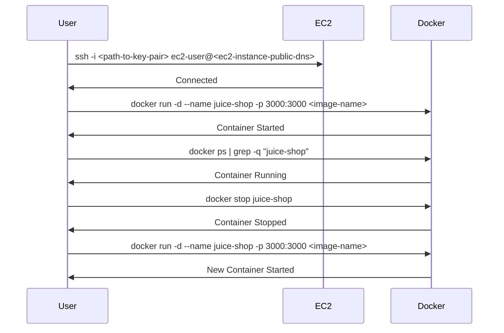

## Introduction to Continuous Delivery (CD) Pipelines

Continuous Delivery (CD) is a practice in software development where teams ensure that their software can be reliably released to production at any time. This involves automating the build, test, and deployment processes to ensure that the software is always in a releasable state. In this chapter, we will focus on deploying an application to an EC2 server using a release pipeline. Specifically, we will cover the steps involved in setting up a Docker container to run our application and how to manage the lifecycle of these containers during subsequent deployments.

### Background Theory

Before diving into the specifics, it’s important to understand the underlying concepts:

- **Docker**: Docker is a platform that allows developers to package applications into containers, which are lightweight, portable, and self-sufficient units of software. Containers encapsulate the application and its dependencies, ensuring consistency across different environments.
  
- **EC2 (Elastic Compute Cloud)**: Amazon EC2 is a web service that provides resizable compute capacity in the cloud. It allows users to launch virtual servers, called instances, and run applications on them.

- **Continuous Delivery Pipeline**: A CD pipeline automates the process of building, testing, and deploying software. It ensures that the software can be deployed to production at any time with minimal manual intervention.

### Setting Up the Deployment Pipeline

To deploy an application to an EC2 server using a release pipeline, we need to perform several steps:

1. **Connect to the EC2 Instance**: Establish a connection to the EC2 instance where the application will be deployed.
2. **Run the Docker Container**: Use Docker to run the application container.
3. **Manage Container Lifecycle**: Ensure that the container is properly managed during subsequent deployments.

#### Step 1: Connect to the EC2 Instance

To connect to the EC2 instance, you typically use SSH (Secure Shell). Here’s an example of how to connect to an EC2 instance:

```sh
ssh -i <path-to-key-pair> ec2-user@<ec2-instance-public-dns>
```

- `<path-to-key-pair>`: Path to the key pair used to authenticate the SSH connection.
- `ec2-user`: The default user for connecting to the EC2 instance.
- `<ec2-instance-public-dns>`: The public DNS name of the EC2 instance.

#### Step 2: Run the Docker Container

Once connected to the EC2 instance, we can run the Docker container. The command to run the Docker container is as follows:

```sh
docker run -d --name juice-shop -p 3000:3000 <image-name>
```

- `-d`: Run the container in detached mode (in the background).
- `--name juice-shop`: Assign a name to the container (`juice-shop`).
- `-p 3000:3000`: Map port 3000 of the container to port 3000 of the host.
- `<image-name>`: The name of the Docker image to be used.

### Explanation of the Command

- **Port Mapping**: The `-p 3000:3000` flag maps port 3000 of the container to port 3000 of the host. This allows external access to the application running inside the container.
  
- **Container Naming**: The `--name juice-shop` flag assigns a name to the container. This is useful for managing the container lifecycle.

### Handling Subsequent Deployments

When deploying the application for the first time, the container will start successfully. However, on subsequent deployments, there might already be a container running with the same name. This can lead to errors if we try to run the container again without stopping the existing one.

#### Stopping the Existing Container

To handle this scenario, we need to stop the existing container before starting a new one. The command to stop a container is as follows:

```sh
docker stop juice-shop
```

This command stops the container named `juice-shop`.

### Complete Example

Here is a complete example of the deployment process:

```sh
# Check if the container is already running
if docker ps | grep -q "juice-shop"; then
    echo "Stopping existing container..."
    docker stop juice-shop
fi

# Run the new container
echo "Starting new container..."
docker run -d --name juice-shop -p 3000:3000 <image-name>
```

### Diagram: Deployment Process



### Common Pitfalls and How to Avoid Them

#### Pitfall 1: Port Conflicts

If the port 3000 is already in use by another process, the Docker container will fail to start. To avoid this, ensure that the port is not being used by another process.

**Detection**: Use the following command to check if the port is in use:

```sh
netstat -tuln | grep 3000
```

**Prevention**: Ensure that no other process is using the port before starting the Docker container.

#### Pitfall 2: Incorrect Container Name

Using an incorrect container name can lead to issues when trying to stop or manage the container. Always double-check the container name.

**Detection**: Use the following command to list all running containers:

```sh
docker ps
```

**Prevention**: Always use consistent naming conventions for your containers.

### Secure Coding Practices

#### Vulnerability: Unsecured SSH Access

Unsecured SSH access can allow unauthorized users to gain access to the EC2 instance. This can lead to unauthorized deployments and potential data breaches.

**Vulnerable Code**:

```sh
ssh -i <path-to-key-pair> ec2-user@<ec2-instance-public-dns>
```

**Secure Code**:

- **Use Strong Key Pairs**: Ensure that the key pairs used for SSH access are strong and securely stored.
- **Limit SSH Access**: Restrict SSH access to specific IP addresses or ranges.
- **Enable Two-Factor Authentication (2FA)**: Enable 2FA for SSH access to add an additional layer of security.

**Example Configuration**:

```sh
Match User ec2-user
    PasswordAuthentication no
    PubkeyAuthentication yes
    AllowUsers ec2-user
    ForceCommand internal-sftp
```

### Real-World Examples

#### CVE-2021-20225: Docker Daemon Remote Code Execution

In 2021, a critical vulnerability was discovered in Docker, allowing remote code execution through the Docker daemon. This vulnerability could be exploited to gain unauthorized access to the system.

**Impact**: Unauthorized access to the system, leading to potential data breaches and unauthorized deployments.

**Mitigation**: Ensure that Docker is updated to the latest version and apply security patches regularly.

### Hands-On Labs

For hands-on practice, consider the following labs:

- **PortSwigger Web Security Academy**: Offers a variety of labs to practice web security concepts, including deployment pipelines.
- **OWASP Juice Shop**: A deliberately insecure web application for security training purposes. It includes a deployment pipeline setup.
- **DVWA (Damn Vulnerable Web Application)**: Another popular web application for security training, which can be used to practice deployment pipelines.

### Conclusion

Deploying an application to an EC2 server using a release pipeline involves several steps, including connecting to the EC2 instance, running the Docker container, and managing the container lifecycle. By following the steps outlined in this chapter and adhering to secure coding practices, you can ensure that your deployment process is reliable and secure.

---
<!-- nav -->
[[02-Introduction to Continuous Delivery (CD) Pipelines Part 2|Introduction to Continuous Delivery (CD) Pipelines Part 2]] | [[DevSecOps/DevSecOps Bootcamp/07-CI CD Security Pipeline/02-Build a CD Pipeline/Deploy Application to EC2 Server with Release Pipeline/00-Overview|Overview]] | [[04-Introduction to Continuous Delivery (CD) Pipelines Part 4|Introduction to Continuous Delivery (CD) Pipelines Part 4]]
