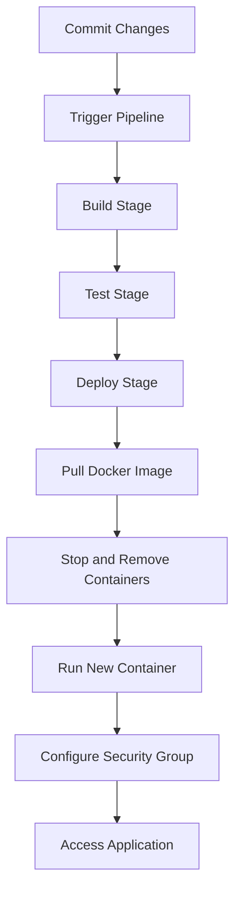

## Introduction to Continuous Delivery (CD) Pipelines

Continuous Delivery (CD) is a software engineering approach that aims to deliver high-quality software in a reliable, repeatable manner. In this context, we will focus on building a CD pipeline to deploy an application to an Amazon EC2 server using a release pipeline. This process involves several stages, including building, testing, and deploying the application. We will delve into each of these steps, explaining the underlying concepts, their importance, and how they work under the hood.

### Prerequisites

Before diving into the details, ensure you have the following prerequisites:

1. **AWS Account**: You need an active AWS account to create and manage EC2 instances.
2. **Docker**: Familiarity with Docker is essential, as we will be using Docker images to deploy our application.
3. **CI/CD Tool**: A CI/CD tool such as Jenkins, GitLab CI, or CircleCI to manage the pipeline.
4. **Application Code**: The source code of the application you want to deploy.

### Overview of the Deployment Process

The deployment process involves several key steps:

1. **Committing Changes**: Commit the changes to your version control system.
2. **Pipeline Execution**: Trigger the pipeline to execute the deployment job.
3. **Deployment Stages**: Execute the deployment stages, including pulling the Docker image, stopping and removing existing containers, and running the new container.
4. **Accessing the Application**: Ensure the application is accessible via a web browser.

Let's break down each of these steps in detail.

### Committing Changes

When you make changes to your application, you need to commit these changes to your version control system. This ensures that the latest version of your code is available for the pipeline to pick up and deploy.

#### Example Commit Command

```bash
git add .
git commit -m "Add new features and fix bugs"
git push origin main
```

### Pipeline Execution

Once the changes are committed, the CI/CD tool triggers the pipeline to execute the deployment job. This involves several stages, which we will discuss in detail.

#### Example Pipeline Configuration

Here is an example of a pipeline configuration using GitLab CI:

```yaml
stages:
  - build
  - test
  - deploy

build_job:
  stage: build
  script:
    - docker build -t myapp .

test_job:
  stage: test
  script:
    - docker run myapp pytest

deploy_job:
  stage: deploy
  script:
    - ssh -i ~/.ssh/id_rsa ec2-user@ec2-instance-ip
    - docker pull myapp
    - docker stop juice-shop || true
    - docker rm juice-shop || true
    - docker run -d --name juice-shop -p 3000:3000 myapp
```

### Deployment Stages

The deployment stages involve several steps, including pulling the Docker image, stopping and removing existing containers, and running the new container.

#### Pulling the Docker Image

The first step is to pull the Docker image from the registry. This ensures that the latest version of the application is deployed.

```bash
docker pull myapp
```

#### Stopping and Removing Existing Containers

Before running the new container, you need to stop and remove any existing containers. This ensures that the new container runs without conflicts.

```bash
docker stop juice-shop || true
docker rm juice-shop || true
```

The `|| true` part ensures that the command does not fail if the container does not exist.

#### Running the New Container

Finally, you need to run the new container. This involves specifying the necessary parameters, such as the container name and port mapping.

```bash
docker run -d --name juice-shop -p 3000:3000 myapp
```

### Accessing the Application

To ensure the application is accessible, you need to configure the security group on the EC2 instance to allow traffic on the required port.

#### Configuring Security Group

1. **Open the EC2 Dashboard**: Navigate to the EC2 dashboard in the AWS Management Console.
2. **Select the Instance**: Select the instance where your application is running.
3. **Edit the Security Group**: Click on the security group associated with the instance.
4. **Add a Rule**: Add a rule to allow traffic on port 3000.



### Checking the Logs

To verify that the deployment was successful, you can check the logs of the deployment process. This includes the build logs, test logs, and deployment logs.

#### Example Log Output

```bash
# Before Script Part
+ docker pull myapp
myapp: Pulling from myrepo
Digest: sha256:abc123...
Status: Downloaded newer image for myapp:latest

# Stop and Remove Containers
+ docker stop juice-shop || true
juice-shop
+ docker rm juice-shop || true
juice-shop

# Run New Container
+ docker run -d --name juice-shop -p 3000:3000 myapp
sha256:abc123...
```

### Accessing the Application

To access the application, you need to open port 3000 on the security group and then access the application via a web browser.

#### Example Access Command

```bash
curl http://ec2-instance-ip:3000
```

### Real-World Examples

Recent breaches and vulnerabilities often highlight the importance of proper deployment practices. For example, the Equifax breach in 2017 was partly due to a failure to patch a known vulnerability in Apache Struts. This underscores the importance of ensuring that your deployment pipeline is robust and secure.

### How to Prevent / Defend

#### Detection

To detect issues in your deployment pipeline, you can use tools such as:

- **Logging and Monitoring**: Tools like ELK Stack (Elasticsearch, Logstash, Kibana) can help you monitor and analyze logs.
- **Security Scanning**: Tools like Trivy or Clair can scan your Docker images for known vulnerabilities.

#### Prevention

To prevent issues in your deployment pipeline, you can implement the following best practices:

- **Automated Testing**: Ensure that automated tests are run before deploying the application.
- **Immutable Infrastructure**: Use immutable infrastructure to ensure that your servers are consistent and reproducible.
- **Least Privilege**: Ensure that your deployment scripts run with the least privilege necessary.

#### Secure Coding Fixes

Here is an example of a vulnerable and secure version of a deployment script:

**Vulnerable Version**

```bash
#!/bin/bash
docker pull myapp
docker stop juice-shop
docker rm juice-shop
docker run -d --name juice-shop -p 3000:3000 myapp
```

**Secure Version**

```bash
#!/bin/bash
set -e
docker pull myapp
docker stop juice-shop || true
docker rm juice-shop || true
docker run -d --name juice-shop -p 3000:3000 myapp
```

### Hands-On Labs

For hands-on practice, you can use the following labs:

- **PortSwigger Web Security Academy**: Offers a variety of labs to practice web security.
- **OWASP Juice Shop**: A deliberately insecure web application to practice security testing.
- **DVWA (Damn Vulnerable Web Application)**: Another web application to practice security testing.

### Conclusion

Building a CD pipeline to deploy an application to an EC2 server involves several stages, including committing changes, triggering the pipeline, and configuring the security group. By following best practices and implementing secure coding techniques, you can ensure that your deployment process is robust and secure.

---
<!-- nav -->
[[03-Introduction to Continuous Delivery (CD) Pipelines Part 3|Introduction to Continuous Delivery (CD) Pipelines Part 3]] | [[DevSecOps/DevSecOps Bootcamp/07-CI CD Security Pipeline/02-Build a CD Pipeline/Deploy Application to EC2 Server with Release Pipeline/00-Overview|Overview]] | [[05-Introduction to Continuous Delivery (CD) Pipelines Part 5|Introduction to Continuous Delivery (CD) Pipelines Part 5]]
