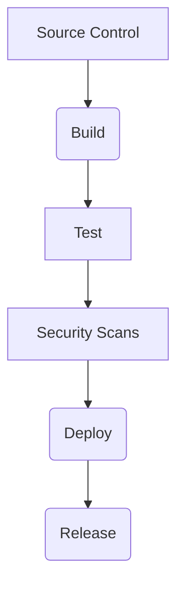

## Introduction to Continuous Delivery (CD) Pipelines

Continuous Delivery (CD) is an extension of Continuous Integration (CI) that automates the release process. In a CD pipeline, once the code passes all the automated tests and security scans, it is automatically deployed to a staging environment and then to production. This ensures that the software can be released to production at any time with minimal manual intervention.

### Background Theory

The primary goal of a CD pipeline is to reduce the time between committing a change and releasing it to production. This is achieved through automation of the build, test, and deployment processes. A typical CD pipeline consists of several stages:

1. **Source Control**: Code is stored in a version control system such as Git.
2. **Build**: The code is compiled and packaged into a deployable artifact.
3. **Test**: Automated tests are run to ensure the code works as expected.
4. **Security Scans**: Static and dynamic analysis tools check for vulnerabilities.
5. **Deploy**: The artifact is deployed to a staging environment.
6. **Release**: The artifact is deployed to production.

### Real-World Example: OWASP Juice Shop

The OWASP Juice Shop is a deliberately insecure web application used for security training. Let’s consider how a CD pipeline might be set up for this application.

#### Setting Up the Environment

To deploy the OWASP Juice Shop to an EC2 instance, we first need to create an EC2 instance and obtain its public IP address. Here’s how you can do it using the AWS Management Console or the AWS CLI:

```bash
aws ec2 run-instances --image-id ami-0c94855ba95c71c99 --count 1 --instance-type t2.micro --key-name my-key-pair --security-group-ids sg-0123456789abcdef0 --subnet-id subnet-0123456789abcdef0
```

This command creates a new EC2 instance with the specified parameters. Once the instance is created, you can find its public IP address in the EC2 console or via the following command:

```bash
aws ec2 describe-instances --instance-ids i-0123456789abcdef0 --query 'Reservations[*].Instances[*].PublicIpAddress'
```

### Building the CD Pipeline

Now that we have the EC2 instance, let’s set up the CD pipeline. We’ll use Jenkins as our CI/CD tool, but similar setups can be done with other tools like GitLab CI, CircleCI, or Travis CI.

#### Step 1: Source Control

First, we need to store the code in a version control system. For this example, we’ll use GitHub.

#### Step 2: Build

Next, we need to build the Docker image for the OWASP Juice Shop. This can be done using a Dockerfile:

```Dockerfile
# Dockerfile
FROM node:14-alpine
WORKDIR /app
COPY package*.json ./
RUN npm install
COPY . .
EXPOSE 3000
CMD ["npm", "start"]
```

We can build the Docker image using the following command:

```bash
docker build -t owasp-juice-shop .
```

#### Step 3: Test

Automated tests can be run using a testing framework like Jest or Mocha. Here’s an example of a simple test suite:

```javascript
// test.js
const assert = require('assert');

describe('Juice Shop', function() {
  it('should start correctly', function() {
    // Mocked assertion
    assert.strictEqual(true, true);
  });
});
```

We can run these tests using the following command:

```bash
npm test
```

#### Step 4: Security Scans

Static and dynamic analysis tools can be used to scan for vulnerabilities. For example, we can use Trivy to perform static analysis:

```bash
trivy image owasp-juice-shop
```

#### Step 5: Deploy

Once the code passes all the tests and security scans, it can be deployed to the EC2 instance. This can be done using a deployment script:

```bash
#!/bin/bash

# SSH into the EC2 instance
ssh -i my-key-pair.pem ec2-user@<public-ip-address> << EOF
  # Stop any existing container
  docker stop juice-shop || true
  docker rm juice-shop || true

  # Pull the latest Docker image
  docker pull owasp-juice-shop

  # Run the Docker container
  docker run -d --name juice-shop -p 3000:3000 owasp-juice-shop
EOF
```

#### Step 6: Release

Finally, we can release the application to production by updating the DNS records or configuring a load balancer.

### Mermaid Diagrams

Here’s a mermaid diagram illustrating the CD pipeline:



### Common Pitfalls and How to Prevent Them

#### Pitfall 1: Manual Interventions

**Problem:** Manual interventions can introduce errors and delays.

**Solution:** Automate as much of the pipeline as possible. Use tools like Jenkins, GitLab CI, or CircleCI to automate the build, test, and deployment processes.

#### Pitfall 2: Lack of Security Scans

**Problem:** Without security scans, vulnerabilities may go undetected.

**Solution:** Integrate security scanning tools into the pipeline. Use tools like Trivy, SonarQube, or OWASP ZAP to perform static and dynamic analysis.

#### Pitfall 3: Inconsistent Environments

**Problem:** Differences between development, staging, and production environments can cause issues.

**Solution:** Use containerization and infrastructure as code (IaC) tools like Docker and Terraform to ensure consistency across environments.

### Real-World Example: Recent CVEs and Breaches

#### Example 1: CVE-2021-44228 (Log4j)

In December 2021, a critical vulnerability was discovered in the Apache Log4j library, which allowed attackers to execute arbitrary code. This vulnerability affected many applications, including those deployed via CD pipelines.

**Impact:** Many organizations were forced to patch their applications quickly to mitigate the risk.

**Prevention:** Ensure that all dependencies are regularly updated and scanned for vulnerabilities. Use tools like Snyk or WhiteSource to monitor dependencies for known vulnerabilities.

### Secure Coding Practices

#### Vulnerable Code Example

```javascript
// Vulnerable code
const express = require('express');
const app = express();

app.get('/', (req, res) => {
  const username = req.query.username;
  res.send(`Hello, ${username}`);
});

app.listen(3000, () => {
  console.log('Server started on port 3000');
});
```

#### Secure Code Example

```javascript
// Secure code
const express = require('express');
const app = express();
const { escape } = require('html-escaper');

app.get('/', (req, res) => {
  const username = req.query.username;
  res.send(`Hello, ${escape(username)}`);
});

app.listen(3000, () => {
  console.log('Server started on port 3000');
});
```

### Hands-On Labs

For hands-on practice, consider the following labs:

- **PortSwigger Web Security Academy**: Offers interactive labs for learning web security concepts.
- **OWASP Juice Shop**: A deliberately insecure web application for security training.
- **DVWA (Damn Vulnerable Web Application)**: Another intentionally insecure web application for security training.

### Conclusion

A well-designed CD pipeline ensures that your application can be released to production at any time with minimal manual intervention. By automating the build, test, and deployment processes, you can reduce the time between committing a change and releasing it to production. Additionally, integrating security scans into the pipeline helps ensure that your application is free from vulnerabilities.

---
<!-- nav -->
[[04-Introduction to Continuous Delivery (CD) Pipelines Part 4|Introduction to Continuous Delivery (CD) Pipelines Part 4]] | [[DevSecOps/DevSecOps Bootcamp/07-CI CD Security Pipeline/02-Build a CD Pipeline/Deploy Application to EC2 Server with Release Pipeline/00-Overview|Overview]] | [[06-Introduction to Continuous Delivery (CD) Pipelines|Introduction to Continuous Delivery (CD) Pipelines]]
