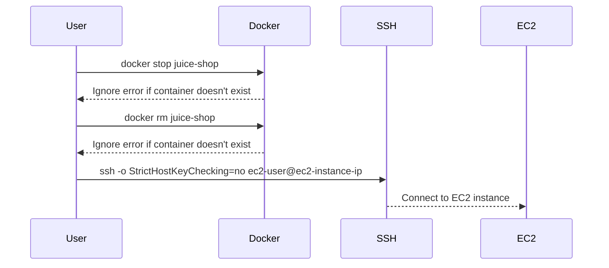

## Deploy Application to EC2 Server with Release Pipeline

In this section, we will delve into the process of deploying an application to an EC2 server using a release pipeline. Specifically, we will focus on stopping and removing a Docker container named `juice-shop` and setting up SSH commands to ensure smooth automation.

### Stopping and Removing Docker Containers

When working with Docker containers, it's often necessary to stop and remove existing containers before starting new ones. This ensures that your environment is clean and consistent. Let's break down the steps involved in stopping and removing a Docker container named `juice-shop`.

#### Step 1: Stop the Container

The first step is to stop the container if it exists. We can achieve this using the `docker stop` command. However, if the container does not exist, this command will fail and produce an error message. To handle this gracefully, we can use shell scripting techniques to ignore the error if the container does not exist.

```bash
docker stop juice-shop || true
```

Here, the `|| true` construct ensures that the command continues even if the `docker stop` command fails due to the absence of the container.

#### Step 2: Remove the Container

After stopping the container, we need to remove it to free up the name for a new container. This is done using the `docker rm` command. Similar to the previous step, we need to handle the case where the container does not exist.

```bash
docker rm juice-shop || true
```

Again, the `|| true` construct ensures that the command continues even if the `docker rm` command fails due to the absence of the container.

### Setting Up SSH Commands

When automating deployments via SSH, it's crucial to handle non-interactive scenarios where user confirmation is not possible. One common issue is the strict host key checking mechanism in SSH, which prompts users to confirm the host key fingerprint during the first connection.

To automate this process, we need to disable strict host key checking. This can be done by adding specific options to the SSH command.

#### Disabling Strict Host Key Checking

We can disable strict host key checking by using the `-o` option followed by `StrictHostKeyChecking=no`. This tells SSH to automatically accept the host key without prompting for confirmation.

```bash
ssh -o StrictHostKeyChecking=no user@remote-server
```

This command will connect to the remote server without requiring user confirmation for the host key.

### Full Example

Let's put everything together in a complete example. Suppose we have a script that stops and removes the `juice-shop` container, then connects to an EC2 server via SSH to deploy the application.

```bash
#!/bin/bash

# Stop the container if it exists
docker stop juice-shop || true

# Remove the container if it exists
docker rm juice-shop || true

# Connect to the EC2 server via SSH
ssh -o StrictHostKeyChecking=no ec2-user@ec2-instance-ip
```

### Diagramming the Process

Let's visualize the process using a Mermaid diagram:



### Real-World Examples and Security Implications

#### Real-World Example: CVE-2021-21315

CVE-2021-21315 is a critical vulnerability in the Jenkins CI/CD system that allows attackers to execute arbitrary code. This vulnerability highlights the importance of securing your deployment pipelines and ensuring that automated processes are robust and secure.

#### Security Implications

Disabling strict host key checking can pose security risks if not handled carefully. An attacker could potentially intercept the SSH connection and perform a man-in-the-middle attack. Therefore, it's essential to implement additional security measures such as:

- **Using SSH keys**: Ensure that SSH connections are authenticated using public-private key pairs instead of passwords.
- **Monitoring and logging**: Implement monitoring and logging to detect any unauthorized access attempts.
- **Network segmentation**: Segregate your network to limit the exposure of sensitive systems.

### How to Prevent / Defend

#### Vulnerable Pattern

```bash
ssh user@remote-server
```

#### Secure Pattern

```bash
ssh -i ~/.ssh/id_rsa -o StrictHostKeyChecking=no user@remote-server
```

In the secure pattern, we use an SSH key for authentication and disable strict host key checking. This ensures that the connection is both automated and secure.

### Complete Example with SSH Configuration

Let's provide a complete example including SSH configuration:

```yaml
# .ssh/config
Host ec2-instance
    HostName ec2-instance-ip
    User ec2-user
    IdentityFile ~/.ssh/id_rsa
    StrictHostKeyChecking no
```

With this configuration, you can simply use:

```bash
ssh ec2-instance
```

### Conclusion

Deploying applications to EC2 servers using a release pipeline involves several steps, including stopping and removing Docker containers and setting up SSH commands. By handling errors gracefully and disabling strict host key checking, you can ensure smooth automation. Always implement additional security measures to protect your deployment pipeline.

### Practice Labs

For hands-on practice, consider the following labs:

- **PortSwigger Web Security Academy**: Focuses on web application security and includes exercises related to deployment and automation.
- **OWASP Juice Shop**: A deliberately insecure web application for security training. It includes scenarios for deploying and managing Docker containers.
- **DVWA (Damn Vulnerable Web Application)**: Another popular web application for security training, which can be used to practice deployment and automation techniques.

These labs provide practical experience in deploying applications and managing Docker containers in a secure manner.

---
<!-- nav -->
[[07-Introduction to SSH Agent and Key Management|Introduction to SSH Agent and Key Management]] | [[DevSecOps/DevSecOps Bootcamp/07-CI CD Security Pipeline/02-Build a CD Pipeline/Deploy Application to EC2 Server with Release Pipeline/00-Overview|Overview]] | [[09-Setting Up an SSH Connection for Deployment|Setting Up an SSH Connection for Deployment]]
