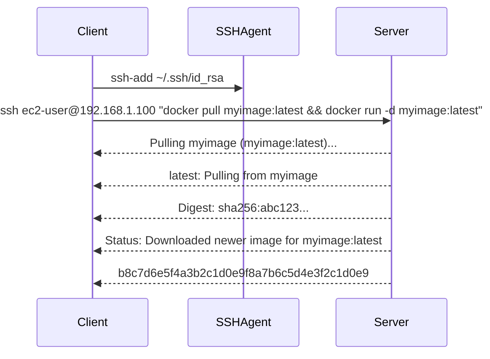

## Setting Up an SSH Connection for Deployment

In the context of DevSecOps, setting up a Continuous Delivery (CD) pipeline often involves deploying applications to remote servers. One common method for doing this is through SSH (Secure Shell), which allows secure communication between a client and a server. This section will cover the steps involved in setting up an SSH connection for deployment, including securing the SSH folder and executing commands on a remote server.

### Securing the SSH Folder

The SSH folder, typically located at `~/.ssh`, contains sensitive information such as private keys used for authentication. It is crucial to restrict permissions on this folder to ensure that unauthorized users cannot access these sensitive files.

#### Setting Permissions

To restrict permissions, we set the folder's permissions to `700`. This means:

- **Owner**: Has full read, write, and execute permissions (`rwx`).
- **Group**: Has no permissions (`---`).
- **Others**: Have no permissions (`---`).

This can be done using the `chmod` command:

```bash
chmod 700 ~/.ssh
```

#### Why This Matters

Restricting permissions ensures that only the owner of the SSH folder can access the files within it. This prevents unauthorized users from accessing sensitive information like private keys, which could be used to gain unauthorized access to remote servers.

### Adding SSH Key to SSH Agent

Before connecting to the remote server, we need to add the private key to the SSH agent. This allows us to authenticate without having to provide the private key with every command.

#### Adding the Private Key

We use the `ssh-add` command to add the private key to the SSH agent:

```bash
ssh-add ~/.ssh/id_rsa
```

#### Why This Matters

Adding the private key to the SSH agent simplifies the process of connecting to the remote server. Instead of providing the private key with every command, the SSH agent handles the authentication process, making it more convenient and secure.

### Executing Commands on the Remote Server

Once the SSH connection is established, we can execute commands on the remote server. This is particularly useful for tasks like pulling and running Docker images.

#### SSH Command Syntax

The basic syntax for executing commands on a remote server via SSH is:

```bash
ssh <username>@<server_ip> "<command>"
```

For example, to pull a Docker image and run it on a remote server, we would use:

```bash
ssh ec2-user@192.168.1.100 "docker pull myimage:latest && docker run -d myimage:latest"
```

#### Breaking Down the Command

- **SSH**: Establishes a secure connection to the remote server.
- **Username**: Specifies the user account on the remote server.
- **Server IP**: Specifies the IP address of the remote server.
- **Command**: Specifies the command(s) to be executed on the remote server.

### Full Example: Pulling and Running a Docker Image

Let's walk through a complete example of pulling and running a Docker image on a remote server using SSH.

#### Step 1: Set Up SSH Connection

First, ensure that the SSH folder permissions are correctly set:

```bash
chmod 700 ~/.ssh
```

Then, add the private key to the SSH agent:

```bash
ssh-add ~/.ssh/id_rsa
```

#### Step 2: Execute Commands on the Remote Server

Now, we can execute the commands to pull and run the Docker image:

```bash
ssh ec2-user@192.168.1.100 "docker pull myimage:latest && docker run -d myimage:latest"
```

#### Full Raw HTTP Message

While SSH does not use HTTP, the equivalent interaction would involve establishing a secure connection and sending commands over the SSH protocol. Here’s a conceptual representation:

```plaintext
SSH Request:
ssh ec2-user@192.168.1.100 "docker pull myimage:latest && docker run -d myimage:latest"

SSH Response:
Pulling myimage (myimage:latest)...
latest: Pulling from myimage
Digest: sha256:abc123...
Status: Downloaded newer image for myimage:latest
b8c7d6e5f4a3b2c1d0e9f8a7b6c5d4e3f2c1d0e9
```

### Diagram: SSH Connection Flow

A mermaid diagram can help visualize the flow of the SSH connection and command execution:



### Pitfalls and Common Mistakes

#### Incorrect Permissions

Failing to set the correct permissions on the SSH folder can lead to unauthorized access. Always ensure that the permissions are set to `700`.

#### Missing SSH Key

If the private key is not added to the SSH agent, you will need to provide it with every command, which can be cumbersome and less secure.

#### Incorrect Command Syntax

Incorrectly formatting the SSH command can result in errors. Ensure that the command is properly quoted and formatted.

### How to Prevent / Defend

#### Detection

Regularly audit SSH logs to detect unauthorized access attempts. Tools like `fail2ban` can automatically block IP addresses that exhibit suspicious behavior.

#### Prevention

- **Use Strong Passwords**: Ensure that SSH passwords are strong and complex.
- **Enable Two-Factor Authentication (2FA)**: Implement 2FA to add an extra layer of security.
- **Limit SSH Access**: Restrict SSH access to trusted IP addresses using firewall rules.

#### Secure Coding Fixes

Here’s a comparison of a vulnerable and a secure approach to setting up SSH:

**Vulnerable Code:**

```bash
chmod 777 ~/.ssh
ssh-add ~/.ssh/id_rsa
ssh ec2-user@192.168.1.100 "docker pull myimage:latest && docker run -d myimage:latest"
```

**Secure Code:**

```bash
chmod 700 ~/.ssh
ssh-add ~/.ssh/id_rsa
ssh ec2-user@192.168.1.100 "docker pull myimage:latest && docker run -d myimage:latest"
```

### Real-World Examples

#### Recent Breaches

One notable breach involving SSH was the 2021 incident where attackers exploited weak SSH credentials to gain unauthorized access to systems. Ensuring proper SSH setup and security measures can prevent such incidents.

#### CVEs

CVE-2021-21972 highlighted vulnerabilities in SSH implementations that could allow attackers to bypass authentication mechanisms. Regularly updating SSH software and following best practices can mitigate such risks.

### Hands-On Labs

For practical experience, consider the following labs:

- **PortSwigger Web Security Academy**: Offers modules on SSH and secure coding practices.
- **OWASP Juice Shop**: Provides scenarios for practicing secure SSH configurations.
- **DVWA (Damn Vulnerable Web Application)**: Includes exercises for securing SSH connections.

By following these detailed steps and best practices, you can effectively set up and secure an SSH connection for deploying applications in a CD pipeline.

---
<!-- nav -->
[[08-Deploy Application to EC2 Server with Release Pipeline|Deploy Application to EC2 Server with Release Pipeline]] | [[DevSecOps/DevSecOps Bootcamp/07-CI CD Security Pipeline/02-Build a CD Pipeline/Deploy Application to EC2 Server with Release Pipeline/00-Overview|Overview]] | [[10-Setting Up the Deployment Job|Setting Up the Deployment Job]]
