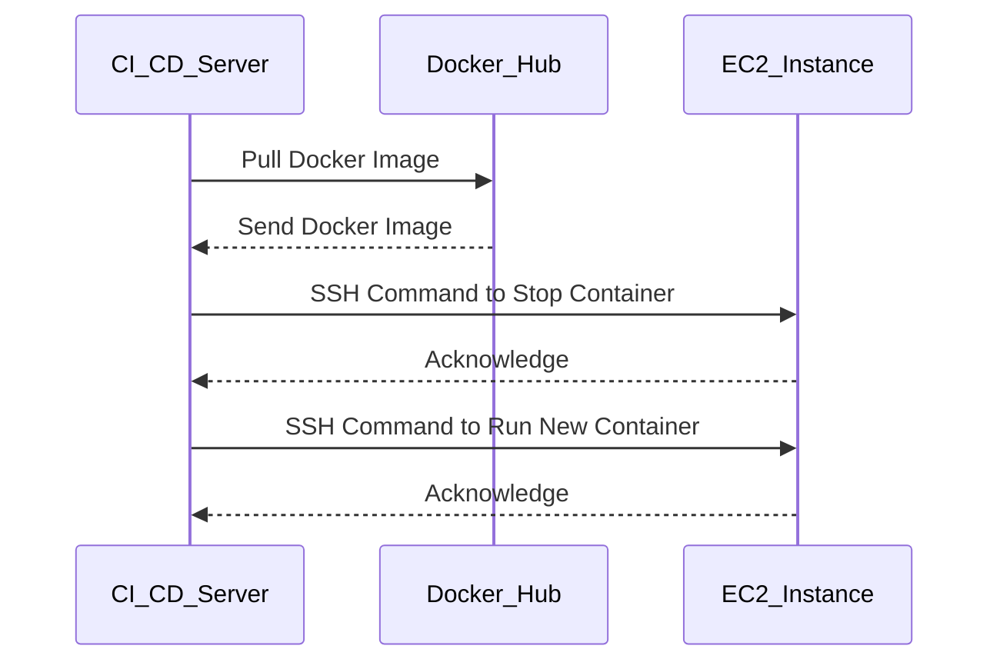

## Setting Up the Deployment Job

Next, we need to set up a deployment job that will run on a CI/CD server (e.g., Jenkins, GitLab CI, CircleCI).

### Example Deployment Job Configuration

Here is an example of a deployment job configuration using GitLab CI:

```yaml
deploy:
  stage: deploy
  script:
    - docker pull username/my-app-image
    - ssh -i /path/to/private/key user@ec2-instance-ip "docker rm -f my-app || true"
    - ssh -i /path/to/private/key user@ec2-instance-ip "docker run -d --name my-app -p 8080:8080 username/my-app-image"
  only:
    - master
```

### Explanation of the Deployment Job Configuration

- **stage: deploy**: Specifies that this job belongs to the `deploy` stage.
- **script**: Contains the commands to be executed during the deployment.
  - `docker pull username/my-app-image`: Pulls the Docker image from the registry.
  - `ssh -i /path/to/private/key user@ec2-instance-ip "docker rm -f my-app || true"`: Connects to the EC2 instance via SSH and stops and removes the existing container if it exists.
  - `ssh -i /path/to/private/key user@ec2-instance-ip "docker run -d --name my-app -p 8080:8080 username/my-app-image"`: Runs the new Docker container on the EC2 instance.
- **only: master**: Specifies that this job should only run when changes are pushed to the `master` branch.

### Full Raw HTTP Request and Response

For completeness, let's consider the HTTP request and response involved in pulling the Docker image from the registry:

#### HTTP Request

```http
GET /v2/username/my-app-image/manifests/latest HTTP/1.1
Host: registry.hub.docker.com
Authorization: Bearer <token>
Accept: application/vnd.docker.distribution.manifest.v2+json
```

#### HTTP Response

```http
HTTP/1.1 200 OK
Content-Type: application/vnd.docker.distribution.manifest.v2+json
Docker-Content-Digest: sha256:<digest>
{
  "schemaVersion": 2,
  "mediaType": "application/vnd.docker.distribution.manifest.v2+json",
  "config": {
    "mediaType": "application/vnd.docker.container.image.v1+json",
    "size": 1234,
    "digest": "sha256:<config-digest>"
  },
  "layers": [
    {
      "mediaType": "application/vnd.docker.image.rootfs.diff.tar.gz",
      "size": 5678,
      "digest": "sha256:<layer-digest>"
    }
  ]
}
```

### Sequence Diagram for Deployment Process



### Common Pitfalls and How to Avoid Them

1. **Incorrect SSH Key Path**: Ensure the path to the private SSH key is correct.
2. **Firewall Rules**: Make sure the EC2 instance's security group allows incoming connections on the required port.
3. **Docker Image Not Found**: Verify the Docker image name and tag are correct and the image is available in the registry.

### How to Prevent / Defend

1. **Secure SSH Keys**: Store SSH keys securely and limit their permissions.
2. **Use IAM Roles**: Instead of using SSH keys, consider using IAM roles for EC2 instances.
3. **Regularly Update Dependencies**: Keep Docker images and dependencies up-to-date to avoid vulnerabilities.

### Real-World Examples

Consider the recent CVE-2021-25741, which affected Docker and allowed unauthorized access to the Docker daemon. Ensuring that Docker images are built securely and that SSH keys are managed properly can help mitigate such risks.

### Practice Labs

For hands-on practice, consider the following labs:

- **PortSwigger Web Security Academy**: Offers exercises on securing web applications.
- **OWASP Juice Shop**: A deliberately insecure web application for practicing security skills.
- **CloudGoat**: Provides scenarios for practicing cloud security on AWS.

By following these steps and best practices, you can effectively set up and manage a CD pipeline for deploying applications to EC2 instances.

---
<!-- nav -->
[[09-Setting Up an SSH Connection for Deployment|Setting Up an SSH Connection for Deployment]] | [[DevSecOps/DevSecOps Bootcamp/07-CI CD Security Pipeline/02-Build a CD Pipeline/Deploy Application to EC2 Server with Release Pipeline/00-Overview|Overview]] | [[11-Setting Up the Docker Image|Setting Up the Docker Image]]
