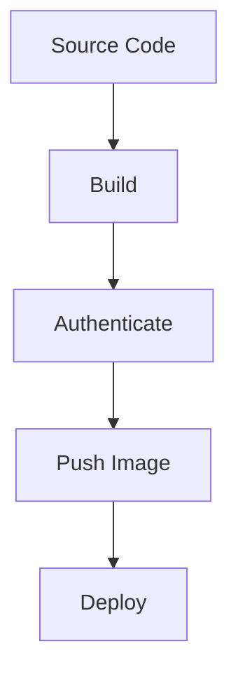

## Introduction to Continuous Delivery (CD) Pipelines with AWS ECR

Continuous Delivery (CD) is an essential practice in modern software development, ensuring that code changes can be reliably released to production at any time. One of the key components in a CD pipeline is the management of container images using Amazon Elastic Container Registry (ECR). This chapter will delve into integrating a CD pipeline with AWS ECR, covering the necessary steps, commands, and configurations to ensure secure and efficient deployment processes.

### Background Theory

Before diving into the specifics of integrating a CD pipeline with AWS ECR, it’s important to understand the underlying concepts:

#### What is Continuous Delivery (CD)?

Continuous Delivery (CD) is a software engineering approach in which teams produce software in short cycles, ensuring that the software can be reliably released to production at any time. It involves automating the build, test, and deployment processes to minimize manual intervention and reduce the risk of errors.

#### What is Amazon Elastic Container Registry (ECR)?

Amazon Elastic Container Registry (ECR) is a fully-managed Docker container registry that makes it easy for developers to store, manage, and deploy Docker container images. ECR integrates with Amazon ECS, AWS Fargate, and Amazon EKS, providing a seamless experience for deploying containerized applications.

### Key Concepts

#### Docker Login Command

The `docker login` command is used to authenticate with a Docker registry. In the context of AWS ECR, this command is crucial for pushing and pulling Docker images from the registry.

```bash
docker login -u AWS -p $(aws ecr get-login-password --region <region>) https://<account-id>.dkr.ecr.<region>.amazonaws.com
```

- **-u AWS**: Specifies the username as `AWS`.
- **-p $(aws ecr get-login-password --region <region>)**: Retrieves the temporary authentication token from AWS ECR.
- **https://<account-id>.dkr.ecr.<region>.amazonaws.com**: URL of the ECR registry.

#### AWS CLI Installation

To interact with AWS services, including ECR, you need to install the AWS Command Line Interface (CLI). The AWS CLI provides a unified way to manage various AWS services from the command line.

### Step-by-Step Integration

#### Step 1: Install AWS CLI

Before using the AWS CLI commands, you need to install the AWS CLI. The installation process varies depending on your operating system. Below is an example for a Docker image using Alpine Linux:

```bash
apk add --no-cache python3 py3-pip
pip install awscli
```

- **apk add --no-cache python3 py3-pip**: Installs Python and pip using the Alpine package manager.
- **pip install awscli**: Installs the AWS CLI using pip.

#### Step 2: Configure AWS CLI

After installing the AWS CLI, you need to configure it with your AWS credentials. This can be done using the `aws configure` command:

```bash
aws configure
```

This command prompts you to enter your AWS Access Key ID, Secret Access Key, default region, and output format.

#### Step 3: Retrieve Temporary Authentication Token

To authenticate with ECR, you need to retrieve a temporary authentication token using the `aws ecr get-login-password` command:

```bash
aws ecr get-login-password --region <region>
```

This command returns a temporary password that can be used to authenticate with the ECR registry.

#### Step 4: Docker Login

Use the retrieved password to log in to the ECR registry:

```bash
docker login -u AWS -p $(aws ecr get-login-password --region <region>) https://<account-id>.dkr.ec
```

#### Step 5: Push and Pull Docker Images

Once authenticated, you can push and pull Docker images from the ECR registry:

```bash
# Push an image
docker tag my-image:latest <account-id>.dkr.ecr.<region>.amazonaws.com/my-image:latest
docker push <account-id>.dkr.ecr.<region>.amazonaws.com/my-image:latest

# Pull an image
docker pull <account-id>.dkr.ecr.<region>.amazonaws.com/my-image:latest
```

### Real-World Examples

#### Recent CVEs and Breaches

One notable breach involving container registries was the compromise of Docker Hub in 2021. Attackers gained access to user accounts and pushed malicious images to repositories. This highlights the importance of securing your container registry and implementing robust authentication mechanisms.

### Complete Example

#### Full CD Pipeline Configuration

Below is a complete example of a CD pipeline configuration using Jenkins and AWS ECR:

```yaml
pipeline {
    agent any

    environment {
        AWS_ACCESS_KEY_ID = credentials('aws-access-key-id')
        AWS_SECRET_ACCESS_KEY = credentials('aws-secret-access-key')
        AWS_DEFAULT_REGION = 'us-east-1'
        ACCOUNT_ID = '123456789012'
        IMAGE_NAME = 'my-image'
        TAG = 'latest'
    }

    stages {
        stage('Build') {
            steps {
                sh 'docker build -t ${IMAGE_NAME}:${TAG} .'
            }
        }

        stage('Authenticate') {
            steps {
                sh 'apk add --no-cache python3 py3-pip && pip install awscli'
                sh 'aws configure set aws_access_key_id ${AWS_ACCESS_KEY_ID}'
                sh 'aws configure set aws_secret_access_key ${AWS_SECRET_ACCESS_KEY}'
                sh 'aws configure set default.region ${AWS_DEFAULT_REGION}'
                sh 'docker login -u AWS -p $(aws ecr get-login-password --region ${AWS_DEFAULT_REGION}) https://${ACCOUNT_ID}.dkr.ecr.${AWS_DEFAULT_REGION}.amazonaws.com'
            }
        }

        stage('Push Image') {
            steps {
                sh 'docker tag ${IMAGE_NAME}:${TAG} ${ACCOUNT_ID}.dkr.ecr.${AWS_DEFAULT_REGION}.amazonaws.com/${IMAGE_NAME}:${TAG}'
                sh 'docker push ${ACCOUNT_ID}.dkr.ecr.${AWS_DEFAULT_REGION}.amazonaws.com/${IMAGE_NAME}:${TAG}'
            }
        }
    }
}
```

### Mermaid Diagrams

#### CD Pipeline Architecture



### Pitfalls and Common Mistakes

#### Static Variables

Using static variables for sensitive information like passwords is a common mistake. Instead, use dynamic methods to retrieve temporary tokens as shown in the example above.

#### Insecure Storage of Credentials

Storing AWS credentials in plain text or hard-coded in scripts is insecure. Use secure methods like environment variables or secret management tools.

### How to Prevent / Defend

#### Detection

Regularly monitor your AWS account for unauthorized access attempts. Use AWS CloudTrail to log API calls and CloudWatch to set up alerts for suspicious activities.

#### Prevention

- **Use IAM Roles**: Assign least privilege IAM roles to your CD pipelines.
- **Enable MFA**: Enable Multi-Factor Authentication (MFA) for your AWS account.
- **Secure Secrets Management**: Use tools like AWS Secrets Manager or HashiCorp Vault to securely store and manage secrets.

#### Secure Coding Fixes

**Vulnerable Code**

```bash
docker login -u AWS -p my-static-password https://<account-id>.dkr.ecr.<region>.amazonaws.com
```

**Fixed Code**

```bash
docker login -u AWS -p $(aws ecr get-login-password --region <region>) https://<account-id>.dkr.ecr.<region>.amazonaws.com
```

### Conclusion

Integrating a CD pipeline with AWS ECR requires careful planning and execution to ensure security and efficiency. By following the steps outlined in this chapter, you can create a robust and secure CD pipeline that leverages the power of AWS ECR.

### Practice Labs

For hands-on practice, consider the following labs:

- **PortSwigger Web Security Academy**: Offers comprehensive training on web application security.
- **OWASP Juice Shop**: An intentionally vulnerable web application for practicing security skills.
- **CloudGoat**: A collection of vulnerable AWS environments for learning cloud security.

These labs provide practical experience in securing and managing CD pipelines with AWS ECR.

---
<!-- nav -->
[[DevSecOps/DevSecOps Bootcamp/07-CI CD Security Pipeline/02-Build a CD Pipeline/Integrate CICD Pipeline with AWS ECR/02-Introduction to AWS Elastic Container Registry (ECR)|Introduction to AWS Elastic Container Registry (ECR)]] | [[DevSecOps/DevSecOps Bootcamp/07-CI CD Security Pipeline/02-Build a CD Pipeline/Integrate CICD Pipeline with AWS ECR/00-Overview|Overview]] | [[04-Introduction to Continuous Delivery (CD) Pipelines with AWS ECR Part 2|Introduction to Continuous Delivery (CD) Pipelines with AWS ECR Part 2]]
