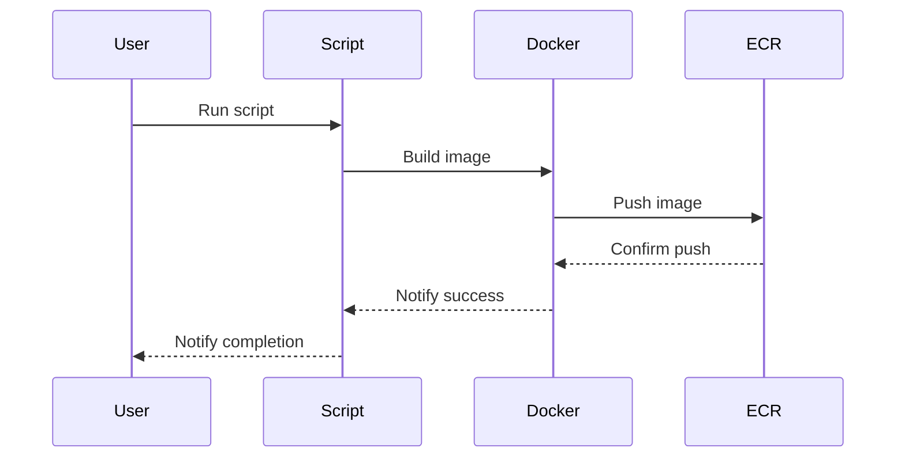

## Introduction to Continuous Delivery (CD) Pipelines with AWS ECR

Continuous Delivery (CD) is an essential practice in modern DevSecOps environments. It ensures that your application can be released to production at any time, with minimal manual intervention. One of the key components of a CD pipeline is the integration with container registries such as Amazon Elastic Container Registry (ECR). This chapter will delve into the details of integrating a CD pipeline with AWS ECR, explaining the necessary steps, configurations, and best practices.

### What is AWS ECR?

Amazon Elastic Container Registry (ECR) is a fully managed Docker container registry service provided by AWS. It allows you to store, manage, and deploy Docker container images. ECR integrates seamlessly with other AWS services, making it a popular choice for deploying containerized applications in the cloud.

#### Why Use AWS ECR?

- **Security**: ECR supports image scanning for vulnerabilities and provides encryption for data at rest.
- **Scalability**: ECR automatically scales to meet your storage and throughput requirements.
- **Integration**: ECR integrates well with other AWS services like ECS, EKS, and CodePipeline, enabling streamlined workflows.

### Key Concepts in AWS ECR

Before diving into the integration process, let's understand some key concepts related to AWS ECR:

- **Registry**: A registry is a collection of repositories. Each AWS account has a default registry.
- **Repository**: A repository is a collection of Docker images. Each repository can have multiple tags.
- **Image**: An image is a set of layers that form a container. Each image can have multiple tags.

### Setting Up Your CD Pipeline with AWS ECR

To integrate your CD pipeline with AWS ECR, you need to follow several steps. These include setting up environment variables, configuring Docker commands, and pushing images to the ECR repository.

#### Step 1: Set Up Environment Variables

AWS ECR requires certain environment variables to be set correctly. These variables include the AWS account ID, the default region, and the repository name.

```bash
export AWS_ACCOUNT_ID=123456789012
export AWS_DEFAULT_REGION=us-east-1
export ECR_REPOSITORY_NAME=juice-shop
```

These variables are crucial because they ensure that your Docker commands and other scripts interact with the correct ECR resources. Let's break down each variable:

- **AWS_ACCOUNT_ID**: This is the unique identifier for your AWS account. It is required to construct the full URI for the ECR repository.
- **AWS_DEFAULT_REGION**: This specifies the AWS region where your ECR repository is located. It is important for ensuring that your commands target the correct region.
- **ECR_REPOSITORY_NAME**: This is the name of the repository within your ECR registry. In this example, we are using `juice-shop`.

#### Step 2: Configure Docker Commands

When building and pushing Docker images, you need to use these environment variables to ensure that the commands reference the correct ECR repository.

```bash
docker build -t $AWS_ACCOUNT_ID.dkr.ecr.$AWS_DEFAULT_REGION.amazonaws.com/$ECR_REPOSITORY_NAME .
docker push $AWS_ACCOUNT_ID.dkr.ecr.$AWS_DEFAULT_REGION.amazonaws.com/$ECR_REPOSITORY_NAME
```

Here’s a breakdown of the commands:

- **docker build**: This command builds the Docker image. The `-t` flag sets the tag for the image. The tag includes the full URI for the ECR repository.
- **docker push**: This command pushes the built image to the specified ECR repository.

#### Step 3: Parameterize Values

To avoid hardcoding values, it is best to parameterize them using environment variables. This approach makes your scripts more flexible and easier to maintain.

```bash
IMAGE_URI="$AWS_ACCOUNT_ID.dkr.ecr.$AWS_DEFAULT_REGION.amazonaws.com/$ECR_REPOSITORY_NAME"
docker build -t $IMAGE_URI .
docker push $IMAGE_URI
```

By using the `IMAGE_URI` variable, you ensure that the commands are consistent and easy to update if any of the environment variables change.

### Full Example of a CD Pipeline Integration

Let's put everything together in a complete example. We'll create a script that sets up the environment variables, builds the Docker image, and pushes it to the ECR repository.

```bash
#!/bin/bash

# Set environment variables
export AWS_ACCOUNT_ID=123456789012
export AWS_DEFAULT_REGION=us-east-1
export ECR_REPOSITORY_NAME=juice-shop

# Construct the full URI for the ECR repository
IMAGE_URI="$AWS_ACCOUNT_ID.dkr.ecr.$AWS_DEFAULT_REGION.amazonaws.com/$ECR_REPOSITORY_NAME"

# Build the Docker image
docker build -t $IMAGE_URI .

# Push the Docker image to the ECR repository
docker push $IMAGE_URI
```

### HTTP Requests and Responses

When interacting with AWS ECR, you often need to perform operations via HTTP requests. Here’s an example of an HTTP request to describe the repositories in your ECR:

```http
GET /v2/repositories HTTP/1.1
Host: $AWS_ACCOUNT_ID.dkr.ecr.$AWS_DEFAULT_REGION.amazonaws.com
Authorization: Bearer <token>
```

The corresponding response might look like this:

```http
HTTP/1.1 200 OK
Content-Type: application/json

{
  "repositories": [
    {
      "name": "juice-shop",
      "uri": "$AWS_ACCOUNT_ID.dkr.ecr.$AWS_DEFAULT_REGION.amazonaws.com/juice-shop"
    }
  ]
}
```

### Mermaid Diagrams

To visualize the workflow, consider the following mermaid diagram:



### Common Pitfalls and How to Avoid Them

#### Hardcoding Values

One common pitfall is hardcoding values in your scripts. This can lead to errors if the values change or if you need to reuse the script in different environments.

**Secure Coding Fix:**

```bash
# Vulnerable code
docker build -t 123456789012.dkr.ecr.us-east-1.amazonaws.com/juice-shop .

# Secure code
export AWS_ACCOUNT_ID=123456789012
export AWS_DEFAULT_REGION=us-east-1
export ECR_REPOSITORY_NAME=juice-shop
IMAGE_URI="$AWS_ACCOUNT_ID.dkr.ecr.$AWS_DEFAULT_REGION.amazonaws.com/$ECR_REPOSITORY_NAME"
docker build -t $IMAGE_URI .
```

#### Incorrect Region

Another common issue is specifying the wrong region. This can cause your commands to fail or push images to the wrong location.

**Secure Coding Fix:**

```bash
# Vulnerable code
export AWS_DEFAULT_REGION=us-west-2

# Secure code
export AWS_DEFAULT_REGION=us-east-1
```

### Real-World Examples and CVEs

#### CVE-2021-44228 (Log4Shell)

While not directly related to AWS ECR, the Log4Shell vulnerability (CVE-2021-44228) highlights the importance of securing your entire infrastructure, including container registries. Ensure that all dependencies and libraries used in your Docker images are up-to-date and free from known vulnerabilities.

#### Recent Breaches

In 2022, a breach involving misconfigured AWS S3 buckets led to sensitive data exposure. While this was not directly related to ECR, it underscores the importance of proper configuration and access controls across all AWS services.

### How to Prevent / Defend

#### Detection

Regularly scan your ECR repositories for vulnerabilities using tools like AWS Image Scanning. This helps identify and mitigate potential security issues.

#### Prevention

- **Use IAM Policies**: Restrict access to ECR repositories using IAM policies.
- **Enable Encryption**: Enable encryption for data at rest in ECR.
- **Regular Audits**: Perform regular audits of your ECR repositories to ensure compliance with security policies.

#### Secure Coding Fixes

Compare the vulnerable and secure versions of the code:

```bash
# Vulnerable code
docker build -t 123456789012.dkr.ecr.us-east-1.amazonaws.com/juice-shop .

# Secure code
export AWS_ACCOUNT_ID=123456789012
export AWS_DEFAULT_REGION=us-east-1
export ECR_REPOSITORY_NAME=juice-shop
IMAGE_URI="$AWS_ACCOUNT_ID.dkr.ecr.$AWS_DEFAULT_REGION.amazonaws.com/$ECR_REPOSITORY_NAME"
docker build -t $IMAGE_URI .
```

### Configuration Hardening

Ensure that your ECR repositories are configured securely:

```json
{
  "registryId": "123456789012",
  "repositoryName": "juice-shop",
  "imageTagMutability": "MUTABLE",
  "imageScanningConfiguration": {
    "scanOnPush": true
  },
  "encryptionConfiguration": {
    "encryptionType": "KMS",
    "kmsKey": "arn:aws:kms:us-east-1:123456789012:key/abcd1234-abcd-1234-abcd-1234abcd1234"
  }
}
```

### Hands-On Labs

For practical experience, consider the following labs:

- **PortSwigger Web Security Academy**: Offers hands-on labs for web application security.
- **OWASP Juice Shop**: A deliberately insecure web application for security training.
- **CloudGoat**: Provides a series of labs to learn about AWS security best practices.

### Conclusion

Integrating a CD pipeline with AWS ECR is a critical step in modern DevSecOps environments. By following the steps outlined in this chapter, you can ensure that your pipeline is secure, scalable, and efficient. Remember to parameterize values, use IAM policies, and regularly audit your repositories to maintain a robust security posture.

---
<!-- nav -->
[[03-Introduction to Continuous Delivery (CD) Pipelines with AWS ECR Part 1|Introduction to Continuous Delivery (CD) Pipelines with AWS ECR Part 1]] | [[DevSecOps/DevSecOps Bootcamp/07-CI CD Security Pipeline/02-Build a CD Pipeline/Integrate CICD Pipeline with AWS ECR/00-Overview|Overview]] | [[05-Introduction to Continuous Delivery (CD) Pipelines with AWS ECR Part 3|Introduction to Continuous Delivery (CD) Pipelines with AWS ECR Part 3]]
