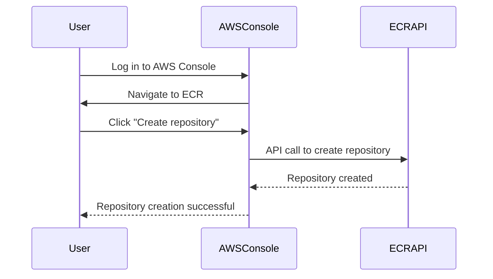
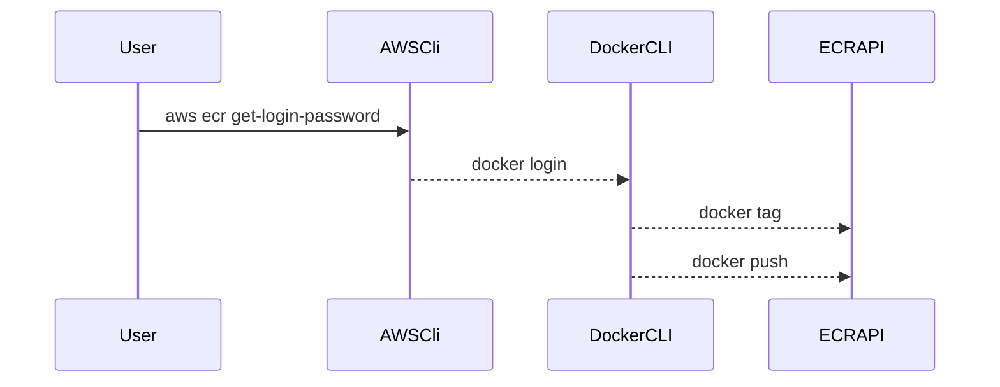

## Introduction to Continuous Delivery (CD) Pipelines with AWS ECR

Continuous Delivery (CD) is a practice where code changes are automatically built, tested, and prepared for release to production. One critical component of a CD pipeline is the management of container images, particularly using Amazon Elastic Container Registry (ECR). This chapter will delve into integrating a CD pipeline with AWS ECR, explaining the concepts, steps, and best practices involved.

### Background Theory

#### What is AWS ECR?

Amazon Elastic Container Registry (ECR) is a fully managed Docker container registry that makes it easy for developers to store, manage, and deploy Docker container images. ECR integrates with Amazon ECS, AWS Fargate, and other services to simplify your development workflow.

#### Why Use ECR in a CD Pipeline?

Using ECR in a CD pipeline offers several advantages:

- **Security**: ECR supports image scanning and encryption, ensuring that your images are secure.
- **Scalability**: ECR scales automatically to meet your needs, handling large numbers of images and high throughput.
- **Integration**: ECR seamlessly integrates with other AWS services like ECS and Fargate, making it easier to deploy and manage containerized applications.

### Creating a Repository in AWS ECR

Before pushing images to ECR, you need to create a repository. This repository will hold your Docker images, organized by application name and version.

#### Steps to Create a Repository

1. **Log in to AWS Management Console**:
   - Navigate to the ECR service.
   - Click on "Repositories" and then "Create repository".

2. **Configure the Repository**:
   - Provide a name for the repository (e.g., `myapp`).
   - Optionally, enable image scanning and encryption.
   - Click "Create repository".



### Tagging Docker Images

In a CD pipeline, it is essential to manage Docker images effectively. This involves tagging images with specific and dynamic versions.

#### Specific but Dynamic Version Tags

When building a Docker image, it is common to generate two versions of the image with different tags:

1. **Unique Tag**: A specific but dynamic version tag that ensures each build produces a unique image.
2. **Latest Tag**: A tag that always points to the most recent image.

#### Environment Variables for Unique Tags

To achieve this, you can use environment variables provided by your CI/CD platform. For example, in GitLab CI/CD, you can use the `CI_COMMIT_SHA` environment variable, which provides a unique commit hash for each build.

```yaml
# .gitlab-ci.yml
image: docker:latest

services:
  - docker:dind

stages:
  - build
  - push

variables:
  IMAGE_NAME: myapp
  IMAGE_TAG: $CI_COMMIT_SHA

build:
  stage: build
  script:
    - docker build -t $IMAGE_NAME:$IMAGE_TAG .

push:
  stage: push
  script:
    - echo "$CI_JOB_TOKEN" | docker login -u $CI_REGISTRY_USER --password-stdin $CI_REGISTRY
    - docker push $IMAGE_NAME:$IMAGE_TAG
```

### Pushing Images to ECR

Once you have tagged your Docker images, you need to push them to the ECR repository.

#### Steps to Push Images

1. **Authenticate with ECR**:
   - Use the AWS CLI to authenticate with ECR.
   - Run `aws ecr get-login-password --region <region> | docker login --username AWS --password-stdin <account-id>.dkr.ecr.<region>.amazonaws.com`.

2. **Tag the Image**:
   - Tag the image with the repository URL and the desired tag.
   - Example: `docker tag myapp:latest <account-id>.dkr.ecr.<region>.amazonaws.com/myapp:latest`.

3. **Push the Image**:
   - Push the image to the ECR repository.
   - Example: `docker push <account-id>.dkr.ecr.<region>.amazonaws.com/myapp:latest`.



### Handling Multiple Tags

In a CD pipeline, it is common to push both a unique tag and a `latest` tag for each build.

#### Example of Pushing Both Tags

```yaml
# .gitlab-ci.yml
image: docker:latest

services:
  - docker:dind

stages:
  - build
  - push

variables:
  IMAGE_NAME: myapp
  IMAGE_TAG: $CI_COMMIT_SHA

build:
  stage: build
  script:
    - docker build -t $IMAGE_NAME:$IMAGE_TAG .
    - docker tag $IMAGE_NAME:$IMAGE_TAG $IMAGE_NAME:latest

push:
  stage: push
  script:
    - echo "$CI_JOB_TOKEN" | docker login -u $CI_REGISTRY_USER --password-stdin $CI_REGISTRY
    - docker push $IMAGE_NAME:$IMAGE_TAG
    - docker push $IMAGE_NAME:latest
```

### Security Considerations

#### Image Scanning

AWS ECR supports image scanning, which helps identify vulnerabilities in your Docker images.

- **Enable Image Scanning**: When creating a repository, enable image scanning.
- **Review Scan Results**: Regularly review scan results to address any identified vulnerabilities.

#### Secure Access Control

Ensure that access to your ECR repositories is controlled securely.

- **IAM Policies**: Use IAM policies to control access to ECR repositories.
- **Resource-Based Policies**: Apply resource-based policies to restrict access to specific repositories.

### Real-World Examples

#### Recent CVEs and Breaches

Recent breaches involving Docker images highlight the importance of proper image management and security practices.

- **CVE-2021-44228 (Log4Shell)**: This vulnerability affected many Docker images, emphasizing the need for regular image scanning and updates.
- **Breaches via Unsecured Repositories**: Several incidents have occurred due to unsecured Docker repositories, leading to unauthorized access and data leaks.

### How to Prevent / Defend

#### Detection

- **Regular Scans**: Schedule regular scans of your Docker images to detect vulnerabilities.
- **Monitoring**: Monitor access logs and alerts for any suspicious activity.

#### Prevention

- **Secure Access**: Use IAM policies and resource-based policies to control access to ECR repositories.
- **Image Scanning**: Enable and regularly review image scanning results.

#### Secure Coding Fixes

Compare the insecure and secure versions of a `.gitlab-ci.yml` file:

**Insecure Version**

```yaml
# .gitlab-ci.yml
image: docker:latest

services:
  - docker:dind

stages:
  - build
  - push

variables:
  IMAGE_NAME: myapp
  IMAGE_TAG: $CI_COMMIT_SHA

build:
  stage: build
  script:
    - docker build -t $IMAGE_NAME:$IMAGE_TAG .

push:
  stage: push
  script:
    - docker push $IMAGE_NAME:$IMAGE_TAG
```

**Secure Version**

```yaml
# .gitlab-ci.yml
image: docker:latest

services:
  - docker:dind

stages:
  - build
  - push

variables:
  IMAGE_NAME: myapp
  IMAGE_TAG: $CI_COMMIT_SHA

build:
  stage: build
  script:
    - docker build -t $IMAGE_NAME:$IMAGE_TAG .
    - docker tag $IMAGE_NAME:$IMAGE_TAG $IMAGE_NAME:latest

push:
  stage: push
  script:
    - echo "$CI_JOB_TOKEN" | docker login -u $$CI_REGISTRY_USER --password-stdin $$CI_REGISTRY
    - docker push $IMAGE_NAME:$IMAGE_TAG
    - docker push $IMAGE_AME:latest
```

### Conclusion

Integrating a CD pipeline with AWS ECR involves creating repositories, tagging images dynamically, and pushing them securely. By following best practices and using tools like GitLab CI/CD, you can ensure that your Docker images are managed efficiently and securely.

### Practice Labs

For hands-on experience with integrating a CD pipeline with AWS ECR, consider the following labs:

- **PortSwigger Web Security Academy**: Focuses on web application security but includes sections on container security.
- **OWASP Juice Shop**: A deliberately insecure web application for practicing web security skills.
- **CloudGoat**: A series of labs designed to help you understand and secure AWS environments.

These labs provide practical experience in managing Docker images and integrating them into a CD pipeline using AWS ECR.

---
<!-- nav -->
[[04-Introduction to Continuous Delivery (CD) Pipelines with AWS ECR Part 2|Introduction to Continuous Delivery (CD) Pipelines with AWS ECR Part 2]] | [[DevSecOps/DevSecOps Bootcamp/07-CI CD Security Pipeline/02-Build a CD Pipeline/Integrate CICD Pipeline with AWS ECR/00-Overview|Overview]] | [[06-Introduction to Continuous Delivery (CD) Pipelines with AWS ECR Part 4|Introduction to Continuous Delivery (CD) Pipelines with AWS ECR Part 4]]
