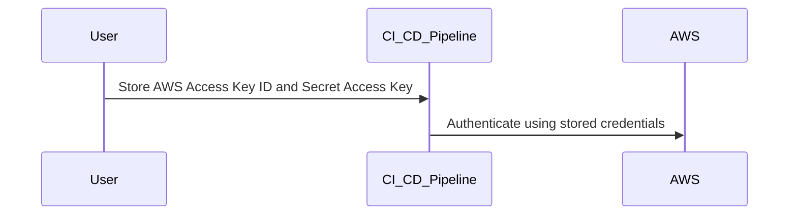

## Introduction to Continuous Delivery (CD) Pipelines with AWS ECR

Continuous Delivery (CD) is an essential practice in modern software development, enabling teams to release high-quality software frequently and reliably. One critical component of a CD pipeline is the integration with container registries such as Amazon Elastic Container Registry (ECR). This chapter will guide you through integrating a CI/CD pipeline with AWS ECR, covering the necessary steps, potential pitfalls, and best practices for securing your environment.

### Background Theory

Before diving into the specifics of integrating a CI/CD pipeline with AWS ECR, it’s important to understand the underlying concepts and technologies involved.

#### What is Continuous Delivery (CD)?

Continuous Delivery (CD) is a software engineering approach in which teams produce software in short cycles, ensuring that the software can be reliably released at any time. It aims to build, test, and deploy code changes automatically and efficiently. This allows organizations to deliver new features and bug fixes more quickly and with higher quality.

#### What is Amazon Elastic Container Registry (ECR)?

Amazon Elastic Container Registry (ECR) is a fully managed Docker container registry that makes it easy to store, manage, and deploy Docker container images. ECR integrates with Amazon Elastic Container Service (ECS) and Amazon Elastic Kubernetes Service (EKS) to simplify your development workflow. By using ECR, you can store and manage your container images securely and efficiently.

### Setting Up AWS Credentials

To integrate your CI/CD pipeline with AWS ECR, you need to set up AWS credentials. These credentials are used to authenticate and authorize actions performed against AWS services, including ECR.

#### AWS Access Key ID and Secret Access Key

The AWS Access Key ID and Secret Access Key are the primary credentials used to authenticate API requests to AWS services. They are generated together and should be treated as sensitive information.

- **AWS Access Key ID**: A unique identifier for your AWS account.
- **Secret Access Key**: A secret key associated with the Access Key ID.

#### Storing AWS Credentials Securely

It is crucial to handle AWS credentials securely. Exposing these credentials can lead to unauthorized access to your AWS resources, potentially resulting in data breaches or financial losses.



#### Example of Storing AWS Credentials

In a CI/CD pipeline, you typically store these credentials as environment variables or in a secure vault. Here’s an example of how you might configure these credentials in a Jenkins pipeline:

```groovy
pipeline {
    agent any
    environment {
        AWS_ACCESS_KEY_ID = 'your-access-key-id'
        AWS_SECRET_ACCESS_KEY = 'your-secret-access-key'
    }
    stages {
        stage('Build') {
            steps {
                sh 'echo Building...'
            }
        }
        stage('Deploy') {
            steps {
                sh 'echo Deploying...'
            }
        }
    }
}
```

### Using AWS Credentials in the Pipeline

Once the AWS credentials are stored securely, you can use them in your CI/CD pipeline to interact with AWS services, including ECR.

#### Authenticating with AWS

To authenticate with AWS services, you need to configure the AWS CLI or SDK with your credentials. Here’s an example of how to configure the AWS CLI:

```bash
aws configure set aws_access_key_id your-access-key-id
aws configure set aws_secret_access_key your-secret-access-key
aws configure set region us-west-2
```

### Integrating with ECR

After setting up your AWS credentials, you can proceed to integrate your CI/CD pipeline with ECR.

#### Creating an ECR Repository

First, you need to create an ECR repository where your Docker images will be stored. You can do this using the AWS Management Console, AWS CLI, or AWS SDKs.

```bash
aws ecr create-repository --repository-name my-repo
```

#### Pushing Docker Images to ECR

Once the repository is created, you can push your Docker images to ECR. This involves tagging your Docker image with the appropriate ECR URI and then pushing it.

```bash
docker tag my-image:latest <account-id>.dkr.ecr.us-west-2.amazonaws.com/my-repo:latest
docker push <account-id>.dkr.ecr.us-west-2.amazonaws.com/my-repo:latest
```

### Handling Secrets in CI/CD Pipelines

Handling secrets in CI/CD pipelines is a critical aspect of maintaining security. Exposing secrets like AWS credentials can lead to serious security issues.

#### Real-World Example: AWS Credentials Exposure

A notable example of AWS credentials exposure occurred in the Capital One breach in 2019. An attacker gained unauthorized access to Capital One’s AWS account by exploiting a misconfigured server. The attacker was able to access sensitive data due to exposed AWS credentials.

#### Best Practices for Handling Secrets

To prevent such incidents, follow these best practices:

1. **Use Environment Variables**: Store secrets as environment variables rather than hardcoding them in scripts.
2. **Secure Vaults**: Utilize secure vaults like HashiCorp Vault or AWS Secrets Manager to manage secrets.
3. **Least Privilege Principle**: Ensure that the credentials used in the pipeline have the minimum permissions required to perform their tasks.
4. **Rotate Credentials Regularly**: Rotate your AWS credentials regularly to minimize the risk of unauthorized access.

### How to Prevent / Defend Against AWS Credential Exposure

#### Detection

Regularly monitor your AWS account for any unauthorized access or suspicious activity. Use AWS CloudTrail to log API calls and AWS Config to track changes to your resources.

#### Prevention

1. **IAM Policies**: Use IAM policies to restrict access to specific resources and actions.
2. **Multi-Factor Authentication (MFA)**: Enable MFA for your AWS account to add an extra layer of security.
3. **Secure Storage**: Use secure storage mechanisms like AWS Secrets Manager to store and manage secrets.

#### Secure Coding Fixes

Here’s an example of how to securely store and use AWS credentials in a Jenkins pipeline:

**Vulnerable Code:**
```groovy
pipeline {
    agent any
    environment {
        AWS_ACCESS_KEY_ID = 'your-access-key-id'
        AWS_SECRET_ACCESS_KEY = 'your-secret-access-key'
    }
    stages {
        stage('Build') {
            steps {
                sh 'echo Building...'
            }
        }
        stage('Deploy') {
            steps {
                sh 'echo Deploying...'
            }
        }
    }
}
```

**Fixed Code:**
```groovy
pipeline {
    agent any
    environment {
        AWS_ACCESS_KEY_ID = credentials('aws-access-key-id')
        AWS_SECRET_ACCESS_KEY = credentials('aws-secret-access-key')
    }
    stages {
        stage('Build') {
            steps {
                sh 'echo Building...'
            }
        }
        stage('Deploy') {
            steps {
                sh 'echo Deploying...'
            }
        }
    }
}
```

### Hands-On Labs

For practical experience, consider the following labs:

- **PortSwigger Web Security Academy**: Offers a comprehensive course on web security, including sections on CI/CD pipelines and AWS services.
- **OWASP Juice Shop**: A deliberately insecure web application for security training purposes, which can be integrated with CI/CD pipelines.
- **CloudGoat**: A series of labs designed to help you learn about cloud security, including AWS ECR and CI/CD pipelines.

By following these guidelines and best practices, you can effectively integrate your CI/CD pipeline with AWS ECR while maintaining a high level of security.

---
<!-- nav -->
[[06-Introduction to Continuous Delivery (CD) Pipelines with AWS ECR Part 4|Introduction to Continuous Delivery (CD) Pipelines with AWS ECR Part 4]] | [[DevSecOps/DevSecOps Bootcamp/07-CI CD Security Pipeline/02-Build a CD Pipeline/Integrate CICD Pipeline with AWS ECR/00-Overview|Overview]] | [[08-Introduction to Continuous Delivery (CD) Pipelines|Introduction to Continuous Delivery (CD) Pipelines]]
