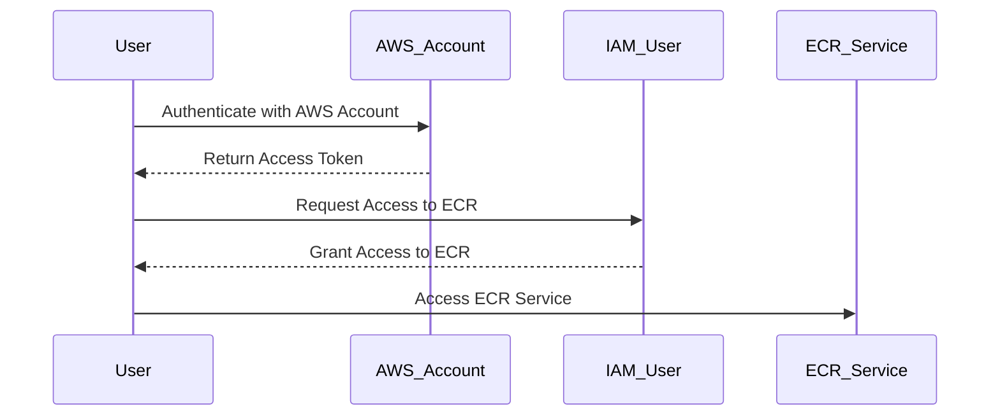

## Introduction to Security Layers for AWS Access

In the realm of DevSecOps, ensuring secure access to AWS services is paramount. This chapter delves into the intricacies of AWS access control, focusing on the multi-layered approach required to manage and secure access effectively. By understanding these concepts, you will be able to build a robust Continuous Delivery (CD) pipeline that adheres to stringent security standards.

### Understanding AWS as a Building Complex

Imagine AWS as a vast building complex, where each service within the AWS ecosystem is akin to an individual apartment. Just as you cannot access all apartments in a building simply by entering the main door, you cannot access all AWS services without proper authentication and authorization.

#### AWS Account Authentication

To gain entry into the AWS building, you must first authenticate using AWS user credentials. This initial layer of security ensures that only authorized users can access the AWS environment. Once authenticated, you can proceed to access specific services within the account.

#### Service-Specific Credentials

Each AWS service, such as Amazon Elastic Container Registry (ECR), requires its own set of credentials. These credentials act as keys to individual apartments within the building. Even after gaining access to the AWS account, you still need the appropriate credentials to interact with specific services.

### Two Security Layers in AWS Access Control

AWS employs a dual-layer security model to ensure that access to resources is both secure and controlled:

1. **AWS Account Authentication**: This layer verifies the identity of the user attempting to access the AWS account. It ensures that only authorized individuals can enter the "building."
   
2. **Service-Specific Authorization**: Once inside the "building," users must provide additional credentials to access specific services. This layer ensures that users can only access the services they are authorized to use.

#### Root User Credentials

The root user is the primary administrator of an AWS account. It has full access to all services and resources within the account. However, due to the high level of privilege associated with the root user, it is generally recommended to use it sparingly and instead create IAM users with more limited permissions.

### Finding AWS Credentials

AWS credentials can be found in several locations, depending on the method of access:

- **IAM Console**: The AWS Identity and Access Management (IAM) console provides a web-based interface to manage users, groups, roles, and policies.
  
- **AWS CLI**: The AWS Command Line Interface (CLI) allows you to manage AWS resources from the command line. Credentials can be stored in the `~/.aws/credentials` file.

- **Environment Variables**: AWS credentials can also be stored in environment variables, such as `AWS_ACCESS_KEY_ID` and `AWS_SECRET_ACCESS_KEY`.

### Example: Accessing ECR Using AWS CLI

Let's walk through an example of accessing Amazon ECR using the AWS CLI. This example demonstrates the process of authenticating with the AWS account and then authorizing access to the ECR service.

#### Step 1: Configure AWS CLI

First, configure the AWS CLI with your root user credentials:

```bash
aws configure
```

This command prompts you to enter your AWS Access Key ID and Secret Access Key. Additionally, you can specify the default region and output format.

#### Step 2: Authenticate with AWS Account

Once configured, you can authenticate with the AWS account using the following command:

```bash
aws sts get-caller-identity
```

This command returns information about the current IAM user or role, confirming successful authentication.

#### Step 3: Authorize Access to ECR

Next, you need to authorize access to the ECR service. This typically involves creating an IAM policy that grants the necessary permissions to the ECR service.

```json
{
    "Version": "2012-10-17",
    "Statement": [
        {
            "Effect": "Allow",
            "Action": [
                "ecr:GetDownloadUrlForLayer",
                "ecr:BatchGetImage",
                "ecr:BatchCheckLayerAvailability",
                "ecr:PutImage",
                "ecr:InitiateLayerUpload",
                "ecr:UploadLayerPart",
                "ecr:CompleteLayerUpload",
                "ecr:DescribeRepositories",
                "ecr:ListImages",
                "ecr:BatchDeleteImage",
                "ecr:DeleteRepository"
            ],
            "Resource": "*"
        }
    ]
}
```

This policy grants the necessary permissions to perform various operations on the ECR service.

#### Step 4: Apply Policy to IAM User

Attach the policy to an IAM user or role:

```bash
aws iam attach-user-policy --user-name my-user --policy-arn arn:aws:iam::123456789012:policy/my-policy
```

Replace `my-user` with the name of the IAM user and `my-policy` with the name of the policy.

#### Step 5: Access ECR Service

With the policy attached, you can now access the ECR service using the AWS CLI:

```bash
aws ecr describe-repositories
```

This command lists all repositories in the ECR service.

### Mermaid Diagram: AWS Access Flow

A visual representation of the AWS access flow can help clarify the process:



### Real-World Examples and Breaches

Recent breaches and vulnerabilities highlight the importance of proper AWS access control:

- **CVE-2021-20225**: A misconfiguration in AWS IAM policies allowed unauthorized access to sensitive resources. This underscores the need for strict access controls and regular audits.
  
- **Capital One Data Breach (2019)**: An attacker exploited a misconfigured AWS S3 bucket to gain unauthorized access to sensitive data. This incident emphasizes the importance of securing S3 buckets and other AWS resources.

### How to Prevent / Defend

#### Detection

Regularly audit IAM policies and user permissions to identify and rectify any misconfigurations. Use AWS CloudTrail to monitor API calls and detect unauthorized access attempts.

#### Prevention

- **Least Privilege Principle**: Ensure that IAM users and roles have only the minimum permissions necessary to perform their tasks.
  
- **Multi-Factor Authentication (MFA)**: Enable MFA for all IAM users to add an extra layer of security.

- **IAM Policies**: Use IAM policies to restrict access to specific resources and actions.

#### Secure Coding Fixes

Compare the vulnerable and secure versions of IAM policies:

**Vulnerable Policy:**

```json
{
    "Version": "2012-10-17",
    "Statement": [
        {
            "Effect": "Allow",
            "Action": "*",
            "Resource": "*"
        }
    ]
}
```

**Secure Policy:**

```json
{
    "Version": "2012-10-17",
    "Statement": [
        {
            "Effect": "Allow",
            "Action": [
                "ecr:GetDownloadUrlForLayer",
                "ecr:BatchGetImage",
                "ecr:BatchCheckLayerAvailability",
                "ecr:PutImage",
                "ecr:InitiateLayerUpload",
                "ecr:UploadLayerPart",
                "ecr:CompleteLayerUpload",
                "ecr:DescribeRepositories",
                "ecr:ListImages",
                "ecr:BatchDeleteImage",
                "ecr:DeleteRepository"
            ],
            "Resource": "arn:aws:ecr:us-west-2:123456789012:repository/my-repo"
        }
    ]
}
```

### Configuration Hardening

- **IAM User Permissions**: Regularly review and update IAM user permissions to ensure they align with the least privilege principle.
  
- **CloudTrail**: Enable CloudTrail to log all API calls made to your AWS account. This helps in detecting and responding to unauthorized access attempts.

### Conclusion

Understanding and implementing the multi-layered security model in AWS is crucial for maintaining a secure CD pipeline. By adhering to best practices and regularly auditing access controls, you can significantly reduce the risk of unauthorized access and potential breaches.

### Practice Labs

For hands-on practice, consider the following labs:

- **PortSwigger Web Security Academy**: Offers interactive labs to practice secure coding and access control.
  
- **OWASP Juice Shop**: A deliberately insecure web application for practicing web security techniques.

These labs provide practical experience in securing AWS resources and implementing robust access controls.

By mastering the concepts covered in this chapter, you will be well-equipped to build and maintain a secure CD pipeline in the AWS environment.

---
<!-- nav -->
[[DevSecOps/DevSecOps Bootcamp/07-CI CD Security Pipeline/02-Build a CD Pipeline/Introduction to Security Layers for AWS Access/01-Introduction to Security Layers for AWS Access in a CD Pipeline|Introduction to Security Layers for AWS Access in a CD Pipeline]] | [[DevSecOps/DevSecOps Bootcamp/07-CI CD Security Pipeline/02-Build a CD Pipeline/Introduction to Security Layers for AWS Access/00-Overview|Overview]] | [[03-Introduction to Security Layers for AWS Access Part 2|Introduction to Security Layers for AWS Access Part 2]]
