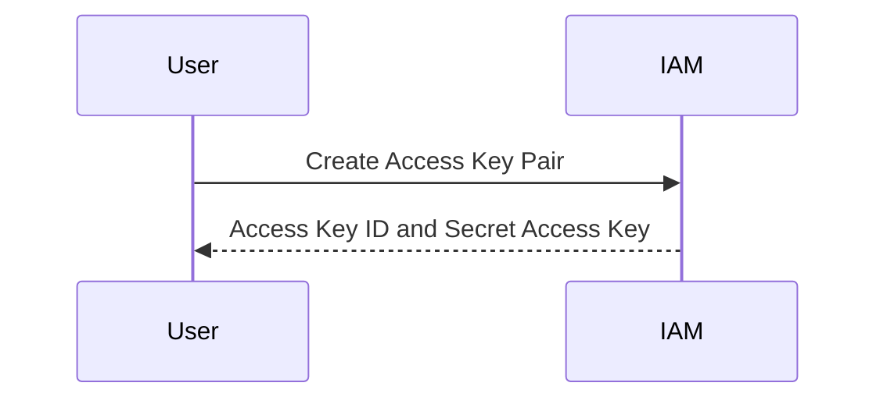
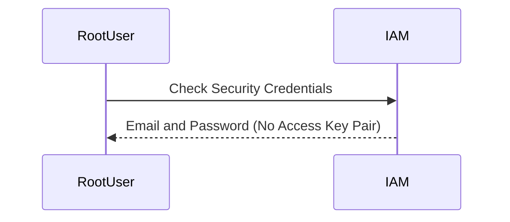
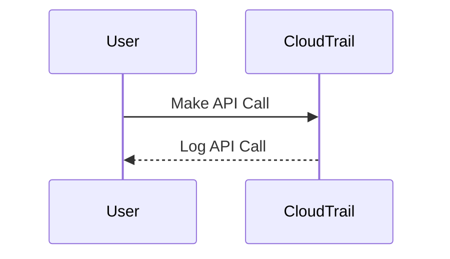

## Introduction to Security Layers for AWS Access

When working with Amazon Web Services (AWS), it is essential to understand the different methods and layers of access control available. These methods include the human-friendly AWS Management Console and the more programmatic AWS Command Line Interface (CLI). Each method requires a distinct set of credentials, and understanding these differences is crucial for maintaining security and operational efficiency.

### AWS Management Console

The AWS Management Console is a web-based interface that allows users to manage their AWS resources. To access the console, users typically need an email address and a password. This method is straightforward and user-friendly, making it ideal for manual tasks and administrative activities.

#### Credentials for the Management Console

- **Email Address**: The primary identifier for the user.
- **Password**: The secret used to authenticate the user.

These credentials are used to log in to the AWS Management Console. Once authenticated, users can perform various actions such as creating and managing resources, configuring settings, and monitoring usage.

### AWS Command Line Interface (CLI)

The AWS CLI is a powerful tool that allows users to interact with AWS services programmatically. Unlike the Management Console, the CLI does not use email and password for authentication. Instead, it relies on a set of credentials known as an access key pair.

#### Access Key Pair

An access key pair consists of two parts:

- **Access Key ID**: A unique identifier for the user.
- **Secret Access Key**: A secret key used to sign requests.

These credentials are used to authenticate API calls made through the CLI. They are stored securely and should never be shared or exposed publicly.

#### Creating Access Key Pair

To create an access key pair for a user, follow these steps:

1. Log in to the AWS Management Console.
2. Navigate to the IAM (Identity and Access Management) service.
3. Select the user for whom you want to create the access key pair.
4. Click on the "Security credentials" tab.
5. Under "Access keys," click on "Create access key."
6. Download the access key pair file, which contains the Access Key ID and Secret Access Key.



### Differentiating Between UI and CLI Access

When creating a new user in AWS, you can specify whether the user should have access only through the UI, only through the CLI, or both. This flexibility allows you to tailor access based on the user's role and responsibilities.

#### UI Access Only

If a user is given only UI access, they will receive an email and password to log in to the AWS Management Console. They will not have an access key pair for CLI access.

#### CLI Access Only

If a user is given only CLI access, they will receive an access key pair. They will not have an email and password to log in to the AWS Management Console.

#### Both UI and CLI Access

If a user is given both UI and CLI access, they will receive both an email and password for the Management Console and an access key pair for the CLI.

### Root User Considerations

The root user, which is the owner of the AWS account, has special considerations. The root user has an email and password to log in to the Management Console but does not have an access key pair for CLI access. This is a critical security measure to prevent unauthorized access to the root account.

#### Checking Root User Credentials

To check the credentials for the root user, follow these steps:

1. Log in to the AWS Management Console as the root user.
2. Navigate to the IAM service.
3. Select the root user.
4. Click on the "Security credentials" tab.
5. You will see that the root user has an email and password but no access key pair.



### Real-World Examples and Recent Breaches

Understanding the importance of securing access credentials is crucial. Several high-profile breaches have occurred due to mismanagement of access credentials.

#### Example: Capital One Data Breach (CVE-2019-11510)

In 2019, Capital One suffered a data breach that exposed sensitive information of over 100 million customers. The breach was caused by a misconfigured web application firewall (WAF) that allowed unauthorized access to AWS S3 buckets. The attacker gained access using stolen AWS credentials.

**Lesson Learned**: Properly securing and managing access credentials is essential to prevent unauthorized access and potential data breaches.

### How to Prevent / Defend

#### Detection

To detect unauthorized access attempts, enable AWS CloudTrail and configure it to log all API calls. This will help you monitor and audit access to your AWS resources.



#### Prevention

1. **Use IAM Roles**: Instead of using individual access keys, use IAM roles to grant temporary permissions to AWS resources.
2. **Enable Multi-Factor Authentication (MFA)**: Require MFA for all users to add an additional layer of security.
3. **Rotate Access Keys Regularly**: Rotate access keys periodically to minimize the risk of exposure.
4. **Least Privilege Principle**: Grant users only the minimum permissions necessary to perform their job functions.

#### Secure Coding Fixes

Here is an example of how to securely manage access credentials in a CD pipeline:

**Vulnerable Code**:
```yaml
# Vulnerable CD Pipeline Configuration
stages:
  - build
  - deploy

build:
  script:
    - aws s3 cp ./dist s3://my-bucket --access-key $ACCESS_KEY --secret-key $SECRET_KEY

deploy:
  script:
    - aws lambda update-function-code --function-name my-lambda --zip-file fileb://./dist/my-lambda.zip --access-key $ACCESS_KEY --secret-key $SECRET_KEY
```

**Secure Code**:
```yaml
# Secure CD Pipeline Configuration
stages:
  - build
  - deploy

build:
  script:
    - aws configure set aws_access_key_id $ACCESS_KEY
    - aws configure set aws_secret_access_key $SECRET_KEY
    - aws s3 cp ./dist s3://my-bucket

deploy:
  script:
    - aws configure set aws_access_key_id $ACCESS_KEY
    - aws configure set aws_secret_access_key $SECRET_KEY
    - aws lambda update-function-code --function-name my-lambda --zip-file fileb://./dist/my-lambda.zip
```

#### Configuration Hardening

1. **IAM Policies**: Define strict IAM policies to limit access to specific resources.
2. **Resource Tags**: Use resource tags to enforce tagging policies and restrict access based on tags.
3. **Service Control Policies (SCP)**: Use SCPs to enforce organizational-level controls.

### Complete Example: Full HTTP Request and Response

Here is an example of a full HTTP request and response for accessing an AWS resource using the CLI:

**HTTP Request**:
```http
POST / HTTP/1.1
Host: s3.amazonaws.com
Content-Type: application/x-www-form-urlencoded
Authorization: AWS ACCESS_KEY_ID:Signature
X-Amz-Date: 20231010T123456Z
Content-Length: 123

Action=ListBuckets&Version=2006-03-01
```

**HTTP Response**:
```http
HTTP/1.1 200 OK
Content-Type: application/xml
Transfer-Encoding: chunked
Date: Wed, 10 Oct 2023 12:34:56 GMT
Server: AmazonS3

<?xml version="1.0" encoding="UTF-8"?>
<ListAllMyBucketsResult xmlns="http://s3.amazonaws.com/doc/2006-03-01/">
  <Owner>
    <ID>OWNER_ID</ID>
    <DisplayName>OWNER_DISPLAY_NAME</DisplayName>
  </Owner>
  <Buckets>
    <Bucket>
      <Name>my-bucket</Name>
      <CreationDate>2023-10-01T12:00:00.000Z</CreationDate>
    </Bucket>
  </Buckets>
</ListAllMyBucketsResult>
```

### Hands-On Labs

For hands-on practice with AWS access management, consider the following labs:

- **PortSwigger Web Security Academy**: Offers a comprehensive set of labs covering various aspects of web security, including AWS access management.
- **OWASP Juice Shop**: Provides a vulnerable web application that can be used to practice securing AWS resources.
- **DVWA (Damn Vulnerable Web Application)**: Another vulnerable web application that can be used to practice securing AWS resources.

By following these guidelines and practicing with real-world examples, you can ensure that your AWS resources are properly secured and managed.

---
<!-- nav -->
[[02-Introduction to Security Layers for AWS Access Part 1|Introduction to Security Layers for AWS Access Part 1]] | [[DevSecOps/DevSecOps Bootcamp/07-CI CD Security Pipeline/02-Build a CD Pipeline/Introduction to Security Layers for AWS Access/00-Overview|Overview]] | [[04-Introduction to Security Layers for AWS Access Part 3|Introduction to Security Layers for AWS Access Part 3]]
