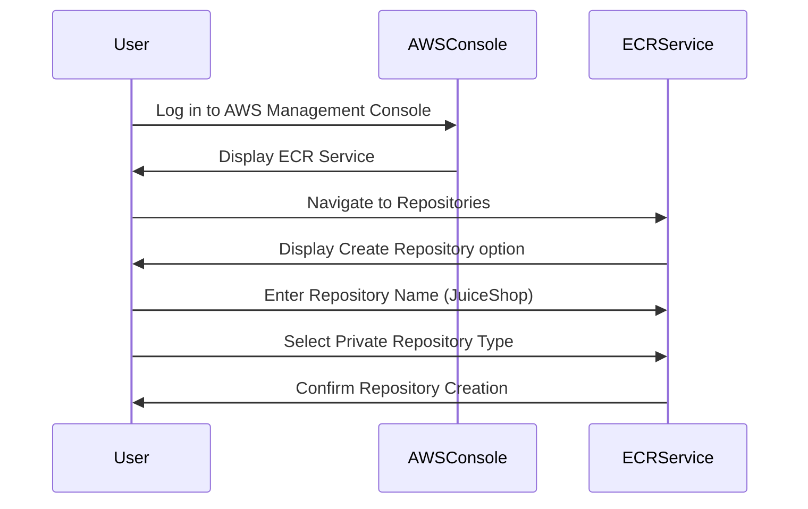

## Introduction to Security Layers for AWS Access

In this section, we will delve into the process of setting up a Continuous Delivery (CD) pipeline using AWS services, specifically focusing on the security aspects involved. We start with a fresh AWS account, which means we have minimal setup and can build our infrastructure from scratch. This approach allows us to understand the underlying principles and security layers required for a robust CD pipeline.

### Setting Up the AWS Account

When you create a new AWS account, you are provided with a root user. The root user has full access to all resources within the account. While it is convenient to use the root user for initial setup, it is highly recommended to avoid using it for day-to-day operations due to the inherent risks associated with full administrative privileges.

#### Why Avoid Root User?

Using the root user for regular tasks can lead to several security issues:

1. **Privilege Escalation**: Any compromise of the root user credentials can result in full control over the entire AWS environment.
2. **Audit Trails**: Actions performed by the root user are harder to trace and audit compared to actions performed by individual IAM users.
3. **Least Privilege Principle**: The principle of least privilege states that users should have the minimum level of access necessary to perform their job functions. Using the root user violates this principle.

### Creating an ECR Repository

The first step in our CD pipeline is to create an Elastic Container Registry (ECR) repository. ECR is a managed Docker registry service provided by AWS. It allows you to store and manage Docker images securely.

#### Steps to Create an ECR Repository

1. **Log in to AWS Management Console**:
    - Navigate to the ECR service.
    - Click on "Repositories" and then "Create repository".

2. **Configure Repository Settings**:
    - **Repository name**: Enter `JuiceShop` (or any other name relevant to your application).
    - **Repository type**: Select `Private`.
    - Leave other settings at their default values.



### Pushing Docker Image to ECR

Once the ECR repository is created, the next step is to push the Docker image to this repository. This involves logging into the ECR registry and then pushing the image.

#### Steps to Push Docker Image

1. **Login to ECR**:
    - Use the AWS CLI to authenticate with the ECR registry.
    - Run the following command:

    ```bash
    aws ecr get-login-password --region <your-region> | docker login --username AWS --password-stdin <account-id>.dkr.ecr.<your-region>.amazonaws.com
    ```

2. **Tag Docker Image**:
    - Tag the local Docker image with the ECR repository URI.

    ```bash
    docker tag <local-image-name>:<tag> <account-id>.dkr.ecr.<your-region>.amazonaws.com/JuiceShop:<tag>
    ```

3. **Push Docker Image**:
    - Push the tagged image to the ECR repository.

    ```bash
    docker push <account-id>.dkr.ecr.<your-region>.amazonaws.com/JuiceShop:<tag>
    ```

#### Example HTTP Request and Response

Here is an example of the HTTP request and response when pushing a Docker image to ECR:

```http
POST /v2/<account-id>.dkr.ecr.<your-region>.amazonaws.com/JuiceShop/<tag>/blobs/uploads/ HTTP/1.1
Host: <account-id>.dkr.ecr.<your-region>.amazonaws.com
Authorization: Bearer <token>
Content-Length: 1024
Content-Type: application/octet-stream

... (binary data)

HTTP/1.1 201 Created
Date: Tue, 01 Jan 2024 12:00:00 GMT
Content-Length: 0
Location: /v2/<account-id>.dkr.ecr.<your-region>.amazonaws.com/JuiceShop/<tag>/blobs/sha256:<digest>
```

### Deploying to EC2 Instance

After pushing the Docker image to ECR, the next step is to deploy it to an EC2 instance. This involves creating an EC2 instance and configuring it to run the Docker image.

#### Steps to Deploy to EC2

1. **Launch EC2 Instance**:
    - Navigate to the EC2 dashboard.
    - Launch a new instance and choose an appropriate AMI (Amazon Machine Image).

2. **Install Docker**:
    - SSH into the EC2 instance.
    - Install Docker using the following commands:

    ```bash
    sudo apt-get update
    sudo apt-get install -y docker.io
    ```

3. **Pull and Run Docker Image**:
    - Pull the Docker image from ECR and run it.

    ```bash
    docker pull <account-id>.dkr.ecr.<your-region>.amazonaws.com/JuiceShop:<tag>
    docker run -d -p 8080:8080 <account-id>.dkr.ecr.<your-region>.amazonaws.com/JuiceShop:<tag>
    ```

### Security Considerations

While setting up the CD pipeline, it is crucial to consider various security aspects to ensure the integrity and confidentiality of the system.

#### IAM Roles and Policies

IAM roles and policies are essential for controlling access to AWS resources. Instead of using the root user, create IAM users and assign them specific roles and policies.

##### Steps to Create IAM Role

1. **Navigate to IAM Dashboard**:
    - Go to the IAM dashboard in the AWS Management Console.
    - Click on "Roles" and then "Create role".

2. **Select Trusted Entity**:
    - Choose "EC2" as the trusted entity.
    - Attach policies such as `AmazonEC2ContainerRegistryReadOnly` and `AmazonEC2FullAccess`.

3. **Assign Role to EC2 Instance**:
    - When launching an EC2 instance, attach the newly created IAM role.

#### Secure Communication

Ensure that all communication between the CD pipeline components is secure. Use HTTPS for all API calls and enable encryption for data at rest and in transit.

##### Example of Secure Communication

Use HTTPS for API calls to ECR and EC2:

```http
GET https://ecr.<your-region>.amazonaws.com/v2/<account-id>.dkr.ecr.<your-region>.amazonaws.com/JuiceShop/tags/list HTTP/1.1
Host: ecr.<your-region>.amazonaws.com
Authorization: Bearer <token>

HTTP/1.1 200 OK
Date: Tue, 01 Jan 2024 12:00:00 GMT
Content-Type: application/json
Content-Length: 1024

{
    "tags": ["latest", "v1.0"]
}
```

#### Vulnerability Detection and Prevention

Regularly scan your Docker images for vulnerabilities using tools like Trivy or Aqua Security. Ensure that your CI/CD pipeline includes steps to automatically fail builds if vulnerabilities are detected.

##### Example of Vulnerability Scan

Use Trivy to scan Docker images:

```bash
trivy image <account-id>.dkr.ecr.<your-region>.amazonaws.com/JuiceShop:<tag>
```

#### Secure Coding Practices

Implement secure coding practices to prevent common vulnerabilities such as SQL injection, cross-site scripting (XSS), and command injection.

##### Example of Secure Coding

Use parameterized queries to prevent SQL injection:

```python
import sqlite3

def get_user(user_id):
    conn = sqlite3.connect('database.db')
    cursor = conn.cursor()
    cursor.execute("SELECT * FROM users WHERE id = ?", (user_id,))
    user = cursor.fetchone()
    conn.close()
    return user
```

### How to Prevent / Defend

To defend against potential security threats, follow these best practices:

1. **Use IAM Roles and Policies**: Limit permissions to the minimum necessary for each task.
2. **Enable Encryption**: Use SSL/TLS for all communications and enable encryption for data at rest.
3. **Regular Scanning**: Use tools like Trivy to regularly scan Docker images for vulnerabilities.
4. **Secure Coding**: Implement secure coding practices to prevent common vulnerabilities.

#### Vulnerable vs. Secure Code

Compare the insecure and secure versions of code to understand the differences:

**Insecure Code**:
```python
import sqlite3

def get_user(user_id):
    conn = sqlite3.connect('database.db')
    cursor = conn.cursor()
    cursor.execute(f"SELECT * FROM users WHERE id = {user_id}")
    user = cursor.fetchone()
    conn.close()
    return user
```

**Secure Code**:
```python
import sqlite3

def get_user(user_id):
    conn = sqlite3.connect('database.db')
    cursor = conn.cursor()
    cursor.execute("SELECT * FROM users WHERE id = ?", (user_id,))
    user = cursor.fetchone()
    conn.close()
    return user
```

### Conclusion

Setting up a CD pipeline using AWS services requires careful consideration of security aspects. By following best practices such as using IAM roles, enabling encryption, and implementing secure coding practices, you can ensure the integrity and confidentiality of your system.

### Hands-On Labs

For practical experience, consider the following labs:

- **PortSwigger Web Security Academy**: Focuses on web application security.
- **OWASP Juice Shop**: A deliberately insecure web application for security training.
- **CloudGoat**: Provides a series of labs to learn about securing AWS environments.

These labs will help you apply the concepts learned in this chapter to real-world scenarios.

---
<!-- nav -->
[[04-Introduction to Security Layers for AWS Access Part 3|Introduction to Security Layers for AWS Access Part 3]] | [[DevSecOps/DevSecOps Bootcamp/07-CI CD Security Pipeline/02-Build a CD Pipeline/Introduction to Security Layers for AWS Access/00-Overview|Overview]] | [[DevSecOps/DevSecOps Bootcamp/07-CI CD Security Pipeline/02-Build a CD Pipeline/Introduction to Security Layers for AWS Access/06-Practice Questions & Answers|Practice Questions & Answers]]
