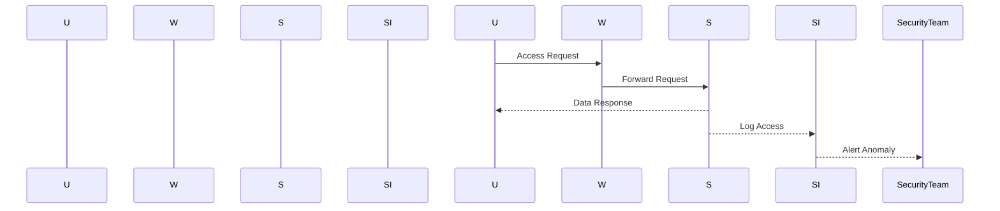
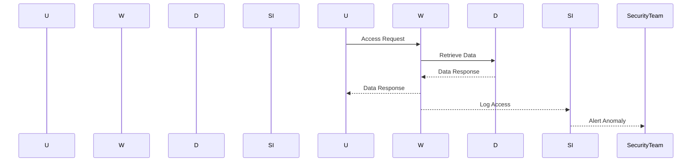

## Introduction to Key Security Events to Log and Monitor

In the realm of DevSecOps, logging and monitoring are critical components for ensuring the security and integrity of systems. This chapter delves into the importance of defining key security events to log and monitor, drawing insights from major industry reports such as the Verizon Data Breach Investigation Report, the UNISA Threat Landscape Report, and the IBM Cost of Data Breach Report. These reports provide invaluable data on the current threat landscape and the financial implications of data breaches.

### Importance of Security Event Logging and Monitoring

Security event logging and monitoring are essential practices that help organizations detect and respond to security incidents promptly. By logging and monitoring key security events, organizations can identify potential threats and take corrective actions before significant damage occurs. This proactive approach is crucial in today’s complex and dynamic threat environment.

#### Key Publications to Read

Three major publications that provide valuable insights into the threat landscape and the cost of data breaches are:

1. **Verizon Data Breach Investigation Report**: This report provides detailed analysis of data breaches, including the methods used by attackers and the types of data compromised.
2. **UNISA Threat Landscape Report**: This report offers a comprehensive overview of the current threat landscape, highlighting emerging trends and vulnerabilities.
3. **IBM Cost of Data Breach Report**: This report quantifies the financial impact of data breaches and provides insights into the factors that influence the cost of a breach.

### IBM Cost of Data Breach Report Insights

The IBM Cost of Data Breach Report is particularly noteworthy for its quantitative analysis of the time taken to detect and contain security incidents. The 2020 version of the report highlights several key findings:

- **Detection Time Without Automation**: On average, it took 228 days to detect an incident without automation.
- **Detection Time With Automation**: With automation, the detection time was reduced to 175 days.
- **Containment Time Without Automation**: Once detected, it took an average of 80 days to contain the incident without automation.
- **Containment Time With Automation**: With automation, the containment time was reduced to 59 days.
- **Total Time Without Automation**: The total time to detect and contain an incident without automation was 308 days.
- **Total Time With Automation**: The total time with automation was 234 days.
- **Time Saved**: Automation resulted in a significant time saving of 74 days.

These findings underscore the importance of implementing automated tools and processes to enhance the speed and effectiveness of incident detection and response.

### Background Theory: Security Event Logging and Monitoring

Security event logging and monitoring involve capturing and analyzing security-relevant events to detect and respond to potential threats. This process typically includes the following steps:

1. **Event Definition**: Identify and define the key security events that need to be logged and monitored.
2. **Logging Mechanisms**: Implement mechanisms to capture these events in a structured format.
3. **Monitoring Tools**: Utilize monitoring tools to analyze the logged events and detect anomalies.
4. **Response Actions**: Define and implement response actions to address detected threats.

#### Event Definition

Key security events to log and monitor include:

- **Authentication Attempts**: Successful and failed login attempts.
- **Access Control Changes**: Modifications to user permissions and access controls.
- **Network Traffic**: Unusual patterns in network traffic, such as large data transfers or connections to known malicious IP addresses.
- **File System Changes**: Modifications to critical files and directories.
- **System Configuration Changes**: Changes to system configurations and settings.
- **Malware Detection**: Identification of malware or suspicious activity.

#### Logging Mechanisms

Effective logging mechanisms should capture the following details for each event:

- **Timestamp**: The exact time the event occurred.
- **Source**: The source of the event (e.g., user, system, application).
- **Action**: The specific action performed (e.g., login attempt, file modification).
- **Result**: The outcome of the action (e.g., success, failure).
- **Additional Context**: Any additional context that may be relevant (e.g., IP address, user agent).

#### Monitoring Tools

Monitoring tools play a crucial role in analyzing the logged events and detecting anomalies. Common monitoring tools include:

- **SIEM (Security Information and Event Management)**: Centralized platforms that collect and correlate security events from various sources.
- **IDS (Intrusion Detection Systems)**: Tools that monitor network traffic and system logs to detect potential intrusions.
- **Log Management Solutions**: Tools that aggregate and analyze logs from multiple sources.

#### Response Actions

Response actions should be defined and implemented to address detected threats. These actions may include:

- **Alerting**: Sending alerts to security teams when suspicious activity is detected.
- **Isolation**: Isolating affected systems to prevent further damage.
- **Remediation**: Taking steps to remediate the threat and restore normal operations.
- **Post-Incident Analysis**: Conducting a thorough analysis of the incident to identify root causes and improve future response efforts.

### Real-World Examples and Recent Breaches

Recent data breaches have highlighted the importance of effective logging and monitoring. Here are a few notable examples:

#### Example 1: Capital One Data Breach (CVE-2019-11510)

In 2019, Capital One suffered a data breach that exposed sensitive information of over 100 million customers. The breach was caused by a misconfigured web application firewall (WAF) that allowed unauthorized access to customer data.

**Key Takeaways**:
- **Logging and Monitoring**: Proper logging and monitoring could have detected the misconfiguration and unauthorized access earlier.
- **Automation**: Automated tools could have alerted security teams to the anomaly and initiated a faster response.



#### Example 2: Equifax Data Breach (CVE-2017-5638)

In 2017, Equifax suffered a massive data breach that exposed personal information of over 143 million consumers. The breach was caused by a vulnerability in the Apache Struts framework that was exploited by attackers.

**Key Takeaways**:
- **Logging and Monitoring**: Proper logging and monitoring could have detected the exploitation of the vulnerability and unauthorized access to sensitive data.
- **Automation**: Automated tools could have alerted security teams to the anomaly and initiated a faster response.



### How to Prevent / Defend

To prevent and defend against security incidents, organizations should implement the following measures:

#### Secure Coding Practices

Secure coding practices are essential to prevent vulnerabilities that can be exploited by attackers. Here are some secure coding practices:

- **Input Validation**: Validate all input data to ensure it meets expected formats and constraints.
- **Error Handling**: Handle errors gracefully to prevent information leakage and unexpected behavior.
- **Least Privilege**: Grant users and applications the minimum privileges necessary to perform their tasks.

**Vulnerable Code Example**:
```python
# Vulnerable code
def login(username, password):
    if username == "admin" and password == "password":
        return True
    else:
        return False
```

**Secure Code Example**:
```python
# Secure code
import hashlib

def login(username, password):
    hashed_password = hashlib.sha256(password.encode()).hexdigest()
    if username == "admin" and hashed_password == "hashed_password":
        return True
    else:
        return False
```

#### Configuration Hardening

Configuration hardening involves securing system configurations to reduce the attack surface. Here are some configuration hardening practices:

- **Disable Unnecessary Services**: Disable services that are not required to reduce the attack surface.
- **Enable Security Features**: Enable security features such as firewalls, intrusion detection systems, and antivirus software.
- **Regular Updates**: Regularly update systems and applications to patch known vulnerabilities.

**Example Configuration**:
```yaml
# Example configuration
server:
  port: 8080
  ssl:
    enabled: true
    key-store: path/to/keystore.jks
    key-store-password: changeit
  security:
    enabled: true
    authentication:
      type: basic
    authorization:
      roles: [admin, user]
```

#### Detection and Prevention

Detection and prevention involve using automated tools and processes to detect and respond to security incidents. Here are some detection and prevention practices:

- **Automated Logging**: Implement automated logging mechanisms to capture security-relevant events.
- **Real-Time Monitoring**: Use real-time monitoring tools to detect anomalies and alert security teams.
- **Incident Response Plan**: Develop and maintain an incident response plan to guide the response to security incidents.

**Example Incident Response Plan**:
```markdown
# Incident Response Plan

1. **Detection**: Use SIEM and IDS tools to detect anomalies and alert security teams.
2. **Isolation**: Isolate affected systems to prevent further damage.
3. **Remediation**: Take steps to remediate the threat and restore normal operations.
4. **Post-Incident Analysis**: Conduct a thorough analysis of the incident to identify root causes and improve future response efforts.
```

### Hands-On Labs

To gain practical experience with logging and monitoring, consider the following hands-on labs:

- **PortSwigger Web Security Academy**: Offers interactive labs to practice web security techniques.
- **OWASP Juice Shop**: A deliberately insecure web application for practicing web security skills.
- **DVWA (Damn Vulnerable Web Application)**: A PHP/MySQL web application that demonstrates web application vulnerabilities.
- **WebGoat**: An interactive training application designed to teach web application security lessons.

### Conclusion

Defining key security events to log and monitor is a critical component of DevSecOps. By implementing effective logging and monitoring mechanisms, organizations can detect and respond to security incidents promptly, reducing the time and cost associated with data breaches. The insights provided by major industry reports such as the IBM Cost of Data Breach Report underscore the importance of automation and proactive measures in enhancing the speed and effectiveness of incident detection and response.

---
<!-- nav -->
[[DevSecOps/DevSecOps Bootcamp/08-Logging & Incident Response/01-Defining Key Security Events to Log and Monitor/01-Cost of Data Breach/00-Overview|Overview]] | [[DevSecOps/DevSecOps Bootcamp/08-Logging & Incident Response/01-Defining Key Security Events to Log and Monitor/01-Cost of Data Breach/02-Defining Key Security Events to Log and Monitor|Defining Key Security Events to Log and Monitor]]
