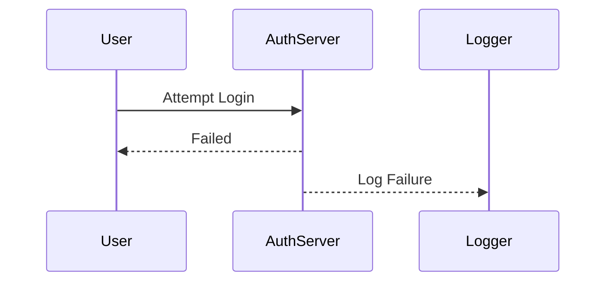
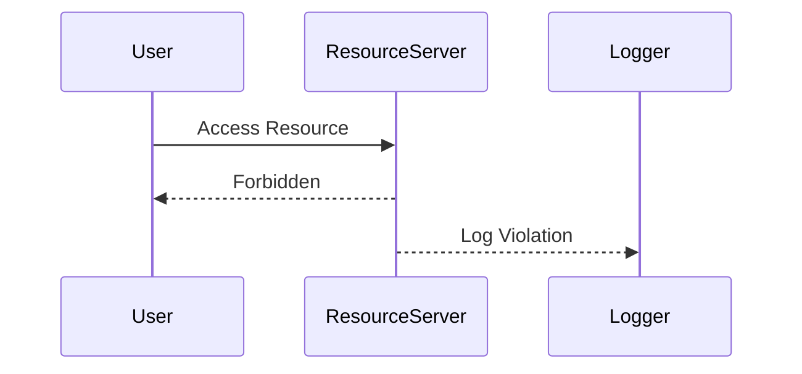
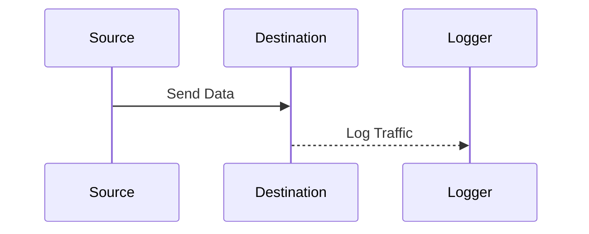

## Defining Key Security Events to Log and Monitor

### Introduction

In the realm of DevSecOps, one of the most critical aspects is ensuring that security incidents are detected and contained as quickly as possible. This is not just about safeguarding data; it also significantly impacts the financial health of an organization. According to recent reports, the cost of a data breach can vary widely depending on how quickly the breach is detected and contained. In this chapter, we will delve into the importance of logging and monitoring key security events, understand the underlying principles, and explore practical methods to integrate these practices into a DevSecOps workflow.

### Importance of Rapid Detection and Containment

The speed at which a security incident is detected and contained is directly proportional to the cost incurred by the organization. A report by the Ponemon Institute found that organizations that were able to detect and contain a breach within 30 days saved approximately $1 million compared to those that took longer. This underscores the critical role of timely detection and containment in minimizing financial losses.

#### Real-World Example: Equifax Data Breach

One of the most notable recent breaches is the Equifax data breach in 2017. The breach exposed sensitive information of over 147 million people. The company was slow to detect and respond to the breach, leading to significant financial and reputational damage. The total cost of the breach was estimated to be around $4 billion, including legal settlements, fines, and operational costs.

### Key Security Events to Log and Monitor

To effectively detect and contain security incidents, it is essential to log and monitor specific types of events. These events provide valuable insights into potential security threats and help in identifying anomalies that could indicate a breach.

#### Authentication Failures

Authentication failures are a common indicator of unauthorized access attempts. Monitoring these events can help detect brute-force attacks and other forms of credential-based attacks.



**Example HTTP Request and Response:**

```http
POST /login HTTP/1.1
Host: example.com
Content-Type: application/json

{
    "username": "admin",
    "password": "wrongpassword"
}

HTTP/1.1 401 Unauthorized
Content-Type: application/json

{
    "message": "Invalid credentials"
}
```

**How to Prevent / Defend:**
- **Secure Coding Fix:** Implement rate limiting on login attempts to prevent brute-force attacks.
  
  **Vulnerable Code:**
  ```python
  def authenticate(username, password):
      if check_password(username, password):
          return True
      else:
          return False
  ```

  **Fixed Code:**
  ```python
  from flask_limiter import Limiter

  limiter = Limiter(app, key_func=get_remote_address)

  @limiter.limit("5 per minute")
  def authenticate(username, password):
      if check_password(username, password):
          return True
      else:
          return False
  ```

- **Configuration Hardening:** Enable multi-factor authentication (MFA) to add an additional layer of security.

#### Access Control Violations

Access control violations occur when a user attempts to access resources or perform actions that they are not authorized to do. Monitoring these events can help detect insider threats and privilege escalation attempts.



**Example HTTP Request and Response:**

```http
GET /admin/dashboard HTTP/1.1
Host: example.com
Authorization: Bearer <token>

HTTP/1.1 403 Forbidden
Content-Type: application/json

{
    "message": "Access denied"
}
```

**How to Prevent / Defend:**
- **Secure Coding Fix:** Implement proper role-based access control (RBAC) to ensure users have the appropriate permissions.

  **Vulnerable Code:**
  ```python
  def access_resource(user_id, resource_id):
      if user_id == 1:
          return get_resource(resource_id)
      else:
          return "Access denied"
  ```

  **Fixed Code:**
  ```python
  def access_resource(user_id, resource_id):
      if has_permission(user_id, "view_resource"):
          return get_resource(resource_id)
      else:
          return "Access denied"
  ```

- **Configuration Hardening:** Regularly audit and review access controls to ensure they align with the principle of least privilege.

#### Network Traffic Anomalies

Network traffic anomalies can indicate malicious activity such as data exfiltration or lateral movement within the network. Monitoring network traffic can help detect these activities and prevent further damage.



**Example Network Traffic:**

```plaintext
Source IP: 192.168.1.10
Destination IP: 192.168.1.20
Protocol: TCP
Port: 80
Data: Encrypted payload
```

**How to Prevent / Defend:**
- **Secure Coding Fix:** Implement network segmentation to limit the spread of malicious traffic.

  **Vulnerable Configuration:**
  ```yaml
  network:
    segments:
      - name: internal
        ip_range: 192.168.1.0/24
      - name: external
        ip_range: 192.168.2.0/24
  ```

  **Fixed Configuration:**
  ```yaml
  network:
    segments:
      - name: internal
        ip_range: 192.168.1.0/24
        firewall_rules:
          - allow: internal
          - deny: external
      - name: external
        ip_range:  192.168.2.0/24
        firewall_rules:
          - allow: external
          - deny: internal
  ```

- **Configuration Hardening:** Use intrusion detection systems (IDS) to monitor and alert on suspicious network traffic.

### Building a Business Case for Integration

Integrating security incident response into DevSecOps requires a strong business case. This involves demonstrating the financial benefits of rapid detection and containment, as well as the potential risks of not doing so.

#### Financial Benefits

- **Reduced Costs:** As mentioned earlier, the quicker a breach is detected and contained, the lower the financial impact.
- **Reputation Management:** Timely response helps in maintaining customer trust and reducing the negative impact on the brand.

#### Potential Risks

- **Data Loss:** Delayed detection can lead to extensive data loss, which can be costly to recover.
- **Regulatory Penalties:** Non-compliance with data protection regulations can result in significant fines and legal consequences.

### Practical Implementation

To effectively implement logging and monitoring of key security events, organizations need to adopt a comprehensive approach that includes both technical and organizational measures.

#### Technical Measures

- **Logging Frameworks:** Use robust logging frameworks like ELK (Elasticsearch, Logstash, Kibana) or Splunk to centralize and analyze logs.
- **Monitoring Tools:** Employ monitoring tools like Prometheus and Grafana to visualize and alert on anomalous behavior.

#### Organizational Measures

- **Incident Response Plan:** Develop and maintain an incident response plan that outlines the steps to be taken in the event of a security incident.
- **Training and Awareness:** Conduct regular training sessions to ensure that all team members are aware of their roles and responsibilities in incident response.

### Hands-On Labs

For practical experience in integrating security incident response into DevSecOps, consider the following well-known labs:

- **PortSwigger Web Security Academy:** Offers hands-on labs to practice detecting and responding to web application security incidents.
- **OWASP Juice Shop:** Provides a vulnerable web application to practice identifying and mitigating security issues.
- **CloudGoat:** Focuses on cloud security and provides scenarios to practice securing cloud environments.

### Conclusion

In conclusion, the rapid detection and containment of security incidents are crucial for minimizing the financial impact of data breaches. By logging and monitoring key security events, organizations can proactively identify and respond to potential threats. Integrating these practices into a DevSecOps workflow requires a combination of technical and organizational measures, supported by robust logging and monitoring tools. By taking these steps, organizations can significantly reduce the risk and cost associated with security incidents.

---
<!-- nav -->
[[DevSecOps/DevSecOps Bootcamp/08-Logging & Incident Response/01-Defining Key Security Events to Log and Monitor/01-Cost of Data Breach/01-Introduction to Key Security Events to Log and Monitor|Introduction to Key Security Events to Log and Monitor]] | [[DevSecOps/DevSecOps Bootcamp/08-Logging & Incident Response/01-Defining Key Security Events to Log and Monitor/01-Cost of Data Breach/00-Overview|Overview]] | [[DevSecOps/DevSecOps Bootcamp/08-Logging & Incident Response/01-Defining Key Security Events to Log and Monitor/01-Cost of Data Breach/03-Practice Questions & Answers|Practice Questions & Answers]]
