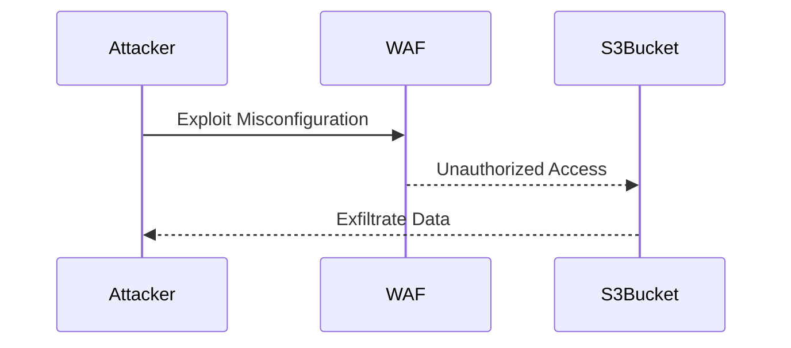

## Introduction to AWS Config Rules and Security Monitoring

AWS Config is a service that enables you to assess, audit, and record changes to your AWS resources. By using AWS Config, you can establish rules to monitor your resources for compliance with specific policies. In this chapter, we will delve into the process of creating an AWS Config rule to monitor and log key security events, specifically focusing on preventing public access to S3 buckets.

### Background Theory

Before diving into the practical steps, let's understand the underlying concepts:

#### What is AWS Config?

AWS Config is a configuration management service that provides you with an inventory of the AWS resources in your account, along with their relationships, configurations, and compliance. It continuously monitors and records configuration changes to your resources, providing you with a detailed history of your infrastructure.

#### Why Use AWS Config?

Using AWS Config helps you maintain compliance with internal policies and external regulations. It allows you to track changes, identify non-compliant resources, and take corrective actions. Additionally, it provides a comprehensive view of your AWS environment, enabling you to manage and audit your resources effectively.

#### How Does AWS Config Work?

AWS Config works by collecting configuration data from your AWS resources and storing it in a central repository. You can define rules to check whether your resources comply with specific criteria. When a resource violates a rule, AWS Config triggers an alert, allowing you to take action.

### Setting Up an AWS Config Rule for S3 Buckets

In this section, we will create an AWS Config rule to ensure that no S3 buckets have public access. This is crucial because allowing public access to S3 buckets can lead to data exposure and potential security breaches.

#### Step-by-Step Process

1. **Navigate to the S3 Management Console**
2. **Modify Bucket Configuration**
3. **Create an AWS Config Rule**
4. **Monitor and Respond to Alerts**

#### Detailed Steps

1. **Navigate to the S3 Management Console**

   Open the AWS Management Console and navigate to the S3 service. Select the bucket you want to modify.

   ```mermaid
graph LR
       A[Open AWS Console] --> B[Navigate to S3 Service]
       B --> C[Select Bucket]
```

2. **Modify Bucket Configuration**

   - **Allow Public Access**: Temporarily allow public access to demonstrate the rule creation.
     - Navigate to the bucket properties.
     - Uncheck the "Block all public access" option.
     - Save the changes.

     ```mermaid
sequenceDiagram
         participant User
         participant S3Console
         User->>S3Console: Navigate to Bucket Properties
         S3Console-->>User: Display Bucket Properties
         User->>S3Console: Uncheck Block All Public Access
         S3Console-->>User: Confirm Changes
         User->>S3Console: Save Changes
```

   - **Warning**: This step is dangerous in a production environment. Ensure you do not perform this action in a live environment.

3. **Create an AWS Config Rule**

   - **Navigate to AWS Config Console**
     - Open the AWS Management Console and navigate to the AWS Config service.
     - Click on "Rules" and then "Create Rule".

     ```mermaid
graph LR
         A[Open AWS Console] --> B[Navigate to AWS Config Service]
         B --> C[Click on Rules]
         C --> D[Click on Create Rule]
```

   - **Define the Rule**
     - Choose a rule type (e.g., "Predefined").
     - Select the rule "S3BucketPublicAccessProhibited".
     - Configure the rule parameters as needed.
     - Add a description and name for the rule.
     - Click "Next" and then "Create".

     ```mermaid
sequenceDiagram
         participant User
         participant AWSConfigConsole
         User->>AWSConfigConsole: Navigate to Rules
         AWSConfigConsole-->>User: Display Rules Page
         User->>AWSConfigConsole: Click on Create Rule
         AWSConfigConsole-->>User: Display Rule Creation Form
         User->>AWSConfigConsole: Select Predefined Rule Type
         User->>AWSConfigConsole: Choose S3BucketPublicAccessProhibited
         User->>AWSConfigConsole: Configure Parameters
         User->>AWSConfigConsole: Add Description and Name
         User->>AWSConfigConsole: Click Next
         User->>AWSConfigConsole: Click Create
```

4. **Monitor and Respond to Alerts**

   - **Check Non-Compliant Resources**
     - After creating the rule, navigate back to the AWS Config console.
     - Check the list of non-compliant resources.
     - Identify the specific bucket that is non-compliant.

     ```mermaid
graph LR
         A[Open AWS Config Console] --> B[Check Non-Compliant Resources]
         B --> C[Identify Non-Compliant Bucket]
```

   - **Review Alert Emails**
     - AWS Config will send alerts via an SNS topic.
     - Review the alert emails to understand the non-compliance issue.

     ```mermaid
sequenceDiagram
         participant User
         participant AWSConfig
         participant SNS
         AWSConfig-->>SNS: Trigger Alert
         SNS-->>User: Send Email
         User->>AWSConfig: Review Alert
```

### Real-World Examples and Recent Breaches

#### Example: Capital One Data Breach (CVE-2019-11510)

In 2019, Capital One suffered a significant data breach due to misconfigured S3 buckets. An attacker exploited a misconfigured web application firewall (WAF) to gain unauthorized access to sensitive customer data stored in S3 buckets. This breach highlights the importance of monitoring and securing S3 buckets to prevent unauthorized access.



### How to Prevent / Defend

#### Detection

- **Use AWS Config**: Continuously monitor your S3 buckets for public access.
- **Set Up Alerts**: Configure SNS topics to receive alerts when a bucket becomes non-compliant.

#### Prevention

- **Block Public Access**: Ensure that the "Block all public access" option is enabled for all S3 buckets.
- **IAM Policies**: Restrict permissions to S3 buckets using IAM policies to limit access to authorized users only.

#### Secure-Coding Fixes

**Vulnerable Code Example**:

```json
{
  "Version": "2012-10-17",
  "Statement": [
    {
      "Sid": "PublicReadGetObject",
      "Effect": "Allow",
      "Principal": "*",
      "Action": "s3:GetObject",
      "Resource": "arn:aws:s3:::my-bucket/*"
    }
  ]
}
```

**Secure Code Example**:

```json
{
  "Version": "2012-10-17",
  "Statement": [
    {
      "Sid": "DenyPublicReadGetObject",
      "Effect": "Deny",
      "Principal": "*",
      "Action": "s3:GetObject",
      "Resource": "arn:aws:s3:::my-bucket/*",
      "Condition": {
        "StringNotEquals": {
          "aws:PrincipalArn": [
            "arn:aws:iam::123456789012:user/authorized-user",
            "arn:aws:iam::123456789012:role/authorized-role"
          ]
        }
      }
    }
  ]
}
```

#### Configuration Hardening

- **Enable Server-Side Encryption**: Ensure that all objects in the S3 bucket are encrypted using server-side encryption.
- **Use Versioning**: Enable versioning on S3 buckets to prevent accidental deletion or modification of objects.

### Complete Example

#### Full HTTP Request and Response

**HTTP Request**:

```http
POST /aws-config/rules/create HTTP/1.1
Host: config.amazonaws.com
Content-Type: application/json

{
  "RuleName": "NoPublicS3Access",
  "Source": {
    "Owner": "AWS",
    "SourceIdentifier": "S3BucketPublicAccessProhibited"
  },
  "Description": "Ensure no S3 buckets have public access.",
  "InputParameters": {},
  "Scope": {
    "ComplianceResourceTypes": ["AWS::S3::Bucket"]
  },
  "Tags": [
    {
      "Key": "Environment",
      "Value": "Production"
    }
  ],
  "ConfigRuleArn": "arn:aws:config:us-east-1:123456789012:config-rule/some-unique-id"
}
```

**HTTP Response**:

```http
HTTP/1.1 200 OK
Content-Type: application/json

{
  "ConfigRuleArn": "arn:aws:config:us-east-1:123456789012:config-rule/some-unique-id",
  "ConfigRuleId": "some-unique-id",
  "ConfigRuleName": "NoPublicS3Access",
  "Description": "Ensure no S3 buckets have public access.",
  "InputParameters": {},
  "Scope": {
    "ComplianceResourceTypes": ["AWS::S3::Bucket"]
  },
  "Source": {
    "Owner": "AWS",
    "SourceIdentifier": "S3BucketPublicAccessProhibited"
  },
  "Tags": [
    {
      1: "Environment",
      2: "Production"
    }
  ]
}
```

#### Expected Result

The AWS Config rule is successfully created, and you can monitor your S3 buckets for compliance with the rule.

### Common Pitfalls and Mistakes

- **Disabling Block Public Access**: Accidentally disabling the "Block all public access" option can expose your S3 buckets to unauthorized access.
- **Ignoring Alerts**: Failing to respond to alerts generated by AWS Config can lead to prolonged exposure of sensitive data.
- **Misconfigured IAM Policies**: Incorrectly configured IAM policies can grant unintended access to S3 buckets.

### Hands-On Labs

For hands-on practice, consider the following labs:

- **PortSwigger Web Security Academy**: Focuses on web application security but includes sections on AWS services.
- **OWASP Juice Shop**: A deliberately insecure web application for practicing security testing.
- **CloudGoat**: A set of labs designed to help you learn about cloud security and compliance.

### Conclusion

By setting up AWS Config rules to monitor and log key security events, you can significantly enhance the security posture of your AWS environment. Understanding the underlying concepts, following the detailed steps, and learning from real-world examples will help you effectively manage and secure your AWS resources.

---
<!-- nav -->
[[DevSecOps/DevSecOps Bootcamp/08-Logging & Incident Response/01-Defining Key Security Events to Log and Monitor/02-Creating AWS Config Rule/00-Overview|Overview]] | [[02-Introduction to AWS Config Rules|Introduction to AWS Config Rules]]
