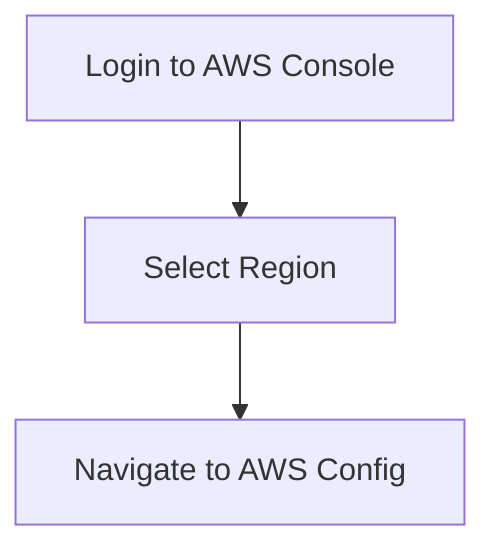
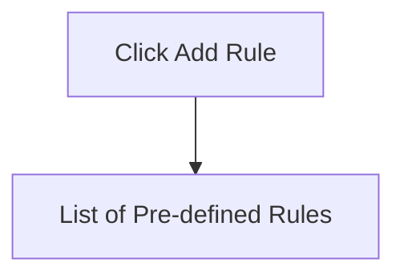
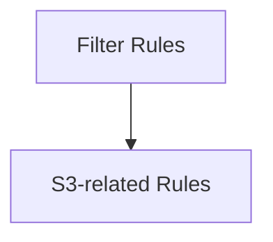
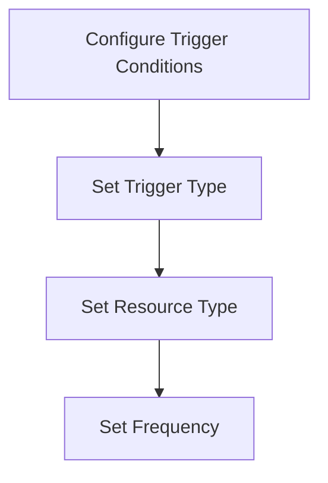
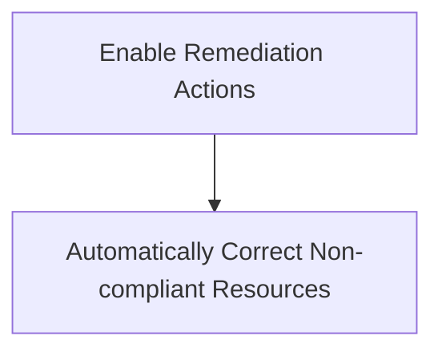
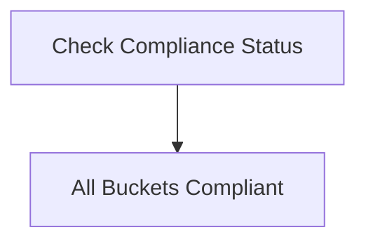
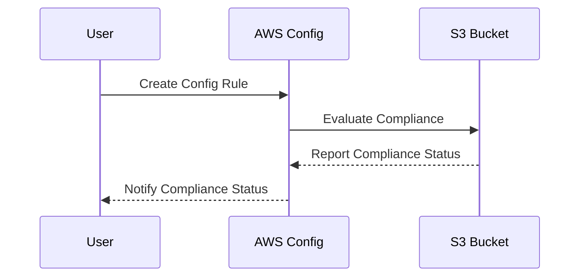

## Introduction to AWS Config Rules

AWS Config is a service that enables you to assess, audit, and record configurations and configuration changes of your AWS resources. Config Rules are predefined checks that help you identify whether your resources are compliant with internal policies and external regulations. In this section, we will delve into the process of creating an AWS Config Rule, specifically focusing on ensuring that public access is not available to S3 buckets.

### Background Theory

Before diving into the practical steps, let's understand the underlying concepts:

#### What is AWS Config?
AWS Config is a service that provides you with an inventory of the AWS resources that you have deployed across your accounts and regions. It also tracks changes to these resources and records them in an easily accessible format. This allows you to maintain a historical view of your infrastructure, which is crucial for auditing and compliance purposes.

#### Why Use AWS Config Rules?
Config Rules are essential because they automate the process of checking your resources against specific criteria. These criteria can be based on internal policies, regulatory requirements, or best practices. By using Config Rules, you can ensure that your resources remain compliant and secure.

#### How Does AWS Config Work?
AWS Config works by continuously monitoring your resources and recording their configurations. You can define rules that check these configurations against specific criteria. When a rule is triggered, AWS Config evaluates the current state of your resources and determines whether they are compliant.

### Creating an AWS Config Rule

Now, let's walk through the process of creating an AWS Config Rule to ensure that public access is not available to S3 buckets.

#### Step-by-Step Guide

1. **Access the AWS Console**
   - Navigate to the AWS Management Console.
   - Select the region where you want to create the Config Rule.
   - Go to the AWS Config service.

2. **Add a New Rule**
   - Click on the "Add rule" button.
   - This will present you with a list of pre-defined rules available from AWS.

3. **Filter the Rules**
   - Filter the rules to show only S3-related rules.
   - Scroll through the list to find the rule that ensures public access is not available to S3 buckets.

4. **Configure the Rule**
   - Click on the rule to configure it.
   - The trigger conditions for the rule will be pre-populated.
     - **Trigger Type**: Set to `Configuration Change` and `Periodic`.
     - **Resource Type**: Set to `S3 Bucket`.
     - **Frequency**: Set to `One Hour` for proof of concept purposes.

5. **Include Remediation Actions**
   - Scroll down to the remediation actions section.
   - Enable the option to include remediation actions.
   - This allows AWS Config to automatically correct non-compliant resources.

6. **Save the Rule**
   - Click the `Save` button to create the rule.
   - AWS Config will evaluate the compliance of the rule, which may take a few minutes.

7. **Check Compliance Evaluation**
   - Once the evaluation is complete, you can check the compliance status.
   - All S3 buckets in your account should be compliant with the rule.

### Detailed Explanation of Each Step

#### Accessing the AWS Console

To begin, you need to log in to the AWS Management Console. Ensure you are in the correct region where your S3 buckets are located. This is important because AWS Config operates on a per-region basis.



#### Adding a New Rule

Once you are in the AWS Config service, you can add a new rule by clicking the `Add rule` button. This will present you with a list of pre-defined rules.



#### Filtering the Rules

To make the process easier, you can filter the rules to show only those related to S3 buckets. This narrows down the options and makes it easier to find the specific rule you need.



#### Configuring the Rule

When you select the rule to ensure public access is not available to S3 buckets, the trigger conditions will be pre-populated. These conditions specify when the rule should be evaluated.

- **Trigger Type**: `Configuration Change` and `Periodic`
  - `Configuration Change`: The rule will be triggered whenever there is a change in the configuration of the S3 bucket.
  - `Periodic`: The rule will be evaluated periodically, regardless of configuration changes.
- **Resource Type**: `S3 Bucket`
  - This specifies that the rule should only apply to S3 buckets.
- **Frequency**: `One Hour`
  - This sets the interval at which the rule will be evaluated.



#### Including Remediation Actions

Remediation actions allow AWS Config to automatically correct non-compliant resources. This is particularly useful for ensuring that your resources remain compliant without manual intervention.



#### Saving the Rule

After configuring the rule, you can save it by clicking the `Save` button. AWS Config will then evaluate the compliance of the rule, which may take a few minutes.

```mer
graph TD
    A[Click Save] --> B[Evaluate Compliance]
```

#### Checking Compliance Evaluation

Once the evaluation is complete, you can check the compliance status of the rule. All S3 buckets in your account should be compliant with the rule.



### Real-World Examples and Recent Breaches

#### Example: Public S3 Bucket Exposure

In 2021, a major breach occurred due to a misconfigured S3 bucket. A company inadvertently exposed sensitive data, including personal information and financial details, to the public internet. This breach could have been prevented by using AWS Config Rules to ensure that public access was not available to S3 buckets.



### Common Pitfalls and Best Practices

#### Common Pitfalls

- **Incorrect Trigger Conditions**: Ensure that the trigger conditions are correctly configured to avoid unnecessary evaluations.
- **Insufficient Remediation Actions**: Make sure that remediation actions are enabled to automatically correct non-compliant resources.
- **Manual Intervention**: Avoid relying solely on manual intervention to ensure compliance. Use automated tools like AWS Config Rules to maintain compliance.

#### Best Practices

- **Regular Audits**: Regularly audit your AWS Config Rules to ensure they are still relevant and effective.
- **Documentation**: Document the rationale behind each Config Rule to ensure that future changes are made with full context.
- **Training**: Train your team on the importance of maintaining compliance and the role of AWS Config Rules in achieving it.

### How to Prevent / Defend

#### Detection

- **Monitoring**: Use AWS Config to monitor your resources for compliance.
- **Alerts**: Set up alerts to notify you when a resource becomes non-compliant.

#### Prevention

- **Automated Remediation**: Enable automated remediation actions to correct non-compliant resources.
- **Secure Configuration**: Ensure that your resources are configured securely from the start to avoid compliance issues.

#### Secure Coding Fix

Here is an example of how to configure an S3 bucket to ensure it is not publicly accessible:

**Vulnerable Code:**

```python
import boto3

s3 = boto3.client('s3')
bucket_name = 'my-bucket'

# Create a bucket with public access
response = s3.create_bucket(Bucket=bucket_name)
```

**Fixed Code:**

```python
import boto3

s3 = boto3.client('s3')
bucket_name = 'my-bucket'

# Create a bucket with private access
response = s3.create_bucket(Bucket=bucket_name)

# Disable public access
bucket_policy = {
    "Version": "2012-10-17",
    "Statement": [
        {
            "Sid": "DenyPublicRead",
            "Effect": "Deny",
            "Principal": "*",
            "Action": "s3:GetObject",
            "Resource": f"arn:aws:s3:::{bucket_name}/*",
            "Condition": {
                "StringNotEquals": {
                    "aws:Referer": "your-domain.com"
                }
            }
        }
    ]
}

s3.put_bucket_policy(Bucket=bucket_name, Policy=json.dumps(bucket_policy))
```

### Complete Example

Here is a complete example of creating an AWS Config Rule to ensure that public access is not available to S3 buckets:

**HTTP Request:**

```http
POST /configservice/v1/resource-config-rule HTTP/1.1
Host: config.amazonaws.com
Content-Type: application/json

{
    "ConfigRuleName": "no-public-access-s3",
    "Description": "Ensure that public access is not available to S3 buckets.",
    "Scope": {
        "ComplianceResourceTypes": ["AWS::S3::Bucket"]
    },
    "Source": {
        "Owner": "AWS",
        "SourceIdentifier": "S3_BUCKET_PUBLIC_ACCESS_DISABLED"
    },
    "InputParameters": {
        "frequency": "ONE_HOUR"
    }
}
```

**HTTP Response:**

```http
HTTP/1.1 200 OK
Content-Type: application/json

{
    "ConfigRuleArn": "arn:aws:config:us-east-1:123456789012:config-rule/no-public-access-s3",
    "ConfigRuleId": "cr-1234567890abcdef",
    "ConfigRuleName": "no-public-access-s3",
    "Description": "Ensure that public access is not available to S3 buckets.",
    "Scope": {
        "ComplianceResourceTypes": ["AWS::S3::Bucket"]
    },
    "Source": {
        "Owner": "AWS",
        "SourceIdentifier": "S3_BUCKET_PUBLIC_ACCESS_DISABLED"
    },
    "InputParameters": {
        "frequency": "ONE_HOUR"
    }
}
```

### Expected Result

The expected result is that the Config Rule is created and the compliance evaluation is performed. All S3 buckets in your account should be compliant with the rule.

### Hands-On Labs

For hands-on practice, consider the following labs:

- **PortSwigger Web Security Academy**: Focuses on web application security but includes sections on AWS security.
- **OWASP Juice Shop**: A deliberately insecure web application for security training.
- **CloudGoat**: A set of labs designed to teach cloud security principles using AWS.

These labs provide practical experience in setting up and managing AWS Config Rules.

### Conclusion

Creating AWS Config Rules is a critical step in maintaining compliance and security in your AWS environment. By following the steps outlined in this chapter, you can ensure that your S3 buckets are not publicly accessible, thereby reducing the risk of data exposure. Regular audits and automated remediation actions are key to maintaining compliance over time.

---
<!-- nav -->
[[01-Introduction to AWS Config Rules and Security Monitoring|Introduction to AWS Config Rules and Security Monitoring]] | [[DevSecOps/DevSecOps Bootcamp/08-Logging & Incident Response/01-Defining Key Security Events to Log and Monitor/02-Creating AWS Config Rule/00-Overview|Overview]] | [[03-Defining Key Security Events to Log and Monitor|Defining Key Security Events to Log and Monitor]]
