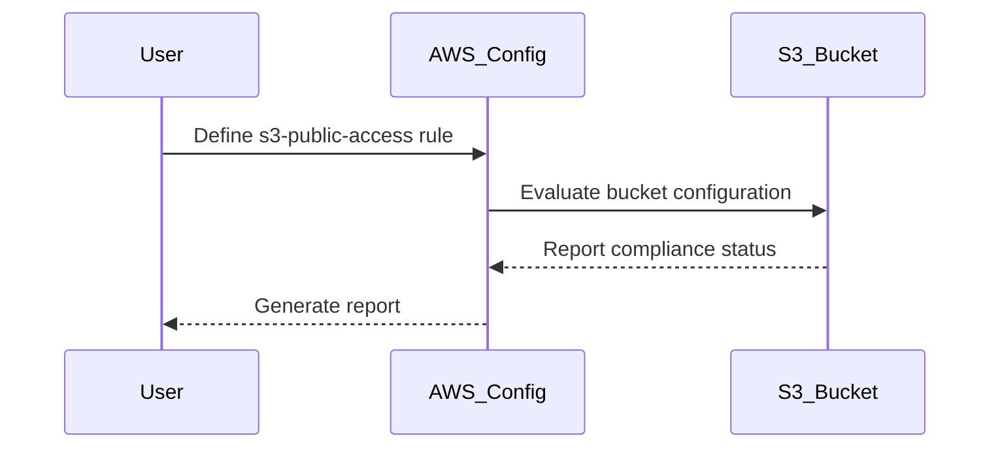

## Defining Key Security Events to Log and Monitor

### Introduction to AWS Config Rules

AWS Config is a service that enables you to assess, audit, and record configurations and configuration changes of your AWS resources. By using AWS Config, you can ensure that your resources are configured according to your organization’s policies and compliance requirements. One of the key features of AWS Config is the ability to define custom rules, known as AWS Config Rules, which can automatically check the configuration of your resources against predefined rules.

### Understanding AWS Config Rules

#### What Are AWS Config Rules?

AWS Config Rules are automated checks that continuously evaluate the configuration of your AWS resources. These rules help you identify and remediate non-compliant resources. Each rule is defined by a set of parameters and a logic that determines whether the resource is compliant or not.

#### Why Use AWS Config Rules?

Using AWS Config Rules helps you maintain compliance with internal policies and external regulations. It also allows you to detect and respond to misconfigurations quickly, reducing the risk of security vulnerabilities and compliance issues.

#### How Do AWS Config Rules Work?

AWS Config Rules work by evaluating the configuration of your resources against predefined rules. You can create rules based on specific conditions, such as checking if an S3 bucket is publicly accessible. When a resource is evaluated, AWS Config compares its current state with the rule definition. If the resource does not comply with the rule, AWS Config generates a non-compliant report.

### Example: Monitoring Public Access Settings for S3 Buckets

Let's walk through an example of creating an AWS Config Rule to monitor public access settings for S3 buckets.

#### Background Theory

Publicly accessible S3 buckets can pose significant security risks. If a bucket is publicly accessible, anyone on the internet can read or write to it, potentially leading to data leaks or unauthorized modifications. To mitigate this risk, it is crucial to monitor and control public access settings for S3 buckets.

#### Step-by-Step Mechanics

1. **Define the Rule**: Create a rule that checks if an S3 bucket is publicly accessible.
2. **Configure the Rule**: Set up the rule parameters to specify the conditions under which the bucket should be considered compliant.
3. **Evaluate Resources**: AWS Config evaluates the configuration of your S3 buckets against the rule.
4. **Generate Reports**: If a bucket is found to be non-compliant, AWS Config generates a report.

#### Complete Code Example

Here is an example of how to create an AWS Config Rule to monitor public access settings for S3 buckets using the AWS Management Console:

```json
{
  "ConfigRuleName": "s3-public-access",
  "Description": "Checks if S3 buckets are publicly accessible.",
  "Scope": {
    "ComplianceResourceTypes": [
      "AWS::S3::Bucket"
    ]
  },
  "Source": {
    "Owner": "AWS",
    "SourceIdentifier": "S3_BUCKET_PUBLIC_ACCESS"
  }
}
```

This JSON configuration defines a rule named `s3-public-access` that checks if S3 buckets are publicly accessible. The `Scope` specifies that the rule applies to S3 buckets (`AWS::S3::Bucket`). The `Source` indicates that the rule is provided by AWS and uses the `S3_BUCKET_PUBLIC_ACCESS` identifier.

#### Mermaid Diagram: Rule Evaluation Flow



### Real-World Examples and Recent Breaches

#### Recent Breaches Involving Public S3 Buckets

One notable breach involving public S3 buckets occurred in 2021 when a large amount of sensitive data was exposed due to misconfigured S3 buckets. This incident highlights the importance of monitoring and controlling public access settings for S3 buckets.

#### CVE Example

CVE-2021-26084 is a critical vulnerability that affects AWS S3 buckets. This vulnerability arises from improper configuration of S3 buckets, allowing unauthorized access to sensitive data. By using AWS Config Rules, you can proactively detect and remediate such misconfigurations.

### Pitfalls and Common Mistakes

#### Common Mistakes

1. **Not Regularly Reviewing Compliance Reports**: Failing to regularly review compliance reports can lead to missed non-compliant resources.
2. **Incorrect Rule Definitions**: Incorrectly defining rules can result in false positives or negatives, leading to misinterpretation of compliance status.
3. **Ignoring Resource Changes**: Not accounting for changes in resource configurations can result in outdated compliance reports.

### How to Prevent / Defend

#### Detection

To detect misconfigurations, you can use AWS Config Rules to continuously evaluate the configuration of your resources. Additionally, you can set up alerts to notify you of non-compliant resources.

#### Prevention

To prevent misconfigurations, you can implement strict policies and controls around resource configurations. This includes:

1. **Automated Compliance Checks**: Use AWS Config Rules to automate compliance checks.
2. **Regular Audits**: Conduct regular audits to ensure compliance with internal policies and external regulations.
3. **Training and Awareness**: Educate your team on the importance of proper resource configurations and the risks associated with misconfigurations.

#### Secure Coding Fixes

Here is an example of how to configure an S3 bucket to prevent public access:

**Vulnerable Configuration**

```json
{
  "Version": "2012-10-17",
  "Statement": [
    {
      "Sid": "PublicReadGetObject",
      "Effect": "Allow",
      "Principal": "*",
      "Action": "s3:GetObject",
      "Resource": "arn:aws:s3:::my-bucket/*"
    }
  ]
}
```

**Secure Configuration**

```json
{
  "Version": "2012-10-17",
  "Statement": [
    {
      "Sid": "DenyPublicAccess",
      "Effect": "Deny",
      "Principal": "*",
      "Action": "s3:*",
      "Resource": "arn:aws:s3:::my-bucket/*",
      "Condition": {
        "StringEquals": {
          "aws:PrincipalIsAWSService": "false"
        }
      }
    }
  ]
}
```

In the secure configuration, the `DenyPublicAccess` statement prevents public access to the S3 bucket.

### Configuration Hardening

To further harden your S3 bucket configurations, you can:

1. **Enable Bucket Policies**: Use bucket policies to restrict access to the bucket.
2. **Use IAM Policies**: Implement IAM policies to control access to the bucket.
3. **Enable Server-Side Encryption**: Enable server-side encryption to protect data at rest.

### Conclusion

By using AWS Config Rules, you can effectively monitor and control the configuration of your AWS resources, ensuring compliance with internal policies and external regulations. This proactive approach helps you detect and remediate misconfigurations, reducing the risk of security vulnerabilities and compliance issues.

### Practice Labs

For hands-on practice with AWS Config Rules, consider the following labs:

- **PortSwigger Web Security Academy**: Offers a comprehensive set of labs covering various aspects of web security, including AWS Config Rules.
- **OWASP Juice Shop**: Provides a vulnerable web application that you can use to practice securing AWS resources.
- **CloudGoat**: A cloud security training platform that includes exercises on AWS Config Rules and other security practices.

These labs will help you gain practical experience in defining and implementing AWS Config Rules to monitor and control the configuration of your AWS resources.

---
<!-- nav -->
[[02-Introduction to AWS Config Rules|Introduction to AWS Config Rules]] | [[DevSecOps/DevSecOps Bootcamp/08-Logging & Incident Response/01-Defining Key Security Events to Log and Monitor/02-Creating AWS Config Rule/00-Overview|Overview]] | [[DevSecOps/DevSecOps Bootcamp/08-Logging & Incident Response/01-Defining Key Security Events to Log and Monitor/02-Creating AWS Config Rule/04-Practice Questions & Answers|Practice Questions & Answers]]
