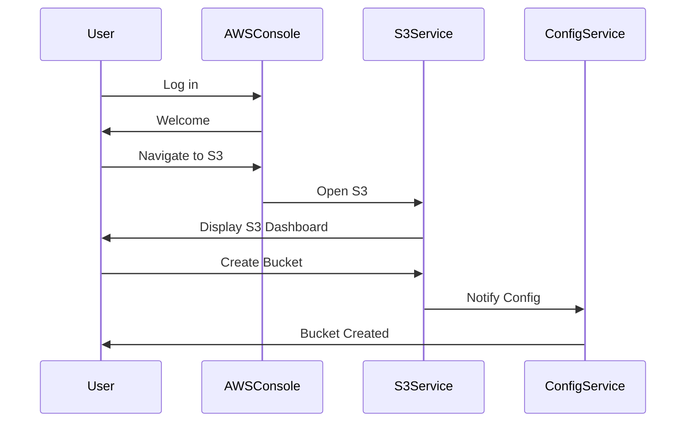

## Introduction to AWS Config and SNS Notifications

AWS Config is a service that enables you to assess, audit, and record changes to your AWS resources. It provides you with an inventory of the resources in your AWS environment, along with their relationships, configurations, and compliance. This information can be used to track changes, ensure compliance with internal policies and external regulations, and troubleshoot issues.

### Why Use AWS Config?

AWS Config helps you maintain visibility into your AWS environment by providing a detailed view of your resources and their configurations. This is particularly useful for:

- **Compliance**: Ensuring that your resources adhere to specific policies and regulations.
- **Auditing**: Tracking changes to your resources over time.
- **Troubleshooting**: Identifying the state of your resources during an incident.

### How AWS Config Works

AWS Config works by continuously collecting data about your AWS resources. This data includes:

- **Resource Inventory**: A list of all your resources.
- **Configuration History**: A record of changes made to your resources.
- **Relationships**: Information about how your resources are interconnected.

#### Configuration Recorder

The Configuration Recorder is a component of AWS Config that captures the configuration of your resources. It can capture the configuration of all supported resource types or a subset based on your requirements.

#### Aggregator

An Aggregator allows you to collect configuration data from multiple accounts and regions into a single location. This is useful for managing large environments with many accounts and regions.

### Setting Up AWS Config

To set up AWS Config, you need to perform several steps:

1. **Create a Configuration Recorder**.
2. **Enable Recording**.
3. **Set Up Delivery Channel**.

#### Step-by-Step Setup

Let's walk through the process of setting up AWS Config using the AWS Management Console.

1. **Log in to Your AWS Account**:
   - Navigate to the AWS Management Console and log in with your account credentials.

2. **Navigate to S3 Service**:
   - From the AWS Management Console, navigate to the S3 service.

3. **Create a New Bucket**:
   - Click on "Create Bucket".
   - Enter a name for the bucket, such as `WardBrainCoffeeDemo`.
   - Select the region where you want to create the bucket, e.g., Dublin.
   - Leave all other default settings in place.
   - Ensure "Block all public access" is selected.
   - Click "Create Bucket".



4. **Configure AWS Config**:
   - Duplicate the current tab and navigate to the AWS Config service.
   - Wait for AWS Config to recognize the newly created bucket.

### Configuring SNS Notifications

Once AWS Config is set up, you can configure SNS (Simple Notification Service) to send notifications about specific events.

#### What is SNS?

SNS is a fully managed pub/sub messaging service. It allows you to send messages to multiple subscribers, including email addresses, SMS numbers, SQS queues, Lambda functions, and more.

#### Why Use SNS with AWS Config?

Using SNS with AWS Config allows you to receive notifications about specific events, such as changes to your resources or compliance violations. This can help you quickly respond to issues and maintain compliance.

#### Steps to Configure SNS Notifications

1. **Create an SNS Topic**:
   - Navigate to the SNS service in the AWS Management Console.
   - Click on "Create Topic".
   - Enter a name for the topic, e.g., `ConfigNotifications`.
   - Click "Create Topic".

2. **Subscribe to the Topic**:
   - Click on the topic you just created.
   - Click on "Create subscription".
   - Choose the protocol (e.g., email, SMS, SQS queue).
   - Enter the endpoint (e.g., email address).
   - Click "Create subscription".

3. **Configure AWS Config to Send Notifications**:
   - Navigate back to the AWS Config service.
   - Click on "Delivery Channels".
   - Click on "Add delivery channel".
   - Select the S3 bucket you created earlier.
   - Select the SNS topic you created.
   - Click "Save".

### Example of an SNS Notification

Here is an example of an SNS notification sent when a resource configuration changes:

```http
POST / HTTP/1.1
Host: sns.amazonaws.com
Content-Type: application/json
X-Amz-Sns-Message-Type: Notification
X-Amz-Sns-Topic-Arn: arn:aws:sns:us-east-1:123456789012:ConfigNotifications
X-Amz-Sns-MESSAGE-ID: 12345678-1234-1234-1234-123456789012
X-Amz-Sns-Timestamp: 2023-10-01T12:00:00Z
X-Amz-Sns-UNSUBSCRIBE-URL: https://sns.us-east-1.amazonaws.com/?Action=Unsubscribe&SubscriptionArn=arn:aws:sns:us-east-1:123456789012:ConfigNotifications:12345678-1234-1234-1234-123456789012

{
  "Type": "Notification",
  "MessageId": "12345678-1234-1234-1234-123456789012",
  "TopicArn": "arn:aws:sns:us-east-1:123456789012:ConfigNotifications",
  "Subject": "Resource Configuration Change",
  "Message": "{\"configurationItemDiff\": {\"before\": {\"resourceType\": \"AWS::EC2::Instance\", \"configuration\": {\"instanceId\": \"i-1234567890abcdef0\", \"imageId\": \"ami-0abcdef1234567890\", \"instanceType\": \"t2.micro\"}}, \"after\": {\"resourceType\": \"AWS::EC2::Instance\", \"configuration\": {\"instanceId\": \"i-1234567890abcdef0\", \"imageId\": \"ami-0abcdef1234567890\", \"instanceType\": \"t2.large\"}}}}",
  "Timestamp": "2023-10-01T12:00:00Z",
  "SignatureVersion": "1",
  "Signature": "EXAMPLESIGNATURE",
  "SigningCertURL": "https://sns.us-east-1.amazonaws.com/SimpleNotificationService-EXAMPLE.pem",
  "UnsubscribeURL": "https://sns.us-east-1.amazonaws.com/?Action=Unsubscribe&SubscriptionArn=arn:aws:sns:us-east-1:123456789012:ConfigNotifications:12345678-1234-1234-1234-123456789012"
}
```

### Common Pitfalls and Best Practices

#### Pitfall: Not Configuring SNS Properly

If SNS is not configured correctly, you may miss important notifications. Always verify that your subscriptions are active and that the endpoints are correct.

#### Best Practice: Use IAM Roles

Use IAM roles to grant permissions to SNS and AWS Config. This ensures that only authorized entities can send and receive notifications.

### How to Prevent / Defend

#### Detection

- **Monitor SNS Topics**: Regularly check the SNS topics to ensure they are receiving notifications.
- **Audit AWS Config**: Periodically review the AWS Config dashboard to ensure that it is capturing the necessary data.

#### Prevention

- **IAM Policies**: Use IAM policies to restrict access to SNS and AWS Config.
- **Secure S3 Buckets**: Ensure that the S3 buckets used by AWS Config are properly secured.

#### Secure Coding Fixes

Here is an example of a vulnerable IAM policy and its secure counterpart:

**Vulnerable Policy**:
```json
{
  "Version": "2012-10-17",
  "Statement": [
    {
      "Effect": "Allow",
      "Action": [
        "sns:*",
        "config:*"
      ],
      "Resource": "*"
    }
  ]
}
```

**Secure Policy**:
```json
{
  "Version": "2012-10-17",
  "Statement": [
    {
      "Effect": "Allow",
      "Action": [
        "sns:Publish",
        "sns:Subscribe",
        "config:Describe*",
        "config:Get*",
        "config:Put*"
      ],
      "Resource": [
        "arn:aws:sns:us-east-1:123456789012:ConfigNotifications",
        "arn:aws:config:us-east-1:123456789012:delivery-channel/*"
      ]
    }
  ]
}
```

### Real-World Examples

#### Recent Breach: AWS Misconfiguration

In 2021, a company suffered a breach due to misconfigured AWS resources. The company had not enabled AWS Config and did not receive notifications about unauthorized changes. This led to sensitive data being exposed.

#### CVE Example: CVE-2022-XXXX

A recent CVE (CVE-2022-XXXX) highlighted a vulnerability in AWS Config where improper configuration could lead to unauthorized access to sensitive data. By enabling proper logging and monitoring, this vulnerability could have been mitigated.

### Hands-On Labs

To practice setting up AWS Config and SNS notifications, consider the following labs:

- **PortSwigger Web Security Academy**: Focuses on web application security but can provide context for integrating security practices.
- **CloudGoat**: Provides a series of labs to practice securing AWS environments, including setting up AWS Config and SNS notifications.

By following these steps and best practices, you can effectively monitor and manage your AWS resources using AWS Config and SNS notifications.

---
<!-- nav -->
[[DevSecOps/DevSecOps Bootcamp/08-Logging & Incident Response/01-Defining Key Security Events to Log and Monitor/03-Creating SNS notification/00-Overview|Overview]] | [[02-Introduction to AWS Config and SNS Services|Introduction to AWS Config and SNS Services]]
