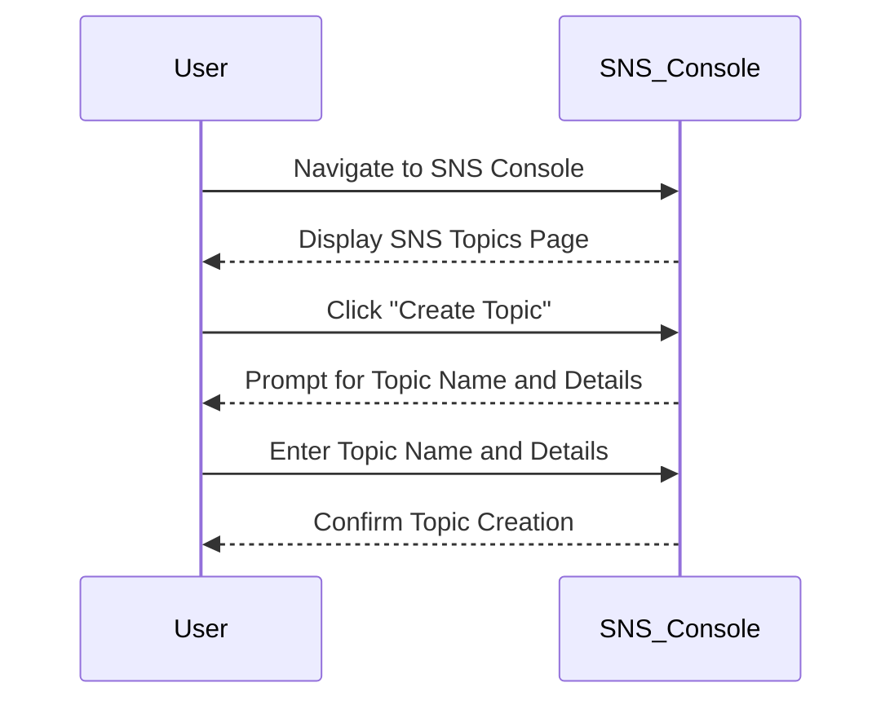
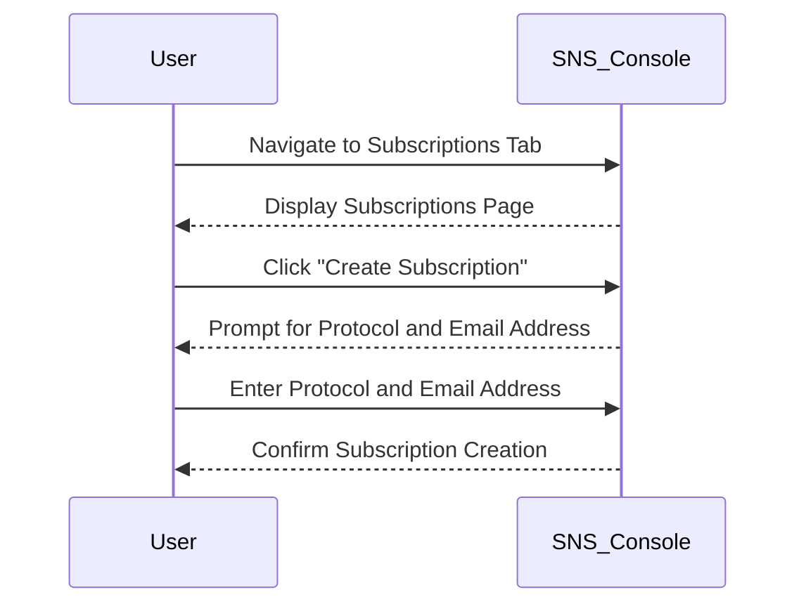
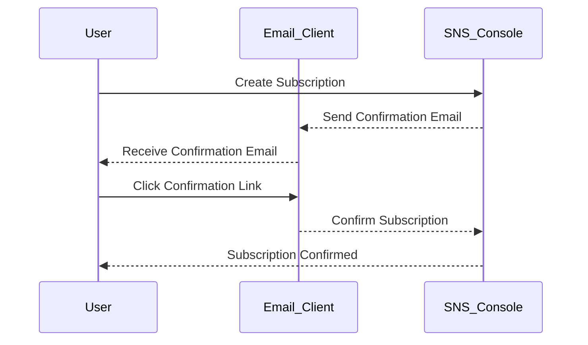
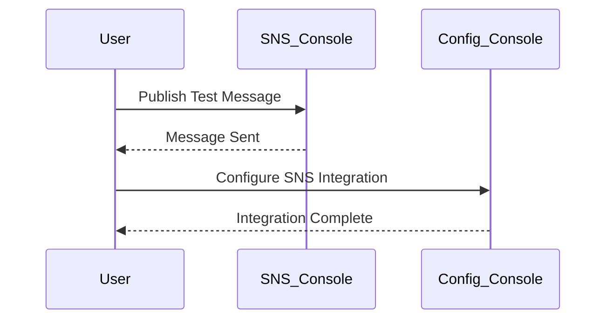

## Introduction to SNS Notification Setup

In the realm of DevSecOps, logging and monitoring key security events are crucial for maintaining the integrity and security of applications and systems. One of the essential tools for achieving this is Amazon Simple Notification Service (SNS). SNS allows you to send notifications to multiple subscribers via various delivery protocols. This chapter will delve into the process of setting up an SNS topic and subscription, focusing on creating an email-based subscription for receiving alerts.

### Background Theory

Amazon SNS is a fully managed pub/sub messaging service that enables you to decouple the components of distributed applications. It supports several protocols, including email, SMS, HTTP/S, and more. By using SNS, you can ensure that critical events are communicated promptly to the appropriate stakeholders.

#### Key Concepts

- **Topic**: A logical access point and transport mechanism that you can use to publish messages to a set of subscribers.
- **Subscription**: A connection between a topic and an endpoint, such as an email address, where messages are delivered.
- **Protocol**: The method used to deliver messages to subscribers. Common protocols include email, SMS, HTTP/S, etc.

### Setting Up an SNS Topic

To begin, you need to create an SNS topic. This topic will serve as the central point for publishing messages.

#### Step-by-Step Process

1. **Navigate to the SNS Console**:
   - Open the AWS Management Console and navigate to the SNS section.
   - Click on "Topics" and then "Create Topic".

2. **Configure the Topic**:
   - Provide a name for your topic, e.g., `WBC_SNS`.
   - Optionally, add a display name and description for better identification.
   - Click "Create Topic".



### Creating a Subscription

Once the topic is created, you need to set up a subscription to receive notifications. In this example, we'll configure an email-based subscription.

#### Step-by-Step Process

1. **Navigate to Subscriptions**:
   - After creating the topic, click on the "Subscriptions" tab.
   - Click on "Create Subscription".

2. **Configure the Subscription**:
   - Select the protocol as "Email".
   - Enter the email address where you want to receive the alerts.
   - Click "Create Subscription".



### Confirming the Subscription

After creating the subscription, you will receive an email from AWS SNS asking you to confirm the subscription. This step is crucial to activate the subscription.

#### Step-by-Step Process

1. **Check Your Email**:
   - Go to the specified email address and look for an email from AWS SNS.
   - Follow the link provided in the email to confirm the subscription.

2. **Verify the Subscription**:
   - Once confirmed, return to the SNS console and verify that the subscription is active.



### Monitoring and Utilizing the Subscription

With the topic and subscription set up, you can now monitor and utilize them for receiving alerts.

#### Step-by-Step Process

1. **Publish a Test Message**:
   - Go back to the SNS console and select your topic.
   - Click on "Publish Message" and enter a test message.
   - Verify that the message is received at the specified email address.

2. **Integrate with Config Console**:
   - Switch to the AWS Config console and configure it to use the SNS topic for sending alerts.
   - Ensure that the necessary policies and permissions are in place.



### Real-World Examples and Recent Breaches

Recent breaches and vulnerabilities often highlight the importance of timely and effective communication through SNS. For instance, the SolarWinds breach (CVE-2020-1014) demonstrated the need for robust monitoring and alerting mechanisms. By integrating SNS with security tools, organizations can quickly respond to such incidents.

#### Example: SolarWinds Breach

- **Description**: The SolarWinds breach involved the compromise of Orion software, leading to widespread attacks on government and private sector entities.
- **Impact**: Timely alerts and notifications could have helped organizations detect and mitigate the breach earlier.
- **Mitigation**: Using SNS to integrate with security tools like AWS Config and CloudTrail can enhance monitoring and alerting capabilities.

### Pitfalls and Common Mistakes

While setting up SNS topics and subscriptions, several common mistakes can occur:

1. **Forgetting to Confirm Subscriptions**: Without confirmation, subscriptions remain inactive.
2. **Incorrect Permissions**: Ensure that the necessary IAM roles and policies are correctly configured.
3. **Incomplete Configuration**: Missing steps in the setup process can lead to non-functional subscriptions.

### How to Prevent / Defend

#### Detection

- **Monitor SNS Activity**: Use CloudWatch Logs to monitor SNS activity and detect any unusual behavior.
- **Audit Trails**: Enable AWS CloudTrail to log API calls made to SNS and other services.

#### Prevention

- **IAM Policies**: Ensure that IAM roles and policies are correctly configured to restrict access to SNS topics.
- **Encryption**: Use encryption for sensitive data transmitted via SNS.

#### Secure Coding Fixes

- **Vulnerable Code**:
  ```python
  import boto3

  sns = boto3.client('sns')
  topic_arn = 'arn:aws:sns:us-west-2:123456789012:WBC_SNS'
  sns.publish(TopicArn=topic_arn, Message='Test Message')
  ```

- **Secure Code**:
  ```python
  import boto3
  from botocore.exceptions import ClientError

  sns = boto3.client('sns')
  topic_arn = 'arn:aws:sns:us-west-2:123456789012:WBC_SNS'

  try:
      response = sns.publish(
          TopicArn=topic_arn,
          Message='Test Message',
          Subject='Security Alert'
      )
      print(f'Message ID: {response["MessageId"]}')
  except ClientError as e:
      print(f'Error: {e}')
  ```

### Hardening Measures

- **Enable Encryption**: Use server-side encryption for SNS messages.
- **Limit Access**: Restrict access to SNS topics using IAM policies and roles.
- **Regular Audits**: Conduct regular audits of SNS configurations and activities.

### Hands-On Labs

For practical experience, consider the following labs:

- **PortSwigger Web Security Academy**: Offers exercises on integrating SNS with web applications.
- **OWASP Juice Shop**: Provides scenarios for securing and monitoring web applications using SNS.

By thoroughly understanding and implementing these concepts, you can effectively leverage SNS for logging and monitoring key security events in your DevSecOps environment.

---
<!-- nav -->
[[02-Introduction to AWS Config and SNS Services|Introduction to AWS Config and SNS Services]] | [[DevSecOps/DevSecOps Bootcamp/08-Logging & Incident Response/01-Defining Key Security Events to Log and Monitor/03-Creating SNS notification/00-Overview|Overview]] | [[DevSecOps/DevSecOps Bootcamp/08-Logging & Incident Response/01-Defining Key Security Events to Log and Monitor/03-Creating SNS notification/04-Practice Questions & Answers|Practice Questions & Answers]]
