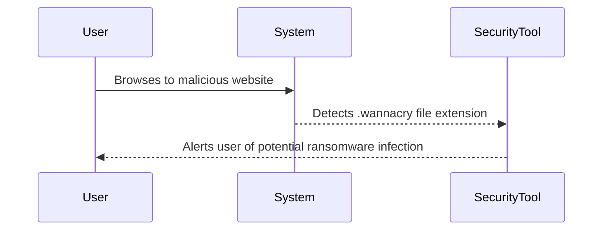
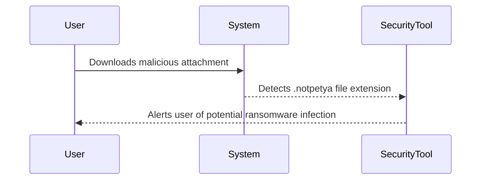

## Introduction to Indicators of Compromise (IOCs)

Indicators of Compromise (IOCs) are specific pieces of evidence within a system that indicate a security breach or malicious activity. These indicators can range from simple network traffic patterns to complex behavioral anomalies. Understanding and identifying IOCs is crucial for effective incident response and proactive threat hunting. This chapter delves into the various types of IOCs, focusing particularly on those related to ransomware, and provides detailed explanations, real-world examples, and practical guidance on how to detect and prevent these threats.

### Types of IOCs

#### Network IOCs

Network IOCs are indicators that can be observed through network traffic and logs. They include:

- **Web Pages and Domain Names**: Malicious actors often use specific web pages or domain names to distribute malware. For example, a user browsing to a known malicious domain could be an IOC.
- **IP Addresses**: IP addresses known to be associated with malicious activities, such as command-and-control servers, can be flagged as IOCs.
- **Bulk File Renames**: Rapid changes in file names, especially those involving known ransomware file extensions, can indicate a ransomware attack.

#### File System IOCs

File system IOCs are indicators found within the file system of a compromised machine. They include:

- **Ransomware Notes**: A ransom note displayed on the screen is a clear indicator of a ransomware attack.
- **Slow Computer Performance**: Users reporting that their computers are running slowly or that they cannot open certain files can be indicative of ransomware.

### Ransomware-Specific IOCs

Ransomware is a type of malware that encrypts files on a victim's system and demands payment in exchange for the decryption key. Identifying ransomware-specific IOCs is critical for early detection and mitigation.

#### File Extensions

One of the most common IOCs for ransomware is the use of specific file extensions. For example:

- `.crypt`
- `.locked`
- `.wannacry`

These extensions are often appended to encrypted files. Monitoring for these extensions can help detect a ransomware infection early.

#### Bulk File Renames

Another common IOC is the rapid renaming of files. For instance, if a large number of files are renamed within a short period, it could indicate a ransomware attack. This behavior can be detected by monitoring file system events.

#### Ransom Notes

A ransom note displayed on the screen is a clear indicator of a ransomware attack. These notes typically demand payment and provide instructions for contacting the attackers.

#### Slow Computer Performance

Users may report that their computers are running slowly or that they cannot open certain files. This can be indicative of ransomware, as the encryption process can consume significant resources.

### Real-World Examples

#### Example 1: WannaCry Ransomware

WannaCry was a widespread ransomware attack that affected numerous organizations globally. One of the key IOCs was the `.wannacry` file extension. By monitoring for this extension, organizations could detect the presence of WannaCry early and take appropriate action.



#### Example 2: NotPetya Ransomware

NotPetya was another high-profile ransomware attack. One of the IOCs was the `.notpetya` file extension. By monitoring for this extension, organizations could detect the presence of NotPetya and take preventive measures.



### Detection and Prevention

#### Detection

To effectively detect IOCs, organizations should implement comprehensive logging and monitoring solutions. This includes:

- **Network Traffic Analysis**: Tools like Snort, Suricata, and Bro can analyze network traffic for suspicious patterns.
- **File System Monitoring**: Tools like OSSEC and Sysmon can monitor file system events for signs of ransomware.
- **Behavioral Analysis**: Tools like Inpoint Network and behavior analysis tools can identify unusual user behavior and flag it for investigation.

#### Prevention

Preventing ransomware attacks requires a multi-layered approach:

- **Patch Management**: Ensure all systems are up-to-date with the latest security patches.
- **Backup Strategy**: Regularly back up data and ensure backups are stored securely.
- **Employee Training**: Educate employees about phishing attacks and the importance of not clicking on suspicious links or attachments.
- **Network Segmentation**: Segment networks to limit the spread of malware.

### Secure Coding Fixes

#### Vulnerable Code Example

Consider a scenario where a web application allows users to upload files without proper validation. An attacker could exploit this vulnerability to upload a malicious file.

```python
# Vulnerable code
def handle_file_upload(file):
    filename = file.filename
    file.save(os.path.join("/uploads", filename))
```

#### Secure Code Example

To prevent this, validate the file extension and restrict uploads to safe file types.

```python
# Secure code
import os

def handle_file_upload(file):
    allowed_extensions = {'txt', 'pdf', 'doc'}
    filename = file.filename
    extension = os.path.splitext(filename)[1][1:].lower()
    
    if extension not in allowed_extensions:
        raise ValueError("Invalid file extension")
    
    file.save(os.path.join("/uploads", filename))
```

### Configuration Hardening

#### Network Configuration Example

Ensure that network configurations are hardened to prevent unauthorized access.

```nginx
# Nginx configuration
server {
    listen 80;
    server_name example.com;

    location / {
        deny all;
    }
}
```

#### Firewall Configuration Example

Configure firewalls to block traffic from known malicious IP addresses.

```iptables
# iptables rule
iptables -A INPUT -s 192.168.1.100 -j DROP
```

### Conclusion

Understanding and identifying IOCs is essential for effective incident response and proactive threat hunting. By monitoring network traffic, file system events, and user behavior, organizations can detect and mitigate ransomware attacks. Implementing a multi-layered approach to prevention, including patch management, backup strategies, employee training, and network segmentation, can significantly reduce the risk of successful ransomware attacks.

### Practice Labs

For hands-on practice in detecting and preventing ransomware, consider the following labs:

- **PortSwigger Web Security Academy**: Offers exercises on web application security, including ransomware detection.
- **OWASP Juice Shop**: Provides a vulnerable web application for practicing security testing and incident response.
- **DVWA (Damn Vulnerable Web Application)**: A deliberately insecure web application for practicing web security concepts.

By engaging in these labs, you can gain practical experience in identifying and mitigating ransomware threats.

---
<!-- nav -->
[[DevSecOps/DevSecOps Bootcamp/08-Logging & Incident Response/01-Defining Key Security Events to Log and Monitor/05-Indicators of Compromise IOC/00-Overview|Overview]] | [[DevSecOps/DevSecOps Bootcamp/08-Logging & Incident Response/01-Defining Key Security Events to Log and Monitor/05-Indicators of Compromise IOC/02-Defining Key Security Events to Log and Monitor|Defining Key Security Events to Log and Monitor]]
